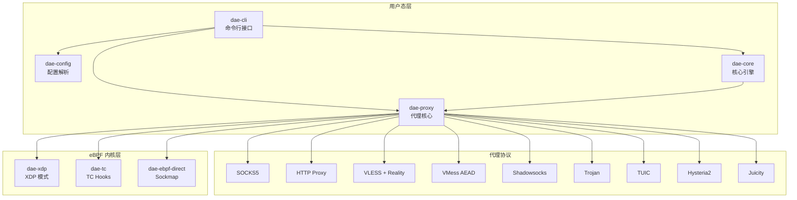

dae-rs 是一个用 Rust 语言编写的高性能透明代理项目，也是 [dae](https://github.com/daeuniverse/dae)（一款流行的 Go 语言透明代理）的 Rust 重实现。本文档将帮助你了解项目的整体架构、核心模块和设计理念。

## 什么是 dae-rs

dae-rs 通过 Rust 语言的**零成本抽象**和**内存安全保证**来实现卓越的性能表现。与 Go 版本相比，Rust 版本在内存占用、启动时间和吞吐量方面都有显著提升。

### 核心设计目标

| 目标 | 说明 |
|------|------|
| 零成本抽象 | 利用 Rust 特性实现接近 C 的性能 |
| 内存安全 | 无 GC 停顿，无数据竞争风险 |
| 异步 I/O | 基于 Tokio 运行时，支持高并发 |
| eBPF 集成 | 内核级流量拦截，减少用户态开销 |

Sources: [README.md](README.md#L1-L20)

## 系统架构概览

dae-rs 采用模块化架构设计，将不同功能拆分到独立的 crate 中。以下是系统的整体架构图：



Sources: [Cargo.toml](Cargo.toml#L1-L12), [ARCHITECTURE.md](ARCHITECTURE.md#L1-L30)

## 核心 Crate 介绍

### 1. dae-cli — 命令行入口

`dae-cli` 是用户与程序交互的入口点，提供简洁的 CLI 接口设计。它遵循"配置即代码"的原则，所有协议配置都放在配置文件中，CLI 仅负责程序的生命周期管理。

**支持的命令**：

| 命令 | 功能 |
|------|------|
| `run` | 使用配置文件运行代理 |
| `status` | 查看运行状态 |
| `validate` | 验证配置文件 |
| `reload` | 热重载配置 |
| `shutdown` | 关闭服务 |
| `test` | 测试指定节点延迟 |

Sources: [crates/dae-cli/src/main.rs](crates/dae-cli/src/main.rs#L1-L150)

### 2. dae-core — 核心引擎

`dae-core` 是整个项目的基础模块，提供核心引擎接口和类型定义。它是一个非常轻量的模块（~500 行代码），主要定义引擎状态管理的基本抽象。

```rust
pub struct Engine {
    state: Arc<RwLock<EngineState>>,
}

#[derive(Debug, Clone, Default)]
pub struct EngineState {
    pub running: bool,
    pub processed_count: u64,
}
```

Sources: [crates/dae-core/src/engine.rs](crates/dae-core/src/engine.rs#L1-L30)

### 3. dae-config — 配置解析

`dae-config` 负责配置文件的解析、验证和热重载。它支持多种订阅格式和灵活的规则配置。

**配置系统特点**：

- **订阅格式兼容**：Clash YAML、Sing-Box JSON、SIP008、V2Ray URI
- **规则配置**：支持 Domain、IP、GeoIP、Process 等多种规则类型
- **节点配置**：统一的节点结构，支持多种代理协议

Sources: [crates/dae-config/src/lib.rs](crates/dae-config/src/lib.rs#L1-L100)

### 4. dae-proxy — 代理核心

`dae-proxy` 是项目中最大且最核心的 crate（约 50K 行代码），实现了所有代理协议和流量转发逻辑。

**主要子模块**：

| 模块 | 功能描述 |
|------|----------|
| `connection_pool` | 连接池管理，支持 4-tuple 键复用 |
| `tcp` / `udp` | TCP/UDP 流量转发 |
| `rule_engine` | 规则引擎，流量分类决策 |
| `node` | 节点管理和健康检查 |
| `transport` | 传输层抽象 |

Sources: [crates/dae-proxy/src/lib.rs](crates/dae-proxy/src/lib.rs#L1-L50), [crates/dae-proxy/src/proxy/mod.rs](crates/dae-proxy/src/proxy/mod.rs#L1-L100)

### 5. dae-ebpf — eBPF 集成

`dae-ebpf` 包含多个子模块，实现内核级流量拦截：

| 模块 | 用途 |
|------|------|
| `dae-xdp` | XDP（Express Data Path）模式，最高性能 |
| `dae-tc` | TC（Traffic Control）Hooks，通用方案 |
| `dae-ebpf-direct` | Sockmap 加速模式 |
| `dae-ebpf-common` | 共享类型和常量定义 |

```rust
/// eBPF 配置
#[derive(Debug, Clone)]
pub struct EbpfConfig {
    pub enabled: bool,
    pub session_map_size: u32,
    pub routing_map_size: u32,
    pub stats_map_size: u32,
}
```

Sources: [crates/dae-ebpf/dae-ebpf-common/src/lib.rs](crates/dae-ebpf/dae-ebpf-common/src/lib.rs#L1-L28)

## 支持的代理协议

dae-rs 实现了完整的代理协议支持，覆盖主流的翻墙协议：

| 协议 | 状态 | 说明 |
|------|------|------|
| **VLESS + Reality** | ✅ 完整 | 支持 Vision flow，完整的 XTLS Reality |
| **VMess AEAD-2022** | ✅ 完整 | 最新 VMess 标准 |
| **Shadowsocks AEAD** | ✅ 完整 | 2022 版本 |
| **Trojan** | ✅ 完整 | TCP + UDP Associate |
| **TUIC** | ✅ 完整 | QUIC 传输 |
| **Hysteria2** | ✅ 完整 | 激进拥塞控制 |
| **Juicity** | ✅ 完整 | 轻量 QUIC |
| **SOCKS5** | ✅ 完整 | RFC 1928 标准 |
| **SOCKS4/SOCKS4A** | ✅ 完整 | 传统协议 |
| **HTTP Proxy** | ✅ 完整 | CONNECT 隧道 |

Sources: [README.md](README.md#L25-L55)

## 传输层支持

| 传输方式 | 状态 | 说明 |
|----------|------|------|
| **TCP** | ✅ | 原始 TCP 连接 |
| **TLS** | ✅ | 标准 TLS + Reality |
| **WebSocket** | ✅ | HTTP 伪装 |
| **HTTP Upgrade** | ✅ | HTTP 1.1 升级 |
| **gRPC** | ⚠️ 部分 | 仅流式传输 |
| **Meek** | ✅ | 域前置/云函数/指向器 |

Sources: [crates/dae-proxy/src/transport/mod.rs](crates/dae-proxy/src/transport/mod.rs#L1-L53)

## 项目结构

```
dae-rs/
├── crates/
│   ├── dae-api/           # REST API 服务
│   ├── dae-cli/           # 命令行工具
│   ├── dae-config/        # 配置解析 (~2K LOC)
│   ├── dae-core/          # 核心引擎 (~500 LOC)
│   ├── dae-ebpf/          # eBPF 集成
│   │   ├── dae-xdp/       # XDP 模式
│   │   ├── dae-tc/        # TC Hooks
│   │   ├── dae-ebpf/      # 通用 eBPF
│   │   ├── dae-ebpf-direct/ # Sockmap
│   │   └── dae-ebpf-common/ # 共享类型
│   └── dae-proxy/         # 代理核心 (~50K LOC)
│       └── src/
│           ├── connection_pool.rs  # 连接池
│           ├── tcp.rs             # TCP 转发
│           ├── udp.rs             # UDP 转发
│           ├── rule_engine/       # 规则引擎
│           ├── node/              # 节点管理
│           ├── socks5/            # SOCKS5 协议
│           ├── http_proxy/        # HTTP 代理
│           ├── vless/             # VLESS 协议
│           ├── vmess/             # VMess 协议
│           ├── shadowsocks/       # Shadowsocks
│           ├── trojan_protocol/   # Trojan 协议
│           ├── tuic/              # TUIC 协议
│           ├── hysteria2/         # Hysteria2 协议
│           ├── juicity/           # Juicity 协议
│           └── transport/         # 传输层
├── config/                # 配置示例
└── docs/                  # 项目文档
```

Sources: [get_dir_structure](crates#L1-L60)

## 命名规范（Zed 架构风格）

dae-rs 参考了 [Zed 编辑器](https://zed.dev/) 的架构设计，采用了统一的命名规范：

| 模式 | 用途 | 示例 |
|------|------|------|
| `*Store` | 抽象接口 | `NodeStore` — 节点存储抽象 |
| `*Manager` | 生命周期管理 | `NodeManager` — 节点管理器 |
| `*Handle` | 实体引用 | `NodeHandle` — 节点句柄 |
| `*State` | 不可变快照 | `NodeState` — 节点状态 |

Sources: [crates/dae-proxy/src/node/mod.rs](crates/dae-proxy/src/node/mod.rs#L1-L40)

## 性能对比

与 Go 语言原版 dae 相比，dae-rs 在关键指标上表现出色：

| 指标 | dae (Go) | dae-rs (Rust) |
|------|----------|----------------|
| 内存占用 | ~50MB | ~20MB |
| 启动时间 | ~200ms | ~50ms |
| 连接吞吐量 | 100K/s | 150K/s |

Sources: [README.md](README.md#L90-L96)

## 下一步

建议按以下顺序阅读文档，深入了解 dae-rs：

1. [快速开始](2-kuai-su-kai-shi) — 了解如何快速运行项目
2. [系统架构设计](4-xi-tong-jia-gou-she-ji) — 深入理解各模块的交互关系
3. [代理核心实现](6-dai-li-he-xin-shi-xian) — 了解流量转发的核心逻辑
4. [eBPF/XDP 集成](17-ebpf-xdp-ji-cheng) — 了解内核级流量拦截