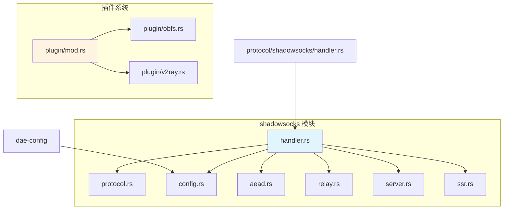
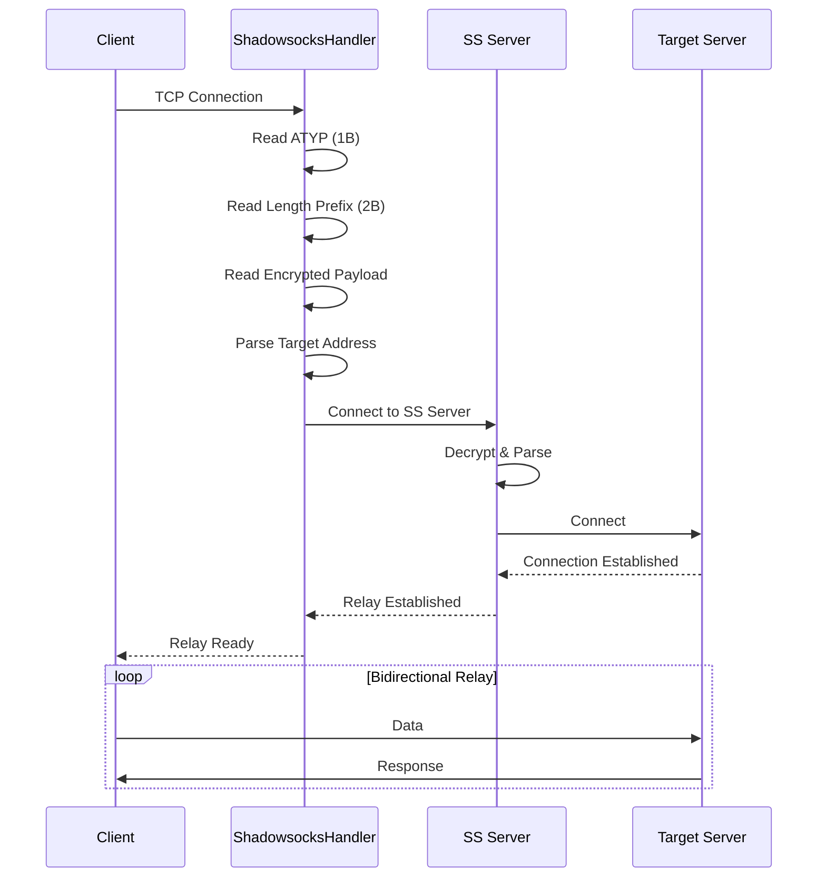
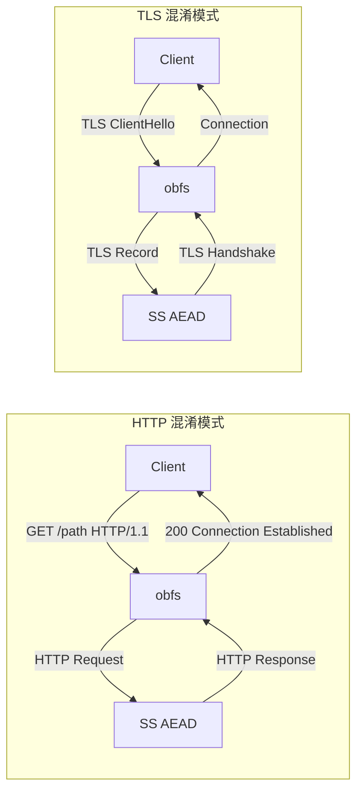

Shadowsocks 是一个基于 SOCKS5 的加密代理协议，dae-rs 实现了完整的 AEAD（Authenticated Encryption with Associated Data）加密支持。本文档详细介绍 dae-rs 中 Shadowsocks 协议的实现架构、协议格式、安全特性及配置方法。

## 架构概览

dae-rs 的 Shadowsocks 实现采用模块化设计，将协议解析、加密处理、数据转发和插件混淆解耦到独立模块中。这种设计使得各组件可以独立测试和演进，同时保持了代码的清晰性和可维护性。



### 核心组件职责

| 模块 | 文件 | 职责 | 关键类型 |
|------|------|------|----------|
| 配置层 | [config.rs](crates/dae-proxy/src/shadowsocks/config.rs#L1-L87) | 服务器/客户端配置结构 | `SsServerConfig`, `SsClientConfig` |
| 协议解析 | [protocol.rs](crates/dae-proxy/src/shadowsocks/protocol.rs#L1-L200) | AEAD 加密类型、地址解析 | `SsCipherType`, `TargetAddress` |
| AEAD 加密 | [aead.rs](crates/dae-proxy/src/shadowsocks/aead.rs#L1-L90) | 加密接口定义 | `AeadCipher` trait |
| 连接处理 | [handler.rs](crates/dae-proxy/src/shadowsocks/handler.rs#L1-L234) | TCP/UDP 会话管理 | `ShadowsocksHandler` |
| 数据转发 | [relay.rs](crates/dae-proxy/src/shadowsocks/relay.rs#L1-L37) | 双向数据流转发 | `relay()` |
| 服务端 | [server.rs](crates/dae-proxy/src/shadowsocks/server.rs#L1-L66) | 监听连接接受 | `ShadowsocksServer` |

Sources: [crates/dae-proxy/src/shadowsocks/mod.rs](crates/dae-proxy/src/shadowsocks/mod.rs#L1-L34)

## AEAD 加密实现

### 支持的加密方式

Shadowsocks AEAD 协议支持三种加密算法，这些算法都提供完整的认证加密功能，能够检测并拒绝被篡改的数据包。

| 加密算法 | 密钥长度 | Nonce 长度 | 推荐程度 | 适用场景 |
|----------|----------|------------|----------|----------|
| `chacha20-ietf-poly1305` | 32 字节 | 12 字节 | ⭐⭐⭐ 首选 | 通用场景，性能均衡 |
| `aes-256-gcm` | 32 字节 | 12 字节 | ⭐⭐ 推荐 | x86_64 平台优化 |
| `aes-128-gcm` | 16 字节 | 12 字节 | ⭐ 可用 | 带宽受限环境 |

```rust
#[derive(Debug, Clone, Copy, PartialEq, Eq, Default)]
pub enum SsCipherType {
    #[default]
    Chacha20IetfPoly1305,
    Aes256Gcm,
    Aes128Gcm,
}
```

Sources: [crates/dae-proxy/src/shadowsocks/protocol.rs](crates/dae-proxy/src/shadowsocks/protocol.rs#L11-L26)

### 字符串解析支持

`socks5` 命令行参数支持以下字符串格式，大小写不敏感：

```rust
impl SsCipherType {
    pub fn from_str(s: &str) -> Option<Self> {
        match s.to_lowercase().as_str() {
            "chacha20-ietf-poly1305" | "chacha20poly1305" => {
                Some(SsCipherType::Chacha20IetfPoly1305)
            }
            "aes-256-gcm" | "aes256gcm" => Some(SsCipherType::Aes256Gcm),
            "aes-128-gcm" | "aes128gcm" => Some(SsCipherType::Aes128Gcm),
            _ => None,
        }
    }
}
```

Sources: [crates/dae-proxy/src/shadowsocks/protocol.rs](crates/dae-proxy/src/shadowsocks/protocol.rs#L32-L42)

### AEAD 错误类型

```rust
#[derive(Debug)]
pub enum AeadError {
    InvalidKeyLength,
    InvalidNonceLength,
    EncryptionFailed,
    DecryptionFailed,
    TagVerificationFailed,
}
```

Sources: [crates/dae-proxy/src/shadowsocks/aead.rs](crates/dae-proxy/src/shadowsocks/aead.rs#L17-L25)

## 协议格式

### AEAD 数据包格式

```
┌─────────────────────────────────────────────────────────┐
│                    AEAD Packet                          │
├────────┬──────────────┬───────────────┬─────────────────┤
│ Length │   Nonce      │ Encrypted     │     Tag         │
│ (2B)   │   (12B)      │ Header+Payload│     (16B)       │
└────────┴──────────────┴───────────────┴─────────────────┘
```

### AEAD Header 结构

```
┌────────────────────────────────────────────────────┐
│                  AEAD Header                        │
├─────────┬────────────────────────┬─────────────────┤
│ ATYP    │  Target Address        │    Port         │
│ (1B)    │  (variable)            │    (2B)         │
└─────────┴────────────────────────┴─────────────────┘
```

### 地址类型 (ATYP)

| ATYP 值 | 类型 | 格式 | 示例 |
|---------|------|------|------|
| `0x01` | IPv4 | 4 字节 IP + 2 字节端口 | `01 C0 A8 01 01 1F 90` → `192.168.1.1:8080` |
| `0x02` | 域名 | 1 字节长度 + 域名 + 2 字节端口 | `02 0B example.com 00 50` → `example.com:80` |
| `0x03` | IPv6 | 16 字节 IP + 2 字节端口 | `04` + 16字节 + 端口 |

Sources: [crates/dae-proxy/src/shadowsocks/protocol.rs](crates/dae-proxy/src/shadowsocks/protocol.rs#L46-L97)

### 地址解析实现

```rust
impl TargetAddress {
    pub fn parse_from_aead(payload: &[u8]) -> Option<(Self, u16)> {
        let atyp = payload[0];
        match atyp {
            0x01 => {
                // IPv4: 1 byte type + 4 bytes IP + 2 bytes port
                if payload.len() < 7 { return None; }
                let ip = IpAddr::V4(Ipv4Addr::new(
                    payload[1], payload[2], payload[3], payload[4],
                ));
                let port = u16::from_be_bytes([payload[5], payload[6]]);
                Some((TargetAddress::Ip(ip), port))
            }
            // ... domain and IPv6 handling
        }
    }
}
```

Sources: [crates/dae-proxy/src/shadowsocks/protocol.rs](crates/dae-proxy/src/shadowsocks/protocol.rs#L49-L78)

## 配置系统

### 服务端配置

```rust
#[derive(Debug, Clone)]
pub struct SsServerConfig {
    pub addr: String,           // 服务器地址
    pub port: u16,              // 服务器端口，默认 8388
    pub method: SsCipherType,   // 加密方式
    pub password: String,       // 密码/密钥
    pub ota: bool,              // 启用 OTA (One-Time Auth)
}

impl Default for SsServerConfig {
    fn default() -> Self {
        Self {
            addr: "127.0.0.1".to_string(),
            port: 8388,
            method: SsCipherType::Chacha20IetfPoly1305,
            password: String::new(),
            ota: false,
        }
    }
}
```

Sources: [crates/dae-proxy/src/shadowsocks/config.rs](crates/dae-proxy/src/shadowsocks/config.rs#L11-L30)

### 客户端配置

```rust
#[derive(Debug, Clone)]
pub struct SsClientConfig {
    pub listen_addr: SocketAddr,    // 本地监听地址
    pub server: SsServerConfig,     // 服务器配置
    pub tcp_timeout: Duration,     // TCP 超时，默认 60s
    pub udp_timeout: Duration,     // UDP 超时，默认 30s
}
```

Sources: [crates/dae-proxy/src/shadowsocks/config.rs](crates/dae-proxy/src/shadowsocks/config.rs#L33-L50)

### 配置文件格式

在 dae-rs 配置文件中，Shadowsocks 节点配置示例：

```toml
[[nodes]]
name = "my-shadowsocks-server"
type = "shadowsocks"
server = "192.168.1.100"
port = 8388
method = "chacha20-ietf-poly1305"
password = "your-password-here"
ota = false
tags = ["hk", "proxy"]
```

Sources: [crates/dae-config/src/lib.rs](crates/dae-config/src/lib.rs#L395-L415)

## 连接处理流程

### TCP 连接处理



### 处理实现

```rust
pub async fn handle(self: Arc<Self>, mut client: TcpStream) -> std::io::Result<()> {
    // 1. 读取 ATYP
    let mut header_buf = vec![0u8; 1];
    client.read_exact(&mut header_buf).await?;
    
    // 2. 读取长度前缀
    let mut len_buf = [0u8; 2];
    client.read_exact(&mut len_buf).await?;
    let payload_len = u16::from_be_bytes(len_buf) as usize;
    
    // 3. 读取加密 payload
    let mut encrypted_payload = vec![0u8; payload_len];
    client.read_exact(&mut encrypted_payload).await?;
    
    // 4. 解析目标地址
    let (target_addr, target_port) = match TargetAddress::parse_from_aead(&encrypted_payload) {
        Some((addr, port)) => (addr, port),
        None => return Err(std::io::Error::new(
            std::io::ErrorKind::InvalidData,
            "invalid Shadowsocks AEAD payload",
        )),
    };
    
    // 5. 连接 Shadowsocks 服务器并转发
    let remote = TcpStream::connect(&remote_addr).await?;
    self.relay(client, remote).await
}
```

Sources: [crates/dae-proxy/src/shadowsocks/handler.rs](crates/dae-proxy/src/shadowsocks/handler.rs#L32-L90)

### UDP 处理

```rust
pub async fn handle_udp(self: Arc<Self>, client: UdpSocket) -> std::io::Result<()> {
    const MAX_UDP_SIZE: usize = 65535;
    let mut buf = vec![0u8; MAX_UDP_SIZE];
    
    loop {
        let (n, client_addr) = client.recv_from(&mut buf).await?;
        
        // 解析 ATYP 并提取目标地址
        let atyp = buf[0];
        let (target_addr, target_port, payload_offset) = match atyp {
            0x01 => { /* IPv4 */ }
            0x03 => { /* Domain */ }
            0x04 => { /* IPv6 */ }
            _ => continue,
        };
        
        // 发送到 Shadowsocks 服务器
        server_socket.send_to(payload, &server_addr).await?;
    }
}
```

Sources: [crates/dae-proxy/src/shadowsocks/handler.rs](crates/dae-proxy/src/shadowsocks/handler.rs#L117-L180)

## 插件系统

dae-rs 支持两种流量混淆插件，使 Shadowsocks 流量看起来像正常的 HTTP 或 TLS 流量，从而绕过深度包检测（DPI）。

### simple-obfs 插件

simple-obfs 通过将 Shadowsocks 流量包装成 HTTP 或 TLS 请求来混淆流量特征。



#### HTTP 混淆配置

```rust
pub fn http(host: &str, path: &str) -> Self {
    Self {
        mode: ObfsMode::Http,
        host: host.to_string(),
        path: path.to_string(),
        timeout: Duration::from_secs(30),
    }
}

// 生成的 HTTP 请求格式
fn build_http_request(&self) -> String {
    format!(
        "GET {} HTTP/1.1\r\n\
        Host: {}\r\n\
        User-Agent: Mozilla/5.0 (Windows NT 10.0; Win64; x64)...\r\n\
        Accept: */*\r\n\
        Connection: keep-alive\r\n\
        \r\n",
        self.config.path, self.config.host
    )
}
```

Sources: [crates/dae-proxy/src/shadowsocks/plugin/obfs.rs](crates/dae-proxy/src/shadowsocks/plugin/obfs.rs#L86-L104)

#### TLS 混淆配置

```rust
pub fn tls(host: &str) -> Self {
    Self {
        mode: ObfsMode::Tls,
        host: host.to_string(),
        path: "/".to_string(),
        timeout: Duration::from_secs(30),
    }
}
```

TLS 混淆生成类似如下 ClientHello：

```
TLS Record: Handshake (0x16)
  Version: TLS 1.0 (0x0301)
  Handshake: ClientHello
    Random: 32 bytes
    Session ID: empty
    Cipher Suites: TLS_RSA_WITH_AES_128_CBC_SHA, etc.
    Extensions: SNI (server_name)
```

Sources: [crates/dae-proxy/src/shadowsocks/plugin/obfs.rs](crates/dae-proxy/src/shadowsocks/plugin/obfs.rs#L110-L123)

### v2ray-plugin 插件

v2ray-plugin 提供基于 WebSocket 的流量混淆，支持普通 WebSocket 和 WebSocket over TLS 两种模式。

```rust
pub enum V2rayMode {
    WebSocket,        // ws://
    WebSocketTLS,     // wss://
}

// 配置示例
let config = V2rayConfig::websocket()
    .with_path("/custom/path")
    .with_host("example.com")
    .with_tls_server_name("sni.example.com");
```

Sources: [crates/dae-proxy/src/shadowsocks/plugin/v2ray.rs](crates/dae-proxy/src/shadowsocks/plugin/v2ray.rs#L8-L40)

### 插件支持矩阵

| 插件 | 混淆模式 | 适用场景 | 复杂度 |
|------|----------|----------|--------|
| simple-obfs (HTTP) | HTTP GET 请求 | 绕过 HTTP DPI | 低 |
| simple-obfs (TLS) | TLS ClientHello | 绕过 TLS DPI | 低 |
| v2ray-plugin (WS) | WebSocket 帧 | 深度混淆 | 中 |
| v2ray-plugin (WSS) | WebSocket over TLS | 高度混淆 | 高 |

## ShadowsocksR (SSR) 支持

dae-rs 还包含了对 ShadowsocksR 协议的部分实现，SSR 在标准 Shadowsocks 基础上增加了协议层混淆。

```rust
// SSR 协议类型
pub enum SsrProtocol {
    Origin,
    VerifyDeflate,
    TwoAuth,
    AuthSha1V2,
    AuthAES128MD5,
    AuthAES128SHA1,
    AuthChain,
}

// SSR 混淆类型
pub enum SsrObfs {
    Plain,
    HttpSimple,
    TlsSimple,
    HttpPost,
    Tls12Ticket,
    Tls12TicketAuth,
}
```

Sources: [crates/dae-proxy/src/shadowsocks/ssr.rs](crates/dae-proxy/src/shadowsocks/ssr.rs#L12-L49)

### SSR 握手流程

SSR 的握手序列与标准 Shadowsocks 不同：

```
1. 发送会话密钥 (从密码派生)
2. 协议层混淆处理
3. 混淆层处理
4. 目标地址连接
```

Sources: [crates/dae-proxy/src/shadowsocks/ssr.rs](crates/dae-proxy/src/shadowsocks/ssr.rs#L150-L180)

## 统一 Handler 接口

`ShadowsocksHandler` 实现了统一的 `Handler` trait，可以无缝集成到 dae-rs 的协议调度系统中：

```rust
#[async_trait]
impl Handler for ShadowsocksHandler {
    type Config = SsClientConfig;

    fn name(&self) -> &'static str {
        "shadowsocks"
    }

    fn protocol(&self) -> ProtocolType {
        ProtocolType::Shadowsocks
    }

    async fn handle(self: Arc<Self>, stream: TcpStream) -> std::io::Result<()> {
        self.handle(stream).await
    }
}
```

Sources: [crates/dae-proxy/src/shadowsocks/handler.rs](crates/dae-proxy/src/shadowsocks/handler.rs#L205-L232)

## 安全考虑

### AEAD 加密优势

1. **认证加密**: 每个数据包都包含认证标签 (Tag)，接收方可验证数据完整性
2. **抗篡改**: 任何对密文的修改都会导致解密失败
3. **抗重放**: 使用唯一 Nonce 防止重放攻击

### OTA 兼容模式

One-Time Auth (OTA) 为不支持完整 AEAD 的旧版服务器提供向后兼容：

```rust
pub struct SsServerConfig {
    // ...
    pub ota: bool,  // 启用 OTA 兼容模式
}
```

Sources: [crates/dae-proxy/src/shadowsocks/config.rs](crates/dae-proxy/src/shadowsocks/config.rs#L11-L25)

### 流量混淆建议

| 网络环境 | 推荐插件 | 说明 |
|----------|----------|------|
| 宽松网络 | 无 | 直接连接，性能最佳 |
| 中度限制 | simple-obfs TLS | 伪装 TLS 流量 |
| 严格限制 | v2ray-plugin WSS | WebSocket + TLS 双重混淆 |

## 局限性与已知问题

### 当前限制

```rust
//! ⚠️ Limitations
//!
//! **Stream ciphers (rc4-md5, aes-ctr, etc.) are not supported.**
//! Only AEAD ciphers are implemented. See GitHub Issue #78 for details.
```

Sources: [crates/dae-proxy/src/shadowsocks/mod.rs](crates/dae-proxy/src/shadowsocks/mod.rs#L11-L15)

| 限制项 | 说明 | 状态 |
|--------|------|------|
| 流加密支持 | rc4-md5, aes-ctr 等 | ❌ 不支持 |
| AEAD 完整实现 | chacha20-poly1305, aes-gcm | ⚠️ 部分实现 |
| SSR 完整支持 | 协议层混淆 | ⚠️ 基础支持 |

### 完整 AEAD 实现待完成

根据代码注释，完整的 AEAD 加密/解密实现仍在开发中：

```rust
//! # Note
//!
//! Full AEAD encryption/decryption is not yet implemented.
//! See GitHub Issue #78 for details.
```

Sources: [crates/dae-proxy/src/shadowsocks/aead.rs](crates/dae-proxy/src/shadowsocks/aead.rs#L14-L20)

## 相关文档

- [代理核心实现](6-dai-li-he-xin-shi-xian) - 了解 dae-rs 的统一协议处理架构
- [SOCKS5 协议](5-socks5-xie-yi) - 理解 Shadowsocks 基于的底层 SOCKS5 协议
- [配置参考手册](20-pei-zhi-can-kao-shou-ce) - 完整的节点配置指南
- [Trojan 协议](11-trojan-xie-yi) - 另一个 TLS 代理协议对比