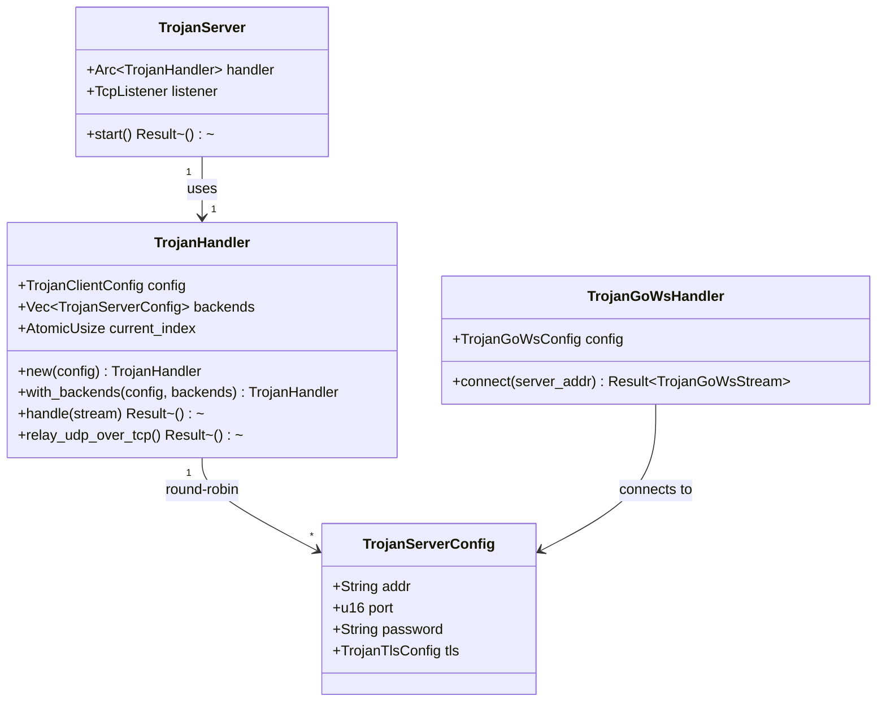
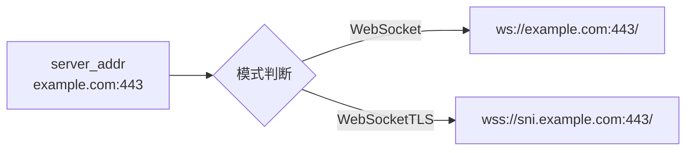

Trojan 是一种模拟 HTTPS 流量的代理协议，其核心设计理念是将代理流量伪装成正常的 HTTPS 流量，从而在深度包检测（DPI）环境下实现流量穿透。dae-rs 实现了 Trojan 协议的客户端功能，支持标准 Trojan 协议以及 Trojan-Go 扩展的 WebSocket 传输模式。

## 协议概述

### 设计理念

Trojan 协议的核心设计基于一个关键观察：HTTPS 流量在互联网流量中占据绝对主导地位，任何对 HTTPS 流量的干扰都会造成严重的兼容性问题。因此，Trojan 选择将自身流量完全模拟成标准的 HTTPS 流量，使其与正常网站流量无法区分。

```
┌─────────────────────────────────────────────────────────────────────┐
│                    Trojan 协议伪装原理                                │
├─────────────────────────────────────────────────────────────────────┤
│                                                                     │
│   正常 HTTPS 流量:                                                   │
│   Client -> [TLS ClientHello] -> Server -> 目标服务器                │
│                                                                     │
│   Trojan 流量:                                                      │
│   Client -> [TLS ClientHello] -> Trojan Server -> 目标服务器        │
│                    ↑                                                │
│            无法区分这两者                                            │
│                                                                     │
└─────────────────────────────────────────────────────────────────────┘
```

### 与其他协议对比

| 特性 | Trojan | VLESS | VMess | Shadowsocks |
|------|--------|-------|-------|-------------|
| 流量伪装 | HTTPS 完全伪装 | 部分伪装 | 无 | 简单加密 |
| 抗 DPI 能力 | 强 | 中 | 弱 | 弱 |
| TLS 强制 | 是 | 可选 | 可选 | 否 |
| 协议头 | 56字节密码 | UUID | UUID+时间戳 | 加密头部 |
| WebSocket 支持 | Trojan-Go | Xray | Xray | 否 |

Sources: [protocol.rs](crates/dae-proxy/src/trojan_protocol/protocol.rs#L1-L50)

## 协议格式详解

### Trojan 标准协议头

Trojan 协议在 TLS 握手完成后，客户端需要发送一个特定的协议头来指定目标地址。协议头格式如下：

```
┌────────────────────────────────────────────────────────────────────────────┐
│                        Trojan 协议头格式                                    │
├──────────────┬───────────┬───────────────────────────────────┬───────────┤
│ Password     │  CRLF     │  Command  │  ATYP │ Address │Port │  CRLF     │
│ (56 字节)    │ (0x0D0A)  │  (1 字节)  │(1字节)│(变长)   │(2字节)│ (0x0D0A)  │
└──────────────┴───────────┴───────────────────────────────────┴───────────┘
```

**各字段说明：**

| 字段 | 长度 | 说明 |
|------|------|------|
| Password | 56 字节 | 用于服务端验证的密码，必须精确匹配 |
| CRLF | 2 字节 | `\r\n` (0x0D 0x0A)，分隔符 |
| Command | 1 字节 | 0x01=TCP连接，0x02=UDP关联 |
| ATYP | 1 字节 | 地址类型：0x01=IPv4，0x02=域名，0x03=IPv6 |
| Address | 变长 | 目标地址，IPv4=4字节，域名=1字节长度+域名，IPv6=16字节 |
| Port | 2 字节 | 目标端口（大端序） |
| CRLF | 2 字节 | `\r\n` (0x0D 0x0A)，协议头结束标志 |

Sources: [handler.rs](crates/dae-proxy/src/trojan_protocol/handler.rs#L50-L100)

### 地址类型编码

```rust
pub enum TrojanAddressType {
    Ipv4 = 0x01,    // IPv4 地址
    Domain = 0x02,  // 域名
    Ipv6 = 0x03,    // IPv6 地址
}

pub enum TrojanCommand {
    Proxy = 0x01,        // TCP 代理连接
    UdpAssociate = 0x02, // UDP 关联
}
```

地址解析逻辑实现了三种地址类型的完整支持：

- **IPv4**: 直接读取 4 字节 IP 地址
- **域名**: 首字节为长度，后跟域名字符串
- **IPv6**: 16 字节 IPv6 地址

Sources: [protocol.rs](crates/dae-proxy/src/trojan_protocol/protocol.rs#L30-L100)

## 数据流架构

### TCP 连接流程

```mermaid
sequenceDiagram
    participant C as Trojan 客户端
    participant L as dae-rs (TrojanHandler)
    participant S as Trojan 服务器
    participant T as 目标服务器

    Note over C,L: TLS 握手完成
    C->>L: [56字节密码][CRLF]
    C->>L: [Command=0x01][ATYP][Address][Port][CRLF]
    L->>L: 验证密码 (常量时间比较)
    L->>S: 建立到 Trojan 服务器的连接
    S->>T: 连接目标服务器
    Note over T: 协议头已剥离<br/>服务器直接 relay 流量
    C<->T: 数据双向传输
```

### UDP 关联流程

Trojan 的 UDP 支持采用了一种独特的设计：UDP 数据包被封装在 TCP 连接中传输。

```
Trojan UDP 帧格式 (通过 TCP 传输):
┌────────┬────────┬────────┬────────┬─────────┬─────────┬─────────┬──────────┐
│  CMD   │  UUID  │  VER    │  PORT  │  ATYP   │ Address │ Length  │ Payload  │
│ (1字节) │(16字节)│ (1字节) │(2字节) │ (1字节) │(变长)   │ (2字节) │ (变长)   │
└────────┴────────┴────────┴────────┴─────────┴─────────┴─────────┴──────────┘

CMD 含义:
- 0x01: UDP 数据
- 0x02: 断开连接
- 0x03: 心跳检测 (PING/PONG)
```

Sources: [handler.rs](crates/dae-proxy/src/trojan_protocol/handler.rs#L280-L350)

## 模块架构

Trojan 协议实现位于 `crates/dae-proxy/src/trojan_protocol/` 目录下，采用模块化设计：

```
trojan_protocol/
├── mod.rs          # 模块入口和公开 API
├── config.rs       # 配置结构体定义
├── protocol.rs     # 协议类型和解析逻辑
├── handler.rs      # TrojanHandler 核心实现
├── server.rs       # TrojanServer 服务器实现
└── trojan_go.rs    # Trojan-Go WebSocket 扩展
```

### 核心组件关系



Sources: [handler.rs](crates/dae-proxy/src/trojan_protocol/handler.rs#L1-L100), [server.rs](crates/dae-proxy/src/trojan_protocol/server.rs#L1-L50)

## 配置系统

### 配置文件格式

在 dae-rs 中，Trojan 节点通过 TOML 配置文件定义：

```toml
[[nodes]]
name = "香港节点"
type = "trojan"
server = "your-server.com"
port = 443
trojan_password = "your-trojan-password"
tls = true
tls_server_name = "your-server.com"
```

### 配置结构体

dae-rs 定义了两套配置结构：一套用于 dae-proxy 内部使用，另一套用于配置文件解析。

**内部配置 (dae-proxy):**

```rust
pub struct TrojanClientConfig {
    pub listen_addr: SocketAddr,    // 本地监听地址
    pub server: TrojanServerConfig, // 服务器配置
    pub tcp_timeout: Duration,      // TCP 超时
    pub udp_timeout: Duration,       // UDP 超时
}

pub struct TrojanServerConfig {
    pub addr: String,               // 服务器地址
    pub port: u16,                  // 服务器端口
    pub password: String,           // 密码
    pub tls: TrojanTlsConfig,       // TLS 配置
}

pub struct TrojanTlsConfig {
    pub enabled: bool,              // 启用 TLS
    pub version: String,             // TLS 版本
    pub alpn: Vec<String>,           // ALPN 协议
    pub server_name: Option<String>, // SNI
    pub insecure: bool,              // 跳过证书验证
}
```

Sources: [config.rs](crates/dae-proxy/src/trojan_protocol/config.rs#L1-L80)

**配置文件解析 (dae-config):**

```rust
pub struct TrojanServerConfig {
    pub name: String,
    pub addr: String,
    pub port: u16,
    pub password: String,
    pub tls: Option<TrojanTlsConfig>,
}

pub struct TrojanTlsConfig {
    pub enabled: bool,
    pub version: String,
    pub server_name: Option<String>,
    pub alpn: Option<Vec<String>>,
}
```

Sources: [lib.rs](crates/dae-config/src/lib.rs#L585-L625)

## 安全特性

### 密码验证

dae-rs 使用常量时间比较（constant-time comparison）来验证密码，防止时序攻击：

```rust
pub fn validate_password(&self, password: &str) -> bool {
    // Use constant-time comparison to prevent timing attacks
    let expected = self.config.server.password.as_bytes();
    let input = password.as_bytes();
    expected.ct_eq(input).unwrap_u8() == 1
}
```

常量时间比较确保攻击者无法通过测量响应时间来推断密码的每一位。

Sources: [handler.rs](crates/dae-proxy/src/trojan_protocol/handler.rs#L70-L80)

### 多后端负载均衡

TrojanHandler 支持配置多个后端服务器，实现故障转移和负载均衡：

```rust
pub fn with_backends(config: TrojanClientConfig, backends: Vec<TrojanServerConfig>) -> Self

fn next_backend(&self) -> &TrojanServerConfig {
    let idx = self
        .current_index
        .fetch_add(1, std::sync::atomic::Ordering::Relaxed)
        % self.backends.len();
    &self.backends[idx]
}
```

使用原子操作实现无锁的轮询负载均衡。

Sources: [handler.rs](crates/dae-proxy/src/trojan_protocol/handler.rs#L30-L65)

## Trojan-Go WebSocket 扩展

Trojan-Go 是 Trojan 的扩展版本，增加了 WebSocket 传输支持和 TLS 混淆功能。

### WebSocket 模式

```rust
pub enum TrojanGoMode {
    WebSocket,       // 明文 WebSocket
    WebSocketTLS,     // WebSocket over TLS (WSS)
}

pub struct TrojanGoWsConfig {
    pub mode: TrojanGoMode,
    pub path: String,           // WebSocket 路径
    pub host: String,           // Host 头
    pub tls_sni: Option<String>, // TLS SNI
    pub timeout: Duration,
}
```

### WebSocket URL 构建



WebSocket 模式下，所有 Trojan 协议数据都被封装在 WebSocket 帧中传输，进一步增强了流量的隐蔽性。

Sources: [trojan_go.rs](crates/dae-proxy/src/trojan_protocol/trojan_go.rs#L1-L100)

## 错误处理

| 错误类型 | 原因 | 处理方式 |
|----------|------|----------|
| `InvalidData` | Trojan 头格式错误（CRLF 不匹配） | 关闭连接 |
| `InvalidData` | 无效的地址类型 | 关闭连接 |
| `InvalidData` | 无效的域名编码 | 关闭连接 |
| `TimedOut` | 连接服务器超时 | 返回错误，记录日志 |
| `ConnectionRefused` | 服务器拒绝连接 | 返回错误，记录日志 |

所有错误都会生成详细的日志记录，便于问题排查：

```rust
error!("Invalid Trojan header: missing CRLF after password");
error!("Timeout connecting to Trojan backend {}:{}", backend.addr, backend.port);
```

Sources: [handler.rs](crates/dae-proxy/src/trojan_protocol/handler.rs#L85-L120)

## 与 Control Socket API 集成

TrojanHandler 实现了统一的 `Handler` trait，可以与 dae-rs 的控制平面无缝集成：

```rust
#[async_trait]
impl Handler for TrojanHandler {
    type Config = TrojanClientConfig;

    fn name(&self) -> &'static str {
        "trojan"
    }

    fn protocol(&self) -> ProtocolType {
        ProtocolType::Trojan
    }

    fn config(&self) -> &Self::Config {
        &self.config
    }

    async fn handle(self: Arc<Self>, stream: TcpStream) -> std::io::Result<()> {
        self.handle(stream).await
    }
}
```

这使得 TrojanHandler 可以通过 [Control Socket API](25-control-socket-api) 进行运行时管理、健康检查和热更新。

Sources: [handler.rs](crates/dae-proxy/src/trojan_protocol/handler.rs#L610-L640)

## 进阶阅读

- 了解更多协议实现，请阅读 [VLESS 协议](8-vless-xie-yi) 或 [VMess 协议](9-vmess-xie-yi)
- 了解传输层抽象，请阅读 [传输层抽象](15-chuan-shu-ceng-chou-xiang)
- 了解 TLS 配置，请阅读 [TLS 与 Reality](16-tls-yu-reality)
- 了解规则引擎，请阅读 [规则引擎](18-gui-ze-yin-qing)