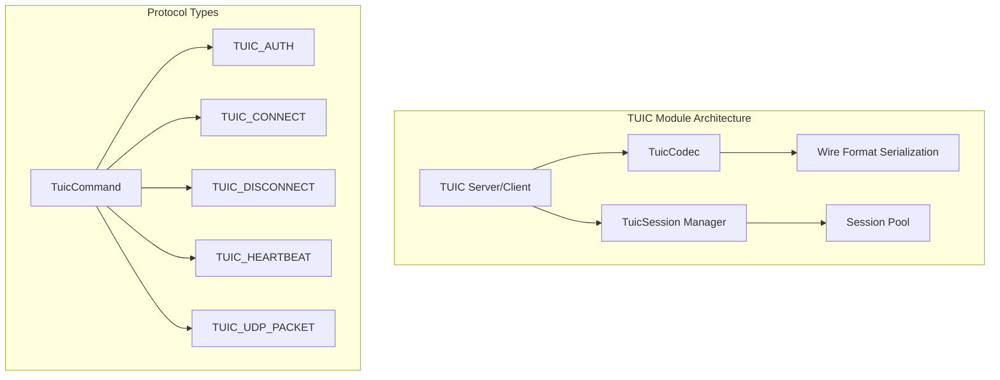
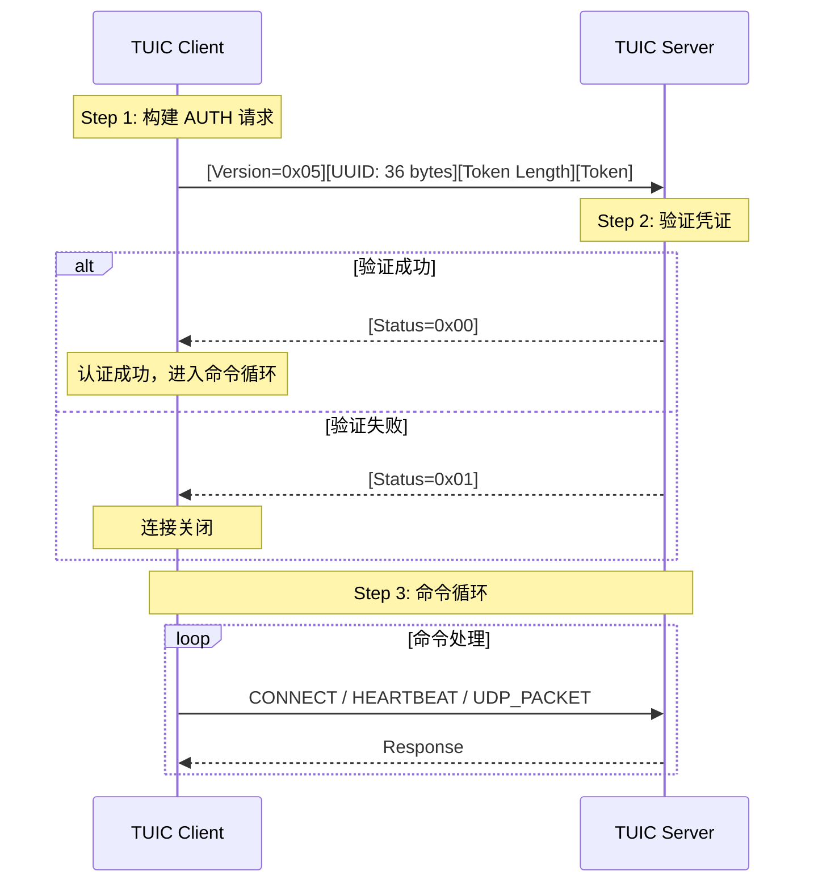

TUIC（Telegrams Ultimate Intensity Changer）是一个基于 QUIC 的高性能代理协议，专为低延迟和高吞吐量场景设计。dae-rs 通过 Rust 实现提供了完整的 TUIC 协议支持，利用 QUIC 协议的流复用和拥塞控制能力，为用户提供稳定可靠的透明代理服务。

## 协议架构

### 模块位置

TUIC 协议实现位于 `crates/dae-proxy/src/tuic/` 目录，包含三个核心文件：

```
tuic/
├── mod.rs      # 模块导出定义
├── codec.rs    # 协议编解码器
└── tuic.rs    # 核心实现
```

Sources: [tuic/mod.rs](crates/dae-proxy/src/tuic/mod.rs#L1-L12)

### 核心组件关系



### 命令类型定义

TUIC 协议定义了五种核心命令类型，每种命令在 wire format 中占用 1 字节标识：

| 命令类型 | 值 | 说明 | 用途 |
|---------|---|---|------|
| `AUTH` | 0x01 | 认证命令 | 客户端身份验证 |
| `CONNECT` | 0x02 | 连接命令 | 建立 TCP 连接 |
| `DISCONNECT` | 0x03 | 断开命令 | 关闭会话连接 |
| `HEARTBEAT` | 0x04 | 心跳命令 | 保活检测 |
| `UDP_PACKET` | 0x05 | UDP 数据包 | UDP 流量转发 |

Sources: [tuic.rs](crates/dae-proxy/src/tuic/tuic.rs#L19-L33)

## 协议握手流程

### 认证流程



### 连接建立流程

认证成功后，客户端通过 CONNECT 命令请求建立到目标地址的 TCP 连接：

```mermaid
sequenceDiagram
    participant C as Client
    participant P as TUIC Proxy
    participant T as Target Server
    
    C->>P: CONNECT<br/>[AddrType][Host][Port][SessionID]
    P->>T: 建立 TCP 连接
    T-->>P: 连接成功
    P-->>C: CONNECT_RESPONSE<br/>[SessionID][Status=0x00]
    
    Note over C,T: TCP 数据双向转发
    C<->P<->T: 数据传输
```

Sources: [tuic.rs handle_client](crates/dae-proxy/src/tuic/tuic.rs#L269-L349)

## 数据结构

### TuicConfig 配置结构

```rust
pub struct TuicConfig {
    pub token: String,                 // 认证令牌
    pub uuid: String,                   // 用户标识
    pub server_name: String,            // TLS SNI 域名
    pub congestion_control: String,     // 拥塞控制算法
    pub max_idle_timeout: u32,         // 最大空闲超时(秒)
    pub max_udp_packet_size: u32,      // 最大 UDP 包大小
    pub flow_control_window: u32,      // 流控窗口大小
}
```

Sources: [tuic.rs](crates/dae-proxy/src/tuic/tuic.rs#L104-L121)

### 默认配置值

| 参数 | 默认值 | 说明 |
|------|--------|------|
| `server_name` | "tuic.cloud" | TLS 服务器名称指示 |
| `congestion_control` | "bbr" | BBR 拥塞控制算法 |
| `max_idle_timeout` | 15 | 15 秒空闲超时 |
| `max_udp_packet_size` | 1400 | MTU 友好 |
| `flow_control_window` | 8388608 | 8MB 流控窗口 |

Sources: [tuic.rs](crates/dae-proxy/src/tuic/tuic.rs#L123-L135)

### TuicSession 会话状态

```rust
pub struct TuicSession {
    pub session_id: u64,                // 会话唯一标识
    pub remote: SocketAddr,            // 客户端地址
    pub target_addr: Option<(String, u16)>, // 目标地址
    pub connected: bool,               // 连接状态
    pub last_heartbeat: i64,           // 最后心跳时间戳
}
```

Sources: [tuic.rs](crates/dae-proxy/src/tuic/tuic.rs#L189-L202)

## Wire Format 协议格式

### 认证请求格式

```
┌─────────┬──────────────────┬──────────────┬─────────────┐
│ Version │       UUID       │ Token Length │    Token    │
│ 1 byte  │    36 bytes      │   2 bytes    │  N bytes    │
└─────────┴──────────────────┴──────────────┴─────────────┘
```

- **Version**: 协议版本，当前为 `0x05`
- **UUID**: 36 字节用户标识符（带连字符格式）
- **Token Length**: Token 长度（大端序 u16）
- **Token**: 认证令牌字符串

Sources: [codec.rs](crates/dae-proxy/src/tuic/codec.rs#L13-L22)

### 连接请求格式

```
┌──────────┬─────────────┬─────────┬───────────────────┬─────────────────┐
│ AddrType │    Host     │  Port   │    Session ID     │      Data       │
│ 1 byte   │   N bytes   │ 2 bytes │     8 bytes       │    N bytes      │
└──────────┴─────────────┴─────────┴───────────────────┴─────────────────┘
```

地址类型编码：
- `0x01`: IPv4 地址（4 字节）
- `0x02`: 域名（首字节为长度）
- `0x03`: IPv6 地址（16 字节）

Sources: [codec.rs](crates/dae-proxy/src/tuic/codec.rs#L24-L35)

## 错误处理

### TuicError 错误类型

```rust
pub enum TuicError {
    Io(#[from] std::io::Error),           // IO 错误
    InvalidProtocol(String),              // 协议格式错误
    InvalidCommand(String),               // 命令解析错误
    AuthFailed(String),                   // 认证失败
    InvalidConfig(String),                // 配置无效
    Quic(String),                         // QUIC 协议错误
    Timeout,                               // 超时
    NotConnected,                          // 未连接
}
```

Sources: [tuic.rs](crates/dae-proxy/src/tuic/tuic.rs#L161-L187)

### 错误处理策略

| 错误类型 | 触发条件 | 处理方式 |
|----------|----------|----------|
| `AuthFailed` | Token 或 UUID 不匹配 | 发送 0x01 响应并关闭连接 |
| `InvalidProtocol` | 版本不匹配或格式错误 | 立即关闭连接 |
| `InvalidCommand` | 未知命令类型 | 记录警告并忽略 |
| `Timeout` | 心跳超时或空闲超时 | 清理会话并关闭 |
| `Quic` | QUIC 连接错误 | 重试或降级 |

Sources: [tuic.rs handle_client](crates/dae-proxy/src/tuic/tuic.rs#L287-L296)

## 配置验证

TuicConfig 在创建时必须通过验证：

```rust
impl TuicConfig {
    pub fn validate(&self) -> Result<(), TuicError> {
        if self.token.is_empty() {
            return Err(TuicError::InvalidConfig(
                "token cannot be empty".to_string(),
            ));
        }
        if self.uuid.is_empty() {
            return Err(TuicError::InvalidConfig(
                "uuid cannot be empty".to_string(),
            ));
        }
        Ok(())
    }
}
```

Sources: [tuic.rs](crates/dae-proxy/src/tuic/tuic.rs#L147-L159)

## 核心组件

### TuicServer 服务器

```rust
pub struct TuicServer {
    config: TuicConfig,
    sessions: Arc<RwLock<HashMap<u64, TuicSession>>>,
}
```

服务器端核心功能：
- 监听 TCP 端口接受连接
- 管理活跃会话池
- 处理客户端认证
- 分发命令到对应处理器

Sources: [tuic.rs](crates/dae-proxy/src/tuic/tuic.rs#L220-L237)

### TuicClient 客户端

```rust
pub struct TuicClient {
    config: TuicConfig,
    server_addr: SocketAddr,
}

pub struct TuicClientSession {
    pub stream: TcpStream,
    pub server_addr: SocketAddr,
    pub session_id: u64,
}
```

客户端核心功能：
- 建立到服务器的连接
- 发送认证请求
- 创建到目标地址的连接
- 管理会话生命周期

Sources: [tuic.rs](crates/dae-proxy/src/tuic/tuic.rs#L374-L461)

### TuicHandler 协议处理器

```rust
pub struct TuicHandler {
    config: TuicConfig,
}

impl TuicHandler {
    pub async fn handle_inbound(&self, ctx: &mut Context) -> ProxyResult<()>;
    pub async fn handle_outbound(&self, ctx: &mut Context) -> ProxyResult<()>;
}
```

用于协议分派器集成的处理器接口。

Sources: [tuic.rs](crates/dae-proxy/src/tuic/tuic.rs#L463-L488)

## 使用示例

### 创建服务器

```rust
use dae_proxy::tuic::{TuicServer, TuicConfig};
use std::net::SocketAddr;

let config = TuicConfig::new(
    "your-auth-token".to_string(),
    "user-uuid-here".to_string(),
);

let server = TuicServer::new(config)?;
let addr: SocketAddr = "0.0.0.0:9999".parse().unwrap();
server.listen(addr).await?;
```

Sources: [tuic.rs](crates/dae-proxy/src/tuic/tuic.rs#L229-L237)

### 创建客户端

```rust
use dae_proxy::tuic::{TuicClient, TuicConfig};
use std::net::SocketAddr;

let config = TuicConfig::new(
    "your-auth-token".to_string(),
    "user-uuid-here".to_string(),
);

let server_addr: SocketAddr = "tuic.example.com:9999".parse().unwrap();
let client = TuicClient::new(config, server_addr);

// 连接到服务器
let mut session = client.connect().await?;

// 连接到目标
client.connect_target(&mut session, "example.com".to_string(), 443).await?;
```

Sources: [tuic.rs](crates/dae-proxy/src/tuic/tuic.rs#L381-L448)

## 安全考虑

1. **Token 认证**: 使用 32 字节认证令牌验证客户端身份
2. **UUID 标识**: 每个用户拥有唯一 UUID 进行会话追踪
3. **QUIC 加密**: TUIC 基于 QUIC 协议，内置 TLS 1.3 加密
4. **心跳保活**: 心跳机制维持连接活跃，检测失效连接
5. **BBR 拥塞控制**: BBR 算法在高延迟和高丢包网络表现优异

Sources: [tuic.rs default config](crates/dae-proxy/src/tuic/tuic.rs#L123-L135)

## 相关协议

- [Juicity 协议](14-juicity-xie-yi): TUIC 的后续协议，同样基于 UDP
- [Hysteria2 协议](13-hysteria2-xie-yi): 另一个基于 QUIC 的代理协议
- [VLESS 协议](8-vless-xie-yi): XTLS 家族的另一个成员