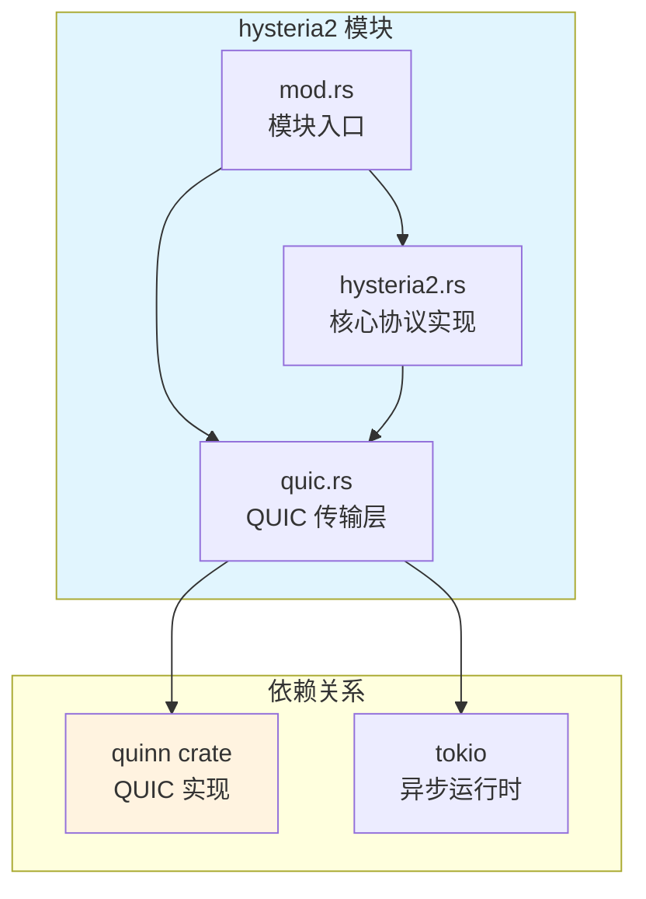
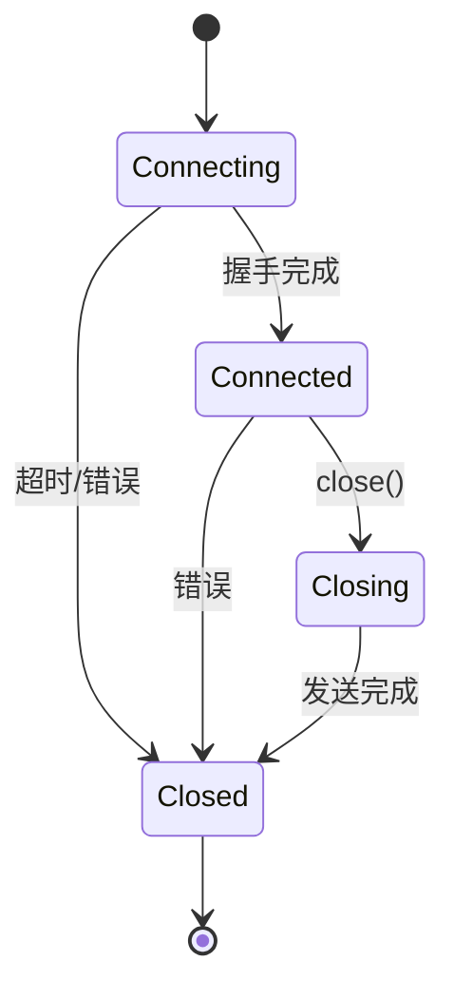
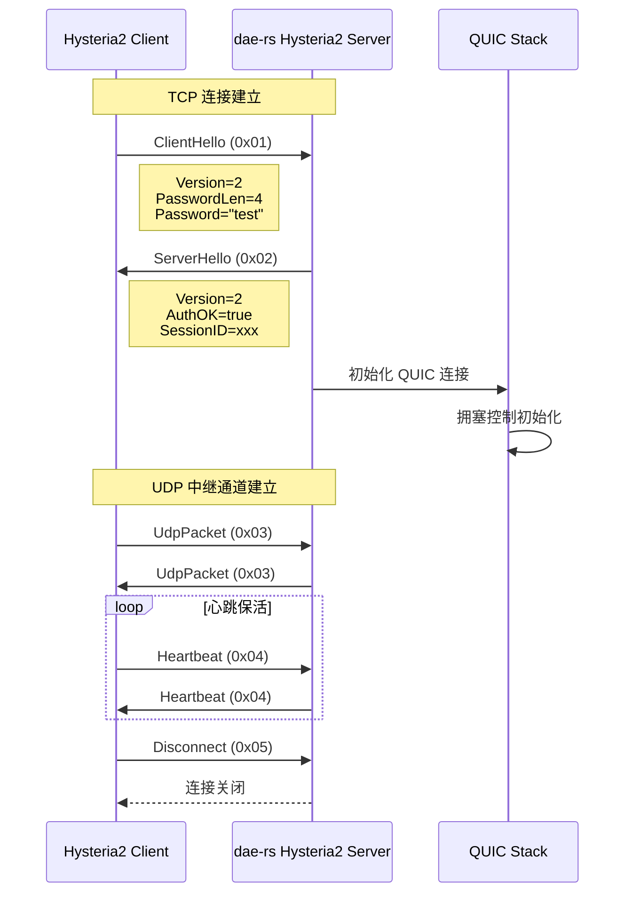
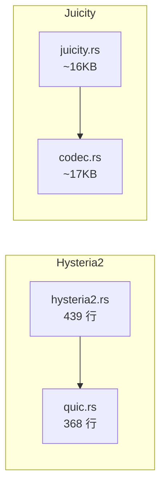

Hysteria2 是一个基于 QUIC 协议的高性能代理协议，专为恶劣网络环境设计，提供激进的速度加速能力。dae-rs 通过 `hysteria2` 模块实现了对 Hysteria2 协议的完整支持，利用 QUIC 的多路复用和拥塞控制机制实现稳定的传输性能。

## 架构概述

Hysteria2 协议在 dae-rs 中的实现由三个核心模块组成，分别处理协议解析、QUIC 传输和错误处理。这种分层设计确保了代码的可维护性和扩展性。



核心文件位置：`crates/dae-proxy/src/hysteria2/` [mod.rs](crates/dae-proxy/src/hysteria2/mod.rs#L1-L16)

## 协议帧格式

Hysteria2 使用二进制帧格式进行通信，每种帧类型都有明确的功能定义和字节布局。

### 帧类型定义

| 帧类型 | 值 | 说明 | 方向 |
|--------|---|------|------|
| `ClientHello` | 0x01 | 客户端问候帧，包含认证密码 | Client → Server |
| `ServerHello` | 0x02 | 服务端应答帧，携带认证结果和会话ID | Server → Client |
| `UdpPacket` | 0x03 | UDP 数据包帧，用于 UDP 流量中继 | 双向 |
| `Heartbeat` | 0x04 | 心跳帧，维持连接活跃 | 双向 |
| `Disconnect` | 0x05 | 断开连接帧，优雅关闭 | 双向 |

帧类型枚举定义位于 [hysteria2.rs:63-72](crates/dae-proxy/src/hysteria2/hysteria2.rs#L63-L72)。

### ClientHello 帧结构

```
┌─────────────┬─────────┬──────────────┬──────────────┬─────────────┐
│ FrameType   │ Version │ PasswordLen  │ Password     │ LocalAddr?  │
│ (1 byte)    │ (1 byte)│ (1 byte)     │ (N bytes)    │ (可变)      │
│ 0x01        │ 0x02    │              │ UTF-8 编码   │ 可选字段     │
└─────────────┴─────────┴──────────────┴──────────────┴─────────────┘
```

ClientHello 帧解析逻辑在 [parse_client_hello](crates/dae-proxy/src/hysteria2/hysteria2.rs#L241-L289) 方法中实现，该方法验证帧类型、版本号和密码长度。

### 地址类型格式

| ATYP | 值 | 格式 | 字节长度 |
|------|---|------|----------|
| IPv4 | 0x01 | `[0x01][4字节IP][2字节端口]` | 7 字节 |
| Domain | 0x02 | `[0x02][1字节长度][域名][2字节端口]` | 可变 |
| IPv6 | 0x03 | `[0x03][16字节IP][2字节端口]` | 19 字节 |

地址解析实现见 [Hysteria2Address::parse](crates/dae-proxy/src/hysteria2/hysteria2.rs#L82-L137)。

## 配置结构

`Hysteria2Config` 是 Hysteria2 协议的核心配置结构，定义了服务端运行所需的所有参数。

```rust
pub struct Hysteria2Config {
    pub password: String,           // 认证密码
    pub server_name: String,        // TLS SNI 主机名
    pub obfuscate_password: Option<String>,  // DPI 混淆密码
    pub listen_addr: SocketAddr,    // 监听地址
    pub bandwidth_limit: u64,        // 带宽限制 (bps，0=无限制)
    pub idle_timeout: Duration,     // 空闲超时
    pub udp_enabled: bool,          // 启用 UDP
}
```

默认值配置位于 [Hysteria2Config::default](crates/dae-proxy/src/hysteria2/hysteria2.rs#L44-L54)。

### 配置参数说明

| 参数 | 类型 | 默认值 | 说明 |
|------|------|--------|------|
| `password` | String | "" | 客户端认证密码（必填） |
| `server_name` | String | "" | TLS SNI 服务器名称 |
| `obfuscate_password` | Option\<String\> | None | 混淆密码，用于 DPI 绕过 |
| `listen_addr` | SocketAddr | 127.0.0.1:8123 | TCP 监听地址 |
| `bandwidth_limit` | u64 | 0 | 带宽限制（0 表示无限制） |
| `idle_timeout` | Duration | 30s | QUIC 空闲超时时间 |
| `udp_enabled` | bool | true | 是否启用 UDP 流量中继 |

## 核心组件

### Hysteria2Handler

`Hysteria2Handler` 负责处理单个客户端连接的生命周期管理，包括认证、握手和数据转发。

```rust
pub struct Hysteria2Handler {
    config: Hysteria2Config,
}

impl Hysteria2Handler {
    pub fn new(config: Hysteria2Config) -> Self
    pub async fn handle(&self, stream: TcpStream) -> Result<(), Hysteria2Error>
}
```

连接处理流程见 [handle](crates/dae-proxy/src/hysteria2/hysteria2.rs#L218-L239) 方法。

### Hysteria2Server

`Hysteria2Server` 提供服务端能力，监听 TCP 连接并为每个连接分配 handler。

```rust
pub struct Hysteria2Server {
    config: Hysteria2Config,
    listener: Option<TcpListener>,
}

impl Hysteria2Server {
    pub async fn new(config: Hysteria2Config) -> Result<Self, Hysteria2Error>
    pub async fn serve(self) -> Result<(), Hysteria2Error>
}
```

服务端实现位于 [Hysteria2Server](crates/dae-proxy/src/hysteria2/hysteria2.rs#L330-L373)。

## QUIC 传输层

QUIC 层是 Hysteria2 高性能的基础，提供 0-RTT 连接建立、多路复用和内置拥塞控制。

### QUIC 配置

```rust
pub struct QuicConfig {
    pub server_name: String,
    pub verify_cert: bool,
    pub idle_timeout: Duration,
    pub initial_rtt: Duration,
    pub max_udp_payload_size: u64,
    pub enable_0rtt: bool,
    pub congestion_control: CongestionControl,
}
```

配置默认值见 [QuicConfig::default](crates/dae-proxy/src/hysteria2/quic.rs#L27-L40)。

### 拥塞控制算法

| 算法 | 特性 | 适用场景 |
|------|------|----------|
| `Bbr` | 带宽延迟积感知 | 高带宽高延迟网络 |
| `Cubic` | Linux 默认算法 | 通用场景 |
| `Reno` | 经典拥塞控制 | 低带宽网络 |
| `NewReno` | Reno 改进版 | 丢包敏感场景 |

拥塞控制枚举定义在 [quic.rs:21-31](crates/dae-proxy/src/hysteria2/quic.rs#L21-L31)。

### QUIC 连接状态



状态枚举见 [QuicState](crates/dae-proxy/src/hysteria2/quic.rs#L43-51)。

## 错误处理

Hysteria2 定义了四类错误，对应协议各层可能出现的故障情况。

| 错误类型 | 原因 | 处理方式 |
|----------|------|----------|
| `AuthFailed` | 密码验证失败 | 拒绝连接，记录警告 |
| `Protocol` | 协议格式错误或版本不支持 | 关闭连接 |
| `Quic` | QUIC 层通信错误 | 根据具体错误决定重试或关闭 |
| `Io` | 网络 I/O 错误 | 传播给上层处理 |

错误定义见 [Hysteria2Error](crates/dae-proxy/src/hysteria2/hysteria2.rs#L56-68)。

## 协议流程

### 完整连接建立过程



### UDP 中继实现状态

当前实现中，UDP 中继功能标记为部分实现状态：

```rust
async fn handle_udp_relay(
    &self,
    _stream: TcpStream,
    _local_addr: Option<Hysteria2Address>,
) -> Result<(), Hysteria2Error> {
    warn!("UDP relay not yet fully implemented - requires QUIC integration");
    Ok(())
}
```

见 [handle_udp_relay](crates/dae-proxy/src/hysteria2/hysteria2.rs#L311-L317)。

## 与 Juicity 协议对比

Hysteria2 和 Juicity 都是基于 QUIC 的代理协议，但设计目标略有不同。

| 特性 | Hysteria2 | Juicity |
|------|-----------|---------|
| 底层传输 | QUIC | QUIC |
| 认证方式 | 共享密码 | 共享密码 |
| 拥塞控制 | BBR/Cubic/Reno | 可配置 |
| 混淆支持 | obfuscate_password | 无 |
| 带宽限制 | 内置支持 | 需外部实现 |
| 协议帧 | 5 种帧类型 | codec 定义的帧 |

两者模块结构对比：



## 单元测试

模块包含完整的单元测试覆盖关键功能。

### 地址解析测试

```rust
#[test]
fn test_hysteria2_address_ipv4() {
    let ip = IpAddr::V4(Ipv4Addr::new(192, 168, 1, 1));
    let addr = Hysteria2Address::Ip(ip);
    let encoded = addr.encode();
    assert_eq!(encoded[0], 0x01);
    assert_eq!(&encoded[1..5], &[192, 168, 1, 1]);
}

#[test]
fn test_hysteria2_address_domain() {
    let addr = Hysteria2Address::Domain("example.com".to_string(), 443);
    let encoded = addr.encode();
    assert_eq!(encoded[0], 0x02);
    assert_eq!(encoded[1], 11); // "example.com" 长度
}
```

测试代码见 [hysteria2.rs:401-439](crates/dae-proxy/src/hysteria2/hysteria2.rs#L401-L439)。

### ClientHello 解析测试

```rust
#[test]
fn test_parse_client_hello() {
    let config = Hysteria2Config::default();
    let handler = Hysteria2Handler::new(config);

    let mut data = Vec::new();
    data.push(0x01); // ClientHello 帧类型
    data.push(0x02); // Version 2
    data.push(4);    // Password length
    data.extend_from_slice(b"test");

    let result = handler.parse_client_hello(&data);
    assert!(result.is_ok());
    let hello = result.unwrap();
    assert_eq!(hello.version, 2);
    assert_eq!(hello.password, "test");
}
```

## 安全性考虑

1. **密码认证**：使用共享密码验证客户端身份，密码以 UTF-8 编码传输
2. **混淆密码**：可选的 `obfuscate_password` 提供额外的 DPI 绕过层
3. **QUIC 加密**：依赖 QUIC 协议内置的 0-RTT 和 1-RTT 加密
4. **带宽限制**：`bandwidth_limit` 参数可防止客户端滥用资源

## 后续阅读

- [TUIC 协议](12-tuic-xie-yi) - 另一个基于 QUIC 的代理协议实现
- [Juicity 协议](14-juicity-xie-yi) - 类似的 UDP 优先代理协议
- [传输层抽象](15-chuan-shu-ceng-chou-xiang) - 了解 TLS 和 Reality 配置

## 相关源码文件

| 文件 | 行数 | 说明 |
|------|------|------|
| [crates/dae-proxy/src/hysteria2/mod.rs](crates/dae-proxy/src/hysteria2/mod.rs) | 16 | 模块入口 |
| [crates/dae-proxy/src/hysteria2/hysteria2.rs](crates/dae-proxy/src/hysteria2/hysteria2.rs) | 439 | 核心协议实现 |
| [crates/dae-proxy/src/hysteria2/quic.rs](crates/dae-proxy/src/hysteria2/quic.rs) | 368 | QUIC 传输层 |
| [crates/dae-proxy/Cargo.toml](crates/dae-proxy/Cargo.toml) | - | quinn 依赖配置 |