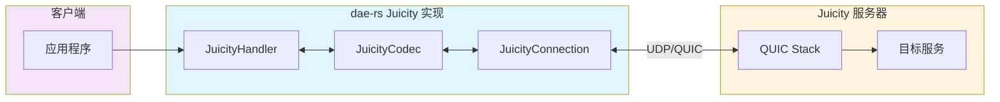
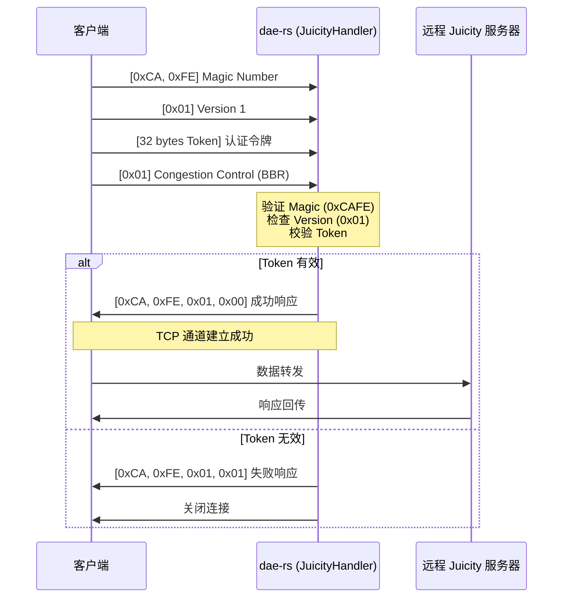

Juicity 是一个基于 UDP 的高性能代理协议，专为低延迟和高吞吐量场景设计。dae-rs 通过 `crates/dae-proxy/src/juicity/` 模块提供了完整的 Juicity 协议实现，包括服务器端和客户端支持。该协议采用轻量级 QUIC 传输层，具有简洁的认证机制和灵活的拥塞控制选项。

## 协议架构

Juicity 协议采用客户端-服务器架构，支持 TCP 和 UDP 两种传输模式。协议设计强调简洁性和高性能，特别适合高带宽低延迟的网络环境。



协议模块结构如下：

```
crates/dae-proxy/src/juicity/
├── mod.rs          # 模块入口，导出公开类型
├── codec.rs        # 帧编解码器实现
└── juicity.rs     # 核心处理器和客户端/服务器实现
```

Sources: [mod.rs](crates/dae-proxy/src/juicity/mod.rs#L1-L20), [juicity.rs](crates/dae-proxy/src/juicity/juicity.rs#L1-L50)

## 协议帧格式

Juicity 协议使用二进制帧格式进行通信。每个帧由命令、连接标识、会话标识、序列号、地址信息和负载数据组成。

### 帧结构定义


帧的最小长度为 13 字节（命令 + 连接ID + 会话ID + 序列号），Open 命令需要额外的地址信息。

Sources: [codec.rs](crates/dae-proxy/src/juicity/codec.rs#L250-L285)

### 命令类型

Juicity 定义了五种核心命令，用于管理连接生命周期和数据传输：

| 命令 | 值 | 说明 | 使用场景 |
|------|---|---|----------|
| `Open` | 0x01 | 建立新连接 | 发起连接请求，包含目标地址 |
| `Send` | 0x02 | 发送数据 | 传输应用层数据 |
| `Close` | 0x03 | 关闭连接 | 优雅关闭连接 |
| `Ping` | 0x04 | 心跳请求 | 保活探测 |
| `Pong` | 0x05 | 心跳响应 | 心跳响应 |

Sources: [codec.rs](crates/dae-proxy/src/juicity/codec.rs#L15-L40)

### 地址类型

Juicity 支持三种目标地址表示方式：

| 类型 | 值 | 格式 | 长度 |
|------|---|---|------|
| IPv4 | 0x01 | [1B type][4B IP][2B port] | 7 字节 |
| Domain | 0x02 | [1B type][1B len][N bytes domain][2B port] | 4+N 字节 |
| IPv6 | 0x03 | [1B type][16B IP][2B port] | 19 字节 |

Sources: [codec.rs](crates/dae-proxy/src/juicity/codec.rs#L55-L95)

## 握手流程

Juicity 协议使用 TCP 进行握手认证，UDP 进行数据传输。握手过程确保客户端身份的有效性。

### TCP 握手序列



握手数据包格式（38 字节）：

| 偏移 | 长度 | 内容 |
|------|------|------|
| 0-1 | 2 | Magic Number (0xCAFE) |
| 2 | 1 | Protocol Version (0x01) |
| 3-34 | 32 | Authentication Token |
| 35 | 1 | Congestion Control Preference |
| 36-37 | 2 | Reserved |

Sources: [juicity.rs](crates/dae-proxy/src/juicity/juicity.rs#L200-L260)

### UDP 数据传输

握手成功后，客户端与服务器通过 UDP 进行数据传输，使用 JuicityFrame 进行封装：

```rust
pub struct JuicityFrame {
    pub command: JuicityCommand,
    pub connection_id: u32,
    pub session_id: u32,
    pub sequence: u32,
    pub address: Option<JuicityAddress>,
    pub payload: Vec<u8>,
}
```

Sources: [codec.rs](crates/dae-proxy/src/juicity/codec.rs#L100-L125)

## 拥塞控制算法

Juicity 支持三种拥塞控制算法，客户端可在握手时声明偏好：

| 算法 | 协议值 | 适用场景 | 特点 |
|------|--------|----------|------|
| `Bbr` | 0x01 | 高带宽、高延迟网络 | 在丢包环境下表现优异 |
| `Cubic` | 0x02 | 通用场景 | Linux 默认算法，兼容性好 |
| `Reno` | 0x03 | 低带宽网络 | 经典拥塞控制算法 |

```rust
pub enum CongestionControl {
    Bbr,
    Cubic,
    Reno,
}

impl CongestionControl {
    pub fn from_str(s: &str) -> Option<Self> {
        match s.to_lowercase().as_str() {
            "bbr" => Some(CongestionControl::Bbr),
            "cubic" => Some(CongestionControl::Cubic),
            "reno" => Some(CongestionControl::Reno),
            _ => None,
        }
    }
    
    pub fn to_byte(self) -> u8 {
        match self {
            CongestionControl::Bbr => 0x01,
            CongestionControl::Cubic => 0x02,
            CongestionControl::Reno => 0x03,
        }
    }
}
```

Sources: [juicity.rs](crates/dae-proxy/src/juicity/juicity.rs#L80-L105)

## 核心实现

### JuicityHandler

`JuicityHandler` 是协议处理的核心实现，实现了 `ProtocolHandler` trait：

```rust
pub struct JuicityHandler {
    config: JuicityConfig,
}

impl JuicityHandler {
    pub fn new(config: JuicityConfig) -> Self;
    pub fn name(&self) -> &'static str { "juicity" }
    pub async fn handle_tcp(self: Arc<Self>, client: TcpStream) -> Result<(), JuicityError>;
    pub async fn handle_udp(self: Arc<Self>, socket: UdpSocket) -> Result<(), JuicityError>;
}
```

Sources: [juicity.rs](crates/dae-proxy/src/juicity/juicity.rs#L130-L170)

### JuicityConfig

配置结构定义了 Juicity 客户端和服务器的连接参数：

```rust
pub struct JuicityConfig {
    pub token: String,                    // 认证令牌
    pub server_name: String,              // TLS SNI
    pub server_addr: String,              // 服务器地址
    pub server_port: u16,                 // 服务器端口
    pub congestion_control: CongestionControl, // 拥塞控制算法
    pub timeout: Duration,                // 超时时间
}

impl Default for JuicityConfig {
    fn default() -> Self {
        Self {
            token: String::new(),
            server_name: String::new(),
            server_addr: "127.0.0.1".to_string(),
            server_port: 443,
            congestion_control: CongestionControl::Bbr,
            timeout: Duration::from_secs(30),
        }
    }
}
```

Sources: [juicity.rs](crates/dae-proxy/src/juicity/juicity.rs#L30-L65)

### JuicityClient

客户端实现用于连接到远程 Juicity 服务器：

```rust
pub struct JuicityClient {
    config: JuicityConfig,
}

impl JuicityClient {
    pub fn new(config: JuicityConfig) -> Self;
    pub async fn connect(&self, target: JuicityAddress) -> Result<JuicityConnection, JuicityError>;
}

pub struct JuicityConnection {
    connection_id: u32,
    session_id: u32,
    socket: Option<UdpSocket>,
}

impl JuicityConnection {
    pub async fn send(&self, data: &[u8]) -> Result<(), JuicityError>;
    pub async fn recv(&self, buf: &mut [u8]) -> Result<usize, JuicityError>;
    pub async fn close(self) -> Result<(), JuicityError>;
}
```

Sources: [juicity.rs](crates/dae-proxy/src/juicity/juicity.rs#L410-L500)

## 错误处理

Juicity 实现定义了专门的错误类型：

```rust
pub enum JuicityError {
    #[error("IO error: {0}")]
    Io(#[from] std::io::Error),
    
    #[error("Invalid header")]
    InvalidHeader,              // Magic number 不匹配
    
    #[error("Invalid token")]
    InvalidToken,               // Token 验证失败
    
    #[error("Connection not found: {0}")]
    ConnectionNotFound(u32),     // 连接不存在
    
    #[error("Session expired")]
    SessionExpired,              // 会话过期
    
    #[error("Timeout")]
    Timeout,                     // 操作超时
    
    #[error("Protocol error: {0}")]
    Protocol(String),            // 协议错误
}
```

Sources: [juicity.rs](crates/dae-proxy/src/juicity/juicity.rs#L20-L50)

## 配置示例

### TOML 配置格式

```toml
[[nodes]]
name = "Juicity Server 1"
type = "juicity"
server = "juicity.example.com"
port = 443
uuid = "your-uuid-here"
password = "your-password"
tls_server_name = "juicity.example.com"
congestion_control = "bbr"
```

### 代码中使用

```rust
use dae_proxy::juicity::{
    CongestionControl, JuicityClient, JuicityConfig, JuicityHandler
};

// 创建配置
let config = JuicityConfig {
    token: "your-auth-token".to_string(),
    server_name: "juicity.example.com".to_string(),
    server_addr: "juicity.example.com".to_string(),
    server_port: 443,
    congestion_control: CongestionControl::Bbr,
    timeout: Duration::from_secs(30),
};

// 创建处理器
let handler = JuicityHandler::new(config);

// 创建客户端
let client = JuicityClient::new(config.clone());
```

Sources: [juicity.rs](crates/dae-proxy/src/juicity/juicity.rs#L415-L450)

## 协议特性对比

Juicity 与其他 UDP 代理协议的对比：

| 特性 | Juicity | TUIC | Hysteria2 |
|------|---------|------|-----------|
| 传输层 | QUIC | QUIC | QUIC |
| 认证方式 | Token | Token | Password |
| 拥塞控制 | BBR/CUBIC/Reno | BBR/CUBIC | Brute/BBR |
| 头部开销 | ~17 字节 | ~20 字节 | ~15 字节 |
| 适用场景 | 通用 | 低延迟游戏 | 超高带宽 |
| 复杂度 | 中等 | 较高 | 简单 |

Sources: [docs/PROTOCOLS.md](docs/PROTOCOLS.md#L230-L260)

## 帧编解码示例

JuicityCodec 提供了完整的帧编码和解码功能：

```rust
use dae_proxy::juicity::{
    JuicityAddress, JuicityCodec, JuicityCommand, JuicityFrame
};

// 编码 Open 帧
let addr = JuicityAddress::Domain("example.com".to_string(), 443);
let frame = JuicityFrame::new_open(0x12345678, 0xABCDEF00, addr);
let encoded = JuicityCodec::encode(&frame);

// 解码帧
if let Some(decoded) = JuicityCodec::decode(&encoded) {
    assert_eq!(decoded.command, JuicityCommand::Open);
    assert_eq!(decoded.connection_id, 0x12345678);
}

// 编码 Send 帧
let payload = b"Hello, Juicity!";
let send_frame = JuicityFrame::new_send(0x12345678, 0xABCDEF00, 42, payload.to_vec());
let send_encoded = JuicityCodec::encode(&send_frame);
```

Sources: [codec.rs](crates/dae-proxy/src/juicity/codec.rs#L280-L340)

## 安全考虑

1. **Token 认证**: 使用 32 字节 token 进行客户端身份验证
2. **Magic Number**: 0xCAFE 魔数用于快速协议识别和初步过滤
3. **BBR 拥塞控制**: 在高丢包率网络环境下表现优于传统算法
4. **UDP 校验**: 依赖 QUIC/UDP 协议栈的数据完整性校验

Sources: [juicity.rs](crates/dae-proxy/src/juicity/juicity.rs#L220-L250)

## 总结

Juicity 协议是 dae-rs 支持的高性能 UDP 代理协议之一，通过 `crates/dae-proxy/src/juicity/` 模块提供完整实现。协议采用简洁的二进制帧格式，支持多种拥塞控制算法，适合各种网络环境下的代理需求。结合 dae-rs 的 eBPF 透明代理能力，Juicity 可以作为高性能出站协议使用。

建议后续阅读：[TUIC 协议](12-tuic-xie-yi) 了解另一个 QUIC 传输协议的实现，或 [Hysteria2 协议](13-hysteria2-xie-yi) 了解激进拥塞控制方案。