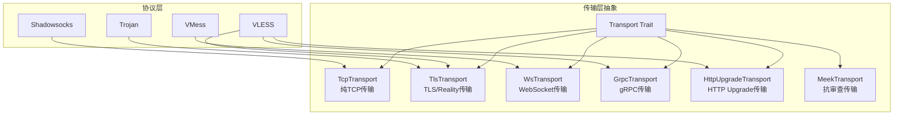

传输层抽象是 dae-rs 代理核心架构的关键组成部分，它通过统一的 trait 接口支持多种传输协议，包括 TCP、TLS、WebSocket、gRPC、HTTP Upgrade 和 Meek 等。这种设计使得上层协议实现（如 VLESS、VMess、Trojan）可以透明地切换底层传输方式，无需关心具体的连接细节。

## 架构设计

传输层模块位于 `crates/dae-proxy/src/transport/` 目录下，采用 **零成本抽象** 的设计理念，通过 Rust trait 系统定义统一的接口规范。所有传输实现都遵循相同的行为契约，确保协议层与传输层可以自由组合。



### Transport Trait 定义

核心 trait 定义在 `crates/dae-proxy/src/transport/mod.rs` 中，使用 `async_trait` 提供异步接口支持：

```rust
#[async_trait]
pub trait Transport: Send + Sync + Debug {
    fn name(&self) -> &'static str;
    async fn dial(&self, addr: &str) -> std::io::Result<TcpStream>;
    async fn listen(&self, addr: &str) -> std::io::Result<tokio::net::TcpListener>;
    fn supports_udp(&self) -> bool { false }
    async fn local_addr(&self) -> Option<SocketAddr> { None }
}
```

这个 trait 的设计遵循了几个核心原则：**Send + Sync** 约束确保传输层可以在多线程环境中安全共享；**Debug** trait 支持调试输出；默认方法实现了接口的渐进式增强，新的传输类型只需实现必需的方法即可。

Sources: [crates/dae-proxy/src/transport/mod.rs](crates/dae-proxy/src/transport/mod.rs#L10-L27)

## 传输类型详解

### TCP 传输

`TcpTransport` 是最简单的传输实现，提供纯 TCP 连接能力，不进行任何加密或协议封装。它默认不支持 UDP，是所有其他传输类型的基础构建块。

```rust
#[derive(Debug, Default)]
pub struct TcpTransport;

impl TcpTransport {
    pub fn new() -> Self {
        Self
    }
}

#[async_trait]
impl Transport for TcpTransport {
    fn name(&self) -> &'static str {
        "tcp"
    }

    async fn dial(&self, addr: &str) -> std::io::Result<TcpStream> {
        tokio::net::TcpStream::connect(addr).await
    }

    async fn listen(&self, addr: &str) -> std::io::Result<tokio::net::TcpListener> {
        tokio::net::TcpListener::bind(addr).await
    }

    fn supports_udp(&self) -> bool {
        false
    }
}
```

Sources: [crates/dae-proxy/src/transport/tcp.rs](crates/dae-proxy/src/transport/tcp.rs#L1-L62)

### TLS 传输

`TlsTransport` 实现了 TLS 加密传输，并特别支持 **Reality 协议**（VLESS XTLS 的混淆扩展）。Reality 通过 X25519 密钥交换实现无证书的 TLS 伪装，能够有效绕过深度包检测（DPI）。

TLS 配置结构支持丰富的定制选项：

```rust
pub struct TlsConfig {
    pub alpn: Vec<Vec<u8>>,           // 应用层协议协商列表
    pub server_name: String,          // SNI 主机名
    pub reality: Option<RealityConfig>, // Reality 配置
    pub accept_invalid_cert: bool,    // 接受无效证书（仅测试用）
}

impl TlsConfig {
    pub fn new(server_name: &str) -> Self { ... }
    pub fn with_reality(mut self, public_key: &[u8], short_id: &[u8], destination: &str) -> Self { ... }
    pub fn with_alpn(mut self, alpn: Vec<Vec<u8>>) -> Self { ... }
}
```

Reality 握手流程是 TLS 传输中最复杂的部分，涉及以下步骤：

1. **生成临时密钥对**：使用 `curve25519_dalek` 库生成 X25519 临时公私钥
2. **计算共享密钥**：通过 ECDH 算法与服务器公钥计算共享秘密
3. **构建 Reality 请求**：生成 48 字节的请求负载，包含 HMAC-SHA256 签名
4. **发送 ClientHello**：在 TLS ClientHello 中嵌入 Reality chrome 扩展
5. **验证 ServerHello**：检查服务器响应的 MAC 签名，使用常量时间比较防止时序攻击

```rust
async fn reality_handshake(&self, mut stream: TcpStream) -> std::io::Result<TcpStream> {
    // Step 1: 生成 X25519 临时密钥对
    let mut rng = rand::rngs::OsRng;
    let scalar = curve25519_dalek::Scalar::random(&mut rng);
    let point = curve25519_dalek::MontgomeryPoint::mul_base(&scalar);
    
    // Step 2: 计算 ECDH 共享密钥
    let server_point = curve25519_dalek::MontgomeryPoint(server_public_key);
    let shared_point = server_point * scalar;
    
    // Step 3: 生成 Reality 请求
    let hmac_key = hmac_sha256(&shared_bytes, b"Reality Souls");
    request[..32].copy_from_slice(&hmac_key);
    
    // ... 后续握手步骤
}
```

Sources: [crates/dae-proxy/src/transport/tls.rs](crates/dae-proxy/src/transport/tls.rs#L1-L300)

### WebSocket 传输

WebSocket 传输使用 `tokio-tungstenite` 库实现，支持明文 WebSocket 和加密的 WSS（WebSocket Secure）。`WsConnection` 封装了 WebSocket 流，提供统一的读写接口。

```rust
pub struct WsConfig {
    pub path: String,              // 请求路径
    pub host: String,              // Host 头
    pub tls: bool,                 // 是否使用 TLS (wss://)
    pub headers: HashMap<String, String>, // 自定义 HTTP 头
    pub timeout: Duration,         // 连接超时
    pub max_frame_size: usize,     // 最大帧大小
}

pub struct WsTransport {
    pub config: WsConfig,
}

pub struct WsConnector {
    pub transport: WsTransport,
}

impl WsConnector {
    pub async fn connect(&self) -> Result<WsStream, ...> {
        let url = self.transport.url();
        let (ws_stream, _) = connect_async(&url).await?;
        Ok(ws_stream)
    }
}
```

WebSocket 消息处理支持二进制和文本两种模式，读操作会循环等待直到收到有效数据帧或连接关闭：

```rust
pub async fn read(&mut self, buf: &mut [u8]) -> std::io::Result<usize> {
    loop {
        match self.stream.next().await {
            Some(Ok(msg)) => match msg {
                tokio_tungstenite::tungstenite::Message::Binary(data) => { ... }
                tokio_tungstenite::tungstenite::Message::Text(text) => { ... }
                tokio_tungstenite::tungstenite::Message::Close(_) => return Ok(0),
                _ => continue,
            },
            ...
        }
    }
}
```

Sources: [crates/dae-proxy/src/transport/ws.rs](crates/dae-proxy/src/transport/ws.rs#L1-L300)

### gRPC 传输

`GrpcTransport` 实现了 HTTP/2 协议基础上的 gRPC 传输，专门为 VLESS Reality Vision 场景设计。它手动构建 HTTP/2 帧，支持 gRPC 的长度前缀消息格式。

gRPC 配置包括服务名、方法名、主机端口等关键参数：

```rust
pub struct GrpcConfig {
    pub service_name: String,      // 服务名 (e.g., "grpc.WebSocket")
    pub method_name: String,       // 方法名 (e.g., "/WebSocket/Tunnel")
    pub host: String,
    pub port: u16,
    pub tls: bool,
    pub sni: Option<String>,
    pub insecure: bool,
    pub connect_timeout: Duration,
}
```

gRPC 帧结构采用 HTTP/2 标准帧格式，消息体使用 1 字节标志 + 4 字节长度的 gRPC 特定封装：

```rust
fn build_data_frame(stream_id: u32, data: &[u8], is_last: bool) -> Bytes {
    // gRPC 消息格式: 1-byte flag (0x80=compressed) + 4-byte length + data
    let grpc_payload_len = 1 + 4 + data.len();
    let mut grpc_payload = BytesMut::with_capacity(grpc_payload_len);
    grpc_payload.put_u8(0);      // flag: 无压缩
    grpc_payload.put_u32(data.len() as u32);
    grpc_payload.put(data);
    // 包装为 HTTP/2 DATA 帧
    ...
}
```

Sources: [crates/dae-proxy/src/transport/grpc.rs](crates/dae-proxy/src/transport/grpc.rs#L1-200)

### HTTP Upgrade 传输

HTTP Upgrade 传输实现 RFC 7230 定义的协议升级机制，流程简单：客户端发送带有 `Upgrade` 头的 HTTP 请求，服务器返回 101 状态码后连接升级为全双工通道。

```rust
fn build_upgrade_request(&self) -> String {
    format!(
        "GET {} HTTP/1.1\r\n\
        Host: {}:{}\r\n\
        Connection: Upgrade\r\n\
        Upgrade: tcp\r\n\
        User-Agent: dae-rs/0.1.0\r\n\
        \r\n",
        self.config.path, self.config.host, self.config.port
    )
}
```

Sources: [crates/dae-proxy/src/transport/httpupgrade.rs](crates/dae-proxy/src/transport/httpupgrade.rs#L1-200)

### Meek 传输

`MeekTransport` 是专为抗审查场景设计的传输层实现，核心机制是 **域名前置（Domain Fronting）**。它通过 CDN 服务（如 Azure、Cloudflare）伪装真实目标，使审查者只能看到合法的云服务域名。

```rust
pub enum MeekTactic {
    Http,           // HTTP 代理通过前端域
    Https,          // HTTPS 代理通过前端域
    Bytepolding,    // 长度编码请求 + 填充 (默认)
    Snia,           // Session ticket ID 混淆 (Azure)
    Patterns,       // 基于模式的混淆
    Gimmie,         // 带问候语的简单隧道
    Redirect,       // 服务器端重定向跟随
}

pub struct MeekConfig {
    pub front_domain: String,      // 前端域名 (出现在 SNI/TLS 中)
    pub server_host: String,      // 实际服务器 (CDN 背后)
    pub port: u16,
    pub tactic: MeekTactic,
    pub tls: bool,
    pub sni: Option<String>,      // TLS SNI，默认为 front_domain
    pub padding_size: usize,      // 填充大小
}
```

Meek 的 Bytepolding 策略将请求编码为固定长度块，包含长度前缀和随机填充：

```rust
MeekTactic::Bytepolding => {
    let request = Self::build_simple_request(host, path);
    let length = request.len() as u32;
    let padding_len = (self.config.padding_size
        - (length as usize % self.config.padding_size))
        .min(self.config.padding_size);

    buf.put_u32(padding_len as u32);
    buf.put_slice(&vec![0u8; padding_len][..]);
    buf.put_u32(length);
    buf.put_slice(&request);
}
```

Sources: [crates/dae-proxy/src/transport/meek.rs](crates/dae-proxy/src/transport/meek.rs#L1-400)

## 配置参数对照表

### TLS/Reality 配置

| 参数 | 类型 | 默认值 | 说明 |
|------|------|--------|------|
| `server_name` | String | "localhost" | SNI 主机名，用于 TLS 握手 |
| `alpn` | Vec<Vec<u8>> | ["h2", "http/1.1"] | ALPN 协议列表 |
| `reality.enabled` | bool | false | 是否启用 Reality 混淆 |
| `reality.public_key` | Vec<u8> | - | X25519 公钥 (32 字节) |
| `reality.short_id` | Vec<u8> | - | Short ID (最多 8 字节) |
| `reality.destination` | String | - | 伪装的 SNI 目标 |
| `accept_invalid_cert` | bool | false | 接受无效证书 (仅测试) |

### WebSocket 配置

| 参数 | 类型 | 默认值 | 说明 |
|------|------|--------|------|
| `path` | String | "/" | WebSocket 路径 |
| `host` | String | "localhost" | Host 头 |
| `tls` | bool | false | 是否使用 wss:// |
| `headers` | HashMap | {} | 自定义 HTTP 头 |
| `timeout` | Duration | 30s | 连接超时 |
| `max_frame_size` | usize | 65535 | 最大帧大小 |

### Meek 配置

| 参数 | 类型 | 默认值 | 说明 |
|------|------|--------|------|
| `front_domain` | String | "ajax.googleapis.com" | 前端域名 |
| `server_host` | String | "meek-reflect.appspot.com" | 服务器主机 |
| `tactic` | MeekTactic | Bytepolding | 混淆策略 |
| `tls` | bool | true | 是否使用 TLS |
| `sni` | Option<String> | None | TLS SNI |
| `padding_size` | usize | 2048 | 填充块大小 |

## 模块导出

传输层模块在 `mod.rs` 中统一导出所有公开类型：

```rust
pub mod grpc;
pub mod httpupgrade;
pub mod meek;
pub mod tcp;
pub mod tls;
pub mod ws;

pub use grpc::{GrpcConfig, GrpcTransport};
pub use meek::{MeekConfig, MeekTactic, MeekTransport};
pub use tcp::TcpTransport;
pub use tls::{RealityConfig, TlsConfig, TlsTransport};
pub use ws::{WsConfig, WsConnector, WsStream, WsTransport};
```

这种统一导出方式使得其他模块可以通过简单的路径引用任何传输类型，保持了代码的整洁性和可维护性。

Sources: [crates/dae-proxy/src/transport/mod.rs](crates/dae-proxy/src/transport/mod.rs#L1-53)

## 使用场景与协议映射

不同的协议实现会使用不同的传输层，这取决于协议规范和实际网络环境的需求：

| 协议 | 推荐传输 | 说明 |
|------|----------|------|
| VLESS | TLS + Reality | 最高伪装性，抗 DPI |
| VLESS Vision | gRPC | HTTP/2 多路复用 |
| VMess | WebSocket / TCP | 兼容性和伪装性平衡 |
| Trojan | TLS | 简单高效 |
| Shadowsocks | TCP | 基础协议 |

传输层抽象的设计使得 dae-rs 能够灵活应对各种网络环境，从普通代理到高度审查的环境都有相应的解决方案。

## 下一步

- [TLS 与 Reality](16-tls-yu-reality) - 深入了解 Reality 协议的实现细节
- [代理核心实现](6-dai-li-he-xin-shi-xian) - 了解协议层如何与传输层交互
- [eBPF/XDP 集成](17-ebpf-xdp-ji-cheng) - 了解传输层与内核的协作方式