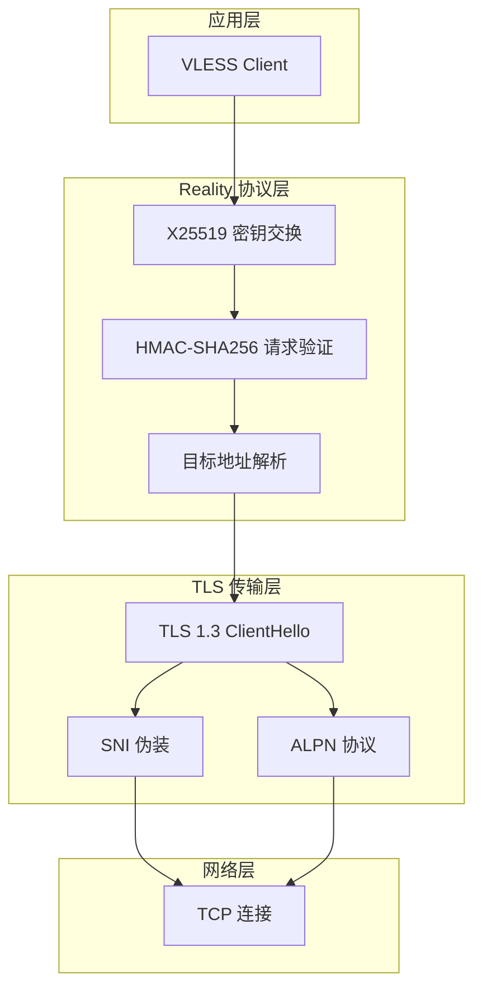
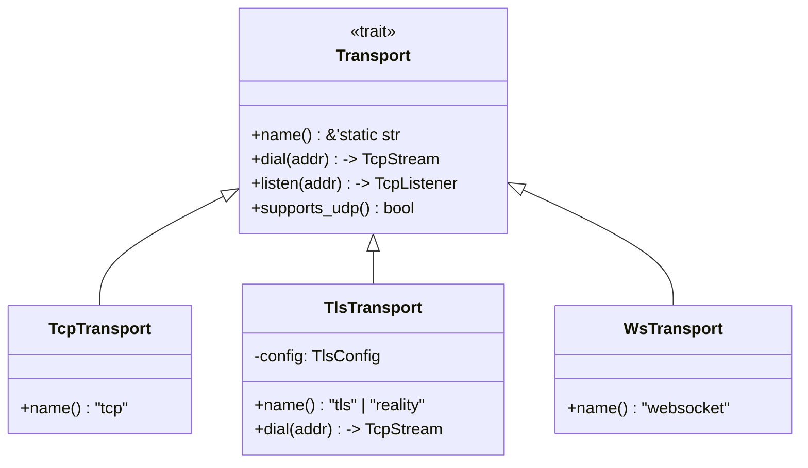

## 概述

Reality 是 VLESS 协议的一种传输层混淆方案，旨在通过 TLS 伪装技术绕过深度数据包检测（DPI）。与传统的 TLS 隧道不同，Reality 不依赖真实的 TLS 服务器证书验证，而是使用 **X25519 公钥 pinning** 来确保与正确的服务器通信，从而实现真正的流量混淆。

dae-rs 实现了完整的 Reality 协议支持，包括 TLS 传输层抽象和 Reality Vision 模式，使得代理流量能够伪装成普通 HTTPS 流量，躲避审查设备的识别。

Sources: [tls.rs](crates/dae-proxy/src/transport/tls.rs#L1-L15)

---

## 技术架构

### 层次模型



### 核心组件

| 组件 | 文件位置 | 职责 |
|------|----------|------|
| `TlsTransport` | [tls.rs](crates/dae-proxy/src/transport/tls.rs#L86-L120) | TLS 传输层抽象，支持标准 TLS 和 Reality 模式 |
| `RealityConfig` | [tls.rs](crates/dae-proxy/src/transport/tls.rs#L63-L80) | Reality 协议配置，包含公钥、short_id、目标地址 |
| `TlsConfig` | [tls.rs](crates/dae-proxy/src/transport/tls.rs#L17-L62) | TLS 配置结构，支持 ALPN、SNI 等参数 |
| `VlessRealityConfig` | [vless/config.rs](crates/dae-proxy/src/vless/config.rs#L27-L46) | VLESS Reality 专用配置 |
| `VlessHandler` | [vless/handler.rs](crates/dae-proxy/src/vless/handler.rs#L1-L50) | VLESS 协议处理器，包含 Reality Vision 处理逻辑 |

Sources: [tls.rs](crates/dae-proxy/src/transport/tls.rs#L1-L120), [config.rs](crates/dae-proxy/src/vless/config.rs#L27-L80)

---

## 协议流程

### Reality 握手流程

Reality 的核心原理是利用 X25519 密钥交换和 HMAC-SHA256 消息认证，在 TLS ClientHello 中嵌入加密的请求信息。以下是完整的握手流程：

```mermaid
sequenceDiagram
    participant C as Client
    participant S as Reality Server
    participant R as Real Target

    Note over C: 1. 生成 X25519 临时密钥对
    C->>C: 生成 scalar, 计算 client_public = scalar * G
    
    Note over C: 2. 计算 ECDH 共享密钥
    C->>C: shared_secret = server_public * scalar
    
    Note over C: 3. 生成 Reality 请求
    C->>C: request = HMAC-SHA256(shared_secret, "Reality Souls") + short_id + random
    
    Note over C: 4. 构建 TLS ClientHello
    C->>C: 添加 SNI 伪装目标
    C->>C: 添加 key_share 扩展 (client_public)
    C->>C: 添加 Reality chrome 扩展
    
    C->>S: TLS ClientHello (包含 Reality payload)
    
    Note over S: 5. 验证请求
    S->>S: 解密并验证 HMAC
    S->>S: 提取目标地址
    
    S->>R: 连接真实目标服务器
    
    S-->>C: TLS ServerHello (加密响应)
    
    Note over C,S: 6. 双向数据传输
    C<->S: 数据中继 (relay_data)
    S<->R: 真实流量
```

### 关键数据结构

**Reality 请求格式** (48 字节):

| 偏移 | 长度 | 内容 |
|------|------|------|
| 0-31 | 32 字节 | `HMAC-SHA256(shared_secret, "Reality Souls")` |
| 32-39 | 8 字节 | `short_id` (短标识符) |
| 40-47 | 8 字节 | 随机数 |

**TLS ClientHello 扩展**:

- `key_share`: X25519 公钥 (32 字节)
- `supported_versions`: TLS 1.3
- `application_layer_protocol_negotiation`: h2, http/1.1
- `server_name`: 伪装的目标 SNI
- `0x5a5a`: Reality chrome 扩展 (私有扩展号)

Sources: [tls.rs](crates/dae-proxy/src/transport/tls.rs#L192-L245), [handler.rs](crates/dae-proxy/src/vless/handler.rs#L192-L250)

---

## 配置参考

### TlsConfig 配置

```rust
// 标准 TLS 配置
let config = TlsConfig::new("www.google.com")
    .with_alpn(vec![b"h2".to_vec(), b"http/1.1".to_vec()]);

// Reality 模式配置
let config = TlsConfig::new("www.amazon.com")
    .with_reality(
        &public_key,      // 32 字节 X25519 公钥
        &short_id,        // 8 字节 short_id
        "www.apple.com"   // 伪装的目标 SNI
    );
```

Sources: [tls.rs](crates/dae-proxy/src/transport/tls.rs#L32-L62)

### RealityConfig 结构

```rust
pub struct RealityConfig {
    /// X25519 公钥 (32 字节)
    pub public_key: Vec<u8>,
    /// Short ID (8 字节，可为空)
    pub short_id: Vec<u8>,
    /// 伪装目标服务器名称 (SNI)
    pub destination: String,
}
```

### VLESS Reality Vision 配置

```rust
pub struct VlessRealityConfig {
    /// X25519 私钥 (32 字节)
    pub private_key: Vec<u8>,
    /// X25519 公钥 (32 字节)
    pub public_key: Vec<u8>,
    /// Short ID (8 字节)
    pub short_id: Vec<u8>,
    /// 伪装目标 (SNI)
    pub destination: String,
    /// Flow 类型 (通常为 "vision")
    pub flow: String,
}
```

Sources: [vless/config.rs](crates/dae-proxy/src/vless/config.rs#L27-L46)

---

## 传输层抽象

dae-rs 通过 `Transport` trait 提供了统一的传输层接口，使得 TLS/Reality 可以与其他传输方式（TCP、WebSocket、gRPC）无缝切换：



**TlsTransport 的 `dial` 方法实现**:

```rust
async fn dial(&self, addr: &str) -> std::io::Result<TcpStream> {
    let stream = tokio::net::TcpStream::connect(addr).await?;

    if self.config.reality.is_some() {
        // Reality 模式: 执行握手
        self.reality_handshake(stream).await
    } else {
        // 标准 TLS 模式: 返回原始 TCP 流
        Ok(stream)
    }
}
```

Sources: [transport/mod.rs](crates/dae-proxy/src/transport/mod.rs#L1-L53), [tls.rs](crates/dae-proxy/src/transport/tls.rs#L122-L175)

---

## 安全性分析

### 防护机制

| 机制 | 描述 | 实现位置 |
|------|------|----------|
| **X25519 密钥交换** | 前向安全的密钥协商 | [tls.rs](crates/dae-proxy/src/transport/tls.rs#L206-L222) |
| **HMAC-SHA256 验证** | 消息完整性验证，防止篡改 | [crypto.rs](crates/dae-proxy/src/vless/crypto.rs#L1-L14) |
| **Constant-time 比较** | 防止时序攻击 | [tls.rs](crates/dae-proxy/src/transport/tls.rs#L280-L293) |
| **SNI 伪装** | 流量看起来像访问合法网站 | [handler.rs](crates/dae-proxy/src/vless/handler.rs#L660-L690) |
| **TLS 1.3 握手** | 完整前向保密 | TLS 1.3 标准 |

### HMAC 验证实现

```rust
// 验证服务器响应的 MAC
let expected_mac = hmac_sha256(&shared_bytes, &verify_data);

// 使用 constant-time 比较防止时序攻击
use subtle::ConstantTimeEq;
if expected_mac.ct_eq(echoed_mac).into() {
    // MAC 验证成功
    Ok(stream)
} else {
    // MAC 验证失败 - 可能遭受攻击
    Err(IoError::new(
        ErrorKind::PermissionDenied,
        "Reality handshake failed: server MAC verification failed",
    ))
}
```

Sources: [tls.rs](crates/dae-proxy/src/transport/tls.rs#L270-L295)

---

## 与 VLESS 协议集成

### VLESS 命令处理

VLESS 协议支持三种命令类型，Reality Vision 是其中之一：

| 命令 | 值 | 描述 |
|------|-----|------|
| `Tcp` | 0x01 | TCP 传输 |
| `Udp` | 0x02 | UDP 传输 |
| `XtlsVision` | 0x03 | Reality Vision 模式 |

```rust
match cmd {
    VlessCommand::Tcp => self.handle_tcp(client, &header_buf).await,
    VlessCommand::Udp => {
        // UDP 流量应走专用 UDP 端口
        Err(...)
    }
    VlessCommand::XtlsVision => {
        // Reality Vision 模式
        self.handle_reality_vision(client, &header_buf).await
    }
}
```

### Reality Vision 处理流程

```rust
async fn handle_reality_vision(
    self: &Arc<Self>,
    client: TcpStream,
    _header_buf: &[u8],
) -> std::io::Result<()> {
    // 1. 生成 X25519 临时密钥对
    let scalar = curve25519_dalek::Scalar::random(&mut rng);
    let client_public = curve25519_dalek::MontgomeryPoint::mul_base(&scalar);
    
    // 2. 计算 ECDH 共享密钥
    let shared_secret = server_point * scalar;
    
    // 3. 生成 Reality 请求并发送 ClientHello
    let client_hello = self.build_reality_client_hello(&client_public, &request, destination)?;
    remote.write_all(&client_hello).await?;
    
    // 4. 接收并验证 ServerHello
    let n = remote.read(&mut server_response).await?;
    
    // 5. 数据中继
    relay_data(client, remote).await
}
```

Sources: [handler.rs](crates/dae-proxy/src/vless/handler.rs#L100-L120), [handler.rs](crates/dae-proxy/src/vless/handler.rs#L435-L530)

---

## 配置示例

### TOML 配置格式

```toml
# VLESS + Reality 节点配置示例
[[nodes]]
name = "Reality Server"
type = "vless"
addr = "203.0.113.1"
port = 443
uuid = "b831381b-5254-4c0f-9447-5a7c5d3e8b12"

[nodes.tls]
enabled = true
version = "1.3"
server_name = "www.microsoft.com"  # 伪装 SNI

# Reality 专用配置
[nodes.reality]
enabled = true
private_key = "0Ac2b3c4d5e6f7a8..."
public_key = "1Bd2c3d4e5f6a7b8..."
short_id = "01234567"
destination = "www.apple.com"  # 伪装目标
flow = "vision"
```

### 代码中使用

```rust
use dae_proxy::transport::{TlsConfig, TlsTransport};

let transport = TlsTransport::new("www.bing.com")
    .with_reality(
        &public_key,    // 服务端公钥
        &[0u8; 8],      // short_id
        "www.linkedin.com"  // 伪装目标
    );

// 通过 Transport trait 使用
let stream = transport.dial("203.0.113.1:443").await?;
```

---

## 相关文档

- [VLESS 协议详解](8-vless-xie-yi) - 完整的 VLESS 协议规范
- [传输层抽象](15-chuan-shu-ceng-chou-xiang) - Transport trait 设计
- [代理核心实现](6-dai-li-he-xin-shi-xian) - 协议处理器架构