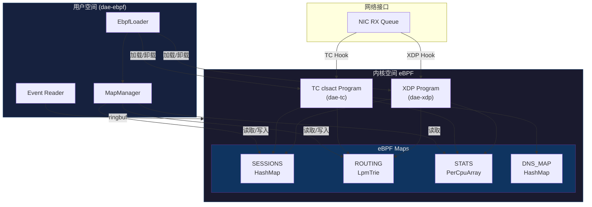
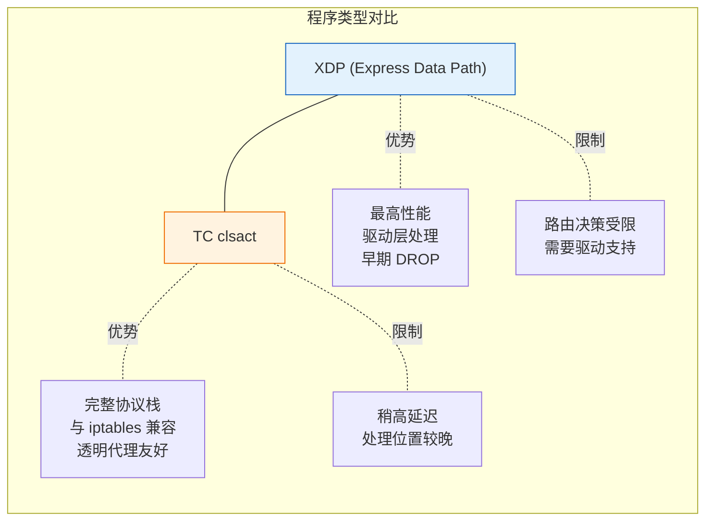
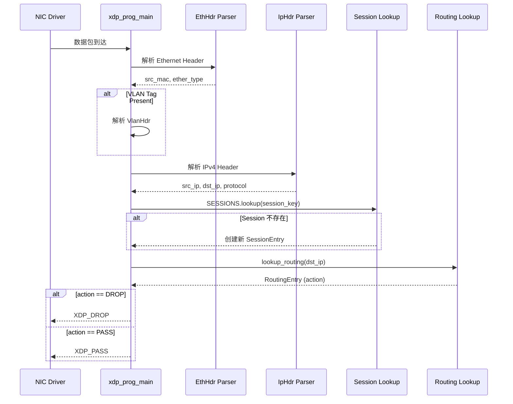
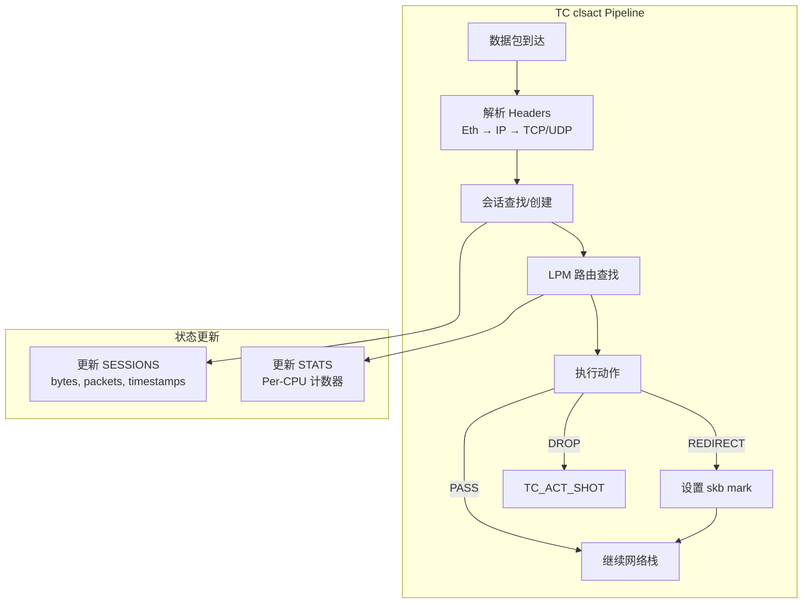
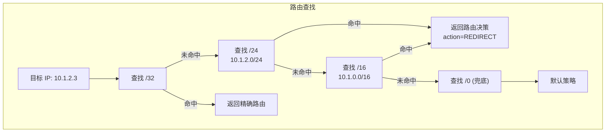

dae-rs 通过 eBPF (Extended Berkeley Packet Filter) 和 XDP (Express Data Path) 技术实现高性能的网络数据包捕获与流量分类。这套架构使内核态程序能够在网络驱动层处理数据包，实现零拷贝、零拷贝转发以及极低的延迟。

## 架构概述

dae-rs 的 eBPF 架构采用双层设计：内核态 eBPF 程序负责快速数据包处理，用户态程序负责控制平面和规则管理。这种设计将数据平面下沉到内核，既保证了性能，又提供了灵活的编程能力。



### 模块层次结构

dae-ebpf crate 包含以下核心模块，各自承担不同职责：

| 模块 | 位置 | 职责 |
|------|------|------|
| `dae-ebpf-common` | `crates/dae-ebpf/dae-ebpf-common/` | 共享类型定义，内核/用户空间共用 |
| `dae-xdp` | `crates/dae-ebpf/dae-xdp/` | XDP 程序包，网络驱动层捕获 |
| `dae-tc` | `crates/dae-ebpf/dae-tc/` | TC clsact 程序包，通用网络层捕获 |
| `dae-ebpf-direct` | `crates/dae-ebpf/dae-ebpf-direct/` | Direct 模式实现，绕过 iptables |
| `dae-ebpf` | `crates/dae-ebpf/dae-ebpf/` | 用户空间加载器和管理器 |

Sources: [crates/dae-ebpf](crates/dae-ebpf#L1-L60)

## eBPF 程序类型选择

### XDP vs TC clsact

dae-rs 支持两种 eBPF 程序挂载方式，各自适用于不同场景：



**选择建议**：
- **透明代理场景**：优先使用 TC clsact，它能正确处理路由、NAT 和 iptables 规则
- **极致性能场景**：使用 XDP，当只需要简单的包过滤或早期丢弃时
- **dae-rs 默认**：推荐 TC clsact，提供最佳透明代理体验

Sources: [loader.rs](crates/dae-ebpf/dae-ebpf/src/loader.rs#L1-L192), [EBPF_MAP_DESIGN.md](EBPF_MAP_DESIGN.md#L1-L100)

### 内核版本能力检测

dae-rs 实现了一套内核版本检测机制，根据内核能力自动选择最佳运行模式：

| 能力级别 | 内核版本 | 支持功能 |
|----------|----------|----------|
| Full | 5.17+ | 完整 TC clsact + LpmTrie + ringbuf + sockmap |
| RingBuf | 5.8+ | ringbuf 事件通道 + 稳定 LpmTrie |
| FullTc | 5.10+ | TC clsact + LpmTrie (推荐生产环境) |
| XdpOnly | 4.18+ | XDP 支持，但 TC 有限 |
| BasicMaps | 4.14+ | 基础 HashMap，无 LpmTrie |

这套能力分级确保了 dae-rs 能够在不同内核版本上运行，自动降级到兼容模式。

Sources: [CHANGELOG-EBPF-REFACTOR.md](CHANGELOG-EBPF-REFACTOR.md#L1-L174)

## 数据包处理流程

### XDP 数据包处理

XDP 程序在网络驱动层处理数据包，实现最高效的拦截：



核心实现位于 `xdp_prog` 函数：

```rust
#[aya_ebpf::macros::xdp]
pub fn xdp_prog_main(mut ctx: XdpContext) -> u32 {
    match xdp_prog(&mut ctx) {
        Ok(ret) => ret,
        Err(_) => XDP_ABORTED,
    }
}

fn xdp_prog(ctx: &mut XdpContext) -> Result<u32, ()> {
    // 解析 Ethernet 头
    let eth = match EthHdr::from_ctx(ctx) {
        Some(hdr) => unsafe { *hdr },
        None => return Ok(XDP_PASS),
    };
    
    let src_mac = eth.src_mac();
    
    // 处理 VLAN 标签
    let (ip_offset, is_ipv4) = if eth.has_vlan() {
        // VLAN 标签存在时的处理逻辑
        // ...
    } else {
        (core::mem::size_of::<EthHdr>(), eth.is_ipv4())
    };
    
    // IPv4 检查
    if !is_ipv4 {
        return Ok(XDP_PASS);
    }
    
    // 解析 IP 头
    let ip = match IpHdr::from_ctx_after_eth(ctx, ip_offset) {
        Some(hdr) => unsafe { *hdr },
        None => return Ok(XDP_PASS),
    };
    
    // 查找或创建会话
    let session_key = SessionKey::new(ip.src_addr(), ip.dst_addr(), 0, 0, ip.protocol());
    // ...
}
```

Sources: [lib.rs](crates/dae-ebpf/dae-xdp/src/lib.rs#L30-L120)

### TC clsact 数据包处理

TC 程序在网络层处理，提供更完整的协议栈集成：



TC 程序相比 XDP 增加了完整的 TCP/UDP 端口提取和 ICMP 支持：

```rust
fn tc_prog(ctx: &mut TcContext) -> Result<i32, ()> {
    // 解析 Headers
    let eth = match EthHdr::from_ctx(ctx) { /* ... */ };
    let ip = match IpHdr::from_ctx_after_eth(ctx, ip_offset) { /* ... */ };
    
    let ip_proto = ip.protocol();
    let ip_hdr_len = ip.header_len();
    
    // 提取 TCP/UDP 端口
    let (src_port, dst_port) = match ip_proto {
        ip_proto::TCP => {
            let tcp = TcpHdr::from_ctx_after_ip(ctx, ip_offset, ip_hdr_len)?;
            (tcp.src_port(), tcp.dst_port())
        }
        ip_proto::UDP => {
            let udp = UdpHdr::from_ctx_after_ip(ctx, ip_offset, ip_hdr_len)?;
            (udp.src_port(), udp.dst_port())
        }
        _ => (0, 0),
    };
    
    // 创建完整 5 元组会话键
    let session_key = SessionKey::new(src_ip, dst_ip, src_port, dst_port, ip_proto);
    
    // 处理路由动作
    match route.action {
        action::PASS => Ok(TC_ACT_OK),
        action::REDIRECT => {
            ctx.set_mark(route.route_id);  // 设置标记供用户空间识别
            Ok(TC_ACT_OK)
        }
        action::DROP => Ok(TC_ACT_SHOT),
        _ => Ok(TC_ACT_OK),
    }
}
```

Sources: [lib.rs](crates/dae-ebpf/dae-tc/src/lib.rs#L30-L210)

## eBPF Maps 架构

eBPF Maps 是内核与用户空间共享状态的核心数据结构。dae-rs 使用多种 map 类型实现不同功能。

### Map 类型概览

| Map 名称 | 类型 | 用途 | Key | Value |
|----------|------|------|-----|-------|
| `SESSIONS` | HashMap | 连接跟踪 | `SessionKey` (5元组) | `SessionEntry` |
| `ROUTING` | LpmTrie | IP CIDR 路由 | `Key<u32>` (IP+前缀) | `RoutingEntry` |
| `DNS_MAP` | HashMap | 域名解析 | `u64` (域名哈希) | `DnsMapEntry` |
| `CONFIG` | Array | 全局配置 | `u32` (索引) | `ConfigEntry` |
| `STATS` | PerCpuArray | 统计计数 | `u32` (统计索引) | `StatsEntry` |

Sources: [EBPF_MAP_DESIGN.md](EBPF_MAP_DESIGN.md#L50-L100)

### 共享类型定义 (dae-ebpf-common)

所有 map 类型在 `dae-ebpf-common` crate 中定义，确保内核和用户空间类型一致：

```rust
// 会话键 - 5 元组连接标识符
#[derive(Clone, Copy, Debug, Default, PartialEq, Eq)]
#[repr(C)]
pub struct SessionKey {
    pub src_ip: u32,      // 网络字节序
    pub dst_ip: u32,
    pub src_port: u16,
    pub dst_port: u16,
    pub proto: u8,         // 6=TCP, 17=UDP
    reserved: [u8; 3],
}

// 会话条目 - 连接状态
#[derive(Clone, Copy, Debug, Default)]
#[repr(C)]
pub struct SessionEntry {
    pub state: u8,         // 0=NEW, 1=ESTABLISHED, 2=CLOSED
    pub src_mac_len: u8,
    pub packets: u64,
    pub bytes: u64,
    pub start_time: u64,
    pub last_time: u64,
    pub route_id: u32,
    pub src_mac: [u8; 6],
}

// 路由条目 - 路由决策
#[derive(Clone, Copy, Debug, Default)]
#[repr(C)]
pub struct RoutingEntry {
    pub route_id: u32,
    pub action: u8,        // 0=PASS, 1=REDIRECT, 2=DROP
    pub ifindex: u32,
    reserved: [u8; 4],
}

// 路由动作定义
pub mod action {
    pub const PASS: u8 = 0;
    pub const REDIRECT: u8 = 1;
    pub const DROP: u8 = 2;
}
```

Sources: [session.rs](crates/dae-ebpf/dae-ebpf-common/src/session.rs#L1-L67), [routing.rs](crates/dae-ebpf/dae-ebpf-common/src/routing.rs#L1-L40)

### LPM Trie 路由查找

`ROUTING` map 使用 LPM (Longest Prefix Match) Trie 实现高效的 CIDR 路由匹配：



实现代码：

```rust
fn lookup_routing(dst_ip: u32) -> Option<RoutingEntry> {
    // 优先尝试精确匹配 /32
    let key = Key::new(32, dst_ip);
    if let Some(route) = ROUTING.get(&key) {
        return Some(*route);
    }
    
    // 从 /24 到 /1 递减前缀长度
    let mut prefix: u32 = 24;
    while prefix > 0 {
        let key = Key::new(prefix, dst_ip);
        if let Some(route) = ROUTING.get(&key) {
            return Some(*route);
        }
        prefix -= 1;
    }
    
    // 兜底 /0
    let key = Key::new(0, 0);
    ROUTING.get(&key).copied()
}
```

Sources: [lib.rs](crates/dae-ebpf/dae-xdp/src/lib.rs#L160-L195)

### Per-CPU 统计

`STATS` map 使用 `PerCpuArray` 实现无锁统计计数，避免多核竞争：

```rust
// 内核定义
#[map]
static STATS: PerCpuArray<StatsEntry> = PerCpuArray::with_max_entries(16, 0);

// 统计条目
pub struct StatsEntry {
    pub packets: u64,
    pub bytes: u64,
    pub redirected: u64,
    pub passed: u64,
    pub dropped: u64,
    pub routed: u64,
    pub unmatched: u64,
}

// 统计索引
pub mod idx {
    pub const OVERALL: u32 = 0;
    pub const TCP: u32 = 1;
    pub const UDP: u32 = 2;
    pub const ICMP: u32 = 3;
    pub const OTHER: u32 = 4;
}
```

用户空间读取时，PerCpuArray 自动聚合所有 CPU 的值：

```rust
// 用户空间读取（自动聚合）
let stats = stats_map.get(&idx::OVERALL)?;
println!("Packets: {}", stats.packets);  // 所有 CPU 的总和
```

Sources: [stats.rs](crates/dae-ebpf/dae-ebpf-common/src/stats.rs#L1-L71), [maps.rs](crates/dae-ebpf/dae-tc/src/maps.rs#L1-L62)

## Direct 模式 (dae-ebpf-direct)

dae-ebpf-direct 实现真正的 Direct eBPF 模式，绕过 iptables 直接重定向流量：

### 架构设计

```
┌─────────────────────────────────────────────────────────────┐
│                    用户空间 (dae-proxy)                      │
│  ┌─────────────────────────────────────────────────────┐   │
│  │              Sockmap Redirect Manager                 │   │
│  │  - 创建监听套接字                                      │   │
│  │  - 管理 sockmap                                       │   │
│  │  - 接受重定向连接                                     │   │
│  └─────────────────────────────────────────────────────┘   │
└─────────────────────────────────────────────────────────────┘
                            │
                            │ sockmap
                            ▼
┌─────────────────────────────────────────────────────────────┐
│                    内核 (eBPF)                               │
│  ┌─────────────────────────────────────────────────────┐   │
│  │              Socket Filter / Cgroup                 │   │
│  │  - 捕获指定 cgroup 的 TCP 连接                        │   │
│  │  - 通过 sockmap 重定向到本地代理端口                   │   │
│  └─────────────────────────────────────────────────────┘   │
└─────────────────────────────────────────────────────────────┘
```

### 路由规则类型

Direct 模式支持多种规则类型：

```rust
pub mod rule_type {
    pub const DIRECT_RULE_IPV4_CIDR: u8 = 1;       // IPv4 CIDR
    pub const DIRECT_RULE_IPV6_CIDR: u8 = 2;        // IPv6 CIDR
    pub const DIRECT_RULE_DOMAIN_SUFFIX: u8 = 3;    // 域名后缀
    pub const DIRECT_RULE_PORT: u8 = 4;            // 端口规则
    pub const DIRECT_RULE_PROCESS: u8 = 5;          // 进程名 (需用户空间)
}

// 规则条目结构
pub struct DirectRouteEntry {
    pub rule_type: u8,
    pub ip_version: u8,
    pub prefix_len: u8,
    pub data: [u32; 2],       // IP 地址或端口
    pub domain: [u32; 16],    // 域名 (后缀匹配)
    pub action: u8,           // 0=PASS, 1=PROXY, 2=DROP
}
```

Sources: [direct.rs](crates/dae-ebpf/dae-ebpf-common/src/direct.rs#L1-L200), [lib.rs](crates/dae-ebpf/dae-ebpf-direct/src/lib.rs#L1-L153)

## 包解析工具

dae-xdp 和 dae-tc 各自实现了数据包解析工具，处理 Ethernet、VLAN、IP、TCP、UDP、ICMP 等协议头：

```mermaid
flowchart TB
    subgraph PacketParse["数据包解析"]
        Eth["EthHdr<br/>14 bytes"] --> VLAN["VlanHdr<br/>4 bytes (可选)"]
        VLAN --> IPv4["IpHdr<br/>20+ bytes"]
        IPv4 --> TCP["TcpHdr<br/>20+ bytes"]
        IPv4 --> UDP["UdpHdr<br/>8 bytes"]
        IPv4 --> ICMP["IcmpHdr<br/>8+ bytes"]
    end
    
    subgraph HeaderFields["关键字段"]
        EthFields["dst_mac[6]<br/>src_mac[6]<br/>ether_type"]
        VLANFields["tpid<br/>tci (VLAN ID)"]
        IPFields["saddr, daddr<br/>protocol<br/>header_len"]
        TCPFields["src_port, dst_port<br/>seq, ack_seq<br/>flags (SYN/ACK/FIN)"]
    end
end
```

关键的协议类型常量：

```rust
// Ethernet 协议类型
pub mod ethertype {
    pub const IPV4: u16 = 0x0800;
    pub const IPV6: u16 = 0x86DD;
    pub const VLAN: u16 = 0x8100;
}

// IP 协议号
pub mod ip_proto {
    pub const ICMP: u8 = 1;
    pub const TCP: u8 = 6;
    pub const UDP: u8 = 17;
    pub const ICMPV6: u8 = 58;
}
```

Sources: [packet.rs (dae-xdp)](crates/dae-ebpf/dae-xdp/src/utils/packet.rs#L1-L200), [packet.rs (dae-tc)](crates/dae-ebpf/dae-tc/src/packet.rs#L1-L200)

## 用户空间加载器

`EbpfLoader` 负责加载和初始化 eBPF 程序：

```rust
pub struct EbpfLoader {
    ebpf: Option<Ebpf>,
    maps: MapManager,
    program_type: EbpfProgramType,
}

impl EbpfLoader {
    // 加载 XDP 程序
    pub async fn load_xdp(&mut self, interface: &str, xdp_object: &str) -> Result<()> {
        let path = Path::new(xdp_object);
        let mut ebpf = Ebpf::load_file(path)?;
        
        // 获取并加载 XDP 程序
        let prog: &mut Xdp = ebpf.program_mut("xdp_prog_main")?.try_into()?;
        prog.load()?;
        
        // 挂载到接口
        prog.attach(interface, XdpFlags::default())?;
        
        // 初始化 maps
        self.maps.init(&ebpf)?;
        self.maps.init_default_routes()?;
        
        self.ebpf = Some(ebpf);
        self.program_type = EbpfProgramType::Xdp;
        Ok(())
    }
    
    // 加载 TC 程序
    pub async fn load_tc(&mut self, interface: &str, tc_object: &str) -> Result<()> {
        // 设置 clsact qdisc
        self.setup_clsact(interface).await?;
        
        // 加载 eBPF 对象
        let mut ebpf = Ebpf::load_file(Path::new(tc_object))?;
        
        // 获取并加载 TC 程序
        let prog: &mut SchedClassifier = ebpf.program_mut("tc_prog_main")?.try_into()?;
        prog.load()?;
        
        // 挂载为 ingress 过滤器
        prog.attach(interface, TcAttachType::Ingress)?;
        
        // 初始化 maps
        self.maps.init(&ebpf)?;
        self.maps.init_default_routes()?;
        
        self.ebpf = Some(ebpf);
        self.program_type = EbpfProgramType::Tc;
        Ok(())
    }
}
```

Sources: [loader.rs](crates/dae-ebpf/dae-ebpf/src/loader.rs#L1-L192)

## Map 管理器

`MapManager` 提供运行时 map 操作接口：

```rust
pub struct MapManager {
    initialized: bool,
}

impl MapManager {
    pub fn init(&mut self, ebpf: &Ebpf) -> Result<()> {
        // 验证所有必需 map 存在
        let _ = ebpf.map("CONFIG")?;
        let _ = ebpf.map("SESSIONS")?;
        let _ = ebpf.map("ROUTING")?;
        let _ = ebpf.map("STATS")?;
        self.initialized = true;
        Ok(())
    }
    
    pub fn init_default_routes(&mut self) -> Result<()> {
        // 添加默认路由规则
        info!("Added default routing rule: 0.0.0.0/0 -> PASS");
        Ok(())
    }
    
    pub fn add_route(&mut self, ip: u32, prefix_len: u8, 
                     route_id: u32, action: u8, ifindex: u32) -> Result<()> {
        // 向 LPM Trie 插入路由规则
        // ...
        Ok(())
    }
    
    pub fn remove_route(&mut self, ip: u32, prefix_len: u8) -> Result<()> {
        // 从 LPM Trie 删除路由规则
        // ...
        Ok(())
    }
}
```

Sources: [maps.rs](crates/dae-ebpf/dae-ebpf/src/maps.rs#L1-L100)

## 接口管理

`interface.rs` 提供网络接口查询工具：

```rust
pub struct InterfaceInfo {
    pub name: String,
    pub ifindex: u32,
    pub flags: u32,
    pub ipv4: Option<Ipv4Addr>,
}

// 获取接口信息
pub fn get_interface(name: &str) -> Result<InterfaceInfo> {
    let ifindex_path = format!("/sys/class/net/{}/ifindex", name);
    let ifindex = std::fs::read_to_string(&ifindex_path)?.trim().parse()?;
    
    // 获取 IPv4 地址
    let ipv4 = get_interface_ipv4(name).ok();
    
    Ok(InterfaceInfo { name, ifindex, flags, ipv4 })
}

// 列出所有网络接口
pub fn list_interfaces() -> Result<Vec<String>> {
    let net_path = "/sys/class/net";
    let entries = std::fs::read_dir(net_path)?;
    
    let mut interfaces = Vec::new();
    for entry in entries {
        let name = entry?.file_name();
        if let Some(name_str) = name.to_str() {
            if name_str != "lo" {  // 跳过 loopback
                interfaces.push(name_str.to_string());
            }
        }
    }
    Ok(interfaces)
}
```

Sources: [interface.rs](crates/dae-ebpf/dae-ebpf/src/interface.rs#L1-L145)

## 错误处理

eBPF 操作可能遇到各类错误，需要妥善处理：

| 错误类型 | 原因 | 处理方式 |
|----------|------|----------|
| `MapNotFound` | eBPF Map 不存在 | 检查 eBPF 对象文件是否正确编译 |
| `KeyNotFound` | 查找的 Key 不存在 | 使用默认路由/兜底策略 |
| `UpdateFailed` | Map 更新失败 | 记录错误，继续处理 |
| `PermissionDenied` | 无 eBPF 权限 | 需要 root 或 CAP_BPF 权限 |
| `KernelNotSupported` | 内核版本不支持 | 自动降级到回退模式 |

Direct 模式的专用错误类型：

```rust
#[derive(Error, Debug)]
pub enum EbpfError {
    #[error("Map error: {0}")]
    Map(String),
    
    #[error("Program error: {0}")]
    Program(String),
    
    #[error("Sockmap error: {0}")]
    Sockmap(String),
    
    #[error("IO error: {0}")]
    Io(#[from] std::io::Error),
    
    #[error("Invalid argument: {0}")]
    InvalidArgument(String),
}
```

Sources: [sockmap.rs](crates/dae-ebpf/dae-ebpf-direct/src/sockmap.rs#L1-L90)

## 安全考虑

1. **权限要求**：加载 eBPF 程序需要 `CAP_BPF` 或 root 权限
2. **内存安全**：eBPF 代码在沙箱中运行，有严格的验证器检查
3. **稳定性**：内核版本差异可能影响功能可用性
4. **边界检查**：所有数据包解析都包含严格的边界验证

## 后续步骤

- [规则引擎](18-gui-ze-yin-qing)：了解如何将 eBPF 路由与规则引擎集成
- [Full-Cone NAT 实现](19-full-cone-nat-shi-xian)：了解基于 eBPF 的 NAT 实现
- [Control Socket API](25-control-socket-api)：了解运行时配置 eBPF Maps 的 API