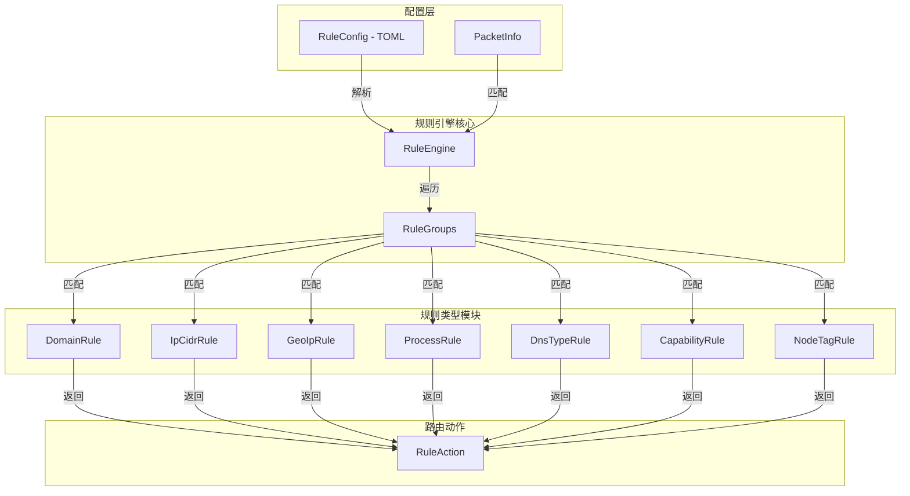
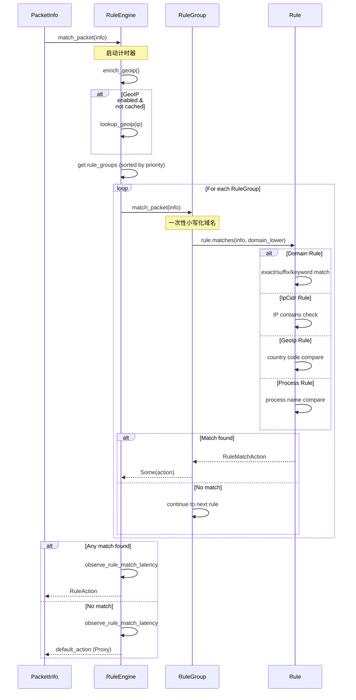

dae-rs 的规则引擎是用户空间流量路由的核心组件，负责根据数据包的多种属性（域名、IP、GeoIP、进程等）做出最终的路由决策。与 eBPF 层配合使用，实现高效的透明代理。

## 系统架构

规则引擎采用分层设计，核心模块位于 `crates/dae-proxy/src/rule_engine/` 和 `crates/dae-proxy/src/rules/` 目录：



Sources: [crates/dae-proxy/src/rule_engine/mod.rs](crates/dae-proxy/src/rule_engine/mod.rs#L1-L31)
Sources: [crates/dae-proxy/src/rules/mod.rs](crates/dae-proxy/src/rules/mod.rs#L1-L31)

## 核心数据结构

### PacketInfo - 数据包信息

`PacketInfo` 是规则匹配的核心数据结构，包含了进行路由决策所需的所有信息：

```rust
pub struct PacketInfo {
    pub source_ip: IpAddr,              // 源 IP 地址
    pub destination_ip: IpAddr,        // 目标 IP 地址
    pub src_port: u16,                  // 源端口
    pub dst_port: u16,                  // 目标端口
    pub protocol: u8,                   // 协议 (6=TCP, 17=UDP)
    pub destination_domain: Option<String>,  // 目标域名 (DNS/SNI)
    pub geoip_country: Option<String>, // GeoIP 国家代码
    pub process_name: Option<String>,   // 进程名 (Linux)
    pub dns_query_type: Option<u16>,   // DNS 查询类型
    pub is_outbound: bool,              // 是否出站
    pub packet_size: usize,            // 数据包大小
    pub connection_hash: Option<u64>,   // 连接哈希
    pub node_fullcone: Option<bool>,    // 节点 FullCone 能力
    pub node_udp: Option<bool>,         // 节点 UDP 支持
    pub node_v2ray: Option<bool>,       // 节点 V2Ray 兼容
    pub node_tag: Option<String>,       // 节点标签
}
```

Sources: [crates/dae-proxy/src/rule_engine/mod.rs](crates/dae-proxy/src/rule_engine/mod.rs#L19-L54)

### RuleAction - 路由动作

规则匹配成功后返回的动作类型：

| 动作 | 说明 | eBPF 映射值 |
|------|------|-------------|
| `Pass` | 直连放行 | 0 |
| `Proxy` | 走代理 | 0 |
| `Drop` | 丢弃数据包 | 2 |
| `Direct` | 显式直连 | 0 |
| `MustDirect` | 强制直连（最高优先级） | 0 |
| `Default` | 使用默认动作 | 0 |

Sources: [crates/dae-proxy/src/rule_engine/mod.rs](crates/dae-proxy/src/rule_engine/mod.rs#L162-L176)
Sources: [crates/dae-proxy/src/rule_engine/mod.rs](crates/dae-proxy/src/rule_engine/mod.rs#L178-L187)

## 规则类型体系

### 规则类型枚举

规则引擎支持 10 种核心规则类型：

```rust
pub enum RuleType {
    Domain,         // 精确域名匹配
    DomainSuffix,   // 域名后缀匹配
    DomainKeyword,  // 域名关键词匹配
    IpCidr,         // IP CIDR 匹配
    GeoIp,          // GeoIP 国家匹配
    Process,        // 进程名匹配
    DnsType,        // DNS 查询类型匹配
    Capability,     // 节点能力匹配
    NodeTag,        // 节点标签匹配
}
```

Sources: [crates/dae-proxy/src/rules/types.rs](crates/dae-proxy/src/rules/types.rs#L5-L26)

### 域名规则详解

域名规则支持三种匹配模式：

```rust
pub enum DomainRuleType {
    Exact(String),    // 精确匹配: "example.com"
    Suffix(String),  // 后缀匹配: ".example.com"
    Keyword(String), // 关键词匹配: "keyword:google"
}
```

匹配算法采用一次性小写化优化，避免 N×to_lowercase() 的性能开销：

```rust
pub fn match_packet(&self, info: &PacketInfo) -> Option<RuleMatchAction> {
    // 在规则组级别统一小写化域名
    let domain_lower = info.destination_domain.as_ref().map(|s| s.to_lowercase());
    for rule in &self.rules {
        if rule.matches(info, domain_lower.as_deref()) {
            return Some(rule.action);
        }
    }
    None
}
```

Sources: [crates/dae-proxy/src/rules/builder.rs](crates/dae-proxy/src/rules/builder.rs#L173-L181)

### IP CIDR 规则

支持 IPv4/IPv6 双栈，使用 `ipnet` crate 进行高效 CIDR 匹配：

```rust
pub struct IpCidrRule {
    pub prefix: IpNet,     // 网络前缀
    pub is_exclude: bool,  // 排除规则 (! 前缀)
}

pub enum IpNet {
    V4(ipnet::Ipv4Net),
    V6(ipnet::Ipv6Net),
}
```

排除规则支持 (`!` 前缀) 用于实现白名单/黑名单组合：

```rust
let rule = IpCidrRule::new("!10.0.0.0/8").unwrap();
// 匹配所有非 10.0.0.0/8 范围的 IP
```

Sources: [crates/dae-proxy/src/rules/ip.rs](crates/dae-proxy/src/rules/ip.rs#L8-L68)

### GeoIP 规则

基于 MaxMind GeoLite2/GeoIP2 数据库的国家代码匹配：

```rust
pub struct GeoIpRule {
    pub country_code: String,  // ISO 3166-1 alpha-2 国家代码
    pub is_exclude: bool,      // 排除规则
}

impl RuleEngine {
    pub async fn lookup_geoip(&self, ip: &IpAddr) -> Option<String> {
        let reader = self.geoip_reader.read().await;
        match reader.lookup(*ip) {
            Ok(result) => {
                match result.decode::<maxminddb::geoip2::Country>() {
                    Ok(Some(country)) => {
                        country.country.iso_code.map(|code| code.to_uppercase())
                    }
                    _ => None,
                }
            }
            _ => None,
        }
    }
}
```

Sources: [crates/dae-proxy/src/rules/ip.rs](crates/dae-proxy/src/rules/ip.rs#L71-L104)
Sources: [crates/dae-proxy/src/rule_engine/engine.rs](crates/dae-proxy/src/rule_engine/engine.rs#L181-L220)

### DNS 查询类型规则

支持标准 DNS 记录类型匹配：

| 类型 | 编号 | 用途 |
|------|------|------|
| A | 1 | IPv4 地址 |
| AAAA | 28 | IPv6 地址 |
| CNAME | 5 | 规范名称 |
| MX | 15 | 邮件交换 |
| TXT | 16 | 文本记录 |
| NS | 2 | 名称服务器 |
| SOA | 6 | 授权起始 |
| PTR | 12 | 指针记录 |
| SRV | 33 | 服务定位 |
| ANY | 255 | 任意类型 |

Sources: [crates/dae-proxy/src/rules/dns.rs](crates/dae-proxy/src/rules/dns.rs#L7-L30)

### 节点能力规则

用于根据节点能力进行智能路由：

```rust
pub enum CapabilityType {
    FullCone,  // Full-Cone NAT 能力
    Udp,       // UDP 协议支持
    V2Ray,     // V2Ray 兼容性
}

pub struct CapabilityRule {
    pub capability: CapabilityType,
    pub expected_value: bool,  // true/false/enabled/disabled
}
```

Sources: [crates/dae-proxy/src/rules/capability.rs](crates/dae-proxy/src/rules/capability.rs#L7-L52)

### 节点标签规则

支持基于预选节点标签的路由决策：

```rust
pub struct NodeTagRule {
    pub tag: String,  // 节点标签
}

impl NodeTagRule {
    pub fn matches_packet(&self, info: &PacketInfo) -> bool {
        if let Some(ref node_tag) = info.node_tag {
            node_tag.to_lowercase() == self.tag
        } else {
            false  // 未设置标签时无法匹配
        }
    }
}
```

Sources: [crates/dae-proxy/src/rules/capability.rs](crates/dae-proxy/src/rules/capability.rs#L67-L107)

### 进程名规则 (Linux)

基于进程名的匹配（Linux 特定功能）：

```rust
pub struct ProcessRule {
    pub process_name: String,
    pub is_exclude: bool,  // 支持 ! 前缀排除
}
```

Sources: [crates/dae-proxy/src/rules/process.rs](crates/dae-proxy/src/rules/process.rs#L7-L48)

## 规则配置格式

### TOML 配置结构

规则引擎使用 TOML 格式配置文件：

```toml
[[rule_groups]]
name = "direct"
default_action = "pass"
first_match = true

[[rule_groups.rules]]
type = "domain-suffix"
value = ".cn"
action = "pass"
priority = 100

[[rule_groups.rules]]
type = "domain-suffix"
value = ".com"
action = "proxy"
priority = 200

[[rule_groups.rules]]
type = "ipcidr"
value = "10.0.0.0/8"
action = "pass"

[[rule_groups.rules]]
type = "geoip"
value = "CN"
action = "pass"

[[rule_groups]]
name = "block"
default_action = "proxy"

[[rule_groups.rules]]
type = "domain-keyword"
value = "ads"
action = "drop"

[[rule_groups.rules]]
type = "port"
value = "25"
action = "drop"
```

Sources: [crates/dae-config/src/rules.rs](crates/dae-config/src/rules.rs#L7-L44)

### 规则类型速查表

| 规则类型 | 配置 key | 值示例 | 说明 |
|----------|----------|--------|------|
| 精确域名 | `domain` | `api.example.com` | 完整域名匹配 |
| 域名后缀 | `domain-suffix` | `.example.com` | 以点开头的后缀 |
| 域名关键词 | `domain-keyword` | `google` | 包含关键词即匹配 |
| IP CIDR | `ipcidr` | `192.168.0.0/16` | 支持 ! 前缀排除 |
| GeoIP | `geoip` | `CN`, `!US` | ISO 国家代码 |
| 进程名 | `process` | `chrome` | 支持 ! 前缀排除 |
| DNS 类型 | `dnstype` | `A,AAAA` | 逗号分隔多类型 |
| FullCone | `fullcone` | `enabled` | 节点 NAT 能力 |
| UDP 支持 | `udp` | `true` | 节点 UDP 支持 |
| V2Ray 兼容 | `v2ray` | `compatible` | 协议兼容模式 |
| 节点标签 | `node-tag` | `hk` | 节点分组标签 |

Sources: [crates/dae-proxy/src/rules/builder.rs](crates/dae-proxy/src/rules/builder.rs#L51-L94)

### 动作类型

| 动作 | 别名 | 说明 |
|------|------|------|
| `pass` | `allow`, `direct` | 直连放行 |
| `proxy` | `route` | 走代理 |
| `drop` | `deny`, `block` | 丢弃数据包 |

Sources: [crates/dae-proxy/src/rules/builder.rs](crates/dae-proxy/src/rules/builder.rs#L10-L19)

## 匹配流程



Sources: [crates/dae-proxy/src/rule_engine/engine.rs](crates/dae-proxy/src/rule_engine/engine.rs#L151-L179)

## 规则引擎配置

```rust
pub struct RuleEngineConfig {
    pub geoip_enabled: bool,           // 启用 GeoIP 查找
    pub geoip_db_path: Option<String>, // GeoIP 数据库路径
    pub process_matching_enabled: bool, // 启用进程匹配
    pub default_action: RuleAction,    // 默认动作
    pub hot_reload_enabled: bool,      // 启用热重载
    pub reload_interval_secs: u64,     // 重载间隔
}

impl Default for RuleEngineConfig {
    fn default() -> Self {
        Self {
            geoip_enabled: true,
            geoip_db_path: None,
            process_matching_enabled: false,
            default_action: RuleAction::Proxy,
            hot_reload_enabled: false,
            reload_interval_secs: 60,
        }
    }
}
```

Sources: [crates/dae-proxy/src/rule_engine/mod.rs](crates/dae-proxy/src/rule_engine/mod.rs#L189-L217)

## 编程接口

### 创建和初始化

```rust
use dae_proxy::{new_rule_engine, RuleEngineConfig, RuleEngine};

// 创建规则引擎
let config = RuleEngineConfig {
    geoip_enabled: true,
    geoip_db_path: Some("/var/lib/dae/GeoLite2-Country.mmdb".into()),
    default_action: RuleAction::Proxy,
    ..Default::default()
};
let engine = new_rule_engine(config);

// 初始化（加载 GeoIP 数据库）
engine.initialize().await?;

// 加载规则文件
engine.load_rules("/etc/dae/rules.toml").await?;
```

Sources: [crates/dae-proxy/src/rule_engine/engine.rs](crates/dae-proxy/src/rule_engine/engine.rs#L25-L51)

### 匹配数据包

```rust
use dae_proxy::{PacketInfo, RuleAction};
use std::net::IpAddr;

// 创建数据包信息
let info = PacketInfo::new(
    "192.168.1.100".parse().unwrap(),
    "8.8.8.8".parse().unwrap(),
    12345,
    443,
    6,  // TCP
)
.with_domain("example.com")  // 添加域名
.with_geoip("CN");           // 添加 GeoIP

// 执行规则匹配
let action = engine.match_packet(&info).await;

match action {
    RuleAction::Pass => { /* 直连 */ }
    RuleAction::Proxy => { /* 走代理 */ }
    RuleAction::Drop => { /* 丢弃 */ }
    _ => {}
}
```

Sources: [crates/dae-proxy/src/rule_engine/mod.rs](crates/dae-proxy/src/rule_engine/mod.rs#L79-L158)
Sources: [crates/dae-proxy/src/rule_engine/engine.rs](crates/dae-proxy/src/rule_engine/engine.rs#L151-L179)

### 热重载

```rust
// 监听配置变更事件
let mut hot_reload = HotReload::new("/etc/dae/rules.toml")?;

loop {
    match hot_reload.rx.recv() {
        Ok(ConfigEvent::FileEvent(event)) => {
            if event.kind == WatchEventKind::Modified {
                engine.reload("/etc/dae/rules.toml").await?;
                info!("Rules reloaded successfully");
            }
        }
        Ok(ConfigEvent::Error(e)) => {
            error!("Config reload error: {}", e);
        }
        _ => {}
    }
}
```

Sources: [crates/dae-proxy/src/config/hot_reload.rs](crates/dae-proxy/src/config/hot_reload.rs#L76-L145)

### 获取统计信息

```rust
use dae_proxy::RuleEngineStats;

let stats = engine.get_stats().await;
println!("Rules loaded: {}", stats.loaded);
println!("Rule groups: {}", stats.rule_group_count);
println!("Total rules: {}", stats.total_rule_count);
```

Sources: [crates/dae-proxy/src/rule_engine/engine.rs](crates/dae-proxy/src/rule_engine/engine.rs#L228-L236)

## 验证与错误处理

### 规则验证

规则引擎在加载阶段进行完整的语法和语义验证：

```rust
pub enum RuleValidationError {
    InvalidRuleType(String),     // 未知规则类型
    InvalidRuleValue(String),    // 无效的规则值
    EmptyValue,                  // 值为空
    InvalidAction(String),       // 未知动作
    InvalidGeoIp(String),        // 无效国家代码
    InvalidDnsType(String),      // 无效 DNS 类型
    InvalidCidr(String),         // 无效 CIDR 格式
}
```

Sources: [crates/dae-config/src/rules.rs](crates/dae-config/src/rules.rs#L54-L71)

### 验证示例

```rust
use dae_config::rules::{validate_rule, RuleConfigItem};

let rule = RuleConfigItem {
    rule_type: "geoip".to_string(),
    value: "CN".to_string(),
    action: "pass".to_string(),
    priority: None,
};

match validate_rule(&rule) {
    Ok(()) => println!("Rule is valid"),
    Err(e) => eprintln!("Validation error: {}", e),
}
```

Sources: [crates/dae-config/src/rules.rs](crates/dae-config/src/rules.rs#L89-L174)

## 性能优化

### 1. 域名小写化优化

在规则组级别一次性小写化域名，避免 N×to_lowercase() 调用：

```rust
// 优化前：每个规则都执行 to_lowercase()
for rule in &self.rules {
    if rule.matches(info) {  // 内部调用 domain.to_lowercase()
        // ...
    }
}

// 优化后：一次性小写化
let domain_lower = info.destination_domain.as_ref().map(|s| s.to_lowercase());
for rule in &self.rules {
    if rule.matches(info, domain_lower.as_deref()) {
        // 使用预计算的 domain_lower
    }
}
```

Sources: [crates/dae-proxy/src/rules/builder.rs](crates/dae-proxy/src/rules/builder.rs#L169-L181)

### 2. GeoIP 异步加载

GeoIP 数据库在后台线程加载，不阻塞主事件循环：

```rust
async fn init_geoip(&self) -> Result<(), String> {
    let db_path_clone = db_path.clone();
    let reader = tokio::task::spawn_blocking(move || {
        maxminddb::Reader::open_readfile(&db_path_clone)
    }).await?;
    // ...
}
```

Sources: [crates/dae-proxy/src/rule_engine/engine.rs](crates/dae-proxy/src/rule_engine/engine.rs#L53-#82)

### 3. 规则组优先级排序

规则组按最小优先级值自动排序：

```rust
rule_groups.sort_by(|a, b| {
    let a_priority = a.rules.iter().map(|r| r.priority).min().unwrap_or(u32::MAX);
    let b_priority = b.rules.iter().map(|r| r.priority).min().unwrap_or(u32::MAX);
    a_priority.cmp(&b_priority)
});
```

Sources: [crates/dae-proxy/src/rule_engine/engine.rs](crates/dae-proxy/src/rule_engine/engine.rs#L129-L134)

### 4. 读写锁优化

使用 `RwLock` 保护共享状态，允许多读单写：

```rust
pub struct RuleEngine {
    rule_groups: RwLock<Vec<RuleGroup>>,
    geoip_reader: RwLock<Option<maxminddb::Reader<Vec<u8>>>>,
    loaded: RwLock<bool>,
}
```

Sources: [crates/dae-proxy/src/rule_engine/engine.rs](crates/dae-proxy/src/rule_engine/engine.rs#L14-L23)

## 单元测试

规则引擎包含完整的单元测试覆盖：

```rust
#[cfg(test)]
mod tests {
    #[tokio::test]
    async fn test_rule_engine_basic() {
        let config = RuleEngineConfig::default();
        let engine = RuleEngine::new(config);

        let rules_toml = r#"
            [[rule_groups]]
            name = "direct"
            default_action = "pass"
            rules = [
                { type = "domain-suffix", value = ".test", action = "pass" }
            ]
        "#;

        engine.parse_and_load_rules(rules_toml).await.unwrap();

        let mut info = PacketInfo::default();
        info.destination_domain = Some("example.test".to_string());

        let action = engine.match_packet(&info).await;
        assert_eq!(action, RuleAction::Pass);
    }
}
```

Sources: [crates/dae-proxy/src/rule_engine/engine.rs](crates/dae-proxy/src/rule_engine/engine.rs#L254-L318)

## 实际应用示例

### 典型代理规则配置

```toml
# /etc/dae/rules.toml

# 直连规则组 - 国内网站直连
[[rule_groups]]
name = "direct"
default_action = "proxy"
first_match = true

# 中国域名直连
{ type = "domain-suffix", value = ".cn", action = "pass" }
{ type = "domain-suffix", value = ".com.cn", action = "pass" }
{ type = "domain-suffix", value = ".gov.cn", action = "pass" }

# 国内 IP 段直连
{ type = "ipcidr", value = "10.0.0.0/8", action = "pass" }
{ type = "ipcidr", value = "172.16.0.0/12", action = "pass" }
{ type = "ipcidr", value = "192.168.0.0/16", action = "pass" }

# 中国 IP 直连
{ type = "geoip", value = "CN", action = "pass" }

# 代理规则组
[[rule_groups]]
name = "proxy"
default_action = "proxy"

# 被屏蔽网站走代理
{ type = "domain-suffix", value = ".google.com", action = "proxy" }
{ type = "domain-suffix", value = ".youtube.com", action = "proxy" }
{ type = "domain-suffix", value = ".twitter.com", action = "proxy" }
{ type = "domain-keyword", value = "github", action = "proxy" }

# 广告和追踪域名
[[rule_groups]]
name = "block"
default_action = "drop"

{ type = "domain-keyword", value = "ads", action = "drop" }
{ type = "domain-keyword", value = "tracking", action = "drop" }

# DNS 优化规则
[[rule_groups]]
name = "dns"
default_action = "proxy"

# 仅匹配 AAAA 查询走代理 (IPv6)
{ type = "dnstype", value = "AAAA", action = "proxy" }
```

Sources: [crates/dae-config/src/rules.rs](crates/dae-config/src/rules.rs#L236-L265)

### 与节点选择器集成

```rust
use dae_proxy::{PacketInfo, NodeSelector};

// 根据规则动作选择节点
let info = PacketInfo::new(src_ip, dst_ip, src_port, dst_port, proto)
    .with_domain(&domain)
    .with_node_capabilities(Some(fullcone), Some(udp), Some(v2ray));

let action = rule_engine.match_packet(&info).await;

match action {
    RuleAction::Pass => {
        // 直连，跳过代理
    }
    RuleAction::Proxy => {
        // 根据节点能力选择代理
        let node = selector.select_for_connection(
            &info,
            |n| n.supports_udp() && n.is_v2ray_compatible()
        ).await?;
        // 建立代理连接
    }
    RuleAction::Drop => {
        // 丢弃连接
    }
    _ => {}
}
```

Sources: [crates/dae-proxy/src/rules/capability.rs](crates/dae-proxy/src/rules/capability.rs#L54-#65)

## 架构设计要点

### 分层设计

规则引擎采用清晰的模块化分层：

1. **配置层** (`dae-config/src/rules.rs`): TOML 解析和验证
2. **引擎层** (`rule_engine/mod.rs`): 核心匹配逻辑和配置
3. **规则层** (`rules/`): 具体规则类型实现
4. **数据层** (`PacketInfo`): 匹配上下文信息

### 可扩展性

新增规则类型只需实现 `Rule` trait：

```rust
pub enum Rule {
    Domain(DomainRule),
    IpCidr(IpCidrRule),
    GeoIp(GeoIpRule),
    Process(ProcessRule),
    DnsType(DnsTypeRule),
    Capability(CapabilityRule),
    NodeTag(NodeTagRule),
    // 新增规则类型...
}

impl Rule {
    pub fn matches(&self, info: &PacketInfo, domain_lower: Option<&str>) -> bool {
        match self {
            Rule::Domain(r) => r.matches_packet(info, domain_lower),
            // ...
        }
    }
}
```

Sources: [crates/dae-proxy/src/rules/builder.rs](crates/dae-proxy/src/rules/builder.rs#L33-L114)

### 错误恢复

规则加载失败时保留旧规则，确保服务连续性：

```rust
pub async fn reload(&self, path: &str) -> Result<(), String> {
    info!("Reloading rules from {}", path);
    // 新规则加载失败时，旧规则仍然有效
    self.load_rules(path).await
}
```

Sources: [crates/dae-proxy/src/rule_engine/engine.rs](crates/dae-proxy/src/rule_engine/engine.rs#L238-L242)

## 下一步

- 了解 [eBPF/XDP 集成](17-ebpf-xdp-ji-cheng) 如何与规则引擎协同工作
- 探索 [节点配置](21-jie-dian-pei-zhi) 中的节点能力设置
- 查看 [Control Socket API](25-control-socket-api) 进行运行时规则管理