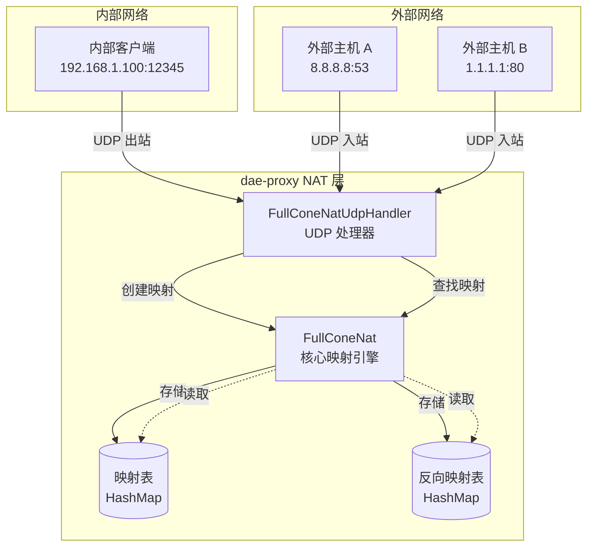
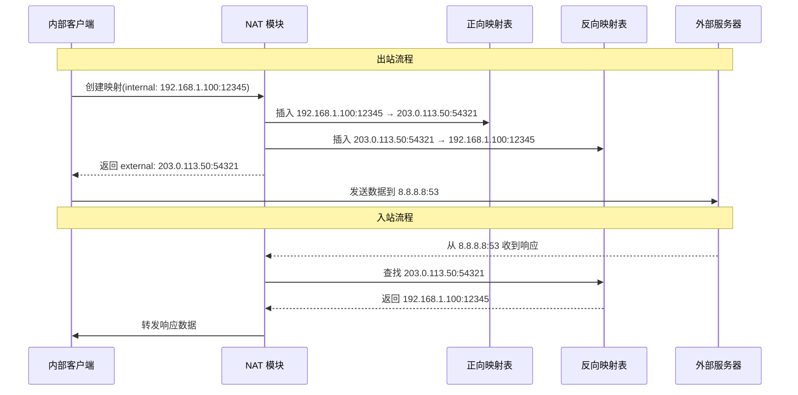
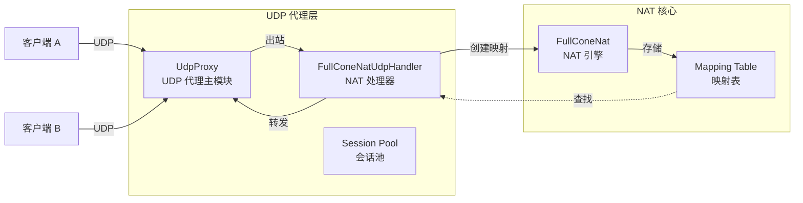

本文档详细介绍 dae-rs 中 Full-Cone NAT（NAT1）的实现原理、架构设计、接口规范以及与透明代理系统的集成方式。Full-Cone NAT 是一种特殊的中继模式实现，它在 UDP 流量处理中扮演关键角色，特别适用于 P2P 应用和需要穿越 NAT 的场景。

Sources: [crates/dae-proxy/src/nat/full_cone.rs](crates/dae-proxy/src/nat/full_cone.rs#L1-L60)

## 1. NAT 类型对比

NAT（网络地址转换）有多种实现类型，它们在处理入站连接方面存在显著差异。理解这些差异对于正确选择代理模式至关重要。

### NAT 类型特性对比

| NAT 类型 | 出站连接 | 入站限制 | 安全性 | P2P 友好度 | 典型应用场景 |
|----------|----------|----------|--------|------------|--------------|
| **Full-Cone** | ✅ 任意目标 | 无限制 | 低 | 非常高 | P2P、VoIP、游戏 |
| Address-Restricted | ✅ 任意目标 | 仅目标 IP | 中 | 高 | 视频会议 |
| Port-Restricted | ✅ 任意目标 | 仅目标 IP:Port | 高 | 中 | 文件传输 |
| Symmetric | ✅ 仅目标 | 仅该连接 | 最高 | 低 | 企业防火墙 |

Full-Cone NAT 的核心特性是**一旦内部主机向某个外部主机发送数据包，该外部主机就可以向内部主机发送任意数据包**，无需任何限制。这种特性使其成为 P2P 应用的理想选择，但在安全性要求较高的场景中需要谨慎使用。

Sources: [crates/dae-proxy/src/nat/full_cone.rs](crates/dae-proxy/src/nat/full_cone.rs#L1-L7)

## 2. 核心数据结构

### 2.1 NatMapping 映射条目

`NatMapping` 是 NAT 映射的核心数据结构，存储每个内部端点到外部端点的映射关系：

```rust
pub struct NatMapping {
    /// 内部 socket 地址
    pub internal: SocketAddr,
    /// 外部 socket 地址（NAT 分配）
    pub external: SocketAddr,
    /// 映射创建时间
    pub created_at: Instant,
    /// 映射过期时间
    pub expires_at: Instant,
    /// 允许的远程端点（Full-Cone 为空表示无限制）
    pub allowed_remotes: Vec<SocketAddr>,
    /// 映射是否仍然活跃
    pub is_active: bool,
}
```

关键设计要点在于 `allowed_remotes` 字段。在 Full-Cone NAT 中，该字段为空向量，表示任何远程主机都可以向该映射发送数据包。而在其他受限 NAT 类型中，该字段会存储允许的远程地址白名单。

Sources: [crates/dae-proxy/src/nat/full_cone.rs](crates/dae-proxy/src/nat/full_cone.rs#L16-L44)

### 2.2 FullConeNatConfig 配置

```rust
pub struct FullConeNatConfig {
    /// 外部 IP 地址
    pub external_ip: IpAddr,
    /// 外部端口范围起始
    pub port_range_start: u16,
    /// 外部端口范围结束
    pub port_range_end: u16,
    /// 映射 TTL（存活时间）
    pub mapping_ttl: Duration,
    /// 最大同时映射数
    pub max_mappings: usize,
}
```

默认配置值提供了开箱即用的合理默认值，适用于大多数部署场景：

| 配置项 | 默认值 | 说明 |
|--------|--------|------|
| `external_ip` | 0.0.0.0 | 绑定到所有可用接口 |
| `port_range_start` | 10000 | 避开系统端口 |
| `port_range_end` | 65535 | 最大端口号 |
| `mapping_ttl` | 300秒 | 5分钟映射存活期 |
| `max_mappings` | 65535 | 几乎无限制 |

Sources: [crates/dae-proxy/src/nat/full_cone.rs](crates/dae-proxy/src/nat/full_cone.rs#L46-L71)

### 2.3 NatStats 统计信息

```rust
pub struct NatStats {
    /// 总创建的映射数
    pub mappings_created: u64,
    /// 转发的数据包数
    pub packets_forwarded: u64,
    /// 丢弃的数据包数
    pub packets_dropped: u64,
    /// 当前活跃映射数
    pub active_mappings: usize,
}
```

这些统计数据对于监控 NAT 模块的运行状况和性能调优至关重要。生产环境中应定期采集这些指标以检测潜在问题。

Sources: [crates/dae-proxy/src/nat/full_cone.rs](crates/dae-proxy/src/nat/full_cone.rs#L86-L97)

## 3. 架构设计

### 3.1 整体架构图



### 3.2 双向映射机制

Full-Cone NAT 维护两个核心数据结构来实现高效的地址查找：



这种双向映射设计确保了：
- **出站查找**：通过内部地址快速找到分配的外部地址
- **入站查找**：通过外部地址快速找到对应的内部地址

Sources: [crates/dae-proxy/src/nat/full_cone.rs](crates/dae-proxy/src/nat/full_cone.rs#L73-L84)

## 4. 核心算法实现

### 4.1 映射创建流程

```rust
pub fn create_mapping(&self, internal: SocketAddr) -> std::io::Result<SocketAddr> {
    // 1. 检查是否存在未过期的映射
    // 2. 检查是否达到最大映射数限制
    // 3. 分配外部端口
    // 4. 创建映射条目
    // 5. 更新统计数据
}
```

映射创建的核心逻辑：

1. **复用检查**：如果内部端点已存在有效映射，直接返回现有外部地址，避免重复分配
2. **容量检查**：确保不超过 `max_mappings` 限制，防止资源耗尽
3. **端口分配**：采用轮询算法从端口池中分配可用端口
4. **TTL 设置**：根据配置设置映射过期时间

Sources: [crates/dae-proxy/src/nat/full_cone.rs](crates/dae-proxy/src/nat/full_cone.rs#L115-L175)

### 4.2 端口分配算法

```rust
fn allocate_port(&self) -> std::io::Result<u16> {
    // 尝试在端口范围内查找可用端口
    for _ in 0..(end - start) {
        let port = *next_port;
        let external = SocketAddr::new(self.config.external_ip, port);
        
        // 检查端口是否已被占用
        if !reverse.contains_key(&external) {
            *next_port = if port >= end { start } else { port + 1 };
            return Ok(port);
        }
        *next_port = if port >= end { start } else { port + 1 };
    }
    // 所有端口都已占用
    Err(AddrInUse)
}
```

该算法采用简单的轮询策略，时间复杂度为 O(n)，其中 n 是端口范围大小。在端口池充足的情况下，性能表现良好。

Sources: [crates/dae-proxy/src/nat/full_cone.rs](crates/dae-proxy/src/nat/full_cone.rs#L177-L204)

### 4.3 入站数据包处理

```rust
pub fn is_incoming_allowed(&self, external: SocketAddr, _remote: SocketAddr) -> bool {
    let mappings = self.mappings.read().unwrap();
    // Full-Cone: 任何来源都允许，只要映射存在
    mappings.contains_key(&external)
}

pub fn handle_incoming(&self, external: SocketAddr, from: SocketAddr) -> Option<SocketAddr> {
    if self.nat.is_incoming_allowed(external, from) {
        self.nat.find_internal(external)
    } else {
        None
    }
}
```

**Full-Cone 的关键特性**：入站检查仅验证外部地址是否存在有效映射，而不限制来源地址。这与 Address-Restricted 或 Port-Restricted NAT 形成鲜明对比。

Sources: [crates/dae-proxy/src/nat/full_cone.rs](crates/dae-proxy/src/nat/full_cone.rs#L219-L326)

### 4.4 过期映射清理

```rust
pub fn cleanup_expired(&self) -> usize {
    let mut mappings = self.mappings.write().unwrap();
    let mut reverse_mappings = self.reverse_mappings.write().unwrap();
    
    mappings.retain(|_internal, mapping| {
        if mapping.is_expired() {
            reverse_mappings.remove(&mapping.external);
            false  // 删除过期映射
        } else {
            true   // 保留有效映射
        }
    });
}
```

清理过程同时更新正向和反向映射表，确保数据一致性。建议配合定时任务定期执行清理操作。

Sources: [crates/dae-proxy/src/nat/full_cone.rs](crates/dae-proxy/src/nat/full_cone.rs#L242-L267)

## 5. UDP 处理器集成

### 5.1 FullConeNatUdpHandler

`FullConeNatUdpHandler` 是 NAT 模块与 UDP 代理层之间的桥梁：

```rust
pub struct FullConeNatUdpHandler {
    nat: Arc<FullConeNat>,
}

impl FullConeNatUdpHandler {
    /// 处理外出 UDP 数据包
    pub fn handle_outgoing(
        &self,
        internal: SocketAddr,
        _target: SocketAddr,
    ) -> std::io::Result<SocketAddr> {
        self.nat.create_mapping(internal)
    }

    /// 处理进入 UDP 数据包
    pub fn handle_incoming(&self, external: SocketAddr, from: SocketAddr) -> Option<SocketAddr> {
        if self.nat.is_incoming_allowed(external, from) {
            self.nat.find_internal(external)
        } else {
            None
        }
    }
}
```

Sources: [crates/dae-proxy/src/nat/full_cone.rs](crates/dae-proxy/src/nat/full_cone.rs#L286-L326)

### 5.2 UDP 代理集成架构



dae-rs 的 UDP 代理架构将 NAT 处理与连接池管理分离，`UdpProxy` 负责会话管理，而 `FullConeNatUdpHandler` 专注于地址转换逻辑。

Sources: [crates/dae-proxy/src/udp.rs](crates/dae-proxy/src/udp.rs#L1-L82)

## 6. 错误处理机制

| 错误类型 | 触发条件 | 处理策略 | 恢复时间 |
|----------|----------|----------|----------|
| `AddrInUse` | 所有可用端口耗尽 | 等待过期清理 | 最多 TTL 秒 |
| `MaxMappingsReached` | 达到映射数上限 | 等待清理 | 最多 TTL 秒 |
| `ConnectionTimeout` | 映射已过期 | 创建新映射 | 即时 |

### 6.1 端口耗尽的应对策略

1. **扩大端口范围**：将 `port_range_start` 降低到更小的值
2. **缩短 TTL**：减少 `mapping_ttl` 以加速映射回收
3. **监控预警**：设置活跃映射数阈值告警

### 6.2 安全性考虑

Full-Cone NAT 虽然便于 P2P 应用，但也带来安全风险：

1. **端口预测攻击**：攻击者可能尝试预测端口分配模式
2. **映射劫持**：在映射生命周期内，任何主机都可向内部发送数据
3. **资源耗尽**：恶意客户端可能快速创建大量映射

建议在生产环境中：
- 限制单 IP 的映射数量
- 启用 TTL 清理机制
- 监控异常映射创建模式

Sources: [crates/dae-proxy/src/nat/full_cone.rs](crates/dae-proxy/src/nat/full_cone.rs#L133-L143)

## 7. 模块导出与使用

### 7.1 模块导出

```rust
// crates/dae-proxy/src/nat/mod.rs
pub mod full_cone;

pub use full_cone::{FullConeNat, FullConeNatConfig, FullConeNatUdpHandler, NatMapping, NatStats};
```

所有公共接口通过 `mod.rs` 统一导出，便于外部模块引用。

Sources: [crates/dae-proxy/src/nat/mod.rs](crates/dae-proxy/src/nat/mod.rs#L1-L17)

### 7.2 快速使用示例

```rust
use dae_proxy::nat::{FullConeNat, FullConeNatConfig, FullConeNatUdpHandler};

fn main() {
    // 方式一：使用默认配置
    let handler = FullConeNatUdpHandler::with_default_config();
    
    // 方式二：自定义配置
    let config = FullConeNatConfig {
        external_ip: "0.0.0.0".parse().unwrap(),
        port_range_start: 20000,
        port_range_end: 60000,
        mapping_ttl: Duration::from_secs(600),
        max_mappings: 10000,
    };
    let handler = FullConeNatUdpHandler::new(config);
    
    // 处理外出连接
    let internal: SocketAddr = "192.168.1.100:12345".parse().unwrap();
    let external = handler.handle_outgoing(internal, "8.8.8.8:53".parse().unwrap())
        .unwrap();
    println!("映射创建: {} -> {}", internal, external);
    
    // 处理进入连接
    let from: SocketAddr = "8.8.8.8:53".parse().unwrap();
    let original = handler.handle_incoming(external, from);
}
```

Sources: [crates/dae-proxy/src/nat/full_cone.rs](crates/dae-proxy/src/nat/full_cone.rs#L99-L113)

## 8. 与连接跟踪的集成

### 8.1 ConnectionKey 与 NAT 映射

dae-rs 使用 5-tuple 作为连接标识符：

```rust
// crates/dae-proxy/src/connection_pool.rs
pub struct ConnectionKey {
    pub src_ip: CompactIp,    // 源 IP
    pub dst_ip: CompactIp,    // 目标 IP
    pub src_port: u16,        // 源端口
    pub dst_port: u16,        // 目标端口
    pub proto: u8,            // 协议 (6=TCP, 17=UDP)
}
```

NAT 映射信息可以与 ConnectionKey 结合，提供更完整的连接视图：

| 组件 | 标识符 | 用途 |
|------|--------|------|
| ConnectionKey | 5-tuple | 连接跟踪和统计 |
| NatMapping | internal ↔ external | 地址转换 |

### 8.2 追踪数据聚合

NAT 统计与连接追踪系统集成，提供端到端的可观测性：

```rust
// NAT 统计
NatStats {
    mappings_created: u64,     // → 连接跟踪: 新建连接数
    packets_forwarded: u64,    // → 连接跟踪: bytes_in/bytes_out
    active_mappings: usize,    // → 连接跟踪: active_connections
}
```

Sources: [crates/dae-proxy/src/connection_pool.rs](crates/dae-proxy/src/connection_pool.rs#L108-L192)
Sources: [crates/dae-proxy/src/tracking/store.rs](crates/dae-proxy/src/tracking/store.rs#L31-L93)

## 9. 测试验证

### 9.1 单元测试覆盖

```rust
#[cfg(test)]
mod tests {
    #[test]
    fn test_full_cone_nat_config_default() {
        let config = FullConeNatConfig::default();
        assert_eq!(config.port_range_start, 10000);
        assert_eq!(config.port_range_end, 65535);
        assert_eq!(config.mapping_ttl, Duration::from_secs(300));
    }

    #[test]
    fn test_is_incoming_allowed() {
        let nat = FullConeNat::with_default_config();
        let internal: SocketAddr = "192.168.1.100:12345".parse().unwrap();
        let external = nat.create_mapping(internal).unwrap();
        let remote: SocketAddr = "8.8.8.8:53".parse().unwrap();
        
        // Full-Cone: 任何来源都允许
        assert!(nat.is_incoming_allowed(external, remote));
        
        // 任意其他来源也允许
        let other: SocketAddr = "1.1.1.1:80".parse().unwrap();
        assert!(nat.is_incoming_allowed(external, other));
    }
}
```

Sources: [crates/dae-proxy/src/nat/full_cone.rs](crates/dae-proxy/src/nat/full_cone.rs#L328-L389)

### 9.2 集成测试要点

1. **映射持久性**：验证映射在 TTL 内保持有效
2. **并发安全**：多个线程同时创建/删除映射
3. **端口冲突**：高并发场景下的端口分配正确性
4. **资源清理**：过期映射被正确回收

## 10. 性能优化建议

### 10.1 并发模型

NAT 模块使用 `RwLock` 保护共享状态：

```rust
pub struct FullConeNat {
    mappings: Arc<RwLock<HashMap<SocketAddr, NatMapping>>>,
    reverse_mappings: Arc<RwLock<HashMap<SocketAddr, SocketAddr>>>,
}
```

读写锁允许：
- **读多写少场景**：多个读操作并发执行
- **写操作互斥**：确保映射一致性

### 10.2 潜在优化方向

| 优化项 | 当前实现 | 优化方案 |
|--------|----------|----------|
| 端口分配 | 线性扫描 | 使用位图或空闲列表 |
| 映射查找 | HashMap | 考虑使用 DashMap |
| TTL 检查 | 惰性清理 | 主动定时清理任务 |
| 统计更新 | 每次更新锁 | 批量更新 + 原子操作 |

## 11. 适用场景与限制

### 11.1 推荐使用场景

- **P2P 应用**：BitTorrent、eMule 等需要接受入站连接的应用
- **VoIP/视频会议**：WebRTC、Zoom 等实时通信
- **在线游戏**：P2P 连接的局域网游戏
- **UDP 穿透测试**：NAT 类型检测工具

### 11.2 不适用场景

- **高安全要求环境**：企业网络、金融系统
- **纯出口代理**：仅需要出站代理时使用对称 NAT
- **资源受限环境**：内存/端口有限的嵌入式系统

---

## 下一步阅读

- [eBPF/XDP 集成](17-ebpf-xdp-ji-cheng) - 了解 NAT 如何与 eBPF 数据平面集成
- [规则引擎](18-gui-ze-yin-qing) - 了解流量路由如何触发 NAT 映射创建
- [Control Socket API](25-control-socket-api) - 了解如何监控 NAT 统计信息