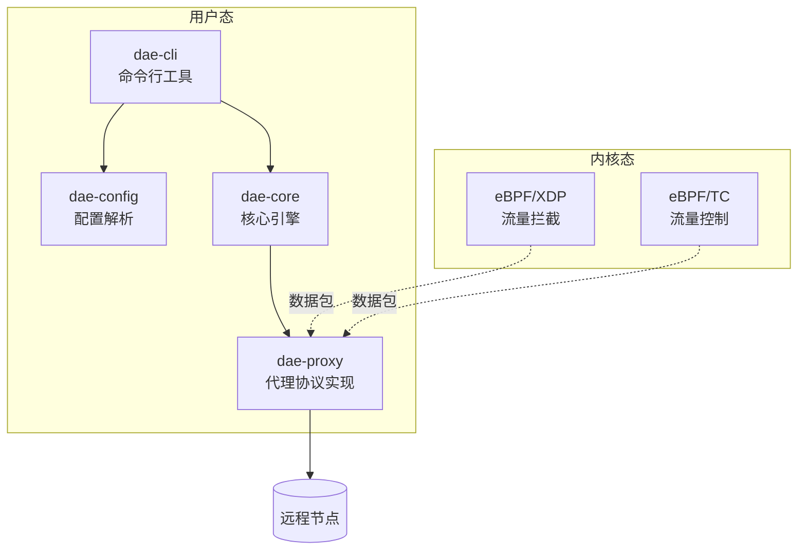

欢迎使用 dae-rs！本页面将帮助您在最短时间内完成从环境准备到运行代理的完整流程。dae-rs 是一个用 Rust 编写的高性能透明代理，支持 eBPF 内核级流量拦截，提供接近 C 语言的性能表现。

## 系统架构概览

在开始之前，让我们快速了解 dae-rs 的核心架构，这有助于理解后续的配置和运行流程。



dae-rs 的核心组件包括：命令行工具 `dae-cli` 负责启动和管理代理，`dae-config` 解析 TOML/YAML 配置文件，`dae-core` 提供核心抽象接口，而 `dae-proxy` 实现所有代理协议逻辑。eBPF 模块在 Linux 内核层面完成流量拦截，减少用户态开销。

Sources: [README.md](README.md#L1-L30), [Cargo.toml](Cargo.toml#L1-L15), [crates/dae-cli/src/main.rs](crates/dae-cli/src/main.rs#L1-L30)

## 环境准备

### 前置依赖

| 依赖项 | 版本要求 | 说明 |
|--------|----------|------|
| Rust | 1.75+ | Rust 工具链 |
| clang | 最新版本 | eBPF 编译支持 |
| llvm | 最新版本 | eBPF 目标代码生成 |
| libelf-dev | 最新版本 | eBPF 对象加载 |
| linux-headers | 最新版本 | 内核头文件 |

### 安装 Rust

如果您尚未安装 Rust，执行以下命令进行安装：

```bash
# 使用 rustup 安装（推荐方式）
curl --proto '=https' --tlsv1.2 -sSf https://sh.rustup.rs | sh
source ~/.cargo/env

# 验证安装
rustc --version
cargo --version
```

### 安装 eBPF 构建依赖

```bash
# Ubuntu/Debian
apt install clang llvm libelf-dev linux-headers-$(uname -r)

# CentOS/RHEL
yum install clang llvm-libelf-devel kernel-headers

# Arch Linux
pacman -S clang llvm linux-headers
```

Sources: [docs/INSTALL.md](docs/INSTALL.md#L1-L50), [README.md](README.md#L50-L60)

## 获取项目

```bash
# 克隆仓库
git clone https://github.com/popo1221/dae-rs.git
cd dae-rs
```

项目克隆完成后，您将看到以下目录结构：

```
dae-rs/
├── Cargo.toml              # 工作区配置
├── Makefile                # 构建任务
├── config/
│   ├── config.example.toml # 配置示例
│   └── config.toml         # 运行时配置
├── crates/
│   ├── dae-cli/            # 命令行工具
│   ├── dae-config/         # 配置解析
│   ├── dae-core/           # 核心引擎
│   ├── dae-proxy/          # 代理协议实现
│   └── dae-ebpf/           # eBPF 模块
├── docker-compose.yml      # Docker 部署配置
└── Dockerfile             # Docker 构建文件
```

Sources: [Cargo.toml](Cargo.toml#L1-L30)

## 构建项目

### 从源码构建

dae-rs 支持 Debug 和 Release 两种构建模式。Release 模式会启用链接时优化（LTO）和目标 CPU 特定优化，推荐用于生产环境。

```bash
# Debug 构建（编译较快，适合开发调试）
cargo build

# Release 构建（编译较慢，性能最优，推荐生产使用）
cargo build --release

# 使用 Makefile
make build
```

构建完成后，可执行文件位于：

| 构建模式 | 输出路径 |
|----------|----------|
| Debug | `target/debug/dae` |
| Release | `target/release/dae` |

### 交叉编译（可选）

如果需要生成静态链接的二进制文件（例如在 Alpine Linux 或无 glibc 环境运行）：

```bash
# 添加 musl 目标
rustup target add x86_64-unknown-linux-musl

# 静态链接构建
cargo build --release --target x86_64-unknown-linux-musl
```

Sources: [docs/INSTALL.md](docs/INSTALL.md#L55-L85), [Cargo.toml](Cargo.toml#L25-L30)

## 配置代理

### 配置文件结构

dae-rs 使用 TOML 格式配置文件，主要包含以下部分：

```toml
[proxy]                    # 代理服务配置
socks5_listen = "0.0.0.0:1080"
http_listen = "0.0.0.0:8080"
tcp_timeout = 60
udp_timeout = 30
ebpf_enabled = false
ebpf_interface = "eth0"

[transparent_proxy]       # 透明代理配置
enabled = false
tun_interface = "dae0"
tun_ip = "10.0.0.1"
tun_netmask = "255.255.255.0"
mtu = 1500
auto_route = true
dns_hijack = ["8.8.8.8", "8.8.4.4"]
dns_upstream = ["8.8.8.8:53", "8.8.4.4:53"]

[[nodes]]                 # 节点配置
name = "香港节点"
type = "trojan"
server = "example.com"
port = 443
trojan_password = "your-password"
tls = true

[logging]                # 日志配置
level = "info"
file = "/var/log/dae-rs.log"
```

Sources: [config/config.example.toml](config/config.example.toml#L1-L67), [crates/dae-config/src/lib.rs](crates/dae-config/src/lib.rs#L120-L220)

### 支持的节点类型

| 节点类型 | 必填字段 | 说明 |
|----------|----------|------|
| **trojan** | `trojan_password` | Trojan 协议，支持 TLS |
| **shadowsocks** | `method`, `password` | Shadowsocks AEAD 加密 |
| **vless** | `uuid` | VLESS + Reality 协议 |
| **vmess** | `uuid`, `security` | VMess AEAD-2022 协议 |

配置示例：

```toml
# Trojan 节点
[[nodes]]
name = "香港-Trojan"
type = "trojan"
server = "hk.example.com"
port = 443
trojan_password = "your-password"
tls = true
tls_server_name = "hk.example.com"

# Shadowsocks 节点
[[nodes]]
name = "日本-SS"
type = "shadowsocks"
server = "jp.example.com"
port = 8388
method = "chacha20-ietf-poly1305"
password = "your-password"

# VLESS 节点
[[nodes]]
name = "美国-VLESS"
type = "vless"
server = "us.example.com"
port = 443
uuid = "your-uuid"
tls = true

# VMess 节点
[[nodes]]
name = "台湾-VMess"
type = "vmess"
server = "tw.example.com"
port = 443
uuid = "your-uuid"
security = "aes-128-gcm-aead"
tls = true
```

Sources: [crates/dae-config/src/lib.rs](crates/dae-config/src/lib.rs#L316-L350), [crates/dae-config/src/lib.rs](crates/dae-config/src/lib.rs#L962-L1010)

### 配置默认值

下表列出了各配置项的默认值：

| 配置项 | 默认值 | 说明 |
|--------|--------|------|
| `socks5_listen` | `127.0.0.1:1080` | SOCKS5 代理监听地址 |
| `http_listen` | `127.0.0.1:8080` | HTTP 代理监听地址 |
| `tcp_timeout` | `60` | TCP 连接超时（秒） |
| `udp_timeout` | `30` | UDP 会话超时（秒） |
| `ebpf_interface` | `eth0` | eBPF 绑定的网络接口 |
| `ebpf_enabled` | `true` | 是否启用 eBPF |
| `tun_ip` | `10.0.0.1` | TUN 设备 IP 地址 |
| `dns_hijack` | `["8.8.8.8", "8.8.4.4"]` | 需要劫持的 DNS 服务器 |
| `log_level` | `info` | 日志级别 |

Sources: [crates/dae-config/src/lib.rs](crates/dae-config/src/lib.rs#L140-L185), [crates/dae-config/src/lib.rs](crates/dae-config/src/lib.rs#L680-L725)

## 启动代理

### 验证配置文件

在启动之前，建议先验证配置文件的正确性：

```bash
# 验证配置语法和内容
./target/release/dae validate --config config/config.toml
```

验证成功后，会显示以下信息：

```
✓ Configuration 'config/config.toml' is valid
  Listen: 127.0.0.1:1080 (SOCKS5), 127.0.0.1:8080 (HTTP)
  eBPF: eth0 (enabled=true)
  Nodes: 4
```

Sources: [crates/dae-cli/src/main.rs](crates/dae-cli/src/main.rs#L60-L85)

### 前台运行

首次运行时，建议先使用前台模式查看日志输出：

```bash
# 运行代理
./target/release/dae run --config config/config.toml
```

### 后台运行（守护进程模式）

```bash
# 以后台方式运行
./target/release/dae run --config config/config.toml --daemon

# 指定 PID 文件
./target/release/dae run --config config/config.toml --daemon --pid-file /var/run/dae.pid
```

Sources: [crates/dae-cli/src/main.rs](crates/dae-cli/src/main.rs#L35-L55)

## 日常运维

### 查看运行状态

```bash
./target/release/dae status
```

### 热重载配置

修改配置文件后，无需重启即可生效：

```bash
./target/release/dae reload
```

### 测试节点连通性

```bash
# 测试指定节点
./target/release/dae test --node "香港节点"
```

### 关闭服务

```bash
./target/release/dae shutdown
```

Sources: [crates/dae-cli/src/main.rs](crates/dae-cli/src/main.rs#L35-L90)

## Docker 部署

如果您更倾向于使用容器部署，dae-rs 也提供了 Docker 支持。

### 构建 Docker 镜像

```bash
docker build -t dae-rs:latest .
```

### 使用 docker-compose 运行

```bash
# 启动服务
docker-compose up -d

# 查看日志
docker-compose logs -f dae

# 停止服务
docker-compose down
```

Docker 部署的关键要求：

| 配置项 | 要求 | 说明 |
|--------|------|------|
| `network_mode` | `host` | eBPF 需要直接访问网络接口 |
| `privileged` | `true` | eBPF 需要特权权限 |
| `cap_add` | `SYS_ADMIN`, `NET_ADMIN` | 系统和网络管理能力 |

Sources: [docker-compose.yml](docker-compose.yml#L1-L81), [Dockerfile](Dockerfile#L1-L47)

## 快速排查

### 常见问题

| 问题 | 可能原因 | 解决方案 |
|------|----------|----------|
| 构建失败，提示缺少 `libclang` | 未安装 libclang-dev | `apt install libclang-dev` |
| eBPF 编译失败 | 内核不支持 BPF | 检查 `cat /proc/sys/kernel/bpf_stats_enabled` |
| 启动失败 | 配置文件语法错误 | 使用 `dae validate` 验证配置 |
| 权限不足 | 需要 root 权限运行 eBPF | `sudo setcap cap_net_admin+ep ./dae` |
| 连接超时 | 节点配置错误 | 检查 `server`, `port`, `password` 字段 |

### 调试模式

启用详细日志输出：

```bash
# 前台运行并查看详细日志
RUST_LOG=debug ./target/release/dae run --config config/config.toml
```

Sources: [docs/INSTALL.md](docs/INSTALL.md#L140-L170)

## 下一步

完成上述配置后，建议继续阅读以下文档以深入了解：

- **[安装指南](3-an-zhuang-zhi-nan)** — 完整的安装选项和环境配置
- **[配置参考手册](20-pei-zhi-can-kao-shou-ce)** — 所有配置项的详细说明
- **[系统架构设计](4-xi-tong-jia-gou-she-xi)** — 深入了解 dae-rs 内部架构
- **[部署指南](22-bu-shu-zhi-nan)** — 生产环境部署最佳实践

如果遇到问题或需要帮助，可以查阅项目的 [CHANGELOG](CHANGELOG-TRACKING.md) 或提交 Issue。