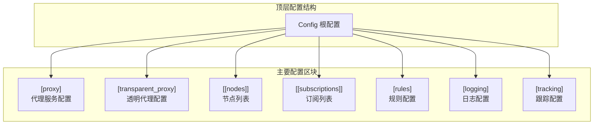
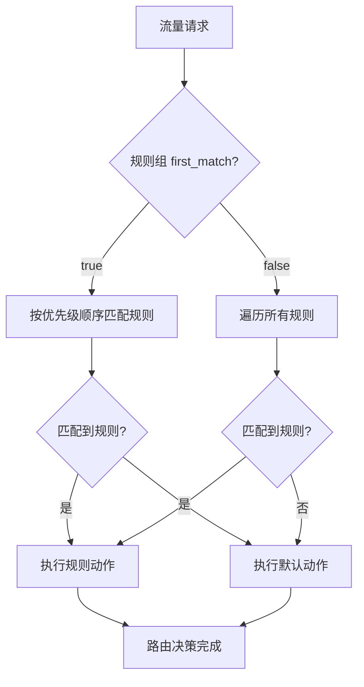

本页面提供 dae-rs 配置文件的完整参考指南。配置文件采用 TOML 格式，支持丰富的配置项以满足不同部署场景的需求。dae-rs 的配置系统设计遵循模块化原则，将功能划分为代理配置、节点配置、规则配置、订阅配置等独立区块，各区块之间通过清晰的结构化接口相互协作。

配置文件的解析和验证由 `dae-config` crate 完成，支持自动格式检测（TOML/YAML）、新旧配置格式兼容，以及启动时的完整配置验证。Sources: [crates/dae-config/src/lib.rs](crates/dae-config/src/lib.rs#L1-L50)

## 配置架构概览



如图所示，dae-rs 的配置结构以 `Config` 为根节点，包含七个主要配置区块。其中 `[[nodes]]` 和 `[[subscriptions]]` 使用 TOML 数组语法表示可包含多个条目，而其他区块则为单一配置对象。这种设计使得配置既保持结构清晰，又具备良好的可扩展性。Sources: [crates/dae-config/src/lib.rs](crates/dae-config/src/lib.rs#L106-L135)

## 完整配置示例

以下是一个功能完整的配置示例，涵盖 dae-rs 的所有主要配置项：

```toml
# ============================================
# dae-rs 完整配置示例
# ============================================

[proxy]
# SOCKS5 代理监听地址
socks5_listen = "127.0.0.1:1080"
# HTTP 代理监听地址
http_listen = "127.0.0.1:8080"
# TCP 连接超时时间（秒）
tcp_timeout = 60
# UDP 会话超时时间（秒）
udp_timeout = 30
# eBPF 绑定的网络接口
ebpf_interface = "eth0"
# 是否启用 eBPF 透明代理
ebpf_enabled = true
# Control Socket 文件路径
control_socket = "/var/run/dae/control.sock"
# PID 文件路径（可选）
pid_file = "/var/run/dae/pid"

[transparent_proxy]
# 是否启用透明代理
enabled = true
# TUN 设备名称
tun_interface = "dae0"
# TUN 设备 IP 地址
tun_ip = "172.16.0.1"
# TUN 子网掩码
tun_netmask = "255.255.255.0"
# MTU 值
mtu = 1500
# DNS 劫持地址列表
dns_hijack = ["8.8.8.8:53", "1.1.1.1:53"]
# DNS 上游服务器
dns_upstream = ["https://1.1.1.1/dns-query", "https://dns.google/dns-query"]
# TCP 超时（秒）
tcp_timeout = 60
# UDP 超时（秒）
udp_timeout = 30
# 自动设置路由规则
auto_route = true

# ============================================
# 节点配置
# ============================================

# Trojan 节点
[[nodes]]
name = "香港节点"
type = "trojan"
server = "hk.example.com"
port = 443
trojan_password = "your-trojan-password"
tls = true
tls_server_name = "example.com"
tags = ["hk", "proxy", "fullcone"]

# VLESS 节点
[[nodes]]
name = "新加坡节点"
type = "vless"
server = "sg.example.com"
port = 443
uuid = "your-vless-uuid"
tls = true
tls_server_name = "example.com"
tags = ["sg", "proxy"]

# VMess 节点
[[nodes]]
name = "日本节点"
type = "vmess"
server = "jp.example.com"
port = 10086
uuid = "your-vmess-uuid"
security = "auto"
tls = true
tags = ["jp", "proxy"]

# Shadowsocks 节点
[[nodes]]
name = "美国节点"
type = "shadowsocks"
server = "us.example.com"
port = 8388
method = "chacha20-ietf-poly1305"
password = "your-ss-password"
tags = ["us", "ss"]

# ============================================
# 订阅配置
# ============================================

[[subscriptions]]
url = "https://sub.example.com/clash"
update_interval_secs = 3600
verify_tls = true
name = "主订阅"
tags = ["sub"]

[[subscriptions]]
url = "https://backup.example.com/sub"
update_interval_secs = 7200
verify_tls = true
name = "备用订阅"
tags = ["backup"]

# ============================================
# 规则配置
# ============================================

[rules]
# 外部规则文件（可选，与 rule_groups 二选一）
config_file = "/etc/dae/rules.toml"

# 内联规则组
[[rules.rule_groups]]
name = "默认规则"
first_match = true
default_action = "proxy"

# 直连中国域名
[[rules.rule_groups.rules]]
type = "domain-suffix"
value = "cn"
action = "direct"
priority = 10

# 直连中国 IP 段
[[rules.rule_groups.rules]]
type = "geoip"
value = "cn"
action = "direct"
priority = 10

# 代理 Google 相关域名
[[rules.rule_groups.rules]]
type = "domain-keyword"
value = "google"
action = "proxy"
priority = 20

# ============================================
# 日志配置
# ============================================

[logging]
# 日志级别: trace, debug, info, warn, error
level = "info"
# 日志文件路径（空或省略表示输出到 stdout）
file = "/var/log/dae-rs.log"
# 结构化日志格式
structured = true

# ============================================
# 跟踪配置
# ============================================

[tracking]
enabled = true
export_interval = 10
max_connections = 65536
max_rules = 1024
connection_ttl = 3600

# Prometheus 导出配置
[tracking.export]
prometheus = true
prometheus_port = 9090
prometheus_path = "/metrics"
json_api = true
json_api_port = 8080
json_api_path = "/api/stats"

# 采样配置
[tracking.sampling]
packet_sample_rate = 100
latency_sample_rate = 10
```

Sources: [config/config.example.toml](config/config.example.toml#L1-L67), [docs/CONFIG.md](docs/CONFIG.md#L1-L100)

## [proxy] 代理服务配置

代理配置区块定义了本地代理服务的基本参数，包括监听地址、超时设置和 eBPF 集成选项。这些配置决定了 dae-rs 如何在本地提供代理服务以及如何与内核网络层交互。

| 字段 | 类型 | 默认值 | 必填 | 说明 |
|------|------|--------|------|------|
| `socks5_listen` | String | `127.0.0.1:1080` | 否 | SOCKS5 代理监听地址 |
| `http_listen` | String | `127.0.0.1:8080` | 否 | HTTP 代理监听地址 |
| `tcp_timeout` | u64 | `60` | 否 | TCP 连接超时（秒） |
| `udp_timeout` | u64 | `30` | 否 | UDP 会话超时（秒） |
| `ebpf_interface` | String | `eth0` | 否 | eBPF 绑定的网卡名称 |
| `ebpf_enabled` | bool | `true` | 否 | 是否启用 eBPF 透明代理 |
| `control_socket` | String | `/var/run/dae/control.sock` | 否 | 控制 socket 文件路径 |
| `pid_file` | Option\<String\> | `None` | 否 | PID 文件路径 |

**配置说明**：

`socks5_listen` 和 `http_listen` 接受标准 SocketAddr 格式，IPv4 地址使用 `host:port` 形式（如 `0.0.0.0:1080`），IPv6 地址使用 `[host]:port` 形式。设置为 `0.0.0.0:0` 或 `::` 将绑定所有网络接口。

`ebpf_enabled` 控制是否启用 eBPF 模式进行透明代理。启用后，dae-rs 将通过 eBPF/XDP 程序拦截经过指定网卡的流量，实现高效的透明代理。关闭此选项后，流量需要通过 TUN 设备转发。Sources: [crates/dae-config/src/lib.rs](crates/dae-config/src/lib.rs#L138-L175)

## [transparent_proxy] 透明代理配置

透明代理配置区块用于控制 TUN 设备的工作模式，适用于需要将系统流量自动路由到代理的场景，例如路由器透明代理部署。

| 字段 | 类型 | 默认值 | 必填 | 说明 |
|------|------|--------|------|------|
| `enabled` | bool | `false` | 否 | 是否启用透明代理 |
| `tun_interface` | String | `dae0` | 否 | TUN 设备名称 |
| `tun_ip` | String | `10.0.0.1` | 否 | TUN 设备 IP 地址 |
| `tun_netmask` | String | `255.255.255.0` | 否 | TUN 子网掩码 |
| `mtu` | u32 | `1500` | 否 | MTU 值 |
| `dns_hijack` | Vec\<String\> | `[8.8.8.8, 8.8.4.4]` | 否 | DNS 劫持地址列表 |
| `dns_upstream` | Vec\<String\> | `[8.8.8.8:53, 8.8.4.4:53]` | 否 | DNS 上游服务器 |
| `tcp_timeout` | u64 | `60` | 否 | TCP 超时（秒） |
| `udp_timeout` | u64 | `30` | 否 | UDP 超时（秒） |
| `auto_route` | bool | `true` | 否 | 自动设置路由 |

**DNS 劫持工作原理**：

`dns_hijack` 字段指定需要劫持的 DNS 服务器地址。当系统向这些地址的 53 端口发送 DNS 查询时，查询请求将被拦截并转发到 dae-rs 的内置 DNS 服务器处理。`dns_upstream` 则指定处理后的 DNS 查询应转发到哪些上游 DNS 服务器。

```toml
# 常见 DNS 配置示例
dns_hijack = ["8.8.8.8:53", "1.1.1.1:53"]
dns_upstream = ["https://1.1.1.1/dns-query", "https://dns.google/dns-query"]
```

Sources: [crates/dae-config/src/lib.rs](crates/dae-config/src/lib.rs#L203-L243)

## [[nodes]] 节点配置

节点配置区块定义上游代理服务器列表。每个节点代表一个可用的代理服务器，支持多种协议类型。节点配置是 dae-rs 代理功能的核心，定义了流量转发的目标服务器。

### 通用字段

所有节点类型共享以下通用配置项：

| 字段 | 类型 | 必填 | 说明 |
|------|------|------|------|
| `name` | String | 是 | 节点名称，用于显示和规则匹配 |
| `type` | NodeType | 是 | 节点协议类型 |
| `server` | String | 是 | 服务器地址（IP 或域名） |
| `port` | u16 | 是 | 服务器端口（1-65535） |
| `tls` | bool | 否 | 是否启用 TLS |
| `tls_server_name` | String | 否 | TLS SNI 主机名 |
| `tags` | Vec\<String\> | 否 | 节点标签列表 |
| `capabilities` | NodeCapabilities | 否 | 节点能力配置 |

### 节点类型详解

#### Trojan 节点

Trojan 协议是一种基于 TLS 的代理协议，具有良好的抗审查特性。

```toml
[[nodes]]
name = "Trojan节点"
type = "trojan"
server = "example.com"
port = 443
trojan_password = "your-password"
tls = true
tls_server_name = "example.com"
tags = ["hk", "proxy"]
```

**必填字段**：`trojan_password` — Trojan 认证密码

#### VLESS 节点

VLESS 协议是一个轻量级代理协议，支持多种传输方式。

```toml
[[nodes]]
name = "VLESS节点"
type = "vless"
server = "example.com"
port = 443
uuid = "your-uuid"
tls = true
tls_server_name = "example.com"
tags = ["sg", "proxy"]
```

**必填字段**：`uuid` — VLESS 用户标识符

#### VMess 节点

VMess 是 V2Ray 项目设计的代理协议，支持丰富的配置选项。

```toml
[[nodes]]
name = "VMess节点"
type = "vmess"
server = "example.com"
port = 10086
uuid = "your-uuid"
security = "auto"  # auto, aes-128-gcm, chacha20-poly1305
tls = false
tags = ["jp", "proxy"]
```

**必填字段**：`uuid` — VMess 用户标识符

#### Shadowsocks 节点

Shadowsocks 是一种基于 SOCKS5 的代理协议，使用加密传输。

```toml
[[nodes]]
name = "Shadowsocks节点"
type = "shadowsocks"
server = "example.com"
port = 8388
method = "chacha20-ietf-poly1305"
password = "your-password"
tags = ["us", "ss"]
```

**必填字段**：`method` — 加密方法；`password` — 认证密码

### 节点能力配置

`capabilities` 字段用于指定节点的功能特性，辅助路由决策：

```toml
[nodes.capabilities]
# Full-Cone NAT 支持
fullcone = true
# UDP 协议支持
udp = true
# V2Ray 兼容性模式
v2ray = true
```

| 能力字段 | 类型 | 默认值 | 说明 |
|----------|------|--------|------|
| `fullcone` | Option\<bool\> | `None` | Full-Cone NAT 支持 |
| `udp` | Option\<bool\> | `true` | UDP 协议支持 |
| `v2ray` | Option\<bool\> | `true` | V2Ray 兼容性 |

Sources: [crates/dae-config/src/lib.rs](crates/dae-config/src/lib.rs#L288-L360)

## [[subscriptions]] 订阅配置

订阅配置区块用于自动从远程 URL 获取和更新节点列表，支持多种订阅格式和自动去重功能。

| 字段 | 类型 | 默认值 | 必填 | 说明 |
|------|------|--------|------|------|
| `url` | String | — | 是 | 订阅地址（http/https） |
| `update_interval_secs` | u64 | `3600` | 否 | 更新间隔（秒） |
| `verify_tls` | bool | `true` | 否 | 是否验证 TLS 证书 |
| `user_agent` | Option\<String\> | dae-rs 默认 | 否 | 自定义 User-Agent |
| `name` | Option\<String\> | `None` | 否 | 订阅别名 |
| `tags` | Vec\<String\> | `[]` | 否 | 自动应用到订阅节点的标签 |

### 支持的订阅格式

dae-rs 支持从多种订阅格式自动解析节点配置：

| 格式 | 标识 | 说明 |
|------|------|------|
| SIP008 JSON | JSON | Shadowsocks SIP008 标准格式 |
| Clash YAML | YAML | Clash 代理配置格式 |
| Sing-Box JSON | JSON | Sing-Box 出站配置格式 |
| Base64 编码 | Base64 | 以上任意格式的 Base64 编码 |
| URI 列表 | Text | 每行一个节点链接（vmess://, vless://, trojan://, ss://） |

### 订阅工作机制

订阅系统的运作流程如下：

1. **启动时拉取**：dae-rs 启动时自动获取所有订阅 URL 的内容
2. **定时更新**：按 `update_interval_secs` 指定的间隔定时重新获取
3. **格式自动识别**：根据内容特征自动判断订阅格式并解析
4. **节点去重**：新节点与现有节点合并，自动去除重复项
5. **标签继承**：订阅中获取的节点自动继承 `tags` 中指定的标签

```toml
# 主订阅 - Clash 格式
[[subscriptions]]
url = "https://sub.example.com/clash"
update_interval_secs = 3600
verify_tls = true
name = "主节点"
tags = ["sub"]

# 备用订阅 - 较长更新间隔
[[subscriptions]]
url = "https://backup.example.com/sub"
update_interval_secs = 7200
verify_tls = true
name = "备用节点"
tags = ["backup"]
```

Sources: [crates/dae-config/src/subscription.rs](crates/dae-config/src/subscription.rs#L1-L100)

## [rules] 规则配置

规则配置区块定义了流量分流的决策逻辑，支持外部规则文件和内联规则组两种配置方式。

### 规则类型

| 类型 | 示例值 | 说明 | 优先级 |
|------|--------|------|--------|
| `domain` | `example.com` | 精确域名匹配 | 高 |
| `domain-suffix` | `cn` | 域名后缀匹配 | 高 |
| `domain-keyword` | `google` | 域名关键词匹配 | 中 |
| `ipcidr` | `10.0.0.0/8` | IP 段匹配（CIDR 格式） | 中 |
| `geoip` | `cn` | GeoIP 国家码匹配 | 中 |
| `process` | `chrome` | 进程名匹配 | 中 |
| `dnstype` | `AAAA` | DNS 查询类型匹配 | 低 |
| `fullcone` | `true` | Full-Cone NAT 能力匹配 | 低 |
| `udp` | `true` | UDP 支持能力匹配 | 低 |
| `node-tag` | `hk` | 节点标签匹配 | 中 |

### 规则动作

| 动作 | 说明 |
|------|------|
| `proxy` | 通过代理转发 |
| `direct` | 直连 |
| `drop` | 丢弃/阻止 |

### 规则组配置

```toml
[rules]
# 外部规则文件（可选）
config_file = "/etc/dae/rules.toml"

# 或使用内联规则组
[[rules.rule_groups]]
name = "分流规则"
first_match = true
default_action = "proxy"

# 直连中国流量
[[rules.rule_groups.rules]]
type = "geoip"
value = "cn"
action = "direct"
priority = 10

# 精确匹配国内域名
[[rules.rule_groups.rules]]
type = "domain"
value = "baidu.com"
action = "direct"
priority = 5

# 代理 Google 相关
[[rules.rule_groups.rules]]
type = "domain-keyword"
value = "google"
action = "proxy"
priority = 20
```

**规则匹配流程**：



Sources: [crates/dae-config/src/rules.rs](crates/dae-config/src/rules.rs#L1-RuleConfig)

## [logging] 日志配置

日志配置区块控制 dae-rs 的日志输出行为，包括日志级别、输出位置和格式。

| 字段 | 类型 | 默认值 | 必填 | 说明 |
|------|------|--------|------|------|
| `level` | String | `info` | 否 | 日志级别 |
| `file` | Option\<String\> | `None` | 否 | 日志文件路径 |
| `structured` | bool | `true` | 否 | 结构化日志格式 |

**日志级别**（按详细程度递增）：

| 级别 | 说明 | 使用场景 |
|------|------|----------|
| `error` | 仅记录错误 | 生产环境最小化日志 |
| `warn` | 警告及以上 | 正常运行时 |
| `info` | 信息及以上 | 推荐的生产设置 |
| `debug` | 调试及以上 | 问题排查 |
| `trace` | 全部日志 | 详细调试 |

```toml
[logging]
# 记录所有信息
level = "info"
# 输出到文件
file = "/var/log/dae-rs.log"
# 使用 JSON 结构化格式
structured = true
```

Sources: [crates/dae-config/src/lib.rs](crates/dae-config/src/lib.rs#L265-L285)

## [tracking] 跟踪配置

跟踪配置区块控制 dae-rs 的流量监控和统计功能，支持 Prometheus、JSON API 和 WebSocket 多种导出方式。

### 主配置项

| 字段 | 类型 | 默认值 | 说明 |
|------|------|--------|------|
| `enabled` | bool | `true` | 是否启用跟踪 |
| `export_interval` | u64 | `10` | 导出间隔（秒） |
| `max_connections` | usize | `65536` | 最大连接追踪数 |
| `max_rules` | usize | `1024` | 最大规则追踪数 |
| `connection_ttl` | u64 | `3600` | 连接追踪 TTL（秒） |

### 导出配置

```toml
[tracking.export]
# Prometheus 导出
prometheus = true
prometheus_port = 9090
prometheus_path = "/metrics"

# JSON API 导出
json_api = true
json_api_port = 8080
json_api_path = "/api/stats"

# WebSocket 实时更新
websocket = true
```

### 采样配置

```toml
[tracking.sampling]
# 数据包采样率：每 N 个数据包采样 1 个
packet_sample_rate = 100
# 延迟采样率：每 N 个连接采样 1 个
latency_sample_rate = 10
```

### 协议跟踪配置

```toml
[tracking.protocols.tcp]
enabled = true
track_rtt = true

[tracking.protocols.udp]
enabled = true
track_rtt = false

[tracking.protocols.dns]
enabled = true
track_rtt = false
```

### 节点统计配置

```toml
[tracking.nodes]
enabled = true
track_percentiles = true
latency_buckets = [10, 25, 50, 100, 200, 500, 1000]
```

Sources: [crates/dae-config/src/tracking.rs](crates/dae-config/src/tracking.rs#L1-L100)

## 配置验证规则

dae-rs 在启动时会对配置进行完整验证，确保所有必填字段已填写且值在有效范围内。

### 端口验证

- 端口范围必须为 1-65535
- 端口不能为 0
- 监听地址的端口必须与节点端口区分开

### 地址验证

- `socks5_listen` 和 `http_listen` 必须为有效的 SocketAddr 格式
- 节点 `server` 地址可以是 IP 或域名

### 节点类型必填字段

| 节点类型 | 必填字段 |
|----------|----------|
| Shadowsocks | `method`, `password` |
| Vless | `uuid` |
| Vmess | `uuid` |
| Trojan | `trojan_password` |

### 订阅验证

- `url` 必须以 `http://` 或 `https://` 开头
- `update_interval_secs` 必须大于 0

### 规则验证

- 规则组名称不能为空
- 每个规则组至少包含一条规则
- 规则值格式必须符合对应规则类型的要求

Sources: [crates/dae-config/src/lib.rs](crates/dae-config/src/lib.rs#L930-L1030)

## 环境变量

dae-rs 支持通过环境变量覆盖部分配置行为：

| 变量 | 说明 | 优先级 |
|------|------|--------|
| `DAE_CONFIG` | 配置文件路径 | 最高 |
| `DAE_LOG_LEVEL` | 日志级别覆盖 | 次高 |
| `DAE_EBPF_ENABLED` | 启用/禁用 eBPF | 次高 |

```bash
# 示例：使用环境变量启动
DAE_CONFIG=/etc/dae/config.toml DAE_LOG_LEVEL=debug dae run
```

## 配置格式兼容性

dae-rs 支持新旧两种配置格式，并可自动检测配置文件格式。

### 新格式（推荐）

```toml
[proxy]
socks5_listen = "127.0.0.1:1080"

[[nodes]]
name = "节点1"
type = "trojan"
server = "example.com"
port = 443
```

### 旧格式（兼容）

```toml
[global]
port = 8080

[[shadowsocks]]
name = "ss1"
addr = "1.2.3.4"
port = 8388
method = "chacha20-ietf-poly1305"
password = "password"
```

dae-rs 会自动将旧格式转换为新格式进行处理，保证向后兼容。Sources: [crates/dae-config/src/lib.rs](crates/dae-config/src/lib.rs#L745-L800)

## 最佳实践

### 配置文件安全

```bash
# 设置配置文件权限，仅所有者可读写
chmod 600 /etc/dae/config.toml

# 确保日志目录存在且权限正确
mkdir -p /var/log/dae
chown dae:dae /var/log/dae
```

### 生产环境推荐配置

```toml
[proxy]
socks5_listen = "127.0.0.1:1080"
http_listen = "127.0.0.1:8080"
tcp_timeout = 120
udp_timeout = 60

[logging]
level = "info"
file = "/var/log/dae-rs.log"
structured = true

[tracking]
enabled = true
export_interval = 60

[tracking.export]
prometheus = true
prometheus_port = 9090
```

### 多节点高可用配置

```toml
# 为不同地区配置多个节点
[[nodes]]
name = "香港-1"
type = "trojan"
server = "hk1.example.com"
tags = ["hk", "primary"]

[[nodes]]
name = "香港-2"
type = "trojan"
server = "hk2.example.com"
tags = ["hk", "backup"]

# 使用 geoip 规则自动选择最近节点
[[rules.rule_groups.rules]]
type = "geoip"
value = "hk"
action = "proxy"
```

---

## 相关资源

- [节点配置详解](21-jie-dian-pei-zhi) — 深入了解各协议节点的高级配置
- [规则引擎](18-gui-ze-yin-qing) — 流量分流规则的完整语法参考
- [部署指南](22-bu-shu-zhi-nan) — 生产环境部署最佳实践
- [Control Socket API](25-control-socket-api) — 运行时配置管理与监控