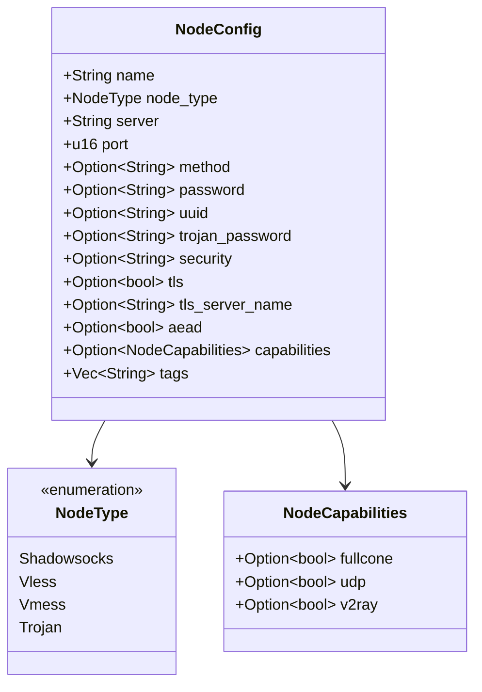
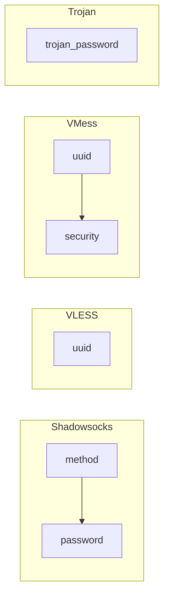
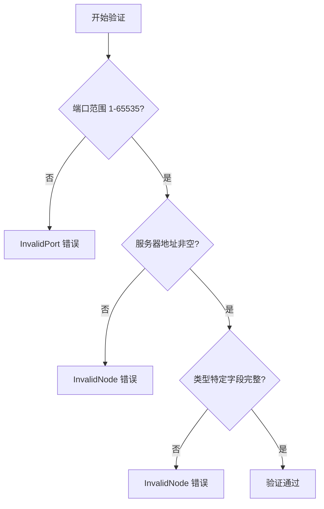

本文档详细描述 dae-rs 中节点（Proxy Node）的配置系统，涵盖节点类型定义、配置结构、TOML 语法示例、标签与能力系统、以及订阅管理等核心概念。

## 节点类型概览

dae-rs 支持四种主流代理协议作为节点后端，每种协议都有其独特的认证机制和配置参数。

### 支持的协议类型

| 节点类型 | 认证方式 | TLS 要求 | 典型端口 | 适用场景 |
|----------|----------|----------|----------|----------|
| **Shadowsocks** | 加密方法 + 密码 | 可选 | 8388 | 轻量级代理，轻量加密 |
| **VLESS** | UUID | 推荐 | 443 | 高性能 TLS 代理 |
| **VMess** | UUID + 安全类型 | 推荐 | 443 | V2Ray 兼容性 |
| **Trojan** | 密码 | 必须 | 443 | 伪装为 HTTPS 流量 |

Sources: [lib.rs](crates/dae-config/src/lib.rs#L53-L59)

```rust
#[derive(Debug, Clone, Copy, PartialEq, Eq, Deserialize)]
#[serde(rename_all = "lowercase")]
pub enum NodeType {
    Shadowsocks,
    Vless,
    Vmess,
    Trojan,
}
```

## 节点配置结构

### 核心配置字段

`NodeConfig` 是节点配置的核心数据结构，包含所有协议通用的字段和类型特定的字段。



Sources: [lib.rs](crates/dae-config/src/lib.rs#L276-L310)

### 通用必填字段

以下字段对所有节点类型都是必需的：

| 字段 | 类型 | 说明 |
|------|------|------|
| `name` | String | 节点显示名称，用于日志和规则匹配 |
| `type` | NodeType | 协议类型：`shadowsocks`、`vless`、`vmess`、`trojan` |
| `server` | String | 服务器地址，支持 IP 或域名 |
| `port` | u16 | 服务器端口，范围 1-65535 |

Sources: [lib.rs](crates/dae-config/src/lib.rs#L276-L295)

### 类型特定必填字段



| 节点类型 | 必填字段 | 说明 |
|----------|----------|------|
| `shadowsocks` | `method` + `password` | 加密方法和密码 |
| `vless` | `uuid` | VLESS 用户唯一标识 |
| `vmess` | `uuid` | VMess 用户标识 |
| `trojan` | `trojan_password` | Trojan 认证密码 |

Sources: [lib.rs](crates/dae-config/src/lib.rs#L922-L950)

## TOML 配置语法

### Shadowsocks 节点

Shadowsocks 使用对称加密进行数据传输，是轻量级代理方案的理想选择。

```toml
[[nodes]]
name = "香港节点"
type = "shadowsocks"
server = "hk.example.com"
port = 8388
method = "chacha20-ietf-poly1305"
password = "your-secure-password"
```

支持的加密方法：

| 加密方法 | 安全性 | 推荐程度 |
|----------|--------|----------|
| `chacha20-ietf-poly1305` | 高 | ⭐⭐⭐⭐⭐ |
| `aes-256-gcm` | 高 | ⭐⭐⭐⭐⭐ |
| `aes-128-gcm` | 中 | ⭐⭐⭐⭐ |
| `aes-128-cfb` | 低 | ⭐ (已废弃) |

Sources: [config.example.toml](config/config.example.toml#L34-L40)

### VLESS 节点

VLESS 是一种高性能 TLS 代理协议，支持 REALITY 透明代理。

```toml
[[nodes]]
name = "美国节点"
type = "vless"
server = "us.example.com"
port = 443
uuid = "a1b2c3d4-e5f6-7890-abcd-ef1234567890"
tls = true
tls_server_name = "us.example.com"
```

VLESS 配置特点：
- UUID 用于用户身份验证
- TLS 加密传输（推荐启用）
- 支持 REALITY 传输层优化
- 支持 flow 字段控制流量类型

Sources: [e2e_config_tests.rs](crates/dae-config/tests/e2e_config_tests.rs#L595-L608)

### VMess 节点

VMess 是 V2Ray/Nekoray 等客户端广泛使用的协议。

```toml
[[nodes]]
name = "台湾节点"
type = "vmess"
server = "tw.example.com"
port = 443
uuid = "a1b2c3d4-e5f6-7890-abcd-ef1234567890"
security = "aes-128-gcm-aead"
tls = true
aead = true
```

VMess 安全类型选项：

| security 值 | 说明 | AEAD 支持 |
|-------------|------|-----------|
| `aes-128-gcm-aead` | AES-128-GCM AEAD | ✅ |
| `chacha20-poly1305-aead` | ChaCha20 AEAD | ✅ |
| `auto` | 自动选择 | ✅ |

Sources: [lib.rs](crates/dae-config/src/lib.rs#L490-L496)

### Trojan 节点

Trojan 协议设计用于模拟 HTTPS 流量，难以被深度包检测识别。

```toml
[[nodes]]
name = "日本节点"
type = "trojan"
server = "jp.example.com"
port = 443
trojan_password = "your-trojan-password"
tls = true
tls_server_name = "jp.example.com"
```

Trojan 关键特性：
- TLS 强制启用（不同于其他协议的可选 TLS）
- 伪装为正常 HTTPS 网站
- 高隐蔽性

Sources: [config.example.toml](crates/dae-config/src/lib.rs#L26-L32)

## 多节点配置示例

### 混合协议配置

在实际部署中，通常会配置多个节点以实现负载均衡和故障转移：

```toml
[proxy]
socks5_listen = "0.0.0.0:1080"
http_listen = "0.0.0.0:8080"
tcp_timeout = 300
udp_timeout = 60
ebpf_enabled = true

# Shadowsocks 节点
[[nodes]]
name = "HK-Shadowsocks"
type = "shadowsocks"
server = "hk-ss.example.com"
port = 8388
method = "chacha20-ietf-poly1305"
password = "hk-password"
tags = ["hk", "shadowsocks", "fast"]

# VLESS 节点
[[nodes]]
name = "US-VLESS"
type = "vless"
server = "us-vless.example.com"
port = 443
uuid = "a1b2c3d4-e5f6-7890-abcd-ef1234567890"
tls = true
tls_server_name = "us-vless.example.com"
tags = ["us", "vless", "tls"]

# VMess 节点
[[nodes]]
name = "JP-VMess"
type = "vmess"
server = "jp-vmess.example.com"
port = 443
uuid = "b2c3d4e5-f6a7-8901-bcde-f23456789012"
security = "aes-128-gcm-aead"
tls = true
tags = ["jp", "vmess", "v2ray"]

# Trojan 节点
[[nodes]]
name = "SG-Trojan"
type = "trojan"
server = "sg-trojan.example.com"
port = 443
trojan_password = "sg-trojan-password"
tls = true
tls_server_name = "sg-trojan.example.com"
tags = ["sg", "trojan", "stealth"]
```

Sources: [e2e_config_tests.rs](crates/dae-config/tests/e2e_config_tests.rs#L600-L660)

## 标签系统

### 标签用途

标签（Tags）用于对节点进行分类，便于规则引擎匹配和流量路由。

```toml
[[nodes]]
name = "香港高速节点"
type = "shadowsocks"
server = "hk1.example.com"
port = 8388
method = "chacha20-ietf-poly1305"
password = "password"
tags = ["hk", "proxy", "fullcone", "low-latency"]
```

### 常用标签约定

| 标签前缀 | 用途示例 | 说明 |
|----------|----------|------|
| 地区标签 | `hk`, `us`, `jp`, `sg` | 节点地理位置 |
| 类型标签 | `shadowsocks`, `vless`, `trojan` | 协议类型 |
| 特性标签 | `fullcone`, `tcp-only` | NAT 类型或限制 |
| 用途标签 | `proxy`, `direct` | 流量用途 |
| 性能标签 | `fast`, `low-latency` | 性能特征 |

Sources: [lib.rs](crates/dae-config/src/lib.rs#L307)

### 标签匹配规则

在规则配置中可以使用标签进行节点选择：

```toml
[rules]
[rules.rule_groups]
name = "hk-proxy"
type = "ipcidr"
rules = ["GEOIP,HK"]
outbound = "tag:hk"
```

## 节点能力系统

### NodeCapabilities 结构

节点能力描述了代理节点的功能特性，用于智能路由和功能适配。

```rust
#[derive(Debug, Clone, Default, Deserialize)]
pub struct NodeCapabilities {
    /// Full-Cone NAT 支持 (VMess/VLESS)
    pub fullcone: Option<bool>,
    /// UDP 协议支持
    pub udp: Option<bool>,
    /// V2Ray 兼容性
    pub v2ray: Option<bool>,
}
```

Sources: [lib.rs](crates/dae-config/src/lib.rs#L258-L268)

### 能力检查方法

```rust
impl NodeCapabilities {
    /// 检查 Full-Cone NAT 是否启用 (None 表示未知/自动检测)
    pub fn is_fullcone_enabled(&self) -> bool {
        self.fullcone.unwrap_or(false)
    }

    /// 检查 UDP 是否支持 (None 表示未知/自动检测，默认 true)
    pub fn is_udp_supported(&self) -> bool {
        self.udp.unwrap_or(true)
    }

    /// 检查 V2Ray 兼容性 (None 表示未知/自动检测，默认 true)
    pub fn is_v2ray_compatible(&self) -> bool {
        self.v2ray.unwrap_or(true)
    }
}
```

Sources: [lib.rs](crates/dae-config/src/lib.rs#L270-L288)

### 能力配置示例

```toml
[[nodes]]
name = "香港 FullCone 节点"
type = "vless"
server = "hk-fullcone.example.com"
port = 443
uuid = "uuid-here"
tls = true
[ nodes.capabilities ]
fullcone = true
udp = true
v2ray = true
```

## 配置验证

### 验证规则

dae-rs 在启动时对节点配置进行严格验证：



### 必填字段验证

```toml
# Shadowsocks 验证
method: 必须存在
password: 必须存在

# VLESS 验证  
uuid: 必须存在且非空

# VMess 验证
uuid: 必须存在且非空

# Trojan 验证
trojan_password: 必须存在且非空
```

Sources: [lib.rs](crates/dae-config/src/lib.rs#L908-L950)

### 验证示例

```rust
#[test]
fn test_config_validate_zero_port() {
    let config = Config {
        nodes: vec![NodeConfig {
            name: "test".to_string(),
            node_type: NodeType::Shadowsocks,
            server: "1.2.3.4".to_string(),
            port: 0, // Invalid port
            // ...
        }],
        // ...
    };
    
    let result = config.validate();
    assert!(result.is_err());
}
```

Sources: [e2e_config_tests.rs](crates/dae-config/tests/e2e_config_tests.rs#L135-L157)

## 订阅管理

### 订阅配置

dae-rs 支持通过订阅 URL 自动获取和更新节点列表。

```toml
[[subscriptions]]
url = "https://your-subscription-provider.com/sub"
update_interval_secs = 3600
verify_tls = true
name = "我的订阅"
tags = ["subscription", "auto-update"]
```

Sources: [lib.rs](crates/dae-config/src/lib.rs#L20-L35)

### SubscriptionEntry 结构

```rust
#[derive(Debug, Clone, Deserialize)]
pub struct SubscriptionEntry {
    /// 订阅 URL (必填)
    pub url: String,
    /// 更新间隔秒数 (默认: 3600 = 1小时)
    #[serde(default = "default_subscription_interval")]
    pub update_interval_secs: u64,
    /// 启用 TLS 证书验证 (默认: true)
    #[serde(default = "default_true")]
    pub verify_tls: bool,
    /// 自定义 User-Agent (可选)
    #[serde(default)]
    pub user_agent: Option<String>,
    /// 订阅名称/别名
    #[serde(default)]
    pub name: Option<String>,
    /// 应用于所有节点的标签
    #[serde(default)]
    pub tags: Vec<String>,
}
```

Sources: [lib.rs](crates/dae-config/src/lib.rs#L20-L35)

### 支持的订阅格式

| 格式 | 类型 | 说明 |
|------|------|------|
| SIP008 | JSON | Shadowsocks SIP008 标准格式 |
| Base64 | 文本 | Base64 编码的 ss:// 链接 |
| Clash YAML | YAML | Clash 订阅格式 |
| Sing-Box | JSON | Sing-Box 订阅格式 |
| URI Links | 文本 | vmess://, vless://, trojan://, ss:// |

Sources: [subscription.rs](crates/dae-config/src/subscription.rs#L42-L52)

## 节点查询 API

### 按名称查找

```rust
impl Config {
    /// 根据名称查找节点
    pub fn find_node(&self, name: &str) -> Option<&NodeConfig> {
        self.nodes.iter().find(|n| n.name == name)
    }
}
```

Sources: [lib.rs](crates/dae-config/src/lib.rs#L1008-L1012)

### 按类型过滤

```rust
impl Config {
    /// 获取所有 Shadowsocks 节点
    pub fn shadowsocks_nodes(&self) -> Vec<&NodeConfig> {
        self.nodes.iter()
            .filter(|n| n.node_type == NodeType::Shadowsocks)
            .collect()
    }
    
    /// 获取所有 VLESS 节点
    pub fn vless_nodes(&self) -> Vec<&NodeConfig> { /* ... */ }
    
    /// 获取所有 VMess 节点
    pub fn vmess_nodes(&self) -> Vec<&NodeConfig> { /* ... */ }
    
    /// 获取所有 Trojan 节点
    pub fn trojan_nodes(&self) -> Vec<&NodeConfig> { /* ... */ }
}
```

Sources: [lib.rs](crates/dae-config/src/lib.rs#L1014-L1034)

### 使用示例

```rust
#[test]
fn test_filter_nodes_by_type() {
    let config = /* 加载配置 */;
    
    // 按类型筛选
    let ss_nodes = config.shadowsocks_nodes();
    let vless_nodes = config.vless_nodes();
    let trojan_nodes = config.trojan_nodes();
    
    assert_eq!(ss_nodes.len(), 2);
    assert_eq!(vless_nodes.len(), 1);
    assert_eq!(trojan_nodes.len(), 1);
}
```

Sources: [e2e_config_tests.rs](crates/dae-config/tests/e2e_config_tests.rs#L247-L310)

## 完整配置示例

```toml
# dae-rs 完整节点配置示例

[proxy]
socks5_listen = "0.0.0.0:1080"
http_listen = "0.0.0.0:8080"
tcp_timeout = 300
udp_timeout = 60
ebpf_enabled = true
ebpf_interface = "eth0"
control_socket = "/var/run/dae/control.sock"

# ==================== 节点配置 ====================

# Shadowsocks 节点 - 轻量级
[[nodes]]
name = "香港-01"
type = "shadowsocks"
server = "hk1.example.com"
port = 8388
method = "chacha20-ietf-poly1305"
password = "secret-key-1"
tags = ["hk", "shadowsocks", "fast"]

# Shadowsocks 节点 - 备用
[[nodes]]
name = "香港-02"
type = "shadowsocks"
server = "hk2.example.com"
port = 8388
method = "aes-256-gcm"
password = "secret-key-2"
tags = ["hk", "shadowsocks", "backup"]

# VLESS 节点 - 高性能 TLS
[[nodes]]
name = "美国-01"
type = "vless"
server = "us1.example.com"
port = 443
uuid = "a1b2c3d4-e5f6-7890-abcd-ef1234567890"
tls = true
tls_server_name = "us1.example.com"
tags = ["us", "vless", "tls", "fullcone"]

# VMess 节点 - V2Ray 兼容
[[nodes]]
name = "日本-01"
type = "vmess"
server = "jp1.example.com"
port = 443
uuid = "b2c3d4e5-f6a7-8901-bcde-f23456789012"
security = "aes-128-gcm-aead"
tls = true
aead = true
tags = ["jp", "vmess", "v2ray"]

# Trojan 节点 - 高隐蔽性
[[nodes]]
name = "新加坡-01"
type = "trojan"
server = "sg1.example.com"
port = 443
trojan_password = "trojan-secret-password"
tls = true
tls_server_name = "sg1.example.com"
tags = ["sg", "trojan", "stealth"]

# ==================== 订阅配置 ====================

[[subscriptions]]
url = "https://sub.example.com/clash"
update_interval_secs = 3600
verify_tls = true
name = "Clash订阅"
tags = ["subscription", "clash"]

[[subscriptions]]
url = "https://sub2.example.com/sip008"
update_interval_secs = 7200
verify_tls = true
name = "SIP008订阅"
tags = ["subscription", "sip008"]

# ==================== 日志配置 ====================

[logging]
level = "info"
file = "/var/log/dae-rs/dae.log"
structured = true
```

Sources: [config.example.toml](config/config.example.toml#L1-L67)

## 配置错误处理

### 错误类型

```rust
#[derive(Error, Debug)]
pub enum ConfigError {
    #[error("Missing required field: {0}")]
    MissingField(String),
    
    #[error("Invalid port number: {0} (must be 1-65535)")]
    InvalidPort(u16),
    
    #[error("Invalid address: {0}")]
    InvalidAddress(String),
    
    #[error("Invalid node configuration: {0}")]
    InvalidNode(String),
    
    #[error("Rule file not found: {0}")]
    RuleFileNotFound(String),
    
    #[error("Rule file parse error: {0}")]
    RuleFileParseError(String),
    
    #[error("Invalid subscription: {0}")]
    InvalidSubscription(String),
    
    #[error("Validation error: {0}")]
    ValidationError(String),
}
```

Sources: [lib.rs](crates/dae-config/src/lib.rs#L43-L61)

### 错误处理示例

```rust
fn load_and_validate_config(path: &str) -> Result<Config, Box<dyn std::error::Error>> {
    let config = Config::from_file(path)?;
    config.validate()?;
    Ok(config)
}

// 使用 match 处理不同错误
match load_and_validate_config("config.toml") {
    Ok(config) => println!("Loaded {} nodes", config.nodes.len()),
    Err(e) => {
        match e.downcast_ref::<ConfigError>() {
            Some(ConfigError::InvalidNode(msg)) => {
                eprintln!("Node configuration error: {}", msg);
            }
            Some(ConfigError::MissingField(field)) => {
                eprintln!("Missing required field: {}", field);
            }
            _ => eprintln!("Configuration error: {}", e),
        }
    }
}
```

## 后续步骤

- 了解 [规则引擎](18-gui-ze-yin-qing) 如何基于标签选择节点
- 掌握 [Control Socket API](25-control-socket-api) 进行动态节点管理
- 学习 [eBPF/XDP 集成](17-ebpf-xdp-ji-cheng) 优化节点流量处理