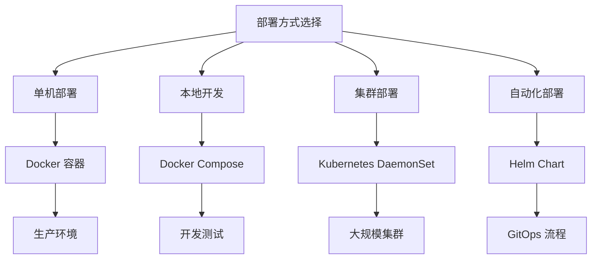

本文档详细介绍 dae-rs 的各种部署方式，帮助开发者根据不同场景选择最合适的部署方案。dae-rs 作为基于 Rust 和 eBPF 的高性能透明代理，支持 Docker 单机部署、Docker Compose 本地开发、Kubernetes 集群部署以及 Helm Chart 自动化管理等多种部署模式。

## 部署方式概览

不同的部署方式适用于不同的使用场景，选择合适的部署方式可以提高部署效率和可维护性。



| 部署方式 | 适用场景 | 复杂度 | 推荐指数 |
|---------|---------|-------|---------|
| Docker | 单机生产环境 | 低 | ⭐⭐⭐⭐⭐ |
| Docker Compose | 本地开发测试 | 低 | ⭐⭐⭐⭐⭐ |
| Kubernetes | 集群管理 | 中 | ⭐⭐⭐⭐ |
| Helm Chart | 自动化运维 | 中 | ⭐⭐⭐⭐ |

## 前置要求

### 系统依赖

在开始部署之前，需要确保目标系统满足以下基本要求。

| 依赖项 | 最低版本 | 说明 |
|-------|---------|------|
| Docker | 20.10+ | 容器运行时环境 |
| Linux 内核 | 5.8+ | eBPF/XDP 特性支持 |
| 容器权限 | 特权模式 | eBPF 操作必需 |

### 必要权限

dae-rs 的 eBPF/XDP 功能需要容器具备较高的系统权限，这是透明代理正常工作的前提条件。

| 权限 | 用途说明 |
|-----|---------|
| `SYS_ADMIN` | eBPF 系统调用操作 |
| `NET_ADMIN` | 网络配置修改 |
| `SYS_RESOURCE` | 提升资源限制 |
| `NET_RAW` | 原始数据包处理 |
| `IPC_LOCK` | 内存锁定 |

> **注意**：这些权限仅用于 eBPF/XDP 透明代理功能。如果仅使用 SOCKS5/HTTP 代理模式，部分权限可以省略。

## Docker 部署

Docker 是最直接的部署方式，适合单机生产环境使用。dae-rs 官方提供了优化的多阶段 Dockerfile，支持 amd64 和 arm64 架构。

### 构建镜像

首先克隆项目代码并构建 Docker 镜像。

```bash
# 克隆项目
git clone https://github.com/popo1221/dae-rs.git
cd dae-rs

# 构建镜像
docker build -t dae-rs:latest .
```

对于多架构构建需求，可以使用 buildx 工具同时构建 amd64 和 arm64 镜像。

```bash
# 启用 docker buildx
docker buildx create --use
docker buildx inspect --bootstrap

# 构建多平台镜像并推送
docker buildx build \
  --platform linux/amd64,linux/arm64 \
  -t dae-rs:latest \
  --push \
  .
```

Sources: [Dockerfile](Dockerfile#L1-L47)

### 运行容器

dae-rs 必须以特权模式运行才能使用 eBPF/XDP 功能。下面的命令展示了完整的容器启动配置。

```bash
docker run -d \
  --name dae-rs \
  --network host \
  --privileged \
  --security-opt seccomp=unconfined \
  --cap-add=SYS_ADMIN \
  --cap-add=NET_ADMIN \
  --cap-add=SYS_RESOURCE \
  -v /path/to/config.toml:/etc/dae/config.toml:ro \
  -v dae-data:/var/lib/dae \
  -v dae-logs:/var/log/dae \
  -e RUST_LOG=info \
  dae-rs:latest
```

关键参数说明：

- `--network host`：使用主机网络模式，这是 eBPF/XDP 绑定网络接口的必要条件
- `--privileged`：授予完整特权，简化权限配置
- `-v /path/to/config.toml:/etc/dae/config.toml:ro`：配置文件必须为只读挂载
- `RUST_LOG=info`：设置日志级别，可选值包括 trace、debug、info、warn、error

Sources: [Dockerfile](Dockerfile#L39-L47)

## Docker Compose 部署

Docker Compose 适合本地开发测试环境，可以快速启动、停止和管理 dae-rs 容器。

### 基本配置

docker-compose.yml 文件定义了 dae-rs 的完整服务配置，包括网络、存储卷和环境变量。

```yaml
services:
  dae:
    build:
      context: .
      dockerfile: Dockerfile
    image: dae-rs:latest
    container_name: dae-rs

    # 网络模式：主机模式（eBPF/XDP 必需）
    network_mode: host

    # 特权模式
    privileged: true
    security_opt:
      - seccomp:unconfined
    cap_add:
      - SYS_ADMIN
      - NET_ADMIN
      - SYS_RESOURCE

    volumes:
      # 配置文件
      - ./config:/etc/dae:ro
      # 持久化数据
      - dae-data:/var/lib/dae
      - dae-logs:/var/log/dae

    environment:
      - RUST_LOG=info
      - DAE_VERBOSE=${DAE_VERBOSE:-false}

    restart: unless-stopped

volumes:
  dae-data:
    driver: local
  dae-logs:
    driver: local
```

Sources: [docker-compose.yml](docker-compose.yml#L1-L81)

### 常用操作命令

部署和管理 dae-rs 容器的基本操作如下。

```bash
# 启动服务
docker-compose up -d

# 查看日志
docker-compose logs -f

# 停止服务
docker-compose down

# 重启服务
docker-compose restart
```

### 开发模式

对于需要修改源码进行开发的场景，可以使用开发模式启动容器，源码目录会被直接挂载到容器内。

```bash
# 启动开发容器
docker-compose --profile dev up -d dae-dev

# 进入容器进行调试
docker exec -it dae-rs-dev /bin/bash
```

Sources: [docker-compose.yml](docker-compose.yml#L46-L66)

## Kubernetes 部署

对于需要在大规模集群中部署 dae-rs 的场景，推荐使用 Kubernetes 的 DaemonSet 方式，确保每个节点都运行一个 dae-rs 实例。

### 快速部署

按照以下步骤在 Kubernetes 集群中部署 dae-rs。

```bash
# 1. 创建命名空间和 RBAC
kubectl apply -f k8s/rbac.yaml

# 2. 应用 ConfigMap 配置
kubectl apply -f k8s/configmap.yaml

# 3. 部署 DaemonSet
kubectl apply -f k8s/deployment.yaml

# 4. 检查运行状态
kubectl get pods -n dae-rs
kubectl get daemonset -n dae-rs
```

### DaemonSet 配置说明

dae-rs 在 Kubernetes 中以 DaemonSet 方式运行，每个节点都会部署一个实例，保证透明代理覆盖整个集群。

```yaml
spec:
  # 使用主机网络（eBPF 必需）
  hostNetwork: true
  hostPID: true
  
  # 安全上下文
  securityContext:
    runAsNonRoot: false
    runAsUser: 0
    
  # 容器特权配置
  containers:
    - name: dae-rs
      securityContext:
        privileged: true
        capabilities:
          add:
            - SYS_ADMIN
            - NET_ADMIN
            - SYS_RESOURCE
            - NET_RAW
            - IPC_LOCK
```

Sources: [k8s/deployment.yaml](k8s/deployment.yaml#L1-L100)

### 资源配置

根据实际负载情况调整资源请求和限制。

```yaml
resources:
  requests:
    cpu: 100m
    memory: 128Mi
  limits:
    cpu: 2000m
    memory: 1Gi
    # eBPF 使用内核内存，不设置限制
```

Sources: [k8s/deployment.yaml](k8s/deployment.yaml#L70-L79)

### 配置更新

修改配置后需要重启 Pod 才能生效。

```bash
# 编辑 ConfigMap
kubectl edit configmap dae-rs-config -n dae-rs

# 重启 Pod 应用新配置
kubectl rollout restart daemonset/dae-rs -n dae-rs
```

### 卸载

使用以下命令从集群中完全移除 dae-rs。

```bash
kubectl delete -f k8s/deployment.yaml
kubectl delete -f k8s/service.yaml
kubectl delete -f k8s/configmap.yaml
kubectl delete -f k8s/rbac.yaml
kubectl delete namespace dae-rs
```

## Helm Chart 部署

Helm Chart 提供了更高级的部署抽象，适合 GitOps 流程和自动化运维场景。

### 安装步骤

```bash
# 添加 Helm 仓库（如已发布）
helm repo add dae-rs https://popo1221.github.io/dae-rs
helm repo update

# 或直接从本地 Chart 安装
cd charts/dae-rs

# 创建命名空间并安装
helm install dae-rs . -n dae-rs --create-namespace
```

### 自定义配置

通过 values.yaml 或命令行参数自定义部署配置。

```bash
# 使用自定义参数安装
helm install dae-rs . -n dae-rs --create-namespace \
  --set dae.logLevel=debug \
  --set config.inline="$(cat /path/to/config.yml)"
```

### 常用 Helm 命令

```bash
# 升级部署
helm upgrade dae-rs . -n dae-rs

# 回滚
helm rollback dae-rs -n dae-rs

# 卸载
helm uninstall dae-rs -n dae-rs

# 查看发布列表
helm list -n dae-rs

# 查看完整配置
helm get values dae-rs -n dae-rs
```

Sources: [charts/dae-rs/Chart.yaml](charts/dae-rs/Chart.yaml#L1-L45)

### values.yaml 核心配置

```yaml
# 镜像配置
image:
  repository: ghcr.io/popo1221/dae-rs
  pullPolicy: IfNotPresent
  tag: ""

# 日志级别
dae:
  logLevel: info
  interface: ""  # 空值表示自动检测

# 内联配置
config:
  inline: |
    global:
      log_level: info
      tcp_timeout: 300
      udp_timeout: 600
    
    inbound:
      - name: socks5
        type: socks5
        listen: 0.0.0.0:1080
        udp: true
    
    outbound:
      - name: direct
        type: direct
    
    rules:
      - type: default
        outbound: direct

# 资源配置
resources:
  requests:
    cpu: 100m
    memory: 128Mi
  limits:
    cpu: 2000m
    memory: 1Gi

# 安全配置
containerSecurityContext:
  privileged: true
  capabilities:
    add:
      - SYS_ADMIN
      - NET_ADMIN
      - SYS_RESOURCE
```

Sources: [charts/dae-rs/values.yaml](charts/dae-rs/values.yaml#L1-L100)

## 配置文件参考

无论采用哪种部署方式，dae-rs 都使用 TOML 格式的配置文件。以下是一个完整的配置示例。

```toml
# dae-rs 配置文件示例
[proxy]
socks5_listen = "0.0.0.0:1080"
http_listen = "0.0.0.0:8080"
tcp_timeout = 60
udp_timeout = 30
ebpf_enabled = false
ebpf_interface = "eth0"

[transparent_proxy]
enabled = false
tun_interface = "dae0"
tun_ip = "10.0.0.1"
tun_netmask = "255.255.255.0"
mtu = 1500
auto_route = true
dns_hijack = ["8.8.8.8", "8.8.4.4"]
dns_upstream = ["8.8.8.8:53", "8.8.4.4:53"]

# Trojan 节点示例
[[nodes]]
name = "香港节点"
type = "trojan"
server = "your-server.com"
port = 443
trojan_password = "your-trojan-password"
tls = true
tls_server_name = "your-server.com"

[logging]
level = "info"
file = "/var/log/dae-rs.log"
```

Sources: [config/config.example.toml](config/config.example.toml#L1-L67)

## 命令行操作

dae-rs 提供了一套完整的命令行工具用于服务管理和配置验证。

```bash
# 前台运行代理
dae run /etc/dae/config.toml

# 后台守护进程模式运行
dae run /etc/dae/config.toml -d --pid-file /var/run/dae/dae.pid

# 查看服务状态
dae status

# 验证配置文件
dae validate /etc/dae/config.toml

# 热重载配置
dae reload

# 测试节点连通性
dae test <节点名称>

# 关闭守护进程
dae shutdown
```

Sources: [docs/16-cli.md](docs/16-cli.md#L1-L50)

## 常见问题排查

### Docker 部署问题

#### eBPF 加载失败

```
Error: failed to load XDP program
```

**解决方案**：

```bash
# 检查内核支持
dmesg | grep -i xdp
cat /proc/sys/kernel/bpf_stats_enabled

# 验证容器权限
docker run --rm --privileged dae-rs:latest capsh --print
```

#### 权限被拒绝

```
Error: operation not permitted
```

**解决方案**：确保容器以特权模式运行或添加必要的 capabilities。

```bash
docker run --privileged ...
```

Sources: [docs/DEPLOYMENT.md](docs/DEPLOYMENT.md#L400-L420)

### Kubernetes 部署问题

#### Pod 无法启动

```bash
# 检查 RBAC 权限
kubectl auth can-i use podsecuritypolicy/dae-rs-privileged -n dae-rs

# 检查节点资源
kubectl describe nodes | grep -A5 "Allocated resources"

# 查看 Pod 事件
kubectl describe pod -n dae-rs <pod-name>
```

#### eBPF 在特定节点失败

```bash
# 检查哪些节点运行了 dae-rs
kubectl get pods -n dae-rs -o wide

# 检查节点内核版本
kubectl get nodes -o jsonpath='{range .items[*]}{.metadata.name}: {.status.nodeInfo.kernelVersion}{"\n"}{end}'
```

Sources: [docs/DEPLOYMENT.md](docs/DEPLOYMENT.md#L420-L450)

### 常见错误对照表

| 错误信息 | 原因 | 解决方案 |
|---------|-----|---------|
| `XDP attach failed` | 网络接口被占用 | 停止其他 XDP 程序 |
| `bpf() operation not permitted` | 缺少必要权限 | 添加 SYS_ADMIN capability |
| `failed to open BPF map` | 内核模块问题 | 加载必需的内核模块 |
| `No such device` | 接口不存在 | 检查接口名称配置 |

## 调试模式

启用调试日志可以获取更详细的运行时信息，便于问题诊断。

```bash
# Docker 环境
docker run -e RUST_LOG=debug dae-rs:latest

# Kubernetes 环境
kubectl set env daemonset/dae-rs -n dae-rs RUST_LOG=debug

# 查看详细日志
kubectl logs -n dae-rs -l app=dae-rs --tail=1000 | grep -i debug
```

### 健康检查

```bash
# Docker 环境
docker exec dae-rs pgrep dae

# Kubernetes 环境
kubectl exec -n dae-rs -l app=dae-rs -- pgrep dae
```

## 后续步骤

完成 dae-rs 部署后，建议继续阅读以下文档深入了解系统功能：

- [配置参考手册](20-pei-zhi-can-kao-shou-ce) — 详细了解所有配置选项
- [Control Socket API](25-control-socket-api) — 了解程序化管理接口
- [eBPF/XDP 集成](17-ebpf-xdp-ji-cheng) — 深入了解透明代理技术

如果你是首次使用 dae-rs，建议从以下文档开始：

- [快速开始](2-kuai-su-kai-shi) — 快速上手指南
- [安装指南](3-an-zhuang-zhi-nan) — 从源码构建详细步骤