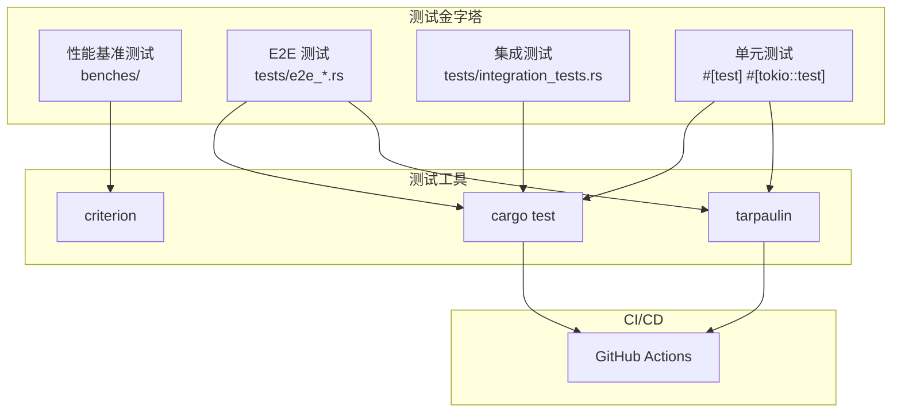

本指南介绍 dae-rs 项目的完整测试体系，包括单元测试、集成测试、端到端测试、性能基准测试和代码覆盖率分析。通过系统化的测试实践，确保代理核心、协议实现和配置系统的可靠性。

## 测试架构概览

dae-rs 采用多层次测试金字塔策略，覆盖从单个函数到完整代理链路的各种场景。测试框架基于 Rust 标准库和 tokio 异步运行时，配合 Criterion 进行性能基准测试，使用 cargo-tarpaulin 生成代码覆盖率报告。



### 测试统计概览

| 测试类型 | 数量级 | 运行命令 | 典型耗时 |
|----------|--------|----------|----------|
| 单元测试 | 180+ | `cargo test --workspace` | < 30s |
| 集成测试 | 19+ | `cargo test --test integration_tests` | < 60s |
| E2E 测试 | 15+ | `cargo test --test e2e_*` | < 120s |
| 性能基准 | 8 组 | `cargo bench` | 5-10 分钟 |

Sources: [crates/dae-config/tests/e2e_config_tests.rs](crates/dae-config/tests/e2e_config_tests.rs#L1-L813), [crates/dae-proxy/tests/e2e_proxy_tests.rs](crates/dae-proxy/tests/e2e_proxy_tests.rs#L1-L714)

---

## 运行测试

### 基础命令

```bash
# 运行工作区所有测试
cargo test --workspace

# 运行特定 crate 测试
cargo test -p dae-proxy
cargo test -p dae-config

# 运行特定测试文件
cargo test --test e2e_config_tests
cargo test --test e2e_proxy_tests
cargo test --test integration_tests
```

### 按名称过滤

```bash
# 过滤包含特定关键词的测试
cargo test connection_pool
cargo test rule_engine
cargo test vless
cargo test shadowsocks

# 忽略特定测试
cargo test -- --skip slow_test
cargo test -- --skip ignored_test
```

### 并行与顺序执行

```bash
# 使用所有 CPU 核心并行运行
cargo test -- --test-threads=0

# 使用指定数量的线程
cargo test -- --test-threads=4

# 单线程顺序运行（调试用）
cargo test -- --test-threads=1
```

Sources: [Makefile](Makefile#L1-L22), [.github/workflows/ci.yml](.github/workflows/ci.yml#L1-L43)

---

## 单元测试

单元测试直接内嵌于源代码模块中，使用 `#[cfg(test)]` 模块和 `#[test]` 或 `#[tokio::test]` 属性标记。

### 代理协议测试

```bash
# 测试所有代理协议
cargo test -p dae-proxy protocol_

# 测试特定协议实现
cargo test -p dae-proxy vless_
cargo test -p dae-proxy vmess_
cargo test -p dae-proxy shadowsocks_
cargo test -p dae-proxy trojan_
```

### 连接池测试

```bash
# 测试连接池基础操作
cargo test -p dae-proxy connection_pool

# 测试连接复用逻辑
cargo test connection_reuse

# 测试连接状态转换
cargo test connection_state
```

### 规则引擎测试

```bash
# 测试规则匹配
cargo test -p dae-proxy rule_engine_

# 测试域名规则
cargo test rule_domain

# 测试 GeoIP 规则
cargo test rule_geoip

# 测试 IP CIDR 规则
cargo test rule_ipcidr
```

Sources: [crates/dae-proxy/tests/integration_tests.rs](crates/dae-proxy/tests/integration_tests.rs#L1-L243)

---

## 集成测试

集成测试位于各 crate 的 `tests/` 目录下，验证多个组件的协作。

### E2E 配置测试

`crates/dae-config/tests/e2e_config_tests.rs` 包含配置系统的完整验证：

```bash
# 运行所有配置 E2E 测试
cargo test --test e2e_config_tests

# 测试配置解析
cargo test -p dae-config test_config_parse

# 测试节点类型转换
cargo test -p dae-config test_node_type

# 测试订阅配置
cargo test -p dae-config subscription_
```

**关键测试场景**：

| 测试函数 | 验证内容 |
|----------|----------|
| `test_config_parse_valid_toml` | TOML 配置正确解析 |
| `test_config_validate_*` | 配置验证逻辑 |
| `test_node_type_from_str_all_variants` | 节点类型枚举转换 |
| `test_subscription_config_*` | 订阅配置构建器模式 |
| `test_complex_multi_protocol_config` | 多协议混合配置 |

Sources: [crates/dae-config/tests/e2e_config_tests.rs](crates/dae-config/tests/e2e_config_tests.rs#L1-L813)

### E2E 代理测试

`crates/dae-proxy/tests/e2e_proxy_tests.rs` 验证代理功能的端到端流程：

```bash
# 运行代理 E2E 测试
cargo test --test e2e_proxy_tests

# 测试 TCP 连接池
cargo test e2e_tests::test_tcp_connection_pool

# 测试 UDP 会话跟踪
cargo test e2e_tests::test_udp_connection_pool

# 测试 IPv6 连接
cargo test e2e_tests::test_ipv6
```

**连接池测试覆盖**：

```rust
// 同 4-tuple 连接复用
#[tokio::test]
async fn test_tcp_connection_pool_reuse_same_4tuple() {
    let pool: SharedConnectionPool = Arc::new(ConnectionPool::new(...));
    let key = ConnectionKey::new(src, dst, Protocol::Tcp);
    
    let (conn1, created1) = pool.get_or_create(key).await;
    assert!(created1, "First connection should be created");
    
    let (conn2, created2) = pool.get_or_create(key).await;
    assert!(!created2, "Second connection should be reused");
}
```

Sources: [crates/dae-proxy/tests/e2e_proxy_tests.rs](crates/dae-proxy/tests/e2e_proxy_tests.rs#L1-L714)

### 并发访问测试

```bash
# 测试并发连接创建
cargo test e2e_tests::test_concurrent_connection_creation

# 测试并发相同连接访问
cargo test e2e_tests::test_concurrent_same_connection_access
```

**并发测试实现**：

```rust
#[tokio::test]
async fn test_concurrent_connection_creation() {
    let pool: SharedConnectionPool = Arc::new(ConnectionPool::new(...));
    let mut join_set = JoinSet::new();

    for i in 0..100 {
        let pool = pool.clone();
        join_set.spawn(async move {
            let key = ConnectionKey::new(src_addr, dst_addr, Protocol::Tcp);
            pool.get_or_create(key).await
        });
    }

    let created_count = results.iter().filter(|(_, created)| *created).count();
    assert_eq!(created_count, 100);
}
```

Sources: [crates/dae-proxy/tests/e2e_proxy_tests.rs](crates/dae-proxy/tests/e2e_proxy_tests.rs#L475-L515)

---

## 性能基准测试

### 基准测试结构

性能测试位于 `benches/` 目录，使用 Criterion 框架：

```bash
# 运行所有基准测试
cargo bench

# 运行特定基准测试组
cargo bench -- socks5_handshake
cargo bench -- rule_matching
cargo bench -- connection_pool

# 生成 HTML 报告
# 报告位置: target/criterion/html/index.html
```

### 基准测试组

| 基准组 | 测试内容 | 关键指标 |
|--------|----------|----------|
| `socks5_handshake` | SOCKS5 握手解析 | < 1ms |
| `http_connect` | HTTP CONNECT 处理 | < 2ms |
| `shadowsocks_decrypt` | SS 加密解密 | 500 Mbps - 2 Gbps |
| `vless_handshake` | VLESS 握手 | < 5ms |
| `rule_matching` | 规则匹配性能 | 10μs - 1ms |
| `xdp_map_lookup` | eBPF Map 查找 | < 1μs |
| `packet_processing` | 数据包处理吞吐量 | 线性扩展 |
| `connection_pool` | 连接池操作 | O(1) |

Sources: [benches/main_bench.rs](benches/main_bench.rs#L1-L365), [benches/proxy_benchmarks_bench.rs](benches/proxy_benchmarks_bench.rs#L1-L437)

### 规则匹配基准

```rust
fn rule_matching_benchmark(c: &mut Criterion) {
    let mut group = c.benchmark_group("rule_matching");

    for rule_count in [100, 1000, 10000].iter() {
        group.throughput(Throughput::Elements(*rule_count as u64));
        group.bench_with_input(
            BenchmarkId::from_parameter(rule_count),
            rule_count,
            |b, &count| {
                let engine = create_rule_engine_with_rules(count);
                let packet = create_test_packet_info();

                b.iter(|| {
                    let result = engine.match_packet(&packet);
                    black_box(result);
                });
            },
        );
    }
}
```

### Shadowsocks 加密基准

```rust
fn shadowsocks_decrypt_benchmark(c: &mut Criterion) {
    let ciphers = [
        ("chacha20-ietf-poly1305", SsCipherType::ChaCha20IetfPoly1305),
        ("aes-256-gcm", SsCipherType::Aes256Gcm),
        ("aes-128-gcm", SsCipherType::Aes128Gcm),
    ];

    for (name, cipher) in ciphers.iter() {
        for payload_size in [64, 512, 4096].iter() {
            group.throughput(Throughput::Bytes(*payload_size as u64));
            // ... benchmark implementation
        }
    }
}
```

Sources: [benches/proxy_benchmarks_bench.rs](benches/proxy_benchmarks_bench.rs#L161-L191)

---

## 代码覆盖率

### 生成覆盖率报告

```bash
# 使用 Makefile
make coverage

# 或直接使用 cargo tarpaulin
cargo tarpaulin --workspace --out Html --output-dir coverage/

# 打开报告
open coverage/tarpaulin-report.html
```

### 多格式输出

```bash
# HTML 报告（交互式）
cargo tarpaulin --workspace --out Html --output-dir coverage/

# Cobertura XML（CI 集成）
cargo tarpaulin --workspace --out Xml --output-dir coverage/

# JSON 报告
cargo tarpaulin --workspace --out Json --output-dir coverage/

# 文本报告
cargo tarpaulin --workspace --out Console --output-dir coverage/
```

### 覆盖率目标

| 模块 | 目标覆盖率 | 关键路径 |
|------|------------|----------|
| dae-config | > 90% | 配置解析、验证、订阅 |
| dae-proxy | > 80% | 协议处理、规则引擎 |
| dae-core | > 70% | 核心调度逻辑 |
| dae-cli | > 60% | 命令行接口 |

Sources: [coverage/README.md](coverage/README.md#L1-L58), [coverage/tarpaulin-report.html](coverage/tarpaulin-report.html)

### 跳过特定代码

```rust
#[tarpaulin::skip]
fn this_function_is_not_covered() {
    // 用于平台特定代码或难以测试的路径
}
```

---

## NAT 行为测试

### NAT 类型验证

```bash
# 测试 Full-Cone NAT
cargo test nat fullcone

# 测试 UDP NAT 行为
cargo test nat udp

# 测试连接超时
cargo test nat timeout
```

### NAT 配置结构

```rust
pub struct NatConfig {
    pub nat_type: NatType,
    pub mapping_timeout: Duration,
    pub filtering_timeout: Duration,
}

enum NatType {
    FullCone,           // 所有外部连接都可穿越
    AddressRestricted,  // 仅允许已访问的 IP
    PortRestricted,     // 仅允许已访问的 IP:Port
    Symmetric,          // 每个目标使用不同映射
}
```

### 连接状态转换测试

```rust
#[tokio::test]
async fn test_connection_pool_update_and_get_state() {
    let pool: SharedConnectionPool = Arc::new(ConnectionPool::new(...));
    
    // 验证状态转换: New -> Active -> Closing -> Closed
    assert_eq!(conn.read().await.state(), ConnectionState::New);
    
    pool.update_state(&key, ConnectionState::Active).await;
    assert_eq!(conn.read().await.state(), ConnectionState::Active);
}
```

Sources: [crates/dae-proxy/tests/e2e_proxy_tests.rs](crates/dae-proxy/tests/e2e_proxy_tests.rs#L656-L692)

---

## CI/CD 集成

### GitHub Actions 工作流

```yaml
# .github/workflows/ci.yml
name: CI

on: [push, pull_request]

jobs:
  test:
    runs-on: ubuntu-latest
    steps:
      - uses: actions/checkout@v4
      - uses: dtolnay/rust-toolchain@stable
      
      - name: Check formatting
        run: cargo fmt --all -- --check
      
      - name: Run clippy
        run: cargo clippy --all -- -D warnings
      
      - name: Build
        run: cargo build --all
      
      - name: Run tests
        run: cargo test --all
```

### 本地 CI 模拟

```bash
# 运行完整 CI 检查
make ci

# 分步执行
make format    # 代码格式化检查
make clippy    # Lint 检查
make test      # 运行测试
make coverage  # 覆盖率报告
```

### Docker 安全扫描

```yaml
# .github/workflows/docker.yml
security:
  name: Security Scan
  steps:
    - uses: aquasecurity/trivy-action@master
      with:
        image-ref: '${{ env.REGISTRY }}/${{ env.IMAGE_NAME }}'
        format: 'sarif'
        output: 'trivy-results.sarif'
        severity: 'CRITICAL,HIGH'
```

Sources: [.github/workflows/ci.yml](.github/workflows/ci.yml#L1-L43), [.github/workflows/docker.yml](.github/workflows/docker.yml#L1-L106)

---

## 测试调试技巧

### 日志级别控制

```bash
# 调试模式运行测试
RUST_LOG=debug cargo test test_name

# 追踪所有模块
RUST_LOG=trace cargo test

# 仅特定模块
RUST_LOG=dae_proxy::vless=debug cargo test
RUST_LOG=dae_proxy::connection_pool=trace cargo test
```

### 使用 Debugger

```bash
# Debug 构建
cargo build
cargo test --no-run

# 使用 rust-gdb
rust-gdb target/debug/dae

# 使用 rust-lldb
rust-lldb target/debug/dae
```

### 常见问题排查

| 问题 | 原因 | 解决方案 |
|------|------|----------|
| 测试超时 | 网络或资源不足 | 增加 timeout 或检查环境 |
| 竞态条件 | 并发测试不稳定 | 使用 `--test-threads=1` 重现 |
| 内存泄漏 | Arc/RwLock 使用不当 | 运行内存测试 |
| 断言失败 | 逻辑错误或预期偏差 | 添加日志输出 |

---

## 编写测试

### 单元测试模板

```rust
#[cfg(test)]
mod tests {
    use super::*;

    #[test]
    fn test_vless_uuid_validation() {
        let valid_uuid = "xxxxxxxx-xxxx-xxxx-xxxx-xxxxxxxxxxxx";
        assert!(VlessHandler::validate_uuid(valid_uuid.as_bytes()));
    }

    #[tokio::test]
    async fn test_connection_pool_insert() {
        let pool = ConnectionPool::new(
            Duration::from_secs(60),
            Duration::from_secs(30),
            Duration::from_secs(10),
        );
        
        let key = ConnectionKey::new(src, dst, Protocol::Tcp);
        let (conn, created) = pool.get_or_create(key).await;
        
        assert!(created);
        assert_eq!(pool.len().await, 1);
    }
}
```

### E2E 测试模板

```rust
#[cfg(test)]
mod e2e_tests {
    use dae_proxy::*;
    use tokio::net::TcpListener;

    #[tokio::test]
    async fn test_vless_end_to_end() {
        let listener = TcpListener::bind("127.0.0.1:0").await.unwrap();
        let addr = listener.local_addr().unwrap();
        
        // 启动服务器
        let server = VlessServer::new(config).start(listener);
        
        // 连接客户端并验证
        let client = VlessClient::new(client_config).connect(addr).await;
        assert!(client.is_connected());
    }
}
```

Sources: [crates/dae-proxy/tests/integration_tests.rs](crates/dae-proxy/tests/integration_tests.rs#L17-L50)

---

## 性能压力测试

### 内存泄漏检测

```bash
# 运行所有内存泄漏测试
cargo test -p dae-proxy --test memory_leak_tests

# 运行特定内存测试
cargo test -p dae-proxy --test memory_leak_tests test_arc_drop_on_scope_exit

# 运行忽略的长期测试
cargo test -p dae-proxy --test memory_leak_tests -- --ignored
```

### 长时间运行测试

```bash
# 30 秒内存稳定性测试
cargo test -p dae-proxy --test integration_tests -- test_thirty_second_memory_stability --ignored --nocapture

# 10 次配置热重载测试
cargo test -p dae-proxy --test integration_tests -- test_config_hot_reload_stability --ignored --nocapture
```

### 性能分析工具

```bash
# 安装 cargo-flamegraph
cargo install cargo-flamegraph

# 生成火焰图
cargo flamegraph --bench proxy_benchmarks -- socks5_handshake

# 使用 perf
perf record -g cargo bench -- socks5_handshake
perf report
```

Sources: [docs/PRESSURE_TEST.md](docs/PRESSURE_TEST.md#L1-L240)

---

## 下一步

完成测试指南的学习后，建议继续阅读：

- [性能测试](24-xing-neng-ce-shi) — 深入了解性能基准测试和调优
- [Control Socket API](25-control-socket-api) — 了解运行时测试接口
- [代理核心实现](6-dai-li-he-xin-shi-xian) — 理解被测试代码的内部逻辑
- [规则引擎](18-gui-ze-yin-qing) — 了解规则匹配测试的测试对象