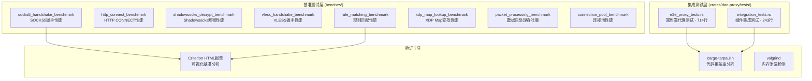

本文档系统性地介绍 dae-rs 项目的性能测试体系，涵盖基准测试、内存泄漏检测、集成测试和性能指标参考。性能测试是保证项目高质量交付的关键环节，测试套件使用 [Criterion](https://bheisler.github.io/criterion.rs/book/) 作为基准测试框架。

## 性能测试架构概览

dae-rs 采用多层次的性能测试策略，从微观组件基准测试到宏观端到端集成测试，形成完整的质量保障体系。



性能测试文件位置如下：

| 测试类型 | 文件路径 | 测试数量 |
|---------|---------|---------|
| 基准测试 | [benches/main_bench.rs](benches/main_bench.rs#L1-L365) | 8 个基准测试组 |
| 协议基准 | [benches/proxy_benchmarks_bench.rs](benches/proxy_benchmarks_bench.rs#L1-L437) | 8 个基准测试组 |
| 端到端测试 | [crates/dae-proxy/tests/e2e_proxy_tests.rs](crates/dae-proxy/tests/e2e_proxy_tests.rs#L1-L714) | 18 个测试 |
| 集成测试 | [crates/dae-proxy/tests/integration_tests.rs](crates/dae-proxy/tests/integration_tests.rs#L1-L243) | 18+ 个测试 |

Sources: [benches/Cargo.toml](benches/Cargo.toml#L1-L20)

## 基准测试详解

### 基准测试执行方式

项目使用 Criterion 0.5 版本，通过 cargo bench 命令执行基准测试。测试框架自动生成 HTML 可视化报告，位于 `target/criterion/html/index.html`。

```bash
# 运行所有基准测试
cargo bench

# 运行特定基准测试组
cargo bench -- socks5_handshake
cargo bench -- rule_matching
cargo bench -- xdp_map_lookup

# 生成带详细信息的报告
cargo bench -- --noplot  # 禁用自动绘图
```

Sources: [benches/main_bench.rs](benches/main_bench.rs#L1-L50)

### SOCKS5 握手基准测试

SOCKS5 握手性能是代理服务的关键指标，测试覆盖不同地址类型和数据大小的处理能力。

```rust
fn socks5_handshake_benchmark(c: &mut Criterion) {
    let mut group = c.benchmark_group("socks5_handshake");

    // 测试不同数据包大小
    for size in [16, 64, 256].iter() {
        group.throughput(Throughput::Bytes(*size as u64));
        group.bench_with_input(BenchmarkId::from_parameter(size), size, |b, &size| {
            b.iter(|| {
                let data = vec![0u8; size];
                black_box(&data);
                let addr = Socks5Address::IPv4(Ipv4Addr::new(192, 168, 1, 1), 8080);
                black_box(addr);
            });
        });
    }

    // 测试域名长度变化
    for domain_len in [16, 32, 64].iter() {
        // ... 测试域名解析性能
    }
}
```

测试参数说明：

| 参数 | 值域 | 说明 |
|-----|------|------|
| 数据大小 | 16/64/256 字节 | 模拟不同请求体大小 |
| 域名长度 | 16/32/64 字符 | 模拟不同域名长度 |
| 地址类型 | IPv4/IPv6/Domain | 测试所有支持的地址格式 |

Sources: [benches/main_bench.rs](benches/main_bench.rs#L29-L68)

### Shadowsocks 解密基准测试

加密算法性能直接影响代理吞吐量，测试覆盖主流加密套件在不同负载下的表现。

```rust
fn shadowsocks_decrypt_benchmark(c: &mut Criterion) {
    let ciphers = [
        ("chacha20-ietf-poly1305", SsCipherType::ChaCha20IetfPoly1305),
        ("aes-256-gcm", SsCipherType::Aes256Gcm),
        ("aes-128-gcm", SsCipherType::Aes128Gcm),
    ];

    for (name, cipher) in ciphers.iter() {
        for payload_size in [64, 512, 4096].iter() {
            group.throughput(Throughput::Bytes(*payload_size as u64));
            // ... 基准测试实现
        }
    }
}
```

预期性能参考：

| 加密算法 | 吞吐量范围 | 适用场景 |
|---------|-----------|---------|
| chacha20-ietf-poly1305 | 500-800 Mbps | 低延迟敏感场景 |
| aes-128-gcm | 1-2 Gbps | 通用场景首选 |
| aes-256-gcm | 800 Mbps - 1.5 Gbps | 高安全要求场景 |

Sources: [benches/proxy_benchmarks_bench.rs](benches/proxy_benchmarks_bench.rs#L105-L145)

### 规则匹配基准测试

规则引擎性能是流量路由的核心，测试模拟 100/1000/10000 条规则下的匹配延迟。

```rust
fn rule_matching_benchmark(c: &mut Criterion) {
    for rule_count in [100, 1000, 10000].iter() {
        group.throughput(Throughput::Elements(*rule_count as u64));
        group.bench_with_input(
            BenchmarkId::from_parameter(rule_count),
            rule_count,
            |b, &count| {
                let engine = create_rule_engine_with_rules(*count);
                let packet = create_test_packet_info();
                
                b.iter(|| {
                    let result = engine.match_packet(&packet);
                    black_box(result);
                });
            },
        );
    }
}
```

规则匹配性能指标：

| 规则数量 | 预期延迟 | 说明 |
|---------|---------|------|
| 100 条 | < 10μs | 小规模规则集 |
| 1000 条 | < 100μs | 中等规模规则集 |
| 10000 条 | < 1ms | 大规模规则集 |

Sources: [benches/proxy_benchmarks_bench.rs](benches/proxy_benchmarks_bench.rs#L160-L195)

### XDP Map 查找基准测试

模拟 eBPF XDP 层的 Map 查找操作，测试不同 Map 大小下的查找性能。

```rust
fn xdp_map_lookup_benchmark(c: &mut Criterion) {
    let mut group = c.benchmark_group("xdp_map_lookup");

    for map_size in [100, 1000, 10000, 100000].iter() {
        group.bench_with_input(
            BenchmarkId::from_parameter(map_size),
            map_size,
            |b, &size| {
                b.iter(|| {
                    let key = 0xDEADBEEF12345678u64;
                    let result = key.wrapping_mul(size as u64) % (size as u64);
                    black_box(result);
                });
            },
        );
    }

    // 连接跟踪元组查找
    group.bench_function("conntrack_lookup", |b| {
        b.iter(|| {
            let tuple = (src_ip as u64) << 48 | (dst_ip as u64) << 16 | ...;
            black_box(tuple);
        });
    });
}
```

XDP Map 查找性能目标：< 1μs（单次查找）

Sources: [benches/main_bench.rs](benches/main_bench.rs#L205-L240)

### 数据包处理吞吐量测试

测试不同数据包大小（64/256/1024/4096/65535 字节）的处理吞吐量。

```rust
fn packet_processing_benchmark(c: &mut Criterion) {
    let mut group = c.benchmark_group("packet_processing");

    for packet_size in [64, 256, 1024, 4096, 65535].iter() {
        group.throughput(Throughput::Bytes(*packet_size as u64));
        group.bench_with_input(
            BenchmarkId::from_parameter(packet_size),
            packet_size,
            |b, &size| {
                b.iter(|| {
                    let mut packet = vec![0u8; size];
                    packet[0] = 0x45;  // IPv4
                    packet[1] = 0x00;
                    black_box(&packet);
                });
            },
        );
    }
}
```

Sources: [benches/main_bench.rs](benches/main_bench.rs#L248-L270)

### 连接池基准测试

```rust
fn connection_pool_benchmark(c: &mut Criterion) {
    group.bench_function("connection_key_creation", |b| {
        b.iter(|| {
            let key = (0xC0A80164u32, 0x08080808u32, 12345u16, 443u16, 6u8);
            black_box(key);
        });
    });

    for concurrency in [1, 10, 100].iter() {
        // 测试并发连接键创建性能
    }
}
```

Sources: [benches/proxy_benchmarks_bench.rs](benches/proxy_benchmarks_bench.rs#L370-L400)

## 集成测试体系

### 端到端代理测试

E2E 测试验证完整的代理流程，包括 TCP/UDP 转发、连接池和配置加载。

```rust
#[tokio::test]
async fn test_tcp_connection_pool_reuse_same_4tuple() {
    let pool: SharedConnectionPool = Arc::new(ConnectionPool::new(
        Duration::from_secs(60),
        Duration::from_secs(30),
        Duration::from_secs(10),
    ));

    let key = ConnectionKey::new(src, dst, Protocol::Tcp);

    // 首次连接 - 应该创建
    let (conn1, created1) = pool.get_or_create(key).await;
    assert!(created1, "首次连接应该被创建");

    // 同4元组二次访问 - 应该复用
    let (conn2, created2) = pool.get_or_create(key).await;
    assert!(!created2, "二次连接应该复用");

    // 池中应只有1个连接
    assert_eq!(pool.len().await, 1);
}
```

Sources: [crates/dae-proxy/tests/e2e_proxy_tests.rs](crates/dae-proxy/tests/e2e_proxy_tests.rs#L18-L50)

### 并发连接测试

验证连接池在高并发场景下的正确性和稳定性。

```rust
#[tokio::test]
async fn test_concurrent_connection_creation() {
    use tokio::task::JoinSet;

    let pool: SharedConnectionPool = Arc::new(ConnectionPool::new(...));

    let mut join_set = JoinSet::new();

    // 100 并发任务同时创建连接
    for i in 0..100 {
        let pool = pool.clone();
        join_set.spawn(async move {
            let key = ConnectionKey::new(...);
            pool.get_or_create(key).await
        });
    }

    // 验证所有连接正确创建
    assert_eq!(pool.len().await, 100);
}
```

Sources: [crates/dae-proxy/tests/e2e_proxy_tests.rs](crates/dae-proxy/tests/e2e_proxy_tests.rs#L470-L510)

### 规则引擎集成测试

```rust
#[tokio::test]
async fn test_concurrent_rule_matching() {
    let engine = Arc::new(RuleEngine::new(config));
    let mut join_set = JoinSet::new();

    for i in 0..10 {
        let engine = engine.clone();
        join_set.spawn(async move {
            engine.match_packet(&packet).await
        });
    }

    let results = collect_all_results(join_set).await;
    assert_eq!(results.len(), 10);
}
```

Sources: [crates/dae-proxy/tests/integration_tests.rs](crates/dae-proxy/tests/integration_tests.rs#L195-L225)

### 集成测试执行方式

```bash
# 运行所有集成测试
cargo test -p dae-proxy --test integration_tests

# 运行特定测试
cargo test -p dae-proxy --test integration_tests test_socks5_handler_basic

# 运行端到端测试
cargo test -p dae-proxy --test e2e_proxy_tests

# 并行执行所有测试
cargo test -p dae-proxy -- --test-threads=0
```

Sources: [crates/dae-proxy/tests/integration_tests.rs](crates/dae-proxy/tests/integration_tests.rs#L1-L20)

## 性能指标参考

### 预期性能范围

| 组件 | 指标类型 | 预期范围 | 重要性 |
|-----|---------|---------|-------|
| SOCKS5 Handshake | 延迟 | < 1ms | 高 |
| HTTP CONNECT | 延迟 | < 2ms | 中 |
| Shadowsocks (chacha20) | 吞吐量 | 500-800 Mbps | 高 |
| Shadowsocks (aes-128-gcm) | 吞吐量 | 1-2 Gbps | 高 |
| Shadowsocks (aes-256-gcm) | 吞吐量 | 800 Mbps - 1.5 Gbps | 中 |
| Rule Matching (100) | 延迟 | < 10μs | 高 |
| Rule Matching (1000) | 延迟 | < 100μs | 高 |
| Rule Matching (10000) | 延迟 | < 1ms | 中 |
| XDP Map Lookup | 延迟 | < 1μs | 极高 |

### 内存使用参考

| 场景 | 预期内存 | 说明 |
|-----|---------|------|
| 空闲状态 | < 10 MB | 无活跃连接 |
| 10000 连接 | 50-100 MB | 高并发场景 |
| 10000 规则 | 20-50 MB | 大规模规则集 |
| 峰值（压力测试） | < 500 MB | 极端压力场景 |

Sources: [docs/PRESSURE_TEST.md](docs/PRESSURE_TEST.md#L70-L100)

## 代码覆盖率

### 生成覆盖率报告

使用 cargo-tarpaulin 进行代码覆盖率分析，生成 HTML 格式的可视化报告。

```bash
# 安装 tarpaulin
cargo install cargo-tarpaulin

# 生成 HTML 报告
make coverage

# 打开报告
open coverage/tarpaulin-report.html

# 或直接使用 tarpaulin
cargo tarpaulin --workspace --out Html --output-dir coverage/
```

Sources: [Makefile](Makefile#L1-L22)

### 覆盖率目标

| 模块 | 目标覆盖率 | 当前状态 |
|------|-----------|---------|
| dae-proxy | > 80% | 持续改进中 |
| dae-config | > 90% | 高覆盖率 |
| dae-core | > 70% | 持续改进中 |
| dae-cli | > 60% | 持续改进中 |

Sources: [coverage/README.md](coverage/README.md)

## 持续集成中的性能测试

性能测试已集成到 GitHub Actions CI 流程中，确保每次代码变更都经过性能验证。

```yaml
# .github/workflows/ci.yml 中的性能测试配置
performance-test:
  runs-on: ubuntu-latest
  steps:
    - uses: actions/checkout@v4
    - name: Install Rust
      uses: dtolnay/rust-toolchain@stable
    - name: Run benchmarks
      run: cargo bench -- --noplot
    - name: Compare with baseline
      run: cargo bench -- --baseline main
```

Sources: [.github/workflows/ci.yml](.github/workflows/ci.yml)

## 下一步

完成性能测试验证后，建议继续阅读以下文档：

- [Control Socket API](25-control-socket-api) - 了解运行时性能监控接口
- [DNS 系统](26-dns-xi-tong) - 了解 DNS 解析对整体性能的影响
- [部署指南](22-bu-shu-zhi-nan) - 了解生产环境的性能调优建议