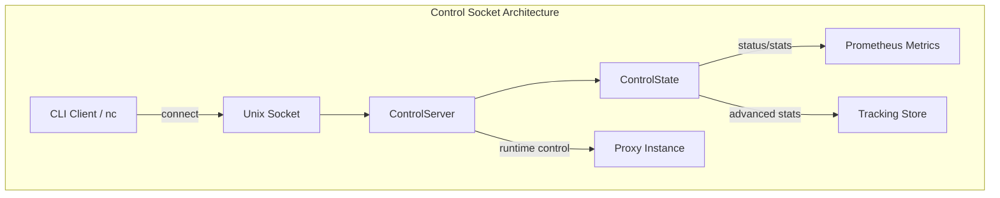
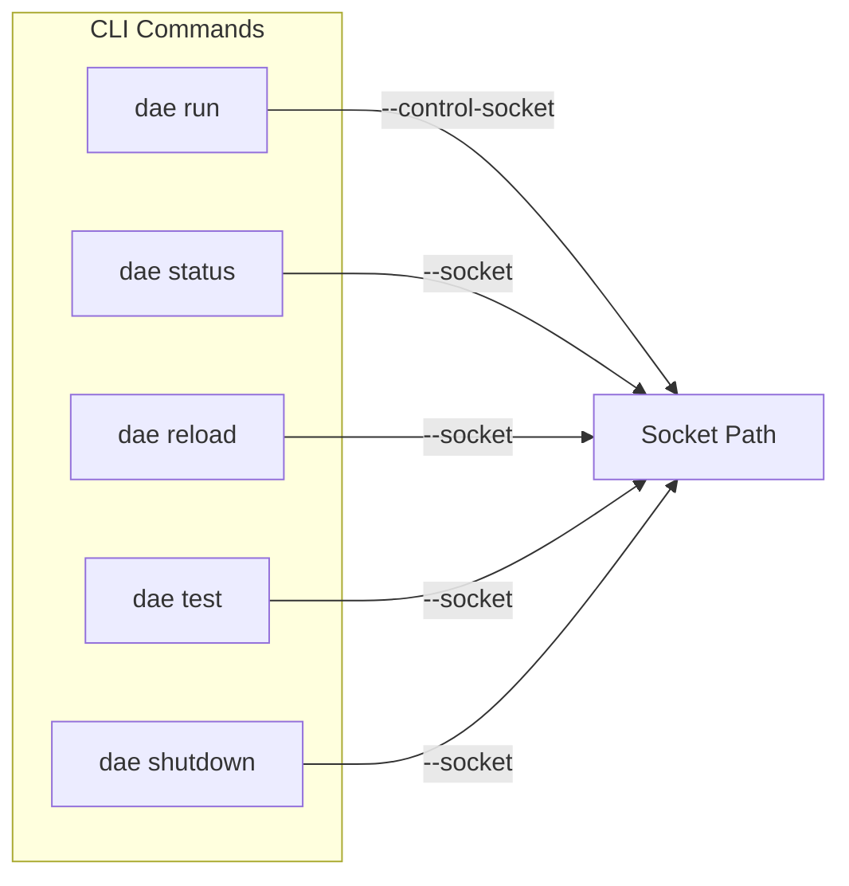

## 概述

Control Socket API 提供基于 Unix Domain Socket 的运行时管理接口，允许管理员在代理运行时查询状态、执行热重载、测试节点连通性以及优雅关闭服务。该接口采用纯文本命令协议设计，通过 JSON 格式返回结构化响应，便于程序化解析和自动化运维集成。Sources: [control.rs](crates/dae-proxy/src/control.rs#L1-L50)

## 架构设计

### 组件关系

Control Socket API 的核心组件包括 `ControlServer` 和 `ControlState` 两个关键结构。`ControlServer` 负责监听 Unix Domain Socket 并处理客户端连接请求，而 `ControlState` 则维护代理运行时的状态信息，包括配置状态、统计信息和各类回调函数。Sources: [control.rs](crates/dae-proxy/src/control.rs#L288-L340)



### 通信流程

1. 客户端通过 Unix Domain Socket 连接控制接口
2. `ControlServer` 接受连接并为每个连接创建独立的处理任务
3. 读取客户端发送的文本命令
4. `process_command` 函数解析命令并调用相应的状态方法
5. 响应通过 JSON 格式返回给客户端
6. 连接关闭，资源清理

Sources: [control.rs](crates/dae-proxy/src/control.rs#L345-L400)

## Socket 配置

### 默认路径

默认控制 socket 路径为 `/var/run/dae/control.sock`，该路径可通过命令行参数覆盖。在 Unix 系统上，socket 文件权限设置为 0o666（所有者、组和其他用户均可读写），确保具有适当权限的本地用户可以访问控制接口。Sources: [control.rs](crates/dae-proxy/src/control.rs#L320-L335)

### CLI 参数配置



各子命令均支持 `--socket` 参数指定非默认路径，实现与多个 dae 实例通信。Sources: [main.rs](crates/dae-cli/src/main.rs#L45-L95)

## 命令参考

### 可用命令

| 命令 | 功能 | 返回格式 | 使用场景 |
|------|------|----------|----------|
| `status` | 获取代理运行状态 | JSON | 监控代理健康状况 |
| `stats` | 获取流量统计 | JSON | 性能分析和计费 |
| `reload` | 热重载配置文件 | 文本 | 无中断配置更新 |
| `test <node>` | 测试节点连通性 | JSON | 节点健康检查 |
| `shutdown` | 优雅关闭代理 | 文本 | 计划维护 |
| `version` | 查看版本信息 | 文本 | 版本确认 |
| `help` | 显示帮助信息 | 文本 | 命令查询 |

### 命令详解

#### status 命令

返回代理的完整运行状态，包括运行时间、活跃连接数、规则加载情况等关键指标。Sources: [control.rs](crates/dae-proxy/src/control.rs#L415-L435)

```bash
$ echo "status" | nc -U /var/run/dae/control.sock
```

响应示例（JSON）：
```json
{
  "running": true,
  "uptime_secs": 3600,
  "tcp_connections": 5,
  "udp_sessions": 3,
  "rules_loaded": true,
  "rule_count": 42,
  "nodes_configured": 3,
  "total_connections": 1234,
  "total_bytes_in": 567890123,
  "total_bytes_out": 987654321
}
```

#### stats 命令

返回详细的流量统计信息，包括总连接数、字节传输量、活跃会话数和规则命中次数。该命令优先从 Tracking Store 获取数据，如未配置则回退到 Prometheus 指标。Sources: [control.rs](crates/dae-proxy/src/control.rs#L250-L300)

```bash
$ echo "stats" | nc -U /var/run/dae/control.sock
```

响应示例（JSON）：
```json
{
  "total_connections": 1234,
  "total_bytes_in": 567890123,
  "total_bytes_out": 987654321,
  "active_tcp_connections": 5,
  "active_udp_sessions": 3,
  "rules_hit": 999,
  "nodes_tested": 3,
  "rule_count": 42,
  "node_count": 3
}
```

#### reload 命令

触发配置热重载功能。如果配置了 reload 回调，系统将重新加载配置文件并应用新规则，不会中断现有连接。Sources: [control.rs](crates/dae-proxy/src/control.rs#L437-L448)

```bash
$ echo "reload" | nc -U /var/run/dae/control.sock
Configuration reload initiated
```

#### test 命令

测试指定节点的连通性和延迟。节点名称通过命令参数传递。Sources: [control.rs](crates/dae-proxy/src/control.rs#L450-L470)

```bash
$ echo "test:my-trojan-node" | nc -U /var/run/dae/control.sock
```

响应示例（JSON）：
```json
{
  "node_name": "my-trojan-node",
  "success": true,
  "latency_ms": 42,
  "error": null
}
```

#### shutdown 命令

请求代理优雅关闭。系统将停止接受新连接，完成现有请求处理后退出。Sources: [control.rs](crates/dae-proxy/src/control.rs#L449-L455)

```bash
$ echo "shutdown" | nc -U /var/run/dae/control.sock
Shutdown initiated
```

## 数据结构

### ProxyStatus

代理运行状态结构体，包含核心运行指标和扩展统计信息。Sources: [control.rs](crates/dae-proxy/src/control.rs#L58-L72)

```rust
pub struct ProxyStatus {
    pub running: bool,                    // 代理是否运行
    pub uptime_secs: u64,                // 运行时间（秒）
    pub tcp_connections: usize,          // 当前 TCP 连接数
    pub udp_sessions: usize,             // 当前 UDP 会话数
    pub rules_loaded: bool,              // 规则是否已加载
    pub rule_count: usize,               // 已加载规则数量
    pub nodes_configured: usize,         // 已配置节点数量
    pub total_connections: u64,          // 总连接数
    pub total_bytes_in: u64,             // 总入站字节数
    pub total_bytes_out: u64,            // 总出站字节数
}
```

### ProxyStats

流量统计结构体，提供更详细的性能指标。Sources: [control.rs](crates/dae-proxy/src/control.rs#L74-L90)

```rust
pub struct ProxyStats {
    pub total_connections: u64,          // 历史总连接数
    pub total_bytes_in: u64,             // 总入站字节
    pub total_bytes_out: u64,            // 总出站字节
    pub active_tcp_connections: usize,    // 活跃 TCP 连接
    pub active_udp_sessions: usize,       // 活跃 UDP 会话
    pub rules_hit: u64,                  // 规则命中总次数
    pub nodes_tested: usize,             // 已测试节点数
    pub rule_count: usize,               // 规则总数
    pub node_count: usize,               // 节点总数
}
```

### NodeTestResult

节点测试结果结构体。Sources: [control.rs](crates/dae-proxy/src/control.rs#L92-L99)

```rust
pub struct NodeTestResult {
    pub node_name: String,                // 节点名称
    pub success: bool,                   // 测试是否成功
    pub latency_ms: Option<u64>,         // 延迟（毫秒）
    pub error: Option<String>,            // 错误信息
}
```

### ControlCommand 枚举

定义所有支持的命令类型。Sources: [control.rs](crates/dae-proxy/src/control.rs#L17-L35)

```rust
pub enum ControlCommand {
    Status,                              // 获取状态
    Reload,                              // 热重载
    Stats,                               // 获取统计
    Shutdown,                            // 关闭
    TestNode(String),                    // 测试节点
    Version,                             // 版本
    Help,                                // 帮助
}
```

## 客户端工具函数

### connect_and_send

连接到控制 socket 并发送命令，返回原始响应字符串。Sources: [control.rs](crates/dae-proxy/src/control.rs#L545-L558)

```rust
pub async fn connect_and_send(socket_path: &str, command: &str) -> std::io::Result<String>
```

使用示例：
```rust
let response = connect_and_send("/var/run/dae/control.sock", "status").await?;
println!("{}", response);
```

### connect_and_get_status

连接到控制 socket 并获取状态响应，返回结构化的 `ControlResponse`。Sources: [control.rs](crates/dae-proxy/src/control.rs#L560-L574)

```rust
pub async fn connect_and_get_status(socket_path: &str) -> std::io::Result<ControlResponse>
```

使用示例：
```rust
match connect_and_get_status("/var/run/dae/control.sock").await? {
    ControlResponse::Status(status) => {
        println!("Running: {}, Uptime: {}s", status.running, status.uptime_secs);
    }
    ControlResponse::Error(msg) => {
        eprintln!("Error: {}", msg);
    }
    _ => {}
}
```

## CLI 集成

dae-rs CLI 提供了便捷的控制接口访问方式。Sources: [main.rs](crates/dae-cli/src/main.rs#L1-L100)

### 命令行使用

```bash
# 启动代理（指定控制 socket）
dae run -c config.toml --control-socket /var/run/dae/control.sock

# 查看状态
dae status --socket /var/run/dae/control.sock

# 热重载配置
dae reload --socket /var/run/dae/control.sock

# 测试节点
dae test --node "trojan-us-01" --socket /var/run/dae/control.sock

# 关闭代理
dae shutdown --socket /var/run/dae/control.sock

# 验证配置文件
dae validate -c config.toml
```

### 与 nc 命令配合

在不支持 dae CLI 的环境中，可使用标准的 `nc` 命令访问控制接口：

```bash
# 查看状态（单行）
echo "status" | nc -U /var/run/dae/control.sock

# 查看统计
echo "stats" | nc -U /var/run/dae/control.sock

# 获取帮助
echo "help" | nc -U /var/run/dae/control.sock
```

## 错误处理

### 错误类型对照表

| 错误类型 | 原因分析 | 处理建议 |
|----------|----------|----------|
| `Connection refused` | Socket 文件不存在或 daemon 未运行 | 检查 dae 进程状态 |
| `Permission denied` | 当前用户无 socket 访问权限 | 检查文件权限或使用 sudo |
| `Socket not found` | Socket 路径不正确或已被清理 | 验证路径配置 |
| `Broken pipe` | 连接已异常关闭 | 重试连接 |
| `JSON parse error` | 响应格式异常 | 查看原始响应内容 |

### 错误响应格式

```bash
$ echo "test:nonexistent" | nc -U /var/run/dae/control.sock
ERROR: Node testing not available (tester not configured)
```

## 回调机制

### 热重载回调

`ControlState` 支持注册热重载回调函数，在收到 `reload` 命令时自动触发。Sources: [control.rs](crates/dae-proxy/src/control.rs#L135-L145)

```rust
impl ControlState {
    pub fn set_reload_callback<F>(&mut self, callback: F)
    where
        F: Fn() + Send + Sync + 'static,
    {
        self.reload_callback = Some(Arc::new(callback));
    }
    
    pub fn trigger_reload(&self) -> bool {
        if let Some(callback) = &self.reload_callback {
            callback();
            true
        } else {
            false
        }
    }
}
```

### 节点测试回调

类似地，节点测试功能通过回调机制实现，允许自定义测试逻辑。Sources: [control.rs](crates/dae-proxy/src/control.rs#L147-L155)

```rust
impl ControlState {
    pub fn set_node_tester<F>(&mut self, tester: F)
    where
        F: Fn(&str) -> NodeTestResult + Send + Sync + 'static,
    {
        self.node_tester = Some(Arc::new(tester));
    }
}
```

## 安全性考虑

### Unix Socket 权限

- Socket 文件权限设置为 0o666，允许多用户访问
- 生产环境中建议限制为 0o660，仅允许指定用户组访问
- Socket 目录 `/var/run/dae/` 应限制访问权限

### 本地访问要求

- 控制接口仅监听 Unix Domain Socket，不暴露网络端口
- 攻击者需要本地 shell 权限才能访问接口
- 建议配合 systemd 限制服务账户权限

### 热重载限制

- `reload` 命令不会中断现有连接
- 建议在重载前验证新配置的有效性
- 使用 `dae validate` 命令预检查配置

## 与 REST API 的区别

dae-rs 同时提供了 Control Socket API 和 REST API 两种管理接口，适用于不同场景：

| 特性 | Control Socket | REST API |
|------|----------------|-----------|
| 协议 | Unix Domain Socket | HTTP/HTTPS |
| 访问方式 | 本地访问 | 本地/远程访问 |
| 延迟 | 极低（无网络开销） | 取决于网络条件 |
| 依赖 | 无额外依赖 | 需要启用 api feature |
| 用途 | 运维自动化 | Dashboard/第三方集成 |
| 权限控制 | 文件系统权限 | HTTP 认证/CORS |

关于 REST API 的详细信息，请参考 [节点管理](21-jie-dian-guan-li) 页面。

## 下一步

- 了解配置热重载机制：[配置参考手册](20-pei-zhi-can-kao-shou-ce)
- 查看节点管理功能：[节点管理](21-jie-dian-guan-li)
- 监控指标集成：[DNS 系统](26-dns-xi-tong)