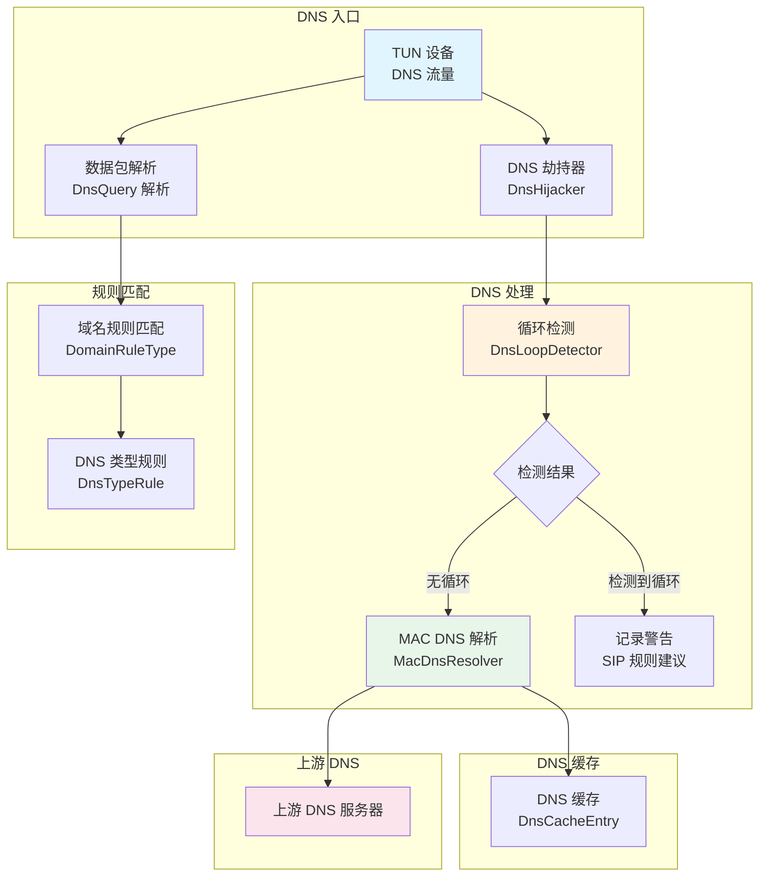
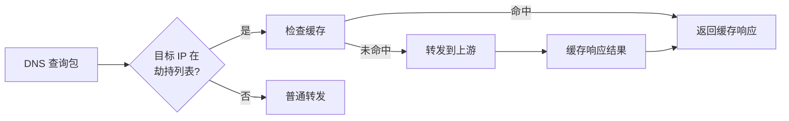
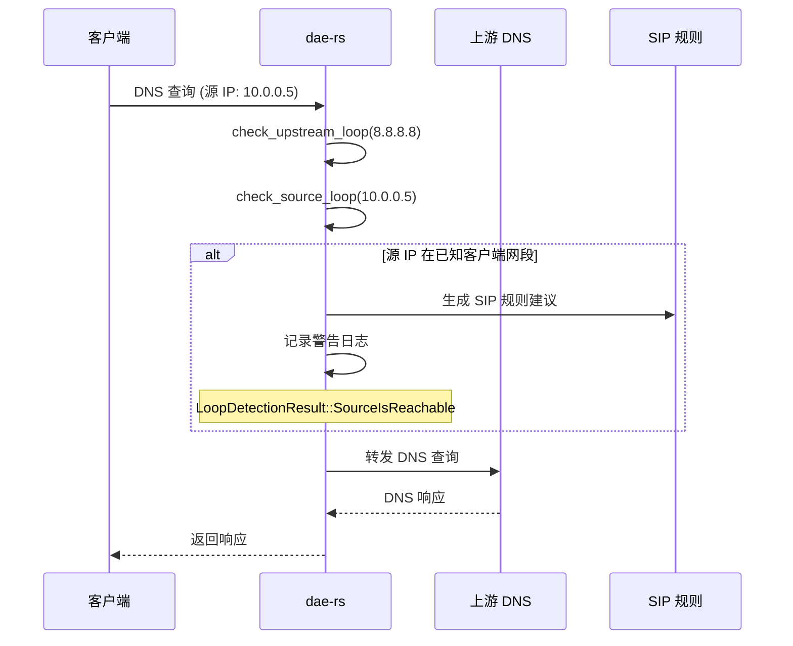
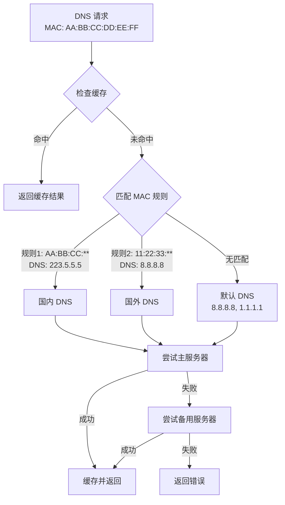
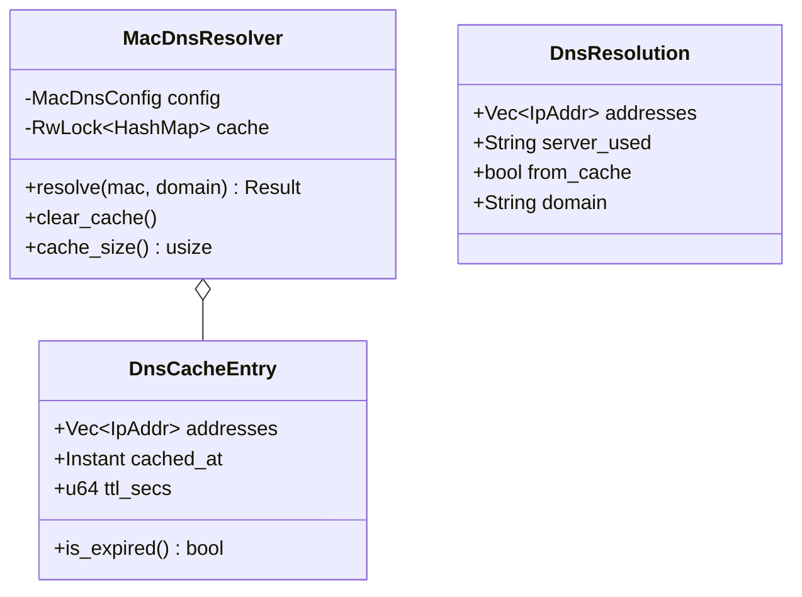
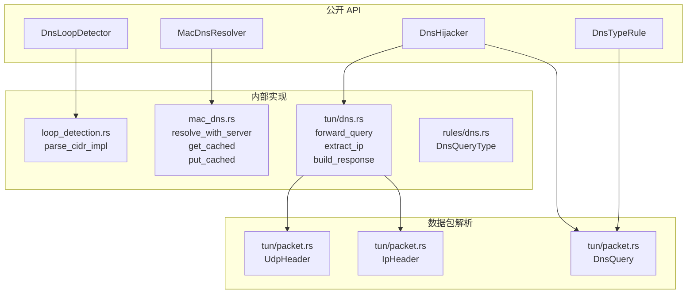

dae-rs 提供完整的 DNS 处理体系，包括基于 MAC 地址的智能 DNS 解析、DNS 循环检测、DNS 劫持和域名规则匹配。这一系统使得 dae-rs 能够根据设备标识选择不同的上游 DNS 服务器，同时防止 DNS 查询形成死循环。

## 架构概览

DNS 系统由四个核心模块组成，它们协同工作以提供智能的域名解析和路由能力。



Sources: [crates/dae-proxy/src/dns/mod.rs](crates/dae-proxy/src/dns/mod.rs#L1-L19)
Sources: [crates/dae-proxy/src/tun/dns.rs](crates/dae-proxy/src/tun/dns.rs#L1-L100)

## 核心模块

### 1. DNS 劫持器 (DnsHijacker)

DnsHijacker 是 DNS 流量的第一道处理层，位于 TUN 设备模块中，负责拦截发往特定 IP 地址的 DNS 查询请求。



**关键数据结构**：

| 组件 | 文件位置 | 职责 |
|------|----------|------|
| `DnsHijacker` | [tun/dns.rs:37-67](crates/dae-proxy/src/tun/dns.rs#L37-L67) | DNS 劫持主逻辑 |
| `DnsHijackEntry` | [tun/dns.rs:13-31](crates/dae-proxy/src/tun/dns.rs#L13-L31) | 缓存条目 |
| `DnsQuery` | [tun/packet.rs:215-260](crates/dae-proxy/src/tun/packet.rs#L215-L260) | DNS 查询解析器 |

**DnsHijacker 核心方法**：

```rust
// 检查 IP 是否被劫持
pub fn is_hijacked_ip(&self, ip: IpAddr) -> bool

// 缓存 DNS 响应
pub async fn cache_entry(&self, domain: String, ip: IpAddr)

// 处理 DNS 查询
pub async fn handle_query(&self, query: &DnsQuery, ...) -> Option<Vec<u8>>
```

Sources: [crates/dae-proxy/src/tun/dns.rs](crates/dae-proxy/src/tun/dns.rs#L1-L300)

### 2. DNS 循环检测 (DnsLoopDetector)

循环检测是防止 DNS 查询在 dae-rs 和上游 DNS 服务器之间无限循环的关键机制。当上游 DNS 服务器恰好是 dae-rs 的客户端时，会产生 DNS 循环。



**配置参数**：

| 参数 | 类型 | 默认值 | 说明 |
|------|------|--------|------|
| `check_upstream` | bool | true | 启用上游循环检测 |
| `check_source` | bool | true | 启用源循环检测 |
| `known_client_ranges` | Vec\<String\> | 10.0.0.0/8, 172.16.0.0/12, 192.168.0.0/16 | 已知客户端网段 |
| `notification_url` | Option\<String\> | None | HTTP 回调通知 URL |

Sources: [crates/dae-proxy/src/dns/loop_detection.rs](crates/dae-proxy/src/dns/loop_detection.rs#L1-L200)

**循环检测结果枚举**：

```rust
pub enum LoopDetectionResult {
    NoLoop,                                          // 无循环
    UpstreamIsClient { upstream, suggestion },       // 上游是客户端
    SourceIsReachable { source, suggestion },       // 源可到达
}
```

当检测到循环时，`suggestion` 字段会自动生成 SIP 规则建议，例如：

```
Add SIP rule to route 10.0.0.5 directly: sip(10.0.0.5, direct)
```

Sources: [crates/dae-proxy/src/dns/loop_detection.rs:20-40](crates/dae-proxy/src/dns/loop_detection.rs#L20-L40)

### 3. MAC DNS 解析器 (MacDnsResolver)

MacDnsResolver 实现基于 MAC 地址的智能 DNS 解析，允许不同设备使用不同的上游 DNS 服务器，实现设备级的 DNS 策略控制。



**MAC DNS 规则结构**：

```rust
pub struct MacDnsRule {
    pub mac: MacAddr,           // MAC 地址
    pub mac_mask: Option<MacAddr>, // 可选掩码（前缀匹配）
    pub dns_servers: Vec<String>,   // 主 DNS 服务器列表
    pub fallback_dns: Vec<String>,  // 备用 DNS 服务器列表
}
```

Sources: [crates/dae-proxy/src/dns/mac_dns.rs](crates/dae-proxy/src/dns/mac_dns.rs#L1-L200)

**规则匹配示例**：

```rust
// 精确匹配
let rule = MacDnsRule::new(mac, vec!["8.8.8.8:53"], vec![]);

// 前缀匹配 (匹配所有苹果设备)
let rule = MacDnsRule::with_mask(
    MacAddr::parse("AC:DE:48:00:00:00").unwrap(),
    MacAddr::parse("FF:FF:FF:00:00:00").unwrap(),
    vec!["224.0.0.251:53"],  // mDNS 本地
    vec![]
);
```

Sources: [crates/dae-proxy/src/dns/mac_dns.rs:50-70](crates/dae-proxy/src/dns/mac_dns.rs#L50-L70)

### 4. DNS 规则类型 (DnsTypeRule)

DNS 类型规则允许根据 DNS 查询类型（如 A、AAAA、MX 等）进行流量匹配。

**支持的 DNS 查询类型**：

| 类型值 | 名称 | 说明 |
|--------|------|------|
| 1 | A | IPv4 地址记录 |
| 28 | AAAA | IPv6 地址记录 |
| 5 | CNAME | 规范名称记录 |
| 2 | NS | 名称服务器记录 |
| 15 | MX | 邮件交换记录 |
| 12 | PTR | 指针记录 |
| 16 | TXT | 文本记录 |
| 33 | SRV | 服务定位器 |
| 255 | ANY | 任意类型 |

Sources: [crates/dae-proxy/src/rules/dns.rs](crates/dae-proxy/src/rules/dns.rs#L1-L118)

**配置示例**：

```toml
# 规则配置示例
[[rule_groups]]
name = "dns-filter"
default_action = "proxy"
first_match = true

[[rule_groups.rules]]
type = "dnstype"
value = "AAAA"  # 只匹配 IPv6 查询
action = "drop"  # 丢弃 IPv6 查询

[[rule_groups.rules]]
type = "domain-suffix"
value = ".local"
action = "drop"  # 丢弃本地域名查询
```

Sources: [crates/dae-config/src/rules.rs](crates/dae-config/src/rules.rs#L100-L125)

## DNS 缓存机制

DNS 缓存是提升解析性能和减少上游服务器压力的关键组件。



**缓存策略**：

- **TTL 机制**：每个缓存条目有独立的 TTL，默认 300 秒
- **容量限制**：最大缓存 10000 条，超过后自动淘汰最旧条目
- **LRU 近似淘汰**：满容量时移除 10% 最旧的条目
- **大小写无关**：域名查找不区分大小写

Sources: [crates/dae-proxy/src/dns/mac_dns.rs:150-210](crates/dae-proxy/src/dns/mac_dns.rs#L150-L210)

## 配置参考

### TUN DNS 配置

在 `[transparent_proxy]` 部分配置 DNS 劫持：

```toml
[transparent_proxy]
enabled = true
tun_interface = "dae0"
tun_ip = "10.0.0.1"
tun_netmask = "255.255.255.0"

# DNS 劫持目标 IP - 发往这些 IP 的 UDP 53 端口流量将被拦截
dns_hijack = ["8.8.8.8", "8.8.4.4", "1.1.1.1"]

# DNS 上游服务器 - 劫持的查询转发到这些服务器
dns_upstream = ["8.8.8.8:53", "1.1.1.1:53"]
```

Sources: [crates/dae-config/src/lib.rs:200-240](crates/dae-config/src/lib.rs#L200-L240)

### 完整配置示例

```toml
[proxy]
socks5_listen = "0.0.0.0:1080"
http_listen = "0.0.0.0:8080"
tcp_timeout = 60
udp_timeout = 30
ebpf_enabled = true
ebpf_interface = "eth0"

[transparent_proxy]
enabled = true
tun_interface = "dae0"
tun_ip = "10.0.0.1"
tun_netmask = "255.255.255.0"
mtu = 1500
auto_route = true
dns_hijack = ["8.8.8.8", "8.8.4.4"]
dns_upstream = ["8.8.8.8:53", "8.8.4.4:53"]

# 代理节点
[[nodes]]
name = "香港节点"
type = "trojan"
server = "hk.example.com"
port = 443
trojan_password = "your-password"
tls = true
tls_server_name = "hk.example.com"

[logging]
level = "info"
file = "/var/log/dae-rs.log"
```

Sources: [config/config.example.toml](config/config.example.toml#L1-L67)

## 错误处理

DNS 操作可能遇到的错误类型及处理策略：

| 错误类型 | 原因 | 处理方式 |
|----------|------|----------|
| `DnsError::NoDnsServerForMac` | MAC 地址无对应 DNS 规则 | 使用默认 DNS 服务器 |
| `DnsError::ResolutionFailed` | DNS 解析失败 | 尝试备用服务器，最终返回错误 |
| `DnsError::NoResults` | DNS 服务器无响应 | 尝试下一个服务器 |
| `DnsError::CacheError` | 缓存操作失败 | 记录警告，继续执行 |
| `LoopDetectionResult::UpstreamIsClient` | 上游是客户端 | 记录警告，生成 SIP 规则建议 |

Sources: [crates/dae-proxy/src/dns/mac_dns.rs:20-40](crates/dae-proxy/src/dns/mac_dns.rs#L20-L40)

## 安全考虑

### 循环预防机制

DNS 循环检测自动识别潜在的死循环场景：

1. **上游循环**：当上游 DNS 服务器 IP 落在已知客户端网段时触发
2. **源循环**：当 DNS 查询源 IP 落在已知客户端网段时触发
3. **SIP 规则建议**：自动生成修复建议，用户可据此添加源 IP 路由规则

### 私有地址保护

已知客户端网段（默认包括 RFC 1918 私有地址）用于识别内网设备，避免意外路由：

- 10.0.0.0/8
- 172.16.0.0/12
- 192.168.0.0/16

Sources: [crates/dae-proxy/src/dns/loop_detection.rs:60-70](crates/dae-proxy/src/dns/loop_detection.rs#L60-L70)

### 通知机制

当检测到 DNS 循环时，可通过 HTTP 回调通知管理员：

```rust
pub struct LoopDetectionConfig {
    pub check_upstream: bool,
    pub check_source: bool,
    pub known_client_ranges: Vec<String>,
    pub notification_url: Option<String>,  // 检测到循环时发送通知
}
```

Sources: [crates/dae-proxy/src/dns/loop_detection.rs:45-55](crates/dae-proxy/src/dns/loop_detection.rs#L45-L55)

## 组件关系图



## 下一步

- 了解 [规则引擎](18-gui-ze-yin-qing) 如何使用 DNS 信息进行流量匹配
- 探索 [TUN 透明代理](17-ebpf-xdp-ji-cheng) 的完整实现
- 查看 [eBPF/XDP 集成](17-ebpf-xdp-ji-cheng) 了解 DNS 流量的底层捕获机制