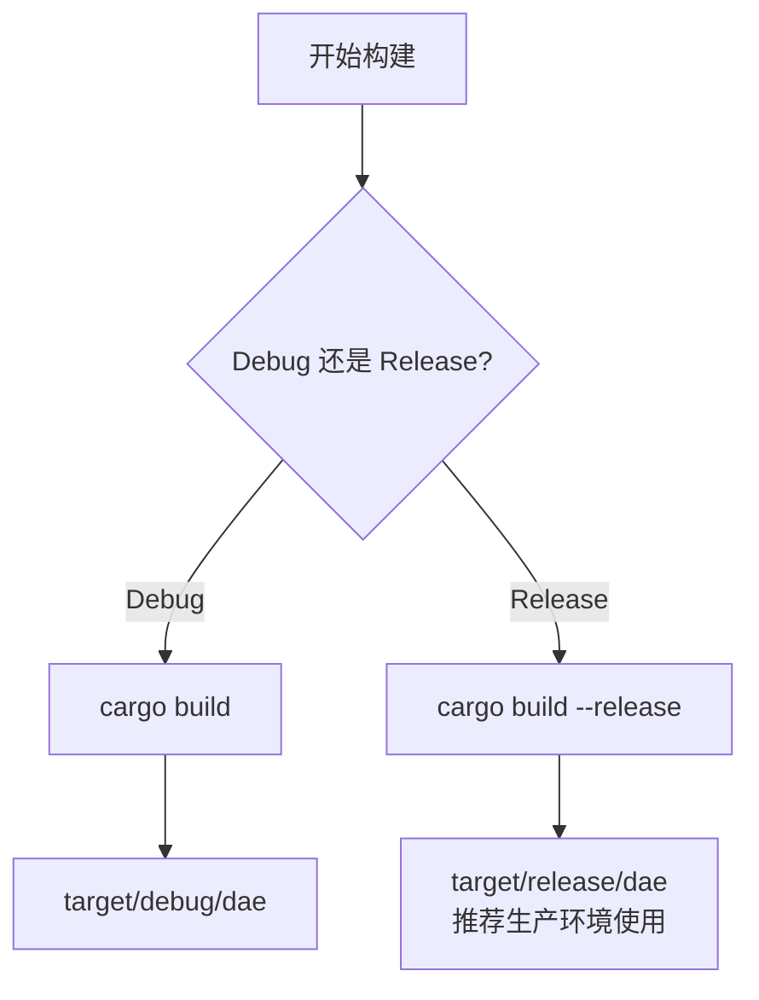

dae-rs 是一个基于 Rust 实现的高性能透明代理项目，支持 eBPF 内核级流量拦截。本指南将帮助初学者完成从环境准备到运行验证的完整安装流程。

---

## 系统要求

在开始安装之前，请确保您的系统满足以下要求。

### 硬件要求

| 组件 | 最低要求 | 推荐配置 |
|------|----------|----------|
| CPU | 1 核心 | 2+ 核心 |
| 内存 | 512MB | 1GB+ |
| 磁盘空间 | 500MB | 1GB+ |
| 网络 | 支持 TCP/UDP | 千兆网络 |

### 软件要求

dae-rs 主要面向 **Linux 系统**开发，以下是各平台的依赖要求：

| 依赖项 | 版本要求 | 说明 |
|--------|----------|------|
| **Rust** | 1.75+ | Rust 工具链编译器 |
| **clang** | 最新稳定版 | eBPF 程序编译支持 |
| **llvm** | 最新稳定版 | eBPF 目标代码生成 |
| **libelf-dev** | 最新稳定版 | eBPF 对象文件加载 |
| **linux-headers** | 与内核版本匹配 | 内核头文件 |

### 操作系统兼容性

```
✅ 完全支持
├── Ubuntu 20.04+
├── Debian 11+
├── CentOS 8+
├── Fedora 36+
└── Arch Linux

⚠️ 部分支持
├── macOS (仅 SOCKS5/HTTP 代理，无 eBPF)
└── Windows (WSL2 环境)
```

---

## 安装方式一：从源码构建

从源码构建是获取 dae-rs 最灵活的方式，适合需要定制化配置或参与开发的用户。

### 步骤 1：安装 Rust 工具链


使用官方 rustup 工具安装 Rust：

```bash
# 下载并执行安装脚本
curl --proto '=https' --tlsv1.2 -sSf https://sh.rustup.rs | sh

# 安装完成后，配置当前 shell 的环境变量
source ~/.cargo/env

# 验证安装
rustc --version
# 输出示例: rustc 1.88.0
```

> **提示**：如果您使用 Linux 包管理器安装 Rust（如 `apt install rustc cargo`），可能会获得较旧版本。建议优先使用 rustup 安装。

Sources: [Cargo.toml](Cargo.toml#L1-L5)

### 步骤 2：安装 eBPF 构建依赖

eBPF 模块需要特定的内核开发工具：

```bash
# Ubuntu / Debian
apt update
apt install -y clang llvm libelf-dev linux-headers-$(uname -r)

# CentOS / RHEL
yum install -y clang llvm-libelf-devel kernel-headers

# Arch Linux
pacman -S clang llvm linux-headers
```

### 步骤 3：克隆项目源码

```bash
# 使用 git 克隆仓库
git clone https://github.com/popo1221/dae-rs.git
cd dae-rs
```

Sources: [README.md](README.md#L45-L48)

### 步骤 4：编译项目



**Debug 构建**（适合开发调试）：

```bash
cargo build
# 构建产物位置: target/debug/dae
```

**Release 构建**（推荐生产环境使用）：

```bash
cargo build --release
# 构建产物位置: target/release/dae
```

Release 构建会自动应用以下优化：
- **LTO** (Link-Time Optimization)：链接时全程优化
- **CPU 特定优化**：使用 `-C target-cpu=native` 启用 CPU 特性
- **优化级别 3**：最高级别编译优化

Sources: [Cargo.toml](Cargo.toml#L28-L30), [README.md](README.md#L51-L58)

### 步骤 5：交叉编译（可选）

如需构建静态链接的二进制文件（适用于 Alpine Linux 等轻量级发行版）：

```bash
# 添加 musl 目标
rustup target add x86_64-unknown-linux-musl

# 构建静态链接版本
cargo build --release --target x86_64-unknown-linux-musl
```

Sources: [docs/INSTALL.md](docs/INSTALL.md#L51-L55)

---

## 安装方式二：Docker 部署

Docker 部署适合快速体验或生产环境的容器化运维。

### 前提条件

确保已安装 Docker Engine（建议 20.10+ 版本）：

```bash
# 验证 Docker 安装
docker --version
# Docker version 24.0.0
```

### 构建 Docker 镜像

```bash
# 在项目根目录执行
docker build -t dae-rs:latest .
```

Sources: [Dockerfile](Dockerfile#L1-L47)

### 运行容器


**基础运行命令**：

```bash
docker run -d \
  --name dae-rs \
  --cap-add NET_ADMIN \
  --network host \
  -v $(pwd)/config:/etc/dae:ro \
  dae-rs:latest
```

**完整配置示例**（带持久化存储）：

```bash
docker run -d \
  --name dae-rs \
  --restart unless-stopped \
  --cap-add NET_ADMIN \
  --cap-add SYS_ADMIN \
  --network host \
  --privileged \
  -v /path/to/your/config.toml:/etc/dae/config.toml:ro \
  -v dae-data:/var/lib/dae \
  -v dae-logs:/var/log/dae \
  -e RUST_LOG=info \
  dae-rs:latest
```

> **重要说明**：dae-rs 需要 `host` 网络模式和特权模式来访问 eBPF/XDP 功能，这是容器化部署的硬性要求。

Sources: [docker-compose.yml](docker-compose.yml#L1-L81)

### 使用 Docker Compose

项目提供了预配置的 `docker-compose.yml`，开箱即用：

```bash
# 启动服务
docker-compose up -d

# 查看日志
docker-compose logs -f dae

# 停止服务
docker-compose down
```

---

## 安装方式三：Kubernetes Helm 部署

对于大规模集群环境，可以使用 Helm Chart 进行 Kubernetes 部署。

### 前提条件

- Kubernetes 1.19+
- Helm 3.2+
- 集群节点支持 eBPF

### 添加 Helm 仓库

```bash
# 添加 Helm 仓库（如果已发布到 Helm Hub）
helm repo add dae-rs https://charts.example.com
helm repo update
```

### 安装 Chart

```bash
# 使用默认配置安装
helm install dae-rs ./charts/dae-rs

# 自定义配置安装
helm install dae-rs ./charts/dae-rs \
  --set dae.logLevel=debug \
  --set dae.interface=eth0
```

### 配置示例

```yaml
# values.yaml
image:
  repository: ghcr.io/popo1221/dae-rs
  tag: latest

dae:
  logLevel: info
  interface: ""

config:
  inline: |
    [proxy]
    socks5_listen = "0.0.0.0:1080"
    http_listen = "0.0.0.0:8080"

daemonset:
  replicas: 3

securityContext:
  runAsNonRoot: false
  runAsUser: 0

containerSecurityContext:
  privileged: true
  capabilities:
    add:
      - SYS_ADMIN
      - NET_ADMIN
      - SYS_RESOURCE
```

Sources: [charts/dae-rs/values.yaml](charts/dae-rs/values.yaml#L1-L200)

---

## 安装验证

无论使用哪种安装方式，都需要验证 dae-rs 是否正确安装。

### 验证二进制文件

```bash
# 查看版本信息
./target/release/dae --version

# 或使用 help 命令
./target/release/dae --help
```

CLI 支持以下命令：

| 命令 | 功能 | 示例 |
|------|------|------|
| `run` | 运行代理服务 | `dae run -c config.toml` |
| `validate` | 验证配置文件 | `dae validate -c config.toml` |
| `status` | 查看运行状态 | `dae status` |
| `reload` | 热重载配置 | `dae reload` |
| `shutdown` | 关闭服务 | `dae shutdown` |
| `test` | 测试节点连接 | `dae test --node "节点名"` |

Sources: [crates/dae-cli/src/main.rs](crates/dae-cli/src/main.rs#L1-L90)

### 验证配置文件

```bash
# 复制示例配置
cp config/config.example.toml config/config.toml

# 编辑配置文件，填入您的节点信息
vim config/config.toml

# 验证配置语法
./target/release/dae validate -c config/config.toml
```

配置验证成功的输出示例：

```
✓ Configuration 'config/config.toml' is valid
  Listen: 0.0.0.0:1080 (SOCKS5), 0.0.0.0:8080 (HTTP)
  eBPF: eth0 (enabled=false)
  Nodes: 1
```

Sources: [config/config.example.toml](config/config.example.toml#L1-L67)

---

## 初始配置

dae-rs 使用 TOML 格式的配置文件。以下是基本配置结构：

```toml
# 代理监听设置
[proxy]
socks5_listen = "0.0.0.0:1080"
http_listen = "0.0.0.0:8080"
tcp_timeout = 60
udp_timeout = 30
ebpf_enabled = false
ebpf_interface = "eth0"

# 透明代理设置（TUN 模式）
[transparent_proxy]
enabled = false
tun_interface = "dae0"
tun_ip = "10.0.0.1"
tun_netmask = "255.255.255.0"
mtu = 1500
auto_route = true
dns_hijack = ["8.8.8.8", "8.8.4.4"]
dns_upstream = ["8.8.8.8:53", "8.8.4.4:53"]

# 上游节点配置示例
[[nodes]]
name = "香港节点"
type = "trojan"
server = "your-server.com"
port = 443
trojan_password = "your-password"
tls = true
tls_server_name = "your-server.com"

# 日志设置
[logging]
level = "info"
file = "/var/log/dae-rs.log"
```

Sources: [config/config.example.toml](config/config.example.toml#L1-L67)

### 启动服务

```bash
# 前台运行（查看实时日志）
./target/release/dae run -c config/config.toml

# 后台守护进程运行
./target/release/dae run -c config/config.toml -d
```

---

## 常见问题排查

### 问题 1：构建失败，提示缺少 libclang

```bash
# Ubuntu/Debian
apt install libclang-dev

# 设置 libclang 路径
export LIBCLANG_PATH=/usr/lib/llvm-14/lib/
```

Sources: [docs/INSTALL.md](docs/INSTALL.md#L119-L125)

### 问题 2：eBPF 编译失败

```bash
# 检查内核是否支持 eBPF
cat /proc/sys/kernel/bpf_stats_enabled

# 加载必要的内核模块
modprobe bpf
modprobe xdp
```

Sources: [docs/INSTALL.md](docs/INSTALL.md#L126-L133)

### 问题 3：权限不足

dae-rs 运行透明代理需要 `CAP_NET_ADMIN` 权限：

```bash
# 方法一：使用 sudo 运行
sudo ./target/release/dae run -c config/config.toml

# 方法二：设置文件 capabilities（推荐）
sudo setcap cap_net_admin+ep ./target/release/dae
./target/release/dae run -c config/config.toml
```

Sources: [docs/INSTALL.md](docs/INSTALL.md#L134-L139)

### 问题 4：容器内 eBPF 无法工作

Docker 容器运行 eBPF 需要特殊配置：

```bash
# 必须使用 --privileged 和 --network host
docker run -d \
  --name dae-rs \
  --privileged \
  --network host \
  --cap-add NET_ADMIN \
  --cap-add SYS_ADMIN \
  dae-rs:latest
```

---

## 运行时优化（可选）

对于追求极致性能的用户，可以尝试以下内核级优化：

```bash
# 减少轮询延迟
echo 1 > /proc/sys/net/core/busy_read
echo 1 > /proc/sys/net/core/busy_poll

# 调整内核参数（需要 root）
sysctl -w net.core.rmem_max=2500000
sysctl -w net.core.wmem_max=2500000
```

Sources: [docs/INSTALL.md](docs/INSTALL.md#L140-L155)

---

## 下一步

安装完成后，建议继续阅读以下文档：

| 文档 | 内容 |
|------|------|
| [快速开始](2-kuai-su-kai-shi) | 基础使用教程和示例 |
| [配置参考手册](20-pei-zhi-can-kao-shou-ce) | 完整配置项说明 |
| [部署指南](22-bu-shu-zhi-nan) | 生产环境部署最佳实践 |
| [系统架构设计](4-xi-tong-jia-gou-she-ji) | 深入了解内部架构 |

---

## 项目结构总览

```
dae-rs/
├── target/                    # 编译输出目录
│   ├── debug/dae             # Debug 构建产物
│   └── release/dae           # Release 构建产物
├── crates/                    # 核心代码模块
│   ├── dae-cli/              # 命令行工具
│   ├── dae-config/           # 配置解析模块
│   ├── dae-core/             # 核心引擎
│   ├── dae-proxy/            # 代理协议实现
│   ├── dae-api/              # REST API 接口
│   └── dae-ebpf/             # eBPF 集成模块
├── config/                    # 配置文件目录
│   ├── config.example.toml   # 配置示例
│   └── config.toml           # 实际配置文件
├── charts/                    # Kubernetes Helm Chart
├── Dockerfile                # Docker 构建文件
└── docker-compose.yml        # Docker Compose 配置
```