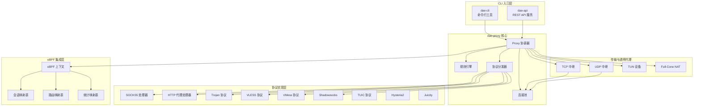
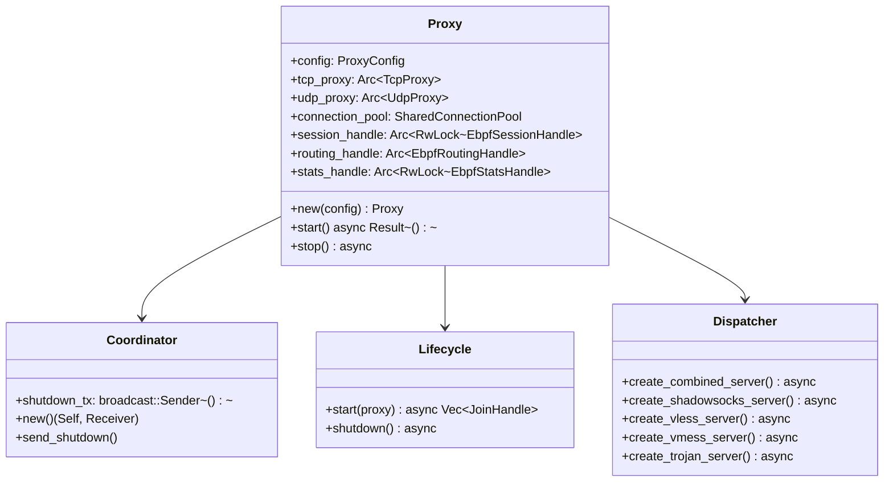
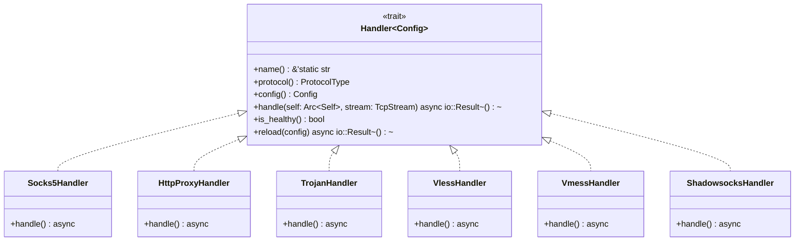
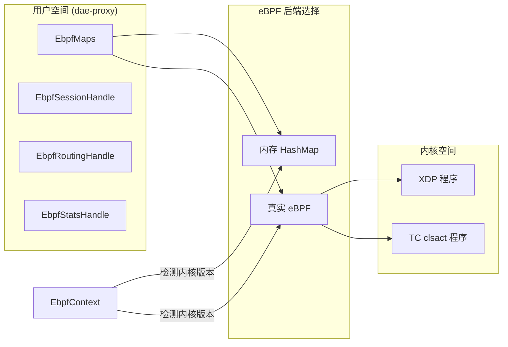
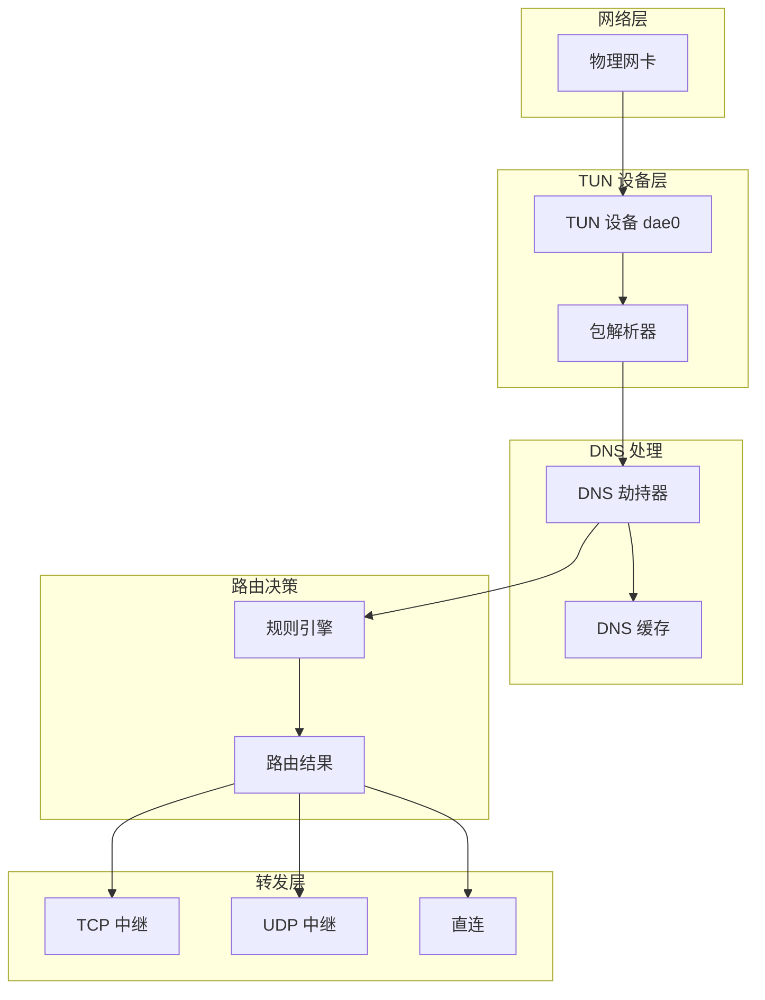
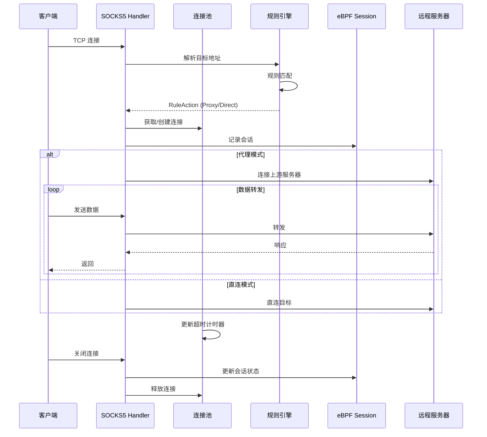
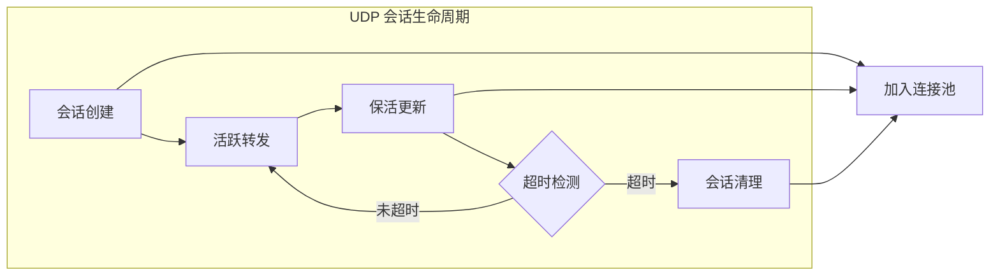

dae-rs 是一个高性能透明代理系统，采用模块化 Rust 架构设计，集成了 eBPF 技术实现内核级流量处理。本文档详细介绍 dae-rs 的整体架构设计、核心组件关系以及数据流设计。

## 一、整体架构概览

dae-rs 采用分层模块化设计，从上至下分为四个主要层次：**CLI 入口层**、**代理核心层**、**协议实现层** 和 **eBPF 集成层**。各层之间通过清晰的接口进行通信，确保系统的高内聚低耦合特性。



Sources: [ARCHITECTURE.md](ARCHITECTURE.md#L1-L50), [crates/dae-proxy/src/lib.rs](crates/dae-proxy/src/lib.rs#L1-L50)

## 二、Crate 结构设计

dae-rs 采用 Rust workspace 管理多 crate 项目，将功能模块化拆分以便独立测试和维护。

| Crate | 功能 | 代码行数 | 依赖关系 |
|-------|------|----------|----------|
| `dae-cli` | 命令行入口 | ~3,000 | dae-core, dae-proxy, dae-config |
| `dae-api` | REST API 服务 | ~1,500 | dae-proxy, dae-config |
| `dae-core` | 核心引擎基础 | ~500 | 无 |
| `dae-config` | 配置解析与验证 | ~2,000 | toml, serde |
| `dae-proxy` | 代理核心实现 | ~50,000 | dae-core, dae-config |
| `dae-ebpf-*` | eBPF 程序集合 | ~10,000 | aya, libc |

Sources: [Cargo.toml](Cargo.toml#L1-L15), [ARCHITECTURE.md](ARCHITECTURE.md#L340-L380)

### 2.1 dae-proxy 模块结构

`dae-proxy` 是系统的核心模块，包含约 90 个文件和 50,000 行代码。其内部组织结构如下：

```
crates/dae-proxy/src/
├── proxy/                    # 代理协调器
│   ├── coordinator.rs       # 关闭信号广播协调
│   ├── dispatcher.rs        # 协议服务器工厂
│   ├── lifecycle.rs         # 生命周期管理
│   └── mod.rs               # 主入口与配置
├── connection.rs             # 连接状态跟踪
├── connection_pool.rs        # 4-tuple 连接复用池
├── protocol_dispatcher.rs    # SOCKS5/HTTP 协议检测
├── tcp.rs                   # TCP 双向转发
├── udp.rs                   # UDP 会话管理
├── tun/                     # TUN 透明代理
│   ├── device.rs           # TUN 设备管理
│   ├── dns.rs              # DNS 劫持
│   ├── routing.rs          # IP 包路由
│   └── packet.rs           # 包解析器
├── nat/                     # NAT 实现
│   └── full_cone.rs        # Full-Cone NAT
├── protocol/                # 统一 Handler 抽象
│   ├── unified_handler.rs  # 核心 Handler trait
│   └── handler.rs          # 协议注册表
├── rules.rs                 # 规则定义
├── rule_engine/             # 规则匹配引擎
├── node/                    # 节点管理 (Zed 风格)
├── tracking/                # 连接追踪统计
├── ebpf_integration/        # eBPF 映射包装
├── socks5/                  # SOCKS5 协议
├── http_proxy/              # HTTP 代理
├── trojan_protocol/          # Trojan 协议
├── vless/                   # VLESS 协议
├── vmess/                   # VMess 协议
├── shadowsocks/             # Shadowsocks
├── hysteria2/               # Hysteria2
├── juicity/                # Juicity
├── tuic/                   # TUIC
├── metrics/                 # Prometheus 指标
└── control.rs              # 控制平面 API
```

Sources: [crates/dae-proxy/src/lib.rs](crates/dae-proxy/src/lib.rs#L50-L180), [get_dir_structure](crates/dae-proxy/src)

## 三、核心组件设计

### 3.1 Proxy 协调器

`Proxy` 是系统的核心协调器，负责初始化和管理所有子组件。它采用 Arc 共享所有权模式，允许各组件引用共享资源。



协调器的工作流程如下：首先在 `Proxy::new()` 中创建所有子组件，然后通过 `Proxy::start()` 启动所有服务，最后通过 `Coordinator` 广播关闭信号实现优雅关闭。

Sources: [crates/dae-proxy/src/proxy/mod.rs](crates/dae-proxy/src/proxy/mod.rs#L100-L250)

### 3.2 连接池管理

连接池是高性能代理的关键组件，dae-rs 采用 4-tuple（源 IP、目的 IP、源端口、目的端口）作为连接标识，支持 TCP 和 UDP 连接的复用。

```rust
pub struct ConnectionKey {
    pub src_ip: CompactIp,    // 紧凑型 IP 存储 (支持 IPv4/IPv6)
    pub dst_ip: CompactIp,
    pub src_port: u16,
    pub dst_port: u16,
    pub proto: u8,            // 6=TCP, 17=UDP
}
```

连接池的核心特性包括：**超时管理**（TCP 默认 60 秒超时）、**连接复用**（相同 4-tuple 复用现有连接）、**IPv6 全支持**（通过 `CompactIp` 类型）。连接池还与 eBPF 会话映射表保持同步，记录活跃连接状态。

Sources: [crates/dae-proxy/src/connection_pool.rs](crates/dae-proxy/src/connection_pool.rs#L1-L150)

### 3.3 规则引擎

规则引擎负责根据数据包的特性决定流量处理方式，支持多种规则类型和灵活的匹配策略。

| 规则类型 | 匹配方式 | 示例 |
|----------|----------|------|
| `Domain` | 精确域名 | `example.com` |
| `DomainSuffix` | 域名后缀 | `.cn`, `.google.com` |
| `DomainKeyword` | 域名关键词 | `google` |
| `IpCidr` | IP 地址段 | `192.168.0.0/16` |
| `GeoIp` | 地理IP | 国家代码 `CN`, `US` |
| `Process` | 进程名 | `chrome.exe` |
| `Mac` | MAC 地址 | `00:11:22:33:44:55` |

规则匹配后返回 `RuleAction`：**Pass**（直连）、**Proxy**（代理）、**Drop**（丢弃）。引擎支持 GeoIP 数据库查询和热重载配置。

Sources: [crates/dae-proxy/src/rule_engine/engine.rs](crates/dae-proxy/src/rule_engine/engine.rs#L1-L150)

### 3.4 协议分发器

`ProtocolDispatcher` 通过协议检测实现 SOCKS5 和 HTTP 代理的自动识别，无需用户手动选择协议。

```rust
pub enum DetectedProtocol {
    Socks5,       // 首字节为 0x05
    HttpConnect,  // "CONNECT " 开头
    HttpOther,    // GET/POST/PUT 等方法
    Unknown,
}
```

分发器通过 peek 读取连接首部 16 字节进行协议识别，支持在单个端口上同时提供 SOCKS5 和 HTTP 代理服务。

Sources: [crates/dae-proxy/src/protocol_dispatcher.rs](crates/dae-proxy/src/protocol_dispatcher.rs#L1-L100)

## 四、协议 Handler 架构

dae-rs 采用统一的 `Handler` trait 定义协议处理接口，参考 Zed 编辑器的架构风格。



这种设计确保所有协议实现遵循一致的接口规范，便于扩展新的协议支持。每个 Handler 实现都包含配置管理、连接处理和热重载能力。

Sources: [crates/dae-proxy/src/protocol/unified_handler.rs](crates/dae-proxy/src/protocol/unified_handler.rs#L1-L150)

## 五、eBPF 集成架构

eBPF 集成是 dae-rs 实现高性能透明代理的关键。通过 aya 库在用户空间管理 eBPF maps，同时支持内核态和用户态回退实现。

### 5.1 eBPF Map 类型

| Map 类型 | 用途 | aya 类型 | 大小配置 |
|----------|------|----------|----------|
| `SessionMap` | 5 元组连接跟踪 | `HashMap` | 65,536 |
| `RoutingMap` | CIDR 路由规则 | `LpmTrie` | 16,384 |
| `StatsMap` | 统计计数器 | `PerCpuArray` | 256 |

### 5.2 双后端设计



系统自动检测内核版本和 eBPF 支持级别：内核 ≥ 5.8 支持 XDP、≥ 5.10 支持 TC clsact、≥ 5.17 支持 ringbuf。当内核不支持 eBPF 时，自动回退到内存 HashMap 实现。

Sources: [crates/dae-proxy/src/ebpf_integration/mod.rs](crates/dae-proxy/src/ebpf_integration/mod.rs#L1-L100)

### 5.3 会话数据结构

```rust
#[repr(C)]
pub struct SessionKey {
    pub src_ip: u32,      // 网络字节序
    pub dst_ip: u32,
    pub src_port: u16,
    pub dst_port: u16,
    pub proto: u8,        // 6=TCP, 17=UDP
}

#[repr(C)]
pub struct SessionEntry {
    pub state: u8,        // 0=NEW, 1=ESTABLISHED, 2=CLOSED
    pub packets: u64,
    pub bytes: u64,
    pub start_time: u64,
    pub last_time: u64,
    pub route_id: u32,
    pub src_mac: [u8; 6],
}
```

Sources: [crates/dae-ebpf/dae-ebpf-common/src/session.rs](crates/dae-ebpf/dae-ebpf-common/src/session.rs#L1-L50)

## 六、TUN 透明代理架构

TUN 模块提供 IP 层的透明代理能力，拦截所有经过代理的网络流量。



TUN 模块支持 DNS 劫持（将特定 DNS 请求重定向到本地解析）、IP 包解析（IPv4/IPv6/TCP/UDP 头解析）、NAT 穿透（Full-Cone NAT 实现）。

Sources: [crates/dae-proxy/src/tun/mod.rs](crates/dae-proxy/src/tun/mod.rs#L1-L100)

## 七、设计模式应用

dae-rs 在架构设计中应用了多种经典设计模式，确保代码的可维护性和可扩展性。

### 7.1 行为型模式

| 模式 | 应用场景 |
|------|----------|
| **策略模式** | `SelectionPolicy`（Latency/RoundRobin/Random 节点选择策略） |
| **观察者模式** | `HotReload` 配置热重载通知 |
| **模板方法** | `RuleEngine::match_packet()` 规则匹配流程 |

### 7.2 结构型模式

| 模式 | 应用场景 |
|------|----------|
| **代理模式** | `ConnectionPool` 连接代理管理 |
| **装饰器模式** | `ProtocolHandlerAdapter` 包装现有 Handler |

### 7.3 创建型模式

| 模式 | 应用场景 |
|------|----------|
| **建造者模式** | `ProcessRuleSetBuilder` 规则构建 |
| **单例模式** | `METRICS_SERVER` 全局指标服务 |

Sources: [ARCHITECTURE.md](ARCHITECTURE.md#L400-L450)

## 八、节点管理 (Zed 风格)

dae-rs 参考 Zed 编辑器的架构模式，实现节点管理的抽象接口。

| Zed 命名 | dae-rs 应用 | 说明 |
|----------|-------------|------|
| `*Store` | `NodeStore` | 抽象接口定义 |
| `*Manager` | `NodeManager` | 生命周期管理 |
| `*Handle` | `NodeHandle` | 实体引用 |
| `*State` | `NodeState` | 不可变快照 |

```rust
// 节点选择策略
pub enum SelectionPolicy {
    Latency,       // 按延迟排序
    RoundRobin,     // 轮询
    Random,        // 随机
    Consistent,    // 一致性哈希
}
```

Sources: [crates/dae-proxy/src/node/mod.rs](crates/dae-proxy/src/node/mod.rs#L1-L60)

## 九、数据流设计

### 9.1 TCP 连接数据流



### 9.2 UDP 会话数据流

UDP 处理采用更复杂的会话管理机制，支持 NAT 穿透和连接复用：



Sources: [crates/dae-proxy/src/udp.rs](crates/dae-proxy/src/udp.rs#L1-L100)

## 十、依赖关系图

```
dae-cli
├── dae-core
│   └── (基础类型导出)
├── dae-proxy
│   ├── dae-core
│   ├── dae-config
│   ├── tokio (异步运行时)
│   ├── aya (eBPF 加载)
│   └── socket2 (高性能 socket)
└── dae-config
    ├── toml (配置解析)
    └── serde (序列化)

dae-proxy
├── connection (连接状态)
├── connection_pool (连接复用)
├── proxy (协调器)
├── tcp (TCP 中继)
├── udp (UDP 中继)
├── tun (透明代理)
├── nat (NAT 实现)
├── protocol (Handler 抽象)
│   ├── socks5/
│   ├── http_proxy/
│   ├── vless/
│   ├── vmess/
│   ├── trojan_protocol/
│   ├── shadowsocks/
│   ├── hysteria2/
│   ├── juicity/
│   └── tuic/
├── rule_engine (规则匹配)
├── ebpf_integration (eBPF 集成)
├── metrics (Prometheus)
└── control (控制平面)

dae-api
├── dae-proxy
└── axum (Web 框架)
```

Sources: [Cargo.toml](Cargo.toml#L1-L30)

## 十一、总结

dae-rs 的架构设计体现了现代高性能网络代理的核心原则：**模块化**确保各组件职责清晰、**异步化**充分利用多核性能、**eBPF 集成**实现内核级流量处理、**统一抽象**简化协议扩展。通过参考 Zed 编辑器的架构风格，代码组织更加规范和可维护。

建议后续阅读路径：[模块结构概览](5-mo-kuai-jie-gou-gai-lan) 深入了解各模块实现细节，或直接进入 [eBPF/XDP 集成](17-ebpf-xdp-ji-cheng) 了解高性能流量处理机制。