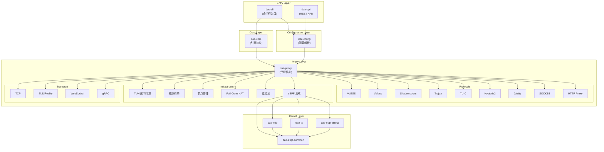
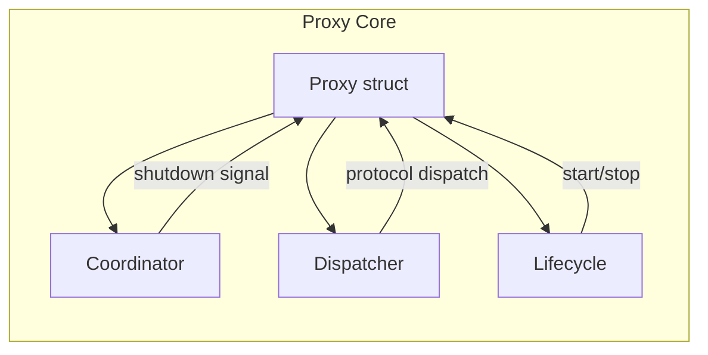
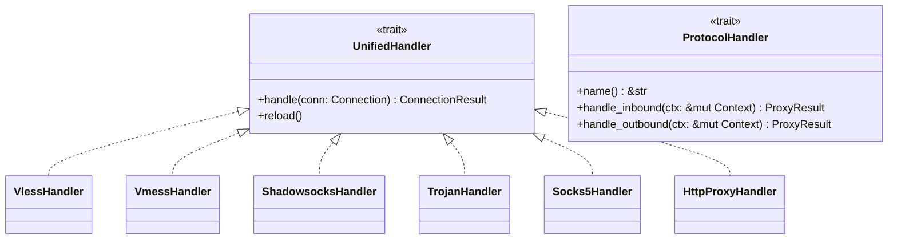
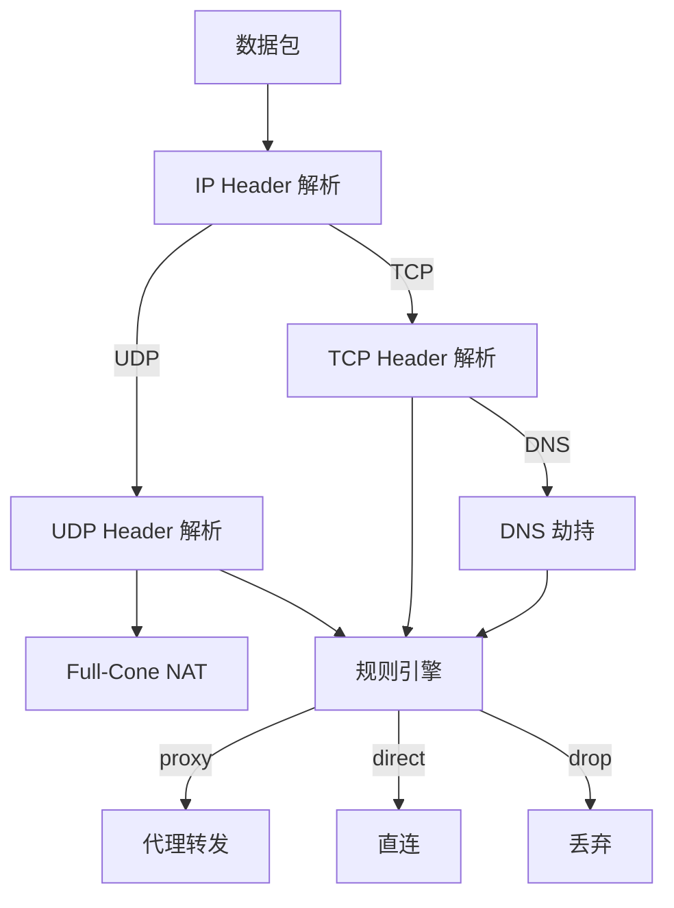
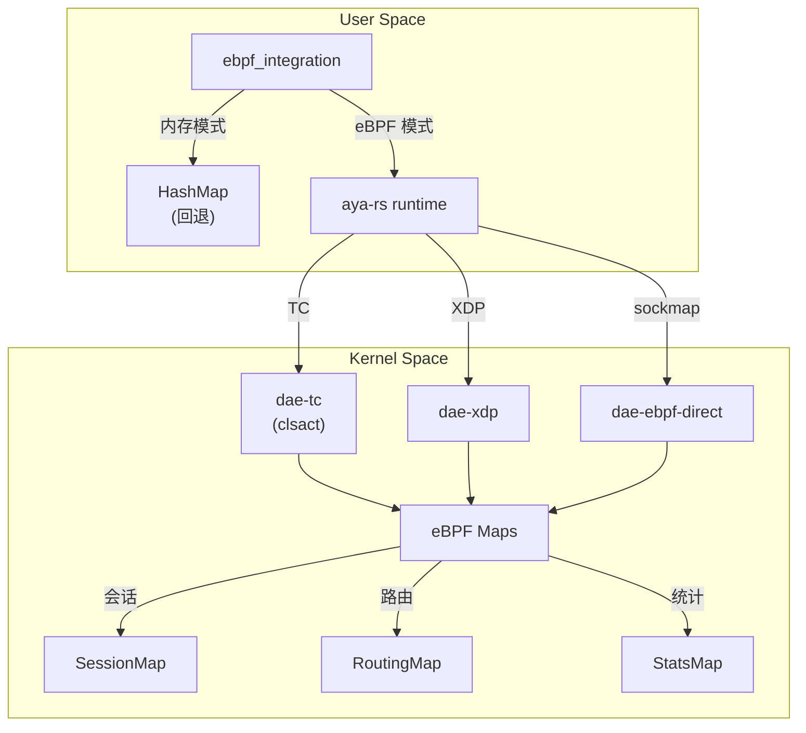
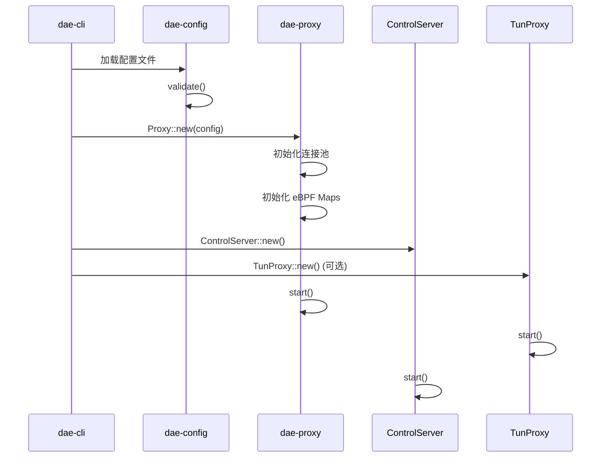
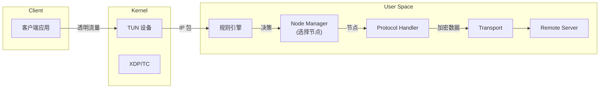

dae-rs 是一个采用 Rust 编写的**高性能透明代理解决方案**，其模块化架构将功能划分为独立的 crate，每个 crate 专注于特定职责领域。从架构层面看，项目采用分层设计：顶层为命令行入口和配置解析，中间层为用户空间代理核心，底层为 eBPF 内核模块。这种设计实现了零成本抽象、异步优先和内存安全三大核心理念。

Sources: [Cargo.toml](Cargo.toml#L1-L30)

## 整体架构图

以下 Mermaid 图展示了 dae-rs 的整体模块依赖关系：



## Workspace 成员结构

dae-rs 的 Rust Workspace 包含以下成员 crate，每个都有明确的职责边界：

| Crate | 路径 | 职责 | 关键类型 |
|-------|------|------|----------|
| `dae-cli` | `crates/dae-cli` | 命令行入口程序 | `main.rs` 入口 |
| `dae-api` | `crates/dae-api` | REST API 服务 | `ApiServer`, `AppState` |
| `dae-core` | `crates/dae-core` | 引擎抽象层 | `Engine` |
| `dae-config` | `crates/dae-config` | 配置解析与验证 | `Config`, `NodeConfig` |
| `dae-proxy` | `crates/dae-proxy` | 用户空间代理核心 | `Proxy`, `TcpProxy`, `UdpProxy` |
| `dae-ebpf-common` | `crates/dae-ebpf/dae-ebpf-common` | eBPF 共享类型 | `SessionEntry`, `RoutingEntry` |
| `dae-xdp` | `crates/dae-ebpf/dae-xdp` | XDP eBPF 程序 | aya-ebpf 程序 |
| `dae-tc` | `crates/dae-ebpf/dae-tc` | TC clsact eBPF 程序 | aya-ebpf 程序 |
| `dae-ebpf` | `crates/dae-ebpf/dae-ebpf` | eBPF 加载器 | `EbpfLoader` |
| `dae-ebpf-direct` | `crates/dae-ebpf/dae-ebpf-direct` | Sockmap 直通 | aya-ebpf 程序 |
| `benches` | `benches` | 性能基准测试 | `main_bench.rs` |

Sources: [Cargo.toml](Cargo.toml#L1-L30)

## dae-proxy 核心模块详解

`dae-proxy` 是项目的核心 crate，包含了所有代理逻辑的实现。其模块结构如下：

### 代理核心 (proxy/)

`proxy/` 模块是 dae-proxy 的核心入口，负责协调所有子系统的生命周期：



**关键组件**：

- `Proxy`: 主代理结构，整合 TCP/UDP 代理、协议服务器、连接池和 eBPF 句柄
- `Coordinator`: 协调关闭信号，管理系统优雅退出
- `Dispatcher`: 协议分发器，自动检测入站连接类型并路由到对应 Handler
- `Lifecycle`: 生命周期管理，处理启动和停止逻辑

Sources: [crates/dae-proxy/src/proxy/mod.rs](crates/dae-proxy/src/proxy/mod.rs#L1-L200)

### 协议层 (protocol/)

协议层实现了所有支持的代理协议，采用 Handler trait 模式：



**支持的协议**：

| 协议 | 模块 | 特性 |
|------|------|------|
| VLESS | `vless/` | XTLS Reality 支持 |
| VMess | `vmess/` | AEAD 加密 |
| Shadowsocks | `shadowsocks/` | SSR 兼容 |
| Trojan | `trojan_protocol/` | TLS 传输 |
| TUIC | `tuic/` | QUIC 协议 |
| Hysteria2 | `hysteria2/` | 拥塞控制 |
| Juicity | `juicity/` | 自定义 QUIC |
| SOCKS5 | `socks5/` | RFC 1928 |
| HTTP | `http_proxy/` | CONNECT 隧道 |

Sources: [crates/dae-proxy/src/protocol/mod.rs](crates/dae-proxy/src/protocol/mod.rs#L1-L179)

### 规则引擎 (rule_engine/, rules/)

规则引擎负责根据数据包属性做出路由决策：

**PacketInfo** 包含所有用于匹配的元数据：

```rust
pub struct PacketInfo {
    pub source_ip: IpAddr,
    pub destination_ip: IpAddr,
    pub src_port: u16,
    pub dst_port: u16,
    pub protocol: u8,                    // 6=TCP, 17=UDP
    pub destination_domain: Option<String>,
    pub geoip_country: Option<String>,
    pub process_name: Option<String>,
    pub dns_query_type: Option<u16>,
    pub node_tag: Option<String>,        // 节点标签
    // ... 更多字段
}
```

**规则类型**：

| 类型 | 模块 | 匹配算法 |
|------|------|----------|
| `domain` | `rules/domain.rs` | 精确匹配 O(1) |
| `domain-suffix` | `rules/domain.rs` | 基数树 O(log n) |
| `domain-keyword` | `rules/domain.rs` | 子串搜索 O(n) |
| `ipcidr` | `rules/ip.rs` | 最长前缀匹配 O(log n) |
| `geoip` | `rules/ip.rs` | 位图查找 O(1) |
| `process` | `rules/process.rs` | 哈希集合 O(1) |
| `dnstype` | `rules/dns.rs` | 精确匹配 O(1) |
| `capability` | `rules/capability.rs` | 节点能力匹配 |

Sources: [crates/dae-proxy/src/rule_engine/mod.rs](crates/dae-proxy/src/rule_engine/mod.rs#L1-L100)
Sources: [crates/dae-proxy/src/rules/mod.rs](crates/dae-proxy/src/rules/mod.rs#L1-L31)

### 节点管理 (node/)

节点管理模块采用 **Zed Store 模式**，提供抽象接口和具体实现：

```
┌─────────────────────────────────────────┐
│         NodeStore Trait (抽象)           │
│  - select_node() -> NodeHandle          │
│  - add_node() / remove_node()           │
│  - health_check()                        │
└────────────────────┬────────────────────┘
                     │ implements
                     ▼
┌─────────────────────────────────────────┐
│      NodeManager (具体实现)              │
│  - 生命周期管理                           │
│  - 健康检查 (LatencyMonitor)             │
│  - 节点选择策略                          │
└─────────────────────────────────────────┘
```

**选择策略**：

| 策略 | 说明 | 适用场景 |
|------|------|----------|
| `Latency` | 最低延迟优先 | 实时应用 |
| `RoundRobin` | 轮询选择 | 负载均衡 |
| `Random` | 随机选择 | 测试环境 |

Sources: [crates/dae-proxy/src/node/mod.rs](crates/dae-proxy/src/node/mod.rs#L1-L63)

### 连接管理 (connection_pool.rs)

连接池采用 4-tuple 作为连接键，支持连接复用：

```rust
pub struct ConnectionKey {
    pub src_ip: CompactIp,      // 源 IP (IPv6 支持)
    pub dst_ip: CompactIp,      // 目标 IP
    pub src_port: u16,          // 源端口
    pub dst_port: u16,          // 目标端口
    pub protocol: IpProtocol,   // TCP/UDP
}
```

**CompactIp** 采用高效存储格式：`[version: u8][address: 16 bytes]`，IPv4 映射到 IPv6 格式存储。

Sources: [crates/dae-proxy/src/connection_pool.rs](crates/dae-proxy/src/connection_pool.rs#L1-L100)

### 传输层 (transport/)

传输层抽象了底层网络协议，支持多种传输方式：

```rust
#[async_trait]
pub trait Transport: Send + Sync + Debug {
    async fn dial(&self, addr: &str) -> std::io::Result<TcpStream>;
    async fn listen(&self, addr: &str) -> std::io::Result<tokio::net::TcpListener>;
    fn supports_udp(&self) -> bool { false }
}
```

| 传输方式 | 模块 | 说明 |
|----------|------|------|
| TCP | `transport/tcp.rs` | 明文 TCP |
| TLS | `transport/tls.rs` | TLS 及 Reality |
| WebSocket | `transport/ws.rs` | WebSocket 传输 |
| gRPC | `transport/grpc.rs` | gRPC 隧道 |
| HTTP Upgrade | `transport/httpupgrade.rs` | HTTP 升级协议 |
| Meek | `transport/meek.rs` | 混淆传输 |

Sources: [crates/dae-proxy/src/transport/mod.rs](crates/dae-proxy/src/transport/mod.rs#L1-L53)

### TUN 透明代理 (tun/)

TUN 模块实现 IP 级别的透明代理，截获并路由所有网络流量：



**子模块**：

- `device.rs`: TUN 设备封装 (使用 tokio-tun)
- `tcp.rs`: TCP 会话状态机
- `udp.rs`: UDP 会话管理
- `dns.rs`: DNS 劫持和分流
- `packet.rs`: IP/TCP/UDP 包解析

Sources: [crates/dae-proxy/src/tun/mod.rs](crates/dae-proxy/src/tun/mod.rs#L1-L100)

### eBPF 集成 (ebpf_integration/)

eBPF 集成模块提供了两种后端：内存哈希表（开发/回退）和真实 aya eBPF（生产）：



**Map 类型**：

| Map | 用途 | aya 类型 |
|-----|------|----------|
| `SessionMap` | 5 元组连接跟踪 | `HashMap` |
| `RoutingMap` | CIDR 路由规则 | `LpmTrie` |
| `StatsMap` | 每 CPU 统计 | `PerCpuArray` |

Sources: [crates/dae-proxy/src/ebpf_integration/mod.rs](crates/dae-proxy/src/ebpf_integration/mod.rs#L1-L100)

### 其他重要模块

| 模块 | 路径 | 职责 |
|------|------|------|
| `control.rs` | `control.rs` | Unix Domain Socket 控制接口 |
| `logging.rs` | `logging.rs` | 日志收集服务 |
| `dns/` | `dns/` | DNS 缓存和解析 |
| `nat/` | `nat/` | Full-Cone NAT 实现 |
| `mac/` | `mac/` | MAC 地址规则 (OUI) |
| `tracking/` | `tracking/` | 连接追踪 |
| `metrics/` | `metrics/` | Prometheus 指标导出 |

## eBPF 内核模块

`crates/dae-ebpf/` 目录包含所有 eBPF 相关模块：

### dae-ebpf-common

共享类型定义，无 `#![no_std]`，供用户态和内核态共同使用：

```rust
pub use config::{ConfigEntry, GLOBAL_CONFIG_KEY};
pub use dns::{DnsMapEntry, MAX_DOMAIN_LEN};
pub use routing::{action, RoutingEntry};
pub use session::{state, SessionEntry, SessionKey};
pub use stats::{idx, StatsEntry};
```

Sources: [crates/dae-ebpf/dae-ebpf-common/src/lib.rs](crates/dae-ebpf/dae-ebpf-common/src/lib.rs#L1-L28)

### eBPF 程序类型

| 程序 | 路径 | 钩子点 | 性能 | 兼容性 |
|------|------|--------|------|--------|
| `dae-xdp` | `dae-xdp/` | XDP | 最高 | 需驱动支持 |
| `dae-tc` | `dae-tc/` | TC clsact | 高 | 广泛支持 |
| `dae-ebpf-direct` | `dae-ebpf-direct/` | Sockmap | 中 | 特定场景 |

Sources: [EBPF_MAP_DESIGN.md](EBPF_MAP_DESIGN.md#L1-L50)

## 命令行入口 (dae-cli)

`dae-cli` 是用户的直接入口，提供简化的命令接口：

```rust
enum Commands {
    Run { config, daemon, pid_file, control_socket },
    Status { socket },
    Reload { socket },
    Test { node, socket },
    Shutdown { socket },
    Validate { config },
}
```

**启动流程**：



Sources: [crates/dae-cli/src/main.rs](crates/dae-cli/src/main.rs#L1-L100)

## 数据流向

完整的请求处理流程：



## 关键设计模式

### 1. Handler Trait 模式

所有协议实现统一的 `Handler` trait：

```rust
#[async_trait]
pub trait Handler: Send + Sync {
    async fn handle(&self, conn: Connection) -> ConnectionResult;
}
```

Sources: [crates/dae-proxy/src/protocol/unified_handler.rs](crates/dae-proxy/src/protocol/unified_handler.rs#L1-L50)

### 2. Store 模式 (Zed 风格)

节点管理采用 Store 接口抽象：

```rust
pub trait NodeStore: Send + Sync {
    async fn select_node(&self, packet: &PacketInfo) -> Option<NodeHandle>;
    async fn add_node(&self, node: Node) -> NodeResult<NodeId>;
    async fn remove_node(&self, id: &NodeId) -> NodeResult<()>;
}
```

Sources: [crates/dae-proxy/src/node/store.rs](crates/dae-proxy/src/node/store.rs#L1-L50)

### 3. In-Memory Stub 模式

eBPF 部分为最小化代码，通过用户态 stub 通信：

```rust
pub struct EbpfSessionHandle {
    maps: EbpfMaps,
}

impl EbpfSessionHandle {
    pub async fn get_session(&self, key: &SessionKey) -> Option<SessionEntry>;
    pub async fn update_session(&self, key: &SessionKey, entry: &SessionEntry);
}
```

Sources: [docs/ARCHITECTURE.md](docs/ARCHITECTURE.md#L140-L160)

## 总结

dae-rs 的模块结构体现了以下设计原则：

1. **单一职责**：每个 crate 和模块都有明确的职责边界
2. **依赖倒置**：核心逻辑通过 trait 接口抽象，不依赖具体实现
3. **零成本抽象**：使用 Rust 的泛型和 trait，无额外运行时开销
4. **可测试性**：模块化设计便于单元测试和集成测试
5. **可扩展性**：Handler trait 模式便于添加新协议支持

对于进一步学习，建议按以下顺序阅读：

1. 从 [dae-cli 入口](crates/dae-cli/src/main.rs#L1-L100) 了解启动流程
2. 阅读 [dae-proxy 核心模块](crates/dae-proxy/src/proxy/mod.rs#L1-L200) 理解代理架构
3. 深入 [规则引擎实现](crates/dae-proxy/src/rule_engine/mod.rs) 理解流量路由
4. 探索 [eBPF 集成](crates/dae-proxy/src/ebpf_integration/mod.rs) 了解内核协作

---

**相关内容**：

- [系统架构设计](4-xi-tong-jia-gou-she-ji) — 深入了解整体架构决策
- [配置参考手册](20-pei-zhi-can-kao-shou-ce) — 配置项详解
- [eBPF/XDP 集成](17-ebpf-xdp-ji-cheng) — eBPF 内核模块详解