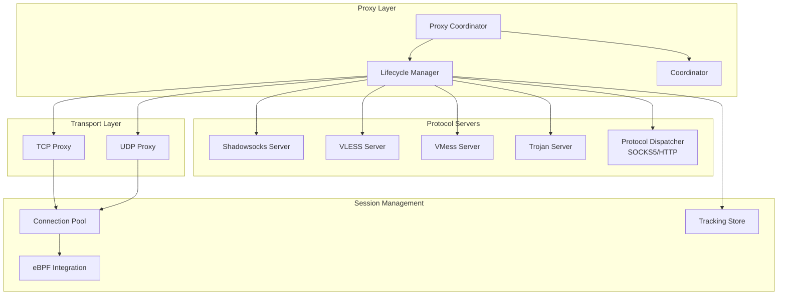
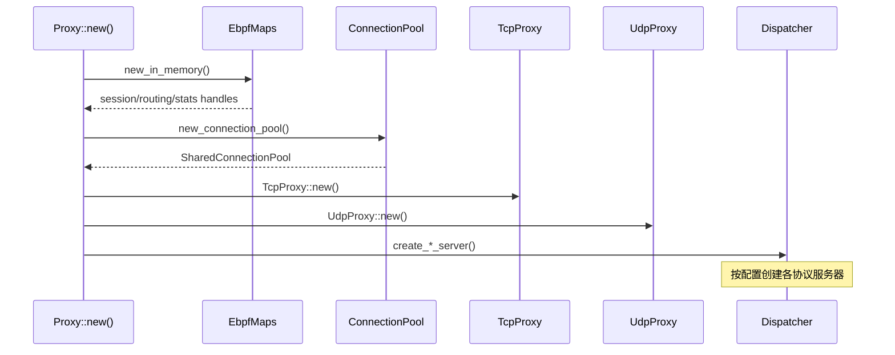
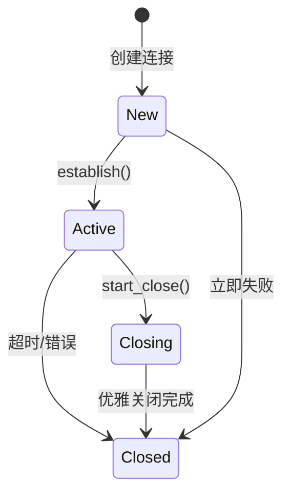
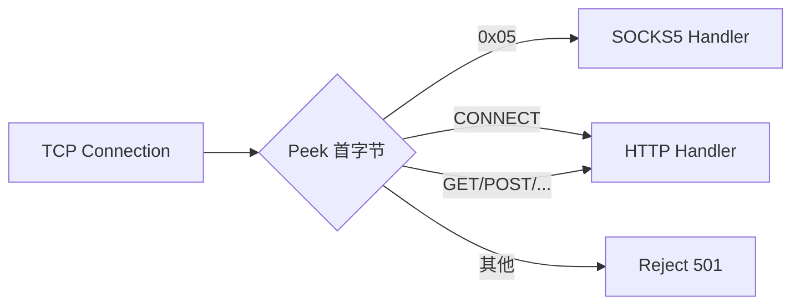
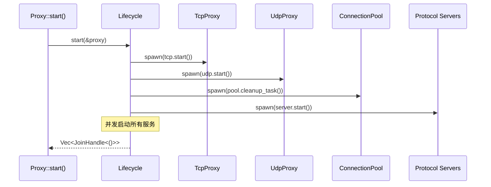

dae-rs 的代理核心是整个系统的中枢组件，负责协调 TCP/UDP 代理流量、eBPF Maps 会话跟踪、连接池管理以及多协议处理器的分发。本文档深入剖析 `dae-proxy` crate 的架构设计、核心组件交互以及关键实现细节。

## 架构概览

### 系统组件关系

代理核心采用分层架构设计，从下至上依次为：eBPF Maps 层提供会话跟踪能力、连接池层管理连接复用、协议处理层支持多种代理协议、生命周期管理层协调服务启停。



### 初始化流程

当调用 `Proxy::new(config)` 时，系统按顺序完成以下初始化步骤：



Sources: [proxy/mod.rs](crates/dae-proxy/src/proxy/mod.rs#L123-L150)

## 核心组件详解

### Proxy 结构体

`Proxy` 是代理核心的主入口点，采用 `Arc` 共享所有子组件：

```rust
pub struct Proxy {
    config: ProxyConfig,
    tcp_proxy: Arc<TcpProxy>,
    udp_proxy: Arc<UdpProxy>,
    connection_pool: SharedConnectionPool,
    session_handle: Arc<RwLock<EbpfSessionHandle>>,
    routing_handle: Arc<EbpfRoutingHandle>,
    stats_handle: Arc<RwLock<EbpfStatsHandle>>,
    running: RwLock<bool>,
    combined_server: Option<Arc<CombinedProxyServer>>,
    shadowsocks_server: Option<Arc<ShadowsocksServer>>,
    vless_server: Option<Arc<VlessServer>>,
    vmess_server: Option<Arc<VmessServer>>,
    trojan_server: Option<Arc<TrojanServer>>,
    tracking_store: Option<Arc<TrackingStore>>,
    coordinator: Coordinator,
    lifecycle: Arc<Lifecycle>,
}
```

各字段职责明确区分：配置层存储所有可配置参数、传输层管理 TCP/UDP 流量、会话层与 eBPF 集成提供透明代理能力、协议层支持多种入站协议、协同层处理生命周期与关闭信号。

Sources: [proxy/mod.rs](crates/dae-proxy/src/proxy/mod.rs#L117-L134)

### Proxy 配置结构

```rust
pub struct ProxyConfig {
    pub tcp: TcpProxyConfig,
    pub udp: UdpProxyConfig,
    pub ebpf: EbpfConfig,
    pub pool: ConnectionPoolConfig,
    pub xdp_object: PathBuf,
    pub xdp_interface: String,
    pub tracking: TrackingConfig,
    pub socks5_listen: Option<SocketAddr>,
    pub http_listen: Option<SocketAddr>,
    pub ss_listen: Option<SocketAddr>,
    pub ss_server: Option< SsServerConfig>,
    pub vless_listen: Option<SocketAddr>,
    pub vless_server: Option<VlessServerConfig>,
    // ... 更多协议配置
}
```

配置采用可选类型设计，每种协议服务器只有在同时指定监听地址和服务器配置时才启动。这种设计允许用户按需启用任意协议组合。

Sources: [proxy/mod.rs](crates/dae-proxy/src/proxy/mod.rs#L36-L77)

## 连接池管理

连接池是高性能代理的核心优化点，通过 4 元组（源IP、源端口、目标IP、目标端口、协议）复用已建立的连接，避免频繁创建 TCP 握手的开销。

### ConnectionKey 设计

```rust
#[derive(Clone, Copy, Debug, PartialEq, Eq)]
pub struct ConnectionKey {
    pub src_ip: CompactIp,  // 紧凑型IP存储
    pub dst_ip: CompactIp,
    pub src_port: u16,
    pub dst_port: u16,
    pub proto: u8,           // 6=TCP, 17=UDP
}
```

`CompactIp` 类型统一存储 IPv4 和 IPv6 地址：

```rust
pub struct CompactIp(u128);

impl CompactIp {
    // 版本4: [version:4bits][IPv4:32bits][padding:92bits]
    // 版本6: [version:4bits][IPv6:128bits]
    pub fn from_ipv4(ip: Ipv4Addr) -> Self {
        let bits = u128::from(u32::from_be_bytes(ip.octets()));
        Self((4u128 << 124) | bits)
    }
    
    pub fn from_ipv6(ip: Ipv6Addr) -> Self {
        let bytes = ip.octets();
        let bits = u128::from_be_bytes(bytes);
        Self((6u128 << 124) | bits)
    }
}
```

Sources: [connection_pool.rs](crates/dae-proxy/src/connection_pool.rs#L22-L90)

### 连接状态机



连接状态定义于 `ConnectionState` 枚举：

```rust
pub enum ConnectionState {
    #[default]
    New,      // 新建，未建立
    Active,   // 活跃，传输数据
    Closing,  // 优雅关闭中
    Closed,   // 已关闭
}
```

Sources: [connection.rs](crates/dae-proxy/src/connection.rs#L8-L23)

### 连接池操作

```rust
impl ConnectionPool {
    pub async fn get_or_create(&self, key: ConnectionKey) -> (SharedConnection, bool) {
        // 尝试获取现有连接
        if let Some(conn) = self.connections.read().await.get(&key) {
            return (conn.clone(), false);
        }
        // 创建新连接
        let conn = new_connection(/* ... */);
        self.connections.write().await.insert(key, conn.clone());
        (conn, true)
    }
    
    pub async fn cleanup_expired(&self) -> usize {
        // 遍历并移除超时连接
    }
    
    pub async fn close_all(&self) {
        // 关闭所有连接
    }
}
```

Sources: [connection_pool.rs](crates/dae-proxy/src/connection_pool.rs#L180-L280)

## TCP 代理实现

TCP 代理负责监听入站连接、建立到远程目标的连接、在客户端与远程之间双向转发数据。

### 监听器创建

```rust
pub async fn create_listener(addr: SocketAddr) -> std::io::Result<TcpListener> {
    let socket = Socket::new(Domain::IPV4, Type::STREAM, None)?;
    socket.set_reuse_address(true)?;
    socket.set_nodelay(true)?;        // 禁用 Nagle 算法
    socket.set_keepalive(true)?;
    socket.bind(&addr.into())?;
    socket.listen(128)?;
    
    let std_listener: std::net::TcpListener = socket.into();
    std_listener.set_nonblocking(true)?;
    TcpListener::from_std(std_listener)
}
```

使用 `socket2` 库直接配置 socket 选项，获得比标准库更精细的控制能力。

Sources: [tcp.rs](crates/dae-proxy/src/tcp.rs#L50-L65)

### 双向流量转发

TCP 流量转发采用 `tokio::io::split` 将读写分离，然后并发执行双向拷贝：

```rust
async fn relay_connection(
    client: TcpStream,
    remote: TcpStream,
    connection: SharedConnection,
    timeout_duration: Duration,
    key: ConnectionKey,
) -> std::io::Result<()> {
    let (mut cr, mut cw) = tokio::io::split(client);
    let (mut rr, mut rw) = tokio::io::split(remote);
    
    let (tx1, mut rx1) = tokio::sync::mpsc::channel(2);
    let tx2 = tx1.clone();
    
    // 并发执行两个方向的拷贝
    let copy1 = tokio::spawn(async move {
        tokio::io::copy(&mut cr, &mut rw).await?;
        Ok(())
    });
    
    let copy2 = tokio::spawn(async move {
        tokio::io::copy(&mut rr, &mut cw).await?;
        Ok(())
    });
    
    // 等待任一方向完成或超时
    tokio::select! {
        result = rx1.recv() => result.unwrap_or(Ok(())),
        _ = tokio::time::sleep(timeout_duration) => Err(Timeout),
    }
}
```

Sources: [tcp.rs](crates/dae-proxy/src/tcp.rs#L180-L230)

## 协议处理系统

### 统一 Handler 接口

项目采用统一的 `Handler` trait 作为所有协议处理器的标准接口：

```rust
#[async_trait]
pub trait Handler: Send + Sync {
    type Config: HandlerConfig;
    
    fn name(&self) -> &'static str;
    fn protocol(&self) -> ProtocolType;
    fn config(&self) -> &Self::Config;
    
    async fn handle(self: Arc<Self>, stream: TcpStream) -> std::io::Result<()>;
    
    fn is_healthy(&self) -> bool { true }
    async fn reload(&self, _new_config: Self::Config) -> std::io::Result<()> { Ok(()) }
}
```

`Arc<Self>` 模式确保异步处理期间 handler 保持有效生命周期，同时允许同一 handler 处理多个并发连接。

Sources: [protocol/unified_handler.rs](crates/dae-proxy/src/protocol/unified_handler.rs#L40-L70)

### 协议类型枚举

```rust
pub enum ProtocolType {
    Socks4,
    Socks5,
    Http,
    Shadowsocks,
    Vless,
    Vmess,
    Trojan,
    Tuic,
    Juicity,
    Hysteria2,
}
```

每种协议类型对应独立的处理器实现，从 `crates/dae-proxy/src/` 目录下的独立模块可见一斑：

Sources: [protocol/mod.rs](crates/dae-proxy/src/protocol/mod.rs#L26-L48)

### 协议分发器

`ProtocolDispatcher` 根据连接首字节自动检测并路由到对应处理器：



检测逻辑：

```rust
impl DetectedProtocol {
    pub fn detect(first_bytes: &[u8]) -> Self {
        match first_bytes[0] {
            0x05 => DetectedProtocol::Socks5,
            b'A'..=b'Z' => {
                let first_str = String::from_utf8_lossy(first_bytes);
                if first_str.starts_with("CONNECT ") {
                    DetectedProtocol::HttpConnect
                } else if first_str.starts_with("GET ") || first_str.starts_with("POST ") {
                    DetectedProtocol::HttpOther
                } else {
                    DetectedProtocol::Unknown
                }
            }
            _ => DetectedProtocol::Unknown,
        }
    }
}
```

Sources: [protocol_dispatcher.rs](crates/dae-proxy/src/protocol_dispatcher.rs#L20-L50)

## 请求上下文

`Context` 结构体贯穿整个请求处理流程，携带关键元数据：

```rust
pub struct Context {
    pub request_id: u64,           // 请求唯一ID，用于追踪
    pub source: SocketAddr,        // 源地址
    pub destination: SocketAddr,   // 目标地址
    pub rule_action: RuleAction,  // 规则匹配结果
    pub node_id: Option<NodeId>,   // 指定节点（可选）
    pub direct: bool,              // 是否直连
    pub process_name: Option<String>,
    pub process_pid: Option<u32>,
}
```

Context 初始化时通过原子计数器生成唯一请求 ID：

```rust
static REQUEST_ID_COUNTER: AtomicU64 = AtomicU64::new(1);

fn generate_request_id() -> u64 {
    REQUEST_ID_COUNTER.fetch_add(1, Ordering::Relaxed)
}
```

Sources: [core/context.rs](crates/dae-proxy/src/core/context.rs#L1-L50)

## 生命周期管理

### 服务启动



Sources: [proxy/lifecycle.rs](crates/dae-proxy/src/proxy/lifecycle.rs#L25-L60)

### 优雅关闭

关闭流程确保所有连接完成当前请求后再释放资源：

```rust
pub async fn shutdown(
    self: &Arc<Self>,
    proxy: &Arc<Proxy>,
    coordinator: &Coordinator,
    handles: Vec<JoinHandle<()>>,
) {
    // 1. 广播关闭信号
    coordinator.send_shutdown();
    
    // 2. 关闭所有连接
    proxy.connection_pool.close_all().await;
    
    // 3. 中止运行中的任务
    for handle in handles {
        handle.abort();
    }
}
```

Sources: [proxy/lifecycle.rs](crates/dae-proxy/src/proxy/lifecycle.rs#L195-L220)

## 错误处理

### 统一错误类型

```rust
#[derive(Error, Debug)]
pub enum ProxyError {
    #[error("connect failed: {0}")]
    Connect(#[from] std::io::Error),
    
    #[error("authentication failed: {0}")]
    Auth(String),
    
    #[error("protocol error: {0}")]
    Protocol(String),
    
    #[error("dispatch error: {0}")]
    Dispatch(String),
    
    #[error("configuration error: {0}")]
    Config(String),
}
```

使用 `thiserror` 派生 `Error` trait，实现 `?` 操作符自动转换。

Sources: [core/error.rs](crates/dae-proxy/src/core/error.rs#L1-L30)

### eBPF 错误处理

```rust
pub enum EbpfError {
    MapNotFound(String),
    KeyNotFound(String),
    UpdateFailed(String),
    LookupFailed(String),
    PermissionDenied(String),
    EbpfNotAvailable(String),
    KernelNotSupported(String),
}
```

eBPF 操作失败时自动 fallback 到内存实现，确保服务不中断运行。

Sources: [ebpf_integration/mod.rs](crates/dae-proxy/src/ebpf_integration/mod.rs#L30-L55)

## 配置热重载

`HotReload` 模块监听配置文件变更，实现规则动态更新：

```rust
pub struct HotReload {
    config_path: PathBuf,
    watcher: RecommendedWatcher,
    debounce_duration: Duration,  // 防抖时长，默认 500ms
}

impl HotReload {
    pub fn new(config_path: impl Into<PathBuf>) 
        -> std::result::Result<Self, HotReloadError>;
    
    pub fn start<F>(&mut self, on_reload: F)
    where F: Fn(Config) + Send + 'static;
}
```

热重载流程：
1. 监听文件系统变更事件
2. 防抖过滤（避免短时间内多次触发）
3. 解析新配置文件
4. 回调通知上层应用

Sources: [config/hot_reload.rs](crates/dae-proxy/src/config/hot_reload.rs#L70-L120)

## 性能优化要点

| 优化项 | 实现方式 | 效果 |
|--------|----------|------|
| 连接复用 | 4元组 HashMap | 减少 TCP 握手开销 |
| Socket 配置 | set_nodelay, set_keepalive | 降低延迟，提升可靠性 |
| 并发转发 | tokio::io::split + join | 最大化吞吐量 |
| 紧凑 IP 存储 | CompactIp u128 | 减少 HashMap 内存占用 |
| Arc 共享 | 所有子组件 Arc 化 | 避免克隆开销 |

Sources: [tcp.rs](crates/dae-proxy/src/tcp.rs#L50-L65), [connection_pool.rs](crates/dae-proxy/src/connection_pool.rs#L22-L60)

## 总结

代理核心通过分层解耦、Actor 模式的事件驱动以及精细的资源管理，在 Rust 的零成本抽象基础上实现了高性能透明代理。连接池的复用机制、统一 Handler 接口的灵活性、以及 eBPF 集成的透明流量捕获能力，共同构成了 dae-rs 的核心竞争力。

---

**下一步阅读**：
- [连接池管理](7-lian-jie-chi-guan-li) - 深入了解连接池的高级特性
- [规则引擎](18-gui-ze-yin-qing) - 了解流量分流的规则匹配机制
- [eBPF/XDP 集成](17-ebpf-xdp-ji-cheng) - 深入了解透明代理的 eBPF 实现