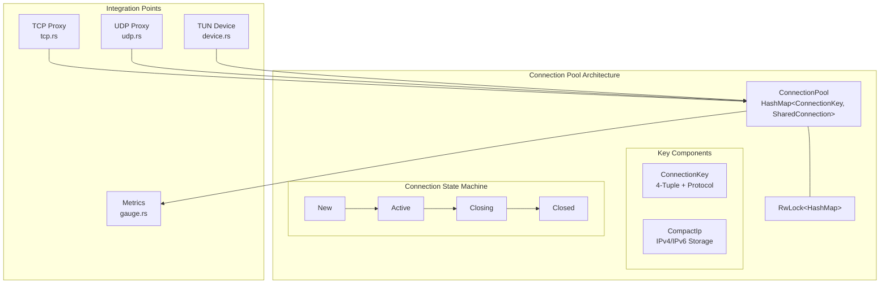
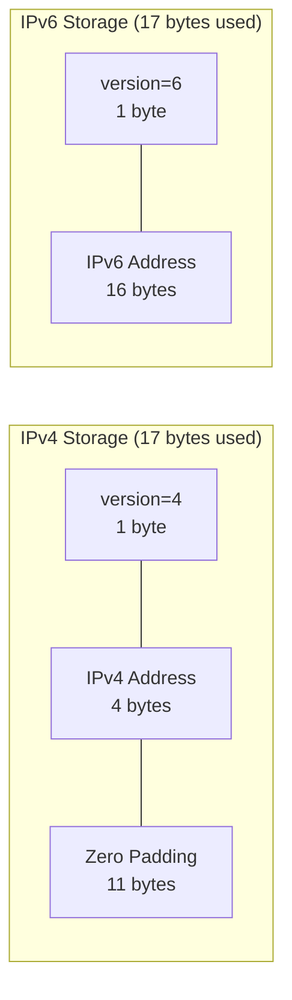
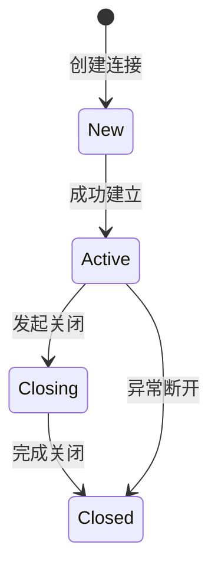
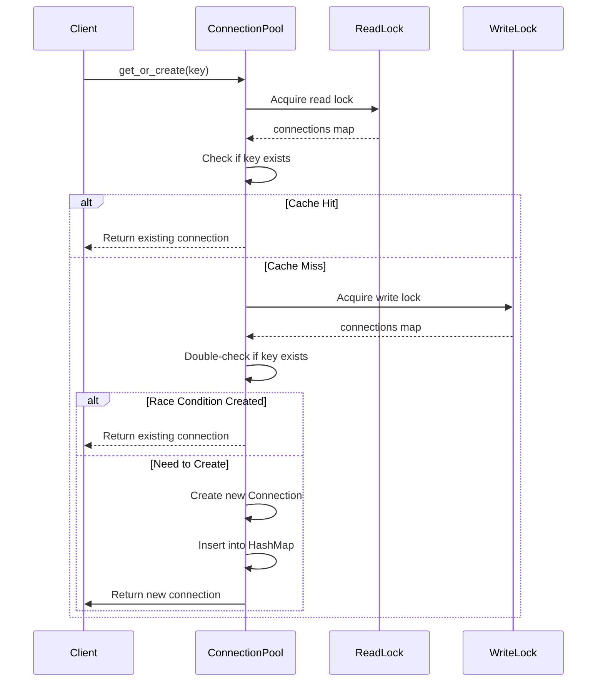
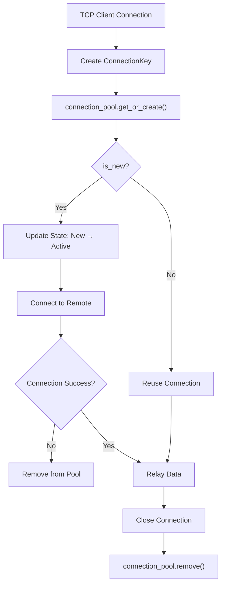

本文档详细阐述 dae-rs 项目中连接池管理的架构设计与实现细节。连接池是透明代理系统的核心组件，负责 TCP/UDP 连接的生命周期管理、复用策略和超时控制。系统通过 4 元组（源 IP、目标 IP、源端口、目标端口）标识连接，实现连接的快速查找与复用。

## 架构概览

连接池模块位于 `crates/dae-proxy/src/connection_pool.rs`，采用读写锁（RwLock）实现并发安全的连接存储。核心设计理念是通过双重检查锁定（Double-Checked Locking）优化高并发场景下的锁竞争。



连接池通过 `SharedConnectionPool` 类型在组件间共享，该类型本质上是 `Arc<ConnectionPool>` 的别名，确保多个组件可以安全地引用同一个连接池实例。

Sources: [connection_pool.rs:404-405](crates/dae-proxy/src/connection_pool.rs#L404-L405)

## 核心数据结构

### ConnectionKey：4 元组连接标识符

`ConnectionKey` 是连接池的核心键类型，通过 5 个字段唯一标识一个网络连接：

| 字段 | 类型 | 说明 |
|------|------|------|
| `src_ip` | `CompactIp` | 源 IP 地址（压缩存储） |
| `dst_ip` | `CompactIp` | 目标 IP 地址（压缩存储） |
| `src_port` | `u16` | 源端口 |
| `dst_port` | `u16` | 目标端口 |
| `proto` | `u8` | 协议类型（6=TCP, 17=UDP） |

Sources: [connection_pool.rs:108-119](crates/dae-proxy/src/connection_pool.rs#L108-L119)

### CompactIp：IPv4/IPv6 统一存储

`CompactIp` 采用固定 16 字节存储空间，通过版本前缀区分 IPv4 和 IPv6 地址：



版本号存储在最高 4 位（bit 124-127），IPv4 地址占用低 32 位，IPv6 地址占用低 128 位。这种设计允许 `ConnectionKey` 直接作为 `HashMap` 的键，同时支持 IPv4-mapped IPv6 地址的兼容处理。

Sources: [connection_pool.rs:18-88](crates/dae-proxy/src/connection_pool.rs#L18-L88)

### Connection：连接状态追踪

`Connection` 结构体追踪单个连接的状态和时间信息：

| 字段 | 类型 | 用途 |
|------|------|------|
| `src_addr` | `SocketAddr` | 源地址 |
| `dst_addr` | `SocketAddr` | 目标地址 |
| `protocol` | `Protocol` | 协议类型 |
| `state` | `ConnectionState` | 连接状态 |
| `created_at` | `Instant` | 创建时间 |
| `last_activity` | `Instant` | 最后活跃时间 |
| `keepalive_interval` | `Duration` | Keepalive 间隔（保留） |
| `keepalive_timer` | `Option<Interval>` | Keepalive 定时器（保留） |

Sources: [connection.rs:34-53](crates/dae-proxy/src/connection.rs#L34-L53)

### 连接状态机



状态转换通过 `ConnectionState` 枚举实现：

```rust
pub enum ConnectionState {
    #[default]
    New,      // 新建，未建立
    Active,   // 活跃，传输数据
    Closing,  // 优雅关闭中
    Closed,   // 已关闭
}
```

Sources: [connection.rs:11-23](crates/dae-proxy/src/connection.rs#L11-L23)

## 连接池操作

### get_or_create：双重检查锁定

`get_or_create` 方法实现连接获取或创建的核心逻辑，采用双重检查锁定优化性能：



**快速路径（读锁）**：首次尝试获取读锁，若连接存在则直接返回并更新 `last_activity`。

**慢速路径（写锁）**：缓存未命中时获取写锁，再次检查后创建新连接（防止竞态条件）。

Sources: [connection_pool.rs:221-274](crates/dae-proxy/src/connection_pool.rs#L221-L274)

### 过期连接清理

`cleanup_expired` 方法定期清理过期连接，支持 TCP/UDP 分别设置超时时间：

```rust
pub async fn cleanup_expired(&self) -> usize {
    // TCP 使用 connection_timeout
    // UDP 使用 udp_timeout（通常更短）
}
```

超时配置示例：

| 协议 | 默认超时 | 说明 |
|------|----------|------|
| TCP | 60 秒 | 长连接场景 |
| UDP | 30 秒 | 会话制场景 |

Sources: [connection_pool.rs:300-347](crates/dae-proxy/src/connection_pool.rs#L300-L347)

## 与代理组件集成

### TCP 代理集成

TCP 代理在处理每个连接时与连接池交互：



关键代码路径：

1. **连接建立**：客户端连接到达时，创建 `ConnectionKey` 并调用 `get_or_create`
2. **状态更新**：新建连接标记为 `Active`，与 eBPF 会话状态同步
3. **连接复用**：相同 4 元组的连接直接复用，避免重复建立
4. **连接关闭**：数据传输完成后从池中移除

Sources: [tcp.rs:123-180](crates/dae-proxy/src/tcp.rs#L123-L180)

### TUN 设备集成

TUN 透明代理使用独立的会话管理，同时依赖连接池进行连接追踪：

```rust
pub struct TunProxy {
    config: TunConfig,
    rule_engine: SharedRuleEngine,
    connection_pool: SharedConnectionPool,
    tcp_sessions: RwLock<HashMap<ConnectionKey, Arc<TcpTunSession>>>,
    udp_sessions: RwLock<HashMap<ConnectionKey, Arc<UdpSessionData>>>,
}
```

TUN 代理维护自己的会话映射，同时可以与连接池协同工作，实现更精细的流量控制。

Sources: [tun/device.rs:58-75](crates/dae-proxy/src/tun/device.rs#L58-L75)

## IPv6 支持

系统全面支持 IPv6 连接，包括纯 IPv6、IPv4-mapped IPv6 和混合场景：

### 压缩存储实现

```rust
impl CompactIp {
    pub fn from_ipv4(ip: Ipv4Addr) -> Self {
        let octets = ip.octets();
        let bits = u128::from(u32::from_be_bytes(octets));
        Self((4u128 << 124) | bits)  // version 4 in top nibble
    }
    
    pub fn from_ipv6(ip: Ipv6Addr) -> Self {
        let octets = ip.octets();
        let bits = u128::from_be_bytes(octets);
        Self((6u128 << 124) | bits)  // version 6 in top nibble
    }
}
```

### 混合地址支持

`ConnectionKey` 支持源 IPv4 + 目标 IPv6 或反向组合：

```rust
#[test]
fn test_connection_key_new_mixed_ipv4_src_ipv6_dst() {
    let src = SocketAddr::new(IpAddr::V4(Ipv4Addr::new(10, 0, 0, 1)), 10000);
    let dst = SocketAddr::new(IpAddr::V6(Ipv6Addr::new(0, 0, 0, 0, 0, 0xffff, 0xc00a, 0x01ff)), 443);
    let key = ConnectionKey::new(src, dst, Protocol::Tcp);
    
    assert!(key.src_ip.is_ipv4());
    assert!(key.dst_ip.is_ipv6());
}
```

Sources: [connection_pool.rs:642-652](crates/dae-proxy/src/connection_pool.rs#L642-L652)

## 指标监控

连接池通过 Prometheus 指标暴露运行状态：

| 指标名 | 类型 | 说明 |
|--------|------|------|
| `dae_active_connections` | Gauge | 当前活跃连接总数 |
| `dae_active_tcp_connections` | Gauge | TCP 活跃连接数 |
| `dae_active_udp_connections` | Gauge | UDP 活跃连接数 |
| `dae_connection_pool_size` | Gauge | 连接池大小 |

```rust
// 指标更新示例
pub async fn get_or_create(&self, key: ConnectionKey) -> (SharedConnection, bool) {
    // ... 创建连接 ...
    connections.insert(key, conn.clone());
    
    // 更新指标
    inc_active_connections();
    match key.protocol() {
        Protocol::Tcp => inc_active_tcp_connections(),
        Protocol::Udp => inc_active_udp_connections(),
    }
    set_connection_pool_size(connections.len() as i64);
}
```

Sources: [gauge.rs:9-23](crates/dae-proxy/src/metrics/gauge.rs#L9-L23)
Sources: [connection_pool.rs:264-270](crates/dae-proxy/src/connection_pool.rs#L264-L270)

## 配置参数

连接池相关配置通过 `TcpProxyConfig` 和 `TunConfig` 提供：

| 参数 | 默认值 | 说明 |
|------|--------|------|
| `connection_timeout` | 60s | TCP 连接超时 |
| `udp_timeout` | 30s | UDP 会话超时 |
| `keepalive_interval` | 30s | TCP keepalive 间隔 |
| `max_packet_size` | 64KB | 最大数据包大小 |

Sources: [tcp.rs:19-43](crates/dae-proxy/src/tcp.rs#L19-L43)
Sources: [tun/device.rs:19-56](crates/dae-proxy/src/tun/device.rs#L19-L56)

## 总结

dae-rs 的连接池管理模块提供了高性能、并发安全的连接复用机制。核心特性包括：

- **双重检查锁定**：优化高并发场景下的锁竞争
- **IPv4/IPv6 统一存储**：通过 `CompactIp` 实现高效地址比较
- **差异化超时策略**：TCP/UDP 使用不同超时参数
- **完整状态追踪**：连接生命周期全链路可观测
- **Prometheus 集成**：实时监控连接池状态

建议后续阅读 [代理核心实现](6-dai-li-he-xin-shi-xian) 了解连接池在代理流量转发中的具体应用。