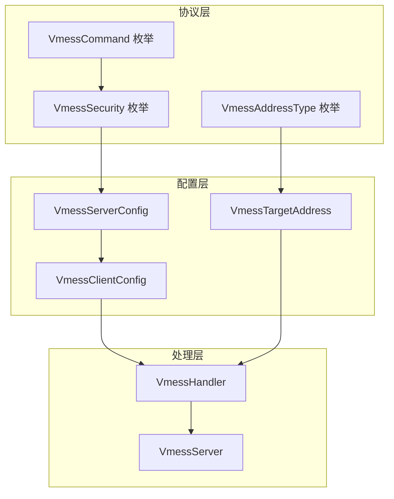
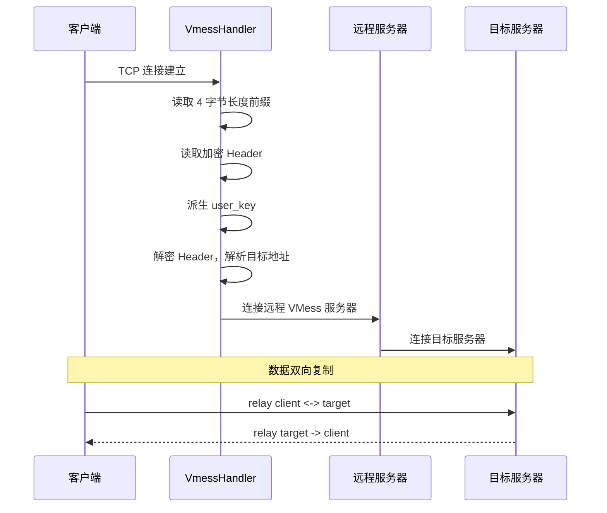
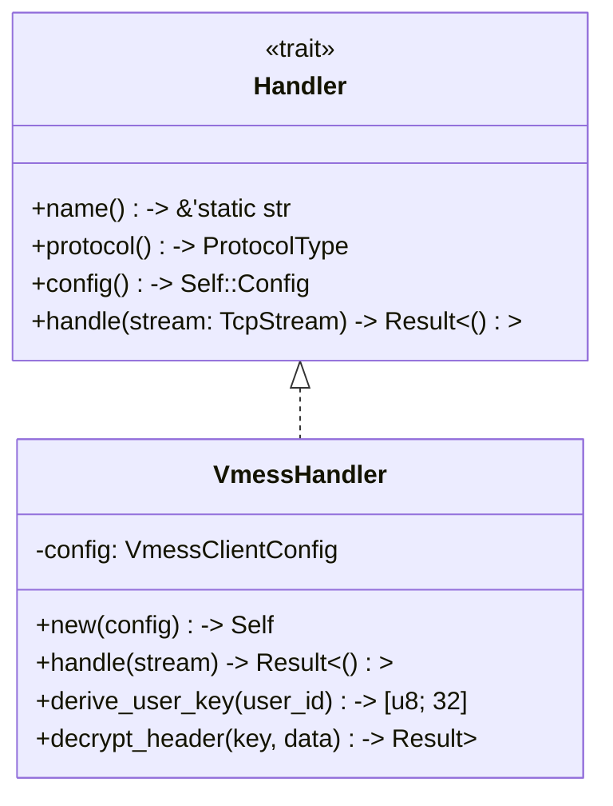

VMess 是 V2Ray 项目开发的无状态 VPN 协议，dae-rs 实现了完整的 VMess 客户端和服务端，支持 **VMess-AEAD-2022** 安全增强方案。本文档详细描述 dae-rs 中 VMess 协议的实现架构、加密机制、数据流处理及配置接口。

Sources: [mod.rs](crates/dae-proxy/src/vmess/mod.rs#L1-L30)

---

## 协议概述

### VMess-AEAD-2022 安全增强

2022 年 V2Ray 社区推出了 VMess-AEAD-2022 方案，解决了原版 VMess 协议头部可被主动探测的安全隐患。dae-rs 默认启用 AEAD 加密，提供了更强的安全保证。

**支持的加密方式**：

| 加密方式 | AEAD | 推荐程度 | 说明 |
|----------|------|----------|------|
| `aes-128-cfb` | ❌ | 已废弃 | 传统加密，存在安全风险 |
| `aes-128-gcm` | ❌ | 不推荐 | 非 AEAD 模式 |
| `chacha20-poly1305` | ❌ | 不推荐 | 非 AEAD 模式 |
| `aes-128-gcm-aead` | ✅ | **推荐** | VMess-AEAD-2022，默认方案 |
| `chacha20-poly1305-aead` | ✅ | **推荐** | VMess-AEAD-2022，移动端友好 |

Sources: [protocol.rs](crates/dae-proxy/src/vmess/protocol.rs#L33-L57)

---

## 架构设计

### 模块结构

VMess 实现位于 `crates/dae-proxy/src/vmess/` 目录，采用分层模块化设计：

```text
vmess/
├── mod.rs          # 模块导出、公开 API 及单元测试
├── config.rs       # 配置类型定义 (VmessClientConfig, VmessTargetAddress)
├── protocol.rs     # 协议常量及枚举 (VmessSecurity, VmessAddressType)
├── handler.rs      # 核心业务逻辑 (VmessHandler)
└── server.rs       # 服务端监听实现 (VmessServer)
```

### 核心类型体系



**关键类型职责**：

- `VmessClientConfig`: 客户端配置，包含监听地址、服务端信息和超时设置
- `VmessServerConfig`: 服务端配置，包含地址、端口、UUID 和加密参数
- `VmessTargetAddress`: 目标地址枚举，支持 IPv4、域名和 IPv6
- `VmessHandler`: 核心处理器，实现协议握手和数据转发

Sources: [config.rs](crates/dae-proxy/src/vmess/config.rs#L1-L50)
Sources: [protocol.rs](crates/dae-proxy/src/vmess/protocol.rs#L1-L108)

---

## 加密机制

### VMess-AEAD-2022 密钥派生

VMess-AEAD-2022 采用多层密钥派生机制，确保每个连接使用唯一的加密密钥：

```mermaid
flowchart LR
    A[user_id] --> B[HMAC-SHA256<br/>"VMess AEAD"]
    B --> C[user_key<br/>32 bytes]
    C --> D[HMAC-SHA256<br/>nonce]
    D --> E[request_auth_key]
    E --> F[HKDF-Expand<br/>"VMess header"]
    E --> G[HMAC-SHA256<br/>nonce]
    F --> H[request_key<br/>32 bytes]
    G --> I[request_iv<br/>12 bytes]
```

**密钥派生函数**：

```rust
/// 从 user_id 派生 user_key
pub fn derive_user_key(user_id: &str) -> [u8; 32] {
    Self::hmac_sha256(user_id.as_bytes(), b"VMess AEAD")
}

/// 从 user_key 和 nonce 派生请求密钥和 IV
pub fn derive_request_key_iv(user_key: &[u8; 32], nonce: &[u8]) -> ([u8; 32], [u8; 12]) {
    // request_auth_key = HMAC-SHA256(user_key, nonce)
    let auth_result = Self::hmac_sha256(user_key, nonce);
    
    // request_key = HKDF-Expand-SHA256(auth_key, "VMess header" || 0x01)
    let request_key = Self::hkdf_expand(&auth_result, b"VMess header");
    
    // request_iv = HMAC-SHA256(auth_key, nonce) [first 12 bytes]
    let iv_result = Self::hmac_sha256(&auth_result, nonce);
    
    (request_key, iv_result[..12])
}
```

Sources: [handler.rs](crates/dae-proxy/src/vmess/handler.rs#L52-L88)

### Header 加密格式

VMess AEAD-2022 的加密 Header 格式如下：

```
┌─────────────────────────────────────────────────────────────┐
│  4 bytes   │  16 bytes   │    N bytes      │  16 bytes     │
│  长度字段   │   Nonce      │  加密数据(含tag) │  认证标签     │
└─────────────────────────────────────────────────────────────┘
     ↓            ↓               ↓                ↓
  大端序长度    用于密钥派生    AES-256-GCM    GCM 认证标签
```

**解密流程**：

```rust
pub fn decrypt_header(user_key: &[u8; 32], encrypted: &[u8]) -> Result<Vec<u8>, &'static str> {
    // 格式: [16-byte nonce][encrypted data][16-byte auth tag]
    let nonce = &encrypted[..16];
    let ciphertext_with_tag = &encrypted[16..];
    
    // 派生请求密钥
    let (request_key, _) = Self::derive_request_key_iv(user_key, nonce);
    
    // 使用 AES-256-GCM 解密
    let cipher = Aes256Gcm::new_from_slice(&request_key)?;
    let nonce = Nonce::from_slice(&nonce[..12]);
    
    cipher.decrypt(nonce, ciphertext_with_tag)
        .map_err(|_| "AES-GCM decryption failed")
}
```

Sources: [handler.rs](crates/dae-proxy/src/vmess/handler.rs#L90-L122)

---

## 数据流处理

### TCP 连接处理流程



**处理代码核心逻辑**：

```rust
pub async fn handle(self: Arc<Self>, mut client: TcpStream) -> std::io::Result<()> {
    let client_addr = client.peer_addr()?;
    
    // 读取长度前缀 (4 bytes, big-endian)
    let mut len_buf = [0u8; 4];
    client.read_exact(&mut len_buf).await?;
    let header_len = u32::from_be_bytes(len_buf) as usize;
    
    // 读取加密 Header
    let mut encrypted_header = vec![0u8; header_len];
    client.read_exact(&mut encrypted_header).await?;
    
    // 派生密钥并解密
    let user_key = Self::derive_user_key(&self.config.server.user_id);
    let decrypted_header = Self::decrypt_header(&user_key, &encrypted_header)?;
    
    // 解析目标地址
    let (target_addr, target_port) = VmessTargetAddress::parse_from_bytes(&decrypted_header)?;
    
    // 连接上游服务器并转发
    let remote = TcpStream::connect(remote_addr).await?;
    self.relay(client, remote).await
}
```

Sources: [handler.rs](crates/dae-proxy/src/vmess/handler.rs#L124-L200)

### UDP 会话处理

```rust
pub async fn handle_udp(self: Arc<Self>, client: UdpSocket) -> std::io::Result<()> {
    let mut buf = vec![0u8; 65535];
    
    loop {
        let (n, client_addr) = client.recv_from(&mut buf).await?;
        
        // 解析 VMess UDP Header
        let (target_addr, target_port, _) = VmessTargetAddress::parse_from_bytes(&buf)?;
        
        // 转发到服务器并等待响应
        let server_socket = UdpSocket::bind("0.0.0.0:0").await?;
        server_socket.send_to(payload, &server_addr).await?;
        
        // 接收响应并返回客户端
        let (m, _) = server_socket.recv_from(&mut response_buf).await?;
        client.send_to(&response_buf[..m], &client_addr).await?;
    }
}
```

Sources: [handler.rs](crates/dae-proxy/src/vmess/handler.rs#L260-L310)

---

## 地址解析

### 地址类型 (ATYP)

VMess 协议定义了三类目标地址格式：

| ATYP 值 | 类型 | 格式 | 示例 |
|---------|------|------|------|
| `0x01` | IPv4 | `[1-byte type][4-byte IP][2-byte port]` | `01 C0 A8 01 01 1F 90` |
| `0x02` | Domain | `[1-byte type][1-byte len][domain][2-byte port]` | `02 0B example.com 00 50` |
| `0x03` | IPv6 | `[1-byte type][16-byte IP][2-byte port]` | `03 20010DB800000000...0001 0050` |

**地址解析实现**：

```rust
impl VmessTargetAddress {
    pub fn parse_from_bytes(payload: &[u8]) -> Option<(Self, u16)> {
        let atyp = payload[0];
        match atyp {
            0x01 => {
                // IPv4: 1 + 4 + 2 = 7 bytes minimum
                if payload.len() < 7 { return None; }
                let ip = IpAddr::V4(Ipv4Addr::new(
                    payload[1], payload[2], payload[3], payload[4],
                ));
                let port = u16::from_be_bytes([payload[5], payload[6]]);
                Some((VmessTargetAddress::Ipv4(ip), port))
            }
            0x02 => {
                // Domain: 1 + 1 + len + 2 bytes
                let domain_len = payload[1] as usize;
                if payload.len() < 4 + domain_len { return None; }
                let domain = String::from_utf8(payload[2..2+domain_len].to_vec()).ok()?;
                let port = u16::from_be_bytes([payload[2+domain_len], payload[3+domain_len]]);
                Some((VmessTargetAddress::Domain(domain, port), port))
            }
            0x03 => {
                // IPv6: 1 + 16 + 2 = 19 bytes minimum
                if payload.len() < 19 { return None; }
                // ... IPv6 解析逻辑
            }
            _ => None,
        }
    }
}
```

Sources: [config.rs](crates/dae-proxy/src/vmess/config.rs#L70-L130)

---

## 配置参考

### 配置参数表

| 参数 | 类型 | 默认值 | 说明 |
|------|------|--------|------|
| `listen_addr` | SocketAddr | `127.0.0.1:1080` | 本地监听地址 |
| `server.addr` | String | `127.0.0.1` | 上游服务器地址 |
| `server.port` | u16 | `10086` | 上游服务器端口 |
| `server.user_id` | String | (空) | VMess 用户 ID (UUID) |
| `server.security` | VmessSecurity | `Aes128GcmAead` | 加密方式 |
| `server.enable_aead` | bool | `true` | 启用 AEAD-2022 |
| `tcp_timeout` | Duration | `60s` | TCP 连接超时 |
| `udp_timeout` | Duration | `30s` | UDP 会话超时 |

### 配置文件示例

```toml
[[nodes]]
name = "VMess 节点"
type = "vmess"
server = "vmess.example.com"
port = 443
uuid = "550e8400-e29b-41d4-a716-446655440000"
security = "aes-128-gcm-aead"
tls = true
```

Sources: [config.rs](crates/dae-proxy/src/vmess/config.rs#L10-L35)

---

## Handler Trait 实现

VmessHandler 实现了统一的 `Handler` trait，可与其他协议共享相同的调用接口：



**trait 实现代码**：

```rust
#[async_trait]
impl Handler for VmessHandler {
    type Config = VmessClientConfig;

    fn name(&self) -> &'static str {
        "vmess"
    }

    fn protocol(&self) -> ProtocolType {
        ProtocolType::Vmess
    }

    fn config(&self) -> &Self::Config {
        &self.config
    }

    async fn handle(self: Arc<Self>, stream: TcpStream) -> std::io::Result<()> {
        self.handle(stream).await
    }
}
```

Sources: [handler.rs](crates/dae-proxy/src/vmess/handler.rs#L315-L339)

---

## 错误处理

### 错误类型与处理策略

| 错误类型 | 触发条件 | 处理方式 | 日志级别 |
|----------|----------|----------|----------|
| `InvalidData` | Header 解析失败 | 关闭连接 | `warn` |
| `TimedOut` | 连接超时 | 返回错误 | `info` |
| `ConnectionRefused` | 远程拒绝 | 检查网络 | `error` |
| `DecryptionFailed` | AEAD 验证失败 | 关闭连接 | `warn` |
| `HeaderTooLarge` | Header > 65535 | 拒绝连接 | `warn` |

**错误处理代码示例**：

```rust
let decrypted_header = match Self::decrypt_header(&user_key, &encrypted_header) {
    Ok(header) => header,
    Err(e) => {
        warn!(
            "VMess TCP: {} header decryption failed: {} — dropping connection",
            client_addr, e
        );
        return Err(std::io::Error::new(
            std::io::ErrorKind::InvalidData,
            format!("VMess header decryption failed: {}", e),
        ));
    }
};
```

Sources: [handler.rs](crates/dae-proxy/src/vmess/handler.rs#L155-L175)

---

## 与 [VLESS 协议](8-vless-xie-yi) 的对比

| 特性 | VMess | VLESS |
|------|-------|-------|
| 无状态 | ✅ | ✅ |
| AEAD 支持 | VMess-AEAD-2022 | XTLS/XRay 原生 |
| TLS 传输 | 需额外配置 | XTLS 直接支持 |
| Reality 混淆 | ❌ 不支持 | ✅ 支持 |
| 头部加密 | AEAD-2022 | UUID + ADD |
| 推荐场景 | 兼容性优先 | 安全优先 |

Sources: [vless/handler.rs](crates/dae-proxy/src/vless/handler.rs)

---

## 延伸阅读

- [配置参考手册](20-pei-zhi-can-kao-shou-ce) - 完整的节点配置说明
- [代理核心实现](6-dai-li-he-xin-shi-xian) - Handler trait 统一抽象
- [VLESS 协议](8-vless-xie-yi) - 更现代的协议选择