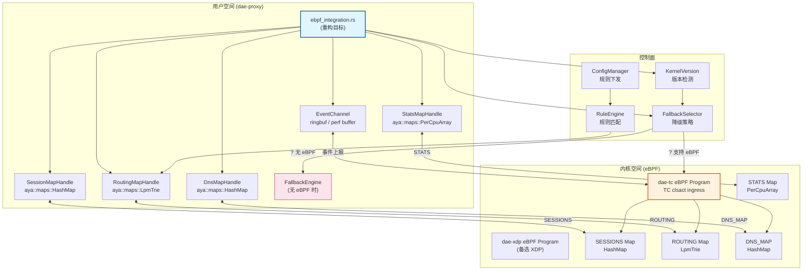

# dae-rs eBPF 重构详细架构文档

> 📅 制定时间：2026-04-04
> 📂 基于：REFACTOR_PLAN.md + 现有代码分析
> 🎯 目标：从 HashMap stub 重构为生产级 aya eBPF 集成

---

## 一、现状与目标差距

### 1.1 当前架构（HashMap Stub）

```
dae-proxy/src/ebpf_integration.rs (1290 行)
├── SessionMapHandle   — Arc<StdRwLock<HashMap<ConnectionKey, SessionEntry>>>
├── RoutingMapHandle    — Arc<StdRwLock<HashMap<u32, RoutingEntry>>>  ⚠️ exact-match，非 LPM
├── StatsMapHandle      — Arc<StdRwLock<HashMap<u32, StatsEntry>>>
└── EbpfMaps::new_in_memory() — 创建内存回退
```

**核心缺陷**：
- 非真实 eBPF Map，无法利用内核加速
- RoutingMap 只支持精确匹配（/32），不支持 CIDR 前缀匹配
- 无用户空间 ↔ 内核 eBPF 程序通信机制
- 无内核版本检测与分级降级

### 1.2 目标架构（aya eBPF）

```
┌─────────────────────────────────────────────────────────────────┐
│                        dae-proxy (用户空间)                      │
│  ┌─────────────────────────────────────────────────────────┐    │
│  │              ebpf_integration.rs (重构目标)               │    │
│  │  ┌──────────┐  ┌──────────┐  ┌──────────┐             │    │
│  │  │ Session  │  │ Routing  │  │  Stats    │             │    │
│  │  │ MapHandle│  │ MapHandle│  │ MapHandle │             │    │
│  │  └────┬─────┘  └────┬─────┘  └────┬─────┘             │    │
│  │       │              │              │                    │    │
│  │       ▼              ▼              ▼                    │    │
│  │  ┌──────────────────────────────────────┐  ┌──────────┐ │    │
│  │  │     aya::maps::{HashMap, LpmTrie}     │  │ringbuf/  │ │    │
│  │  │     aya::programs::{Tc, Xdp}          │  │perf buffer│ │    │
│  │  └──────────────────┬───────────────────┘  └────┬─────┘ │    │
│  └─────────────────────┼───────────────────────────┼────────┘    │
└────────────────────────┼───────────────────────────┼─────────────┘
                         │                           │
              ┌──────────┴──────────┐    ┌──────────┴──────────┐
              │   TC clsact qdisc   │    │    事件通信通道      │
              │  ┌───────────────┐  │    │  ringbuf / perf      │
              │  │  dae-tc .o    │  │    │  buffer             │
              │  │  (eBPF程序)   │  │    └─────────────────────┘
              │  └───────────────┘  │
              └──────────┬──────────┘
                         │ 内核 5.8+ BPF subsystem
                         ▼
              ┌─────────────────────────┐
              │    eBPF Maps (内核)     │
              │  SESSIONS / ROUTING /   │
              │  DNS_MAP / STATS        │
              └─────────────────────────┘
```

---

## 二、目标架构图（Mermaid）



---

## 三、aya crate 集成方案

### 3.1 依赖版本

```toml
# dae-proxy/Cargo.toml
[dependencies]
# aya user-space API (not aya-ebpf)
aya = { version = "0.13", features = ["aya-log"] }

# dae-ebpf-common 已通过 workspace 引用
```

**注意**：aya 0.13 用于用户空间程序加载，aya-ebpf 0.1 仅用于 eBPF 内核程序（dae-xdp/dae-tc 各自使用）。

### 3.2 核心接口设计

```rust
// ebpf_integration.rs — 重构目标接口

use aya::maps::{HashMap, LpmTrie, PerCpuArray, RingBuf};
use aya::programs::{tc, TcAttachType, Xdp, XdpFlags};
use aya::Ebpf;
use std::path::Path;
use tokio::sync::RwLock as AsyncRwLock;
use std::sync::Arc;

/// 内核版本能力
#[derive(Debug, Clone, Copy, PartialEq, Eq)]
pub enum KernelCapability {
    /// 完整 eBPF + TC clsact 支持（内核 5.13+）
    FullTc,
    /// 仅 XDP 支持（内核 5.8+，无 TC）
    XdpOnly,
    /// 仅基础 eBPF Maps（内核 4.14+）
    BasicMaps,
    /// 无 eBPF 支持，回退用户空间
    None,
}

/// eBPF 运行时状态
#[derive(Debug, Clone)]
pub enum EbpfRuntime {
    /// 真实 eBPF 内核程序运行中
    Active {
        ebpf: Arc<AsyncRwLock<Ebpf>>,
        program_type: EbpfProgramType,
        event_buf: Arc<AsyncRwLock<RingBuf<Event>>>,
    },
    /// 回退到用户空间 HashMap
    Fallback,
    /// 未初始化
    Uninitialized,
}

/// eBPF 程序类型
#[derive(Debug, Clone, Copy, PartialEq, Eq)]
pub enum EbpfProgramType {
    /// TC clsact qdisc 挂载（推荐，透明代理场景最佳）
    Tc,
    /// XDP express path（备选，高性能但有路由限制）
    Xdp,
}

/// 事件类型（ring buffer 上报）
#[derive(Debug, Clone, Copy)]
#[repr(C)]
pub struct EbpfEvent {
    pub event_type: u8,   // 0=session_created, 1=session_closed, 2=dns_query
    pub src_ip: u32,
    pub dst_ip: u32,
    pub src_port: u16,
    pub dst_port: u16,
    pub proto: u8,
    pub timestamp: u64,
}

impl EbpfRuntime {
    /// 检测内核 eBPF 能力并选择最佳运行模式
    pub async fn detect_and_init(
        interface: &str,
        ebpf_obj_path: &str,
    ) -> Result<Self, EbpfError> {
        let kernel_ver = KernelVersion::detect();

        match kernel_ver.capability() {
            KernelCapability::FullTc => {
                Self::init_tc(interface, ebpf_obj_path).await
            }
            KernelCapability::XdpOnly => {
                Self::init_xdp(interface, ebpf_obj_path).await
            }
            KernelCapability::BasicMaps => {
                // 加载 eBPF Maps 但不使用程序
                Self::init_maps_only(ebpf_obj_path).await
            }
            KernelCapability::None => {
                Ok(EbpfRuntime::Fallback)
            }
        }
    }

    /// 初始化 TC clsact 模式
    async fn init_tc(interface: &str, obj_path: &str) -> Result<Self, EbpfError> {
        let path = Path::new(obj_path);
        if !path.exists() {
            return Err(EbpError::Other(
                format!("eBPF object not found: {obj_path}")
            ));
        }

        let mut ebpf = Ebpf::load_file(path)
            .map_err(|e| EbpfError::Other(e.to_string()))?;

        // 加载 TC 程序
        let prog: &mut tc::SchedClassifier = ebpf
            .program_mut("tc_prog_main")
            .ok_or_else(|| EbpfError::MapNotFound("tc_prog_main".into()))?
            .try_into()
            .map_err(|e| EbpfError::Other(format!("{:?}", e)))?;

        prog.load()
            .map_err(|e| EbpfError::Other(e.to_string()))?;

        // 设置 clsact qdisc 并挂载
        Self::setup_clsact(interface)?;
        prog.attach(interface, TcAttachType::Ingress)
            .map_err(|e| EbpfError::Other(e.to_string()))?;

        // 初始化 ring buffer 事件通道
        let event_buf = Self::init_event_channel(&ebpf)?;

        Ok(EbpfRuntime::Active {
            ebpf: Arc::new(AsyncRwLock::new(ebpf)),
            program_type: EbpfProgramType::Tc,
            event_buf: Arc::new(AsyncRwLock::new(event_buf)),
        })
    }

    /// 初始化 XDP 模式
    async fn init_xdp(interface: &str, obj_path: &str) -> Result<Self, EbpfError> {
        let path = Path::new(obj_path);
        let mut ebpf = Ebpf::load_file(path)
            .map_err(|e| EbpfError::Other(e.to_string()))?;

        let prog: &mut Xdp = ebpf
            .program_mut("xdp_prog_main")
            .ok_or_else(|| EbpfError::MapNotFound("xdp_prog_main".into()))?
            .try_into()
            .map_err(|e| EbpfError::Other(format!("{:?}", e)))?;

        prog.load()
            .map_err(|e| EbpfError::Other(e.to_string()))?;

        prog.attach(interface, XdpFlags::default())
            .map_err(|e| EbpfError::Other(e.to_string()))?;

        let event_buf = Self::init_event_channel(&ebpf)?;

        Ok(EbpfRuntime::Active {
            ebpf: Arc::new(AsyncRwLock::new(ebpf)),
            program_type: EbpfProgramType::Xdp,
            event_buf: Arc::new(AsyncRwLock::new(event_buf)),
        })
    }

    /// 设置 clsact qdisc（内核 5.8+ 必需）
    fn setup_clsact(interface: &str) -> Result<(), EbpfError> {
        use std::process::Command;

        // 检查是否已有 clsact
        let output = Command::new("tc")
            .args(["qdisc", "show", "dev", interface])
            .output()
            .map_err(|e| EbpfError::Other(e.to_string()))?;

        let output_str = String::from_utf8_lossy(&output.stdout);
        if !output_str.contains("clsact") {
            // 添加 clsact qdisc
            Command::new("tc")
                .args(["qdisc", "add", "dev", interface, "clsact"])
                .output()
                .map_err(|e| EbpfError::Other(e.to_string()))?;
        }

        Ok(())
    }

    /// 初始化 ring buffer 事件通道
    fn init_event_channel(ebpf: &Ebpf) -> Result<RingBuf<Event>, EbpfError> {
        // 从 eBPF map "EVENTS" 获取 ring buffer
        let events_map = ebpf
            .map("EVENTS")
            .ok_or_else(|| EbpfError::MapNotFound("EVENTS".into()))?;

        let ring_buf: RingBuf<Event, _> = RingBuf::builder(events_map, ())
            .map_err(|e| EbpfError::Other(e.to_string()))?;

        Ok(ring_buf)
    }
}
```

### 3.3 核心 Map Handle 实现

```rust
// ===== SessionMapHandle — 5元组连接追踪 =====

use aya::maps::HashMap;
use aya::Ebpf;

/// Session Map Handle — 封装 aya HashMap
pub struct SessionMapHandle {
    map: HashMap<_, SessionKey, SessionEntry>,
}

impl SessionMapHandle {
    pub fn new(ebpf: &Ebpf) -> Result<Self, EbpfError> {
        let map = ebpf.map("SESSIONS")
            .ok_or_else(|| EbpfError::MapNotFound("SESSIONS".into()))?
            .try_into()
            .map_err(|e| EbpfError::Other(format!("{:?}", e)))?;
        Ok(Self { map })
    }

    /// 插入或更新会话
    pub fn insert(&self, key: &SessionKey, entry: &SessionEntry) -> Result<(), EbpfError> {
        self.map.insert(key, entry, 0)
            .map_err(|e| EbpfError::UpdateFailed(e.to_string()))
    }

    /// 查找会话
    pub fn lookup(&self, key: &SessionKey) -> Result<Option<SessionEntry>, EbpfError> {
        self.map.get(key, 0)
            .map_err(|e| EbpfError::LookupFailed(e.to_string()))
    }

    /// 移除会话
    #[allow(dead_code)]
    pub fn remove(&self, key: &SessionKey) -> Result<(), EbpfError> {
        self.map.remove(key, 0)
            .map_err(|e| EbpfError::UpdateFailed(e.to_string()))
    }
}

// ===== RoutingMapHandle — LPM 前缀路由 =====

use aya::maps::lpm_trie::Key;
use aya::maps::LpmTrie;

/// Routing Map Handle — 封装 aya LpmTrie
pub struct RoutingMapHandle {
    map: LpmTrie<u32, RoutingEntry>,
}

impl RoutingMapHandle {
    pub fn new(ebpf: &Ebpf) -> Result<Self, EbpfError> {
        let map = ebpf.map("ROUTING")
            .ok_or_else(|| EbpfError::MapNotFound("ROUTING".into()))?
            .try_into()
            .map_err(|e| EbpfError::Other(format!("{:?}", e)))?;
        Ok(Self { map })
    }

    /// 插入 CIDR 路由规则
    ///
    /// # Arguments
    /// * `ip` — IP 地址（网络字节序）
    /// * `prefix_len` — 前缀长度（0-32）
    /// * `entry` — 路由条目
    pub fn insert(&self, ip: u32, prefix_len: u32, entry: &RoutingEntry) -> Result<(), EbpfError> {
        let key = Key::new(prefix_len, ip);
        self.map.insert(&key, entry, 0)
            .map_err(|e| EbpfError::UpdateFailed(e.to_string()))
    }

    /// 最长前缀匹配查找
    ///
    /// eBPF LpmTrie 在内核中自动完成最长前缀匹配，
    /// 用户空间只需按目标 IP 插入 key，查找时构造 /32 键即可。
    pub fn lookup(&self, ip: u32) -> Result<Option<RoutingEntry>, EbpfError> {
        // 内核 LpmTrie 自动返回最长匹配
        let key = Key::new(32, ip);
        self.map.get(&key, 0)
            .map_err(|e| EbpfError::LookupFailed(e.to_string()))
    }

    /// 移除 CIDR 路由规则
    #[allow(dead_code)]
    pub fn remove(&self, ip: u32, prefix_len: u32) -> Result<(), EbpfError> {
        let key = Key::new(prefix_len, ip);
        self.map.remove(&key, 0)
            .map_err(|e| EbpfError::UpdateFailed(e.to_string()))
    }
}

// ===== DnsMapHandle — DNS 域名映射 =====

use aya::maps::HashMap;

/// DNS Map Handle — 域名哈希 → DNS 映射条目
pub struct DnsMapHandle {
    map: HashMap<u64, DnsMapEntry>,
}

impl DnsMapHandle {
    pub fn new(ebpf: &Ebpf) -> Result<Self, EbpfError> {
        let map = ebpf.map("DNS_MAP")
            .ok_or_else(|| EbpfError::MapNotFound("DNS_MAP".into()))?
            .try_into()
            .map_err(|e| EbpfError::Other(format!("{:?}", e)))?;
        Ok(Self { map })
    }

    /// 从域名生成 map key（与 dae-tc/src/maps.rs 保持一致）
    fn domain_key(domain: &[u8]) -> u64 {
        let mut key: u64 = 0;
        for (i, &b) in domain.iter().enumerate().take(8) {
            key = key.wrapping_add((b as u64).wrapping_mul((i as u64).wrapping_add(1)));
        }
        key
    }

    /// 插入 DNS 映射
    pub fn insert(&self, domain: &[u8], entry: &DnsMapEntry) -> Result<(), EbpfError> {
        let key = Self::domain_key(domain);
        self.map.insert(&key, entry, 0)
            .map_err(|e| EbpfError::UpdateFailed(e.to_string()))
    }

    /// 查找 DNS 映射
    pub fn lookup(&self, domain: &[u8]) -> Result<Option<DnsMapEntry>, EbpfError> {
        let key = Self::domain_key(domain);
        self.map.get(&key, 0)
            .map_err(|e| EbpfError::LookupFailed(e.to_string()))
    }
}

// ===== StatsMapHandle — Per-CPU 统计 =====

use aya::maps::PerCpuArray;

/// Statistics Map Handle — PerCpuArray 用于多核无锁统计
pub struct StatsMapHandle {
    map: PerCpuArray<StatsEntry>,
}

impl StatsMapHandle {
    pub fn new(ebpf: &Ebpf) -> Result<Self, EbpfError> {
        let map = ebpf.map("STATS")
            .ok_or_else(|| EbpfError::MapNotFound("STATS".into()))?
            .try_into()
            .map_err(|e| EbpfError::Other(format!("{:?}", e)))?;
        Ok(Self { map })
    }

    /// 获取统计项（PerCpuArray 自动合并多核计数）
    pub fn get(&self, idx: u32) -> Result<Option<StatsEntry>, EbpfError> {
        self.map.get(&idx, 0)
            .map_err(|e| EbpfError::LookupFailed(e.to_string()))
    }
}
```

---

## 四、eBPF Map 类型选择

### 4.1 Map 类型对比

| Map 类型 | 用途 | go-dae 对应 | dae-rs 现状 | 推荐 |
|---------|------|-----------|------------|------|
| `HashMap` | SESSIONS (5-tuple → 会话) | `SessionMap` | HashMap stub | ✅ 采用 |
| `LpmTrie` | ROUTING (CIDR 路由) | `IpRoutingMap` + `LpmArrayMap` | HashMap stub (exact only) | ✅ 采用 |
| `PerCpuArray` | STATS (每核计数) | `StatsMap` | HashMap stub | ✅ 采用 |
| `RingBuf` | 事件上报通道 | `ringbuf` | 无 | ✅ 采用 (替代 perf buffer) |
| `Queue` | DNS 响应队列 | `DnsQueue` | 无 | 🟡 可选 |
| `SockHash` | TCP 连接加速 | `SockMap` | 无 | 🟡 内核 4.18+ |
| `Array` | 全局配置 | `ConfigMap` | 已定义 | ✅ 已有 |

### 4.2 go-dae 参考 Map 设计

```
go-dae eBPF Maps:
├── SESSIONS     HashMap<SessionKey, SessionEntry>   — 连接追踪
├── ROUTING      LpmTrie<u32, RoutingEntry>          — IP CIDR 路由（LPM）
├── DNS_MAP      HashMap<u64, DnsMapEntry>           — 域名 → IP 映射
├── IP_DOMAIN_MAP HashMap<u32, u64>                  — IP → 域名（反向）
├── CONFIG       Array<ConfigEntry>                  — 全局配置
├── STATS        PerCpuArray<StatsEntry>              — 统计计数器
└── EVENTS       ringbuf                            — 事件上报（新增）
```

---

## 五、BPF 程序设计：TC vs XDP

### 5.1 选择 TC clsact 的理由

| 维度 | TC clsact | XDP | 结论 |
|------|-----------|-----|------|
| **透明代理支持** | ✅ 完整 TCP/IP 栈之前拦截 | ⚠️ XDP_REDIRECT 后无法透明代理 | TC 胜 |
| **iptables/nftables 兼容** | ✅ 完全兼容 | ❌ XDP 在 netfilter 之前，无法参与 iptables 链 | TC 胜 |
| **L7 内容检测** | ✅ 可解析到 TCP/UDP payload | ❌ 仅网络层 | TC 胜 |
| **隧道/GRE 封装** | ✅ 可处理封装数据包 | ⚠️ XDP 原生处理困难 | TC 胜 |
| **数据包修改** | ✅ 可修改任何字段 | ⚠️ XDP_TX/XDP_REDIRECT 有限制 | TC 胜 |
| **性能** | 优秀（clsact 开销极低） | 极高（最早处理点） | XDP 略优但差距不大 |
| **MAC 头处理** | ✅ 完整（含 VLAN） | ⚠️ 需 MACv2 支持 | TC 胜 |

### 5.2 dae-tc TC 程序架构

```rust
// dae-tc/src/lib.rs — 已有完整实现

/// TC clsact 入口点
#[no_mangle]
pub fn tc_prog_main(ctx: TcContext) -> i32 {
    let mut new_ctx = TcContext::new(ctx.skb.skb);
    match tc_prog(&mut new_ctx) {
        Ok(ret) => ret,
        Err(_) => TC_ACT_OK,
    }
}

/// 主处理流程
fn tc_prog(ctx: &mut TcContext) -> Result<i32, ()> {
    // 1. 解析 Ethernet 头（含 VLAN）
    // 2. 解析 IPv4 头
    // 3. 解析 TCP/UDP 头（提取端口）
    // 4. 创建 SessionKey (5-tuple)
    // 5. SESSIONS map 查找/创建
    // 6. ROUTING map LPM 查找
    // 7. 根据路由 action 执行：
    //    - PASS → TC_ACT_OK
    //    - REDIRECT → set_mark + TC_ACT_OK
    //    - DROP → TC_ACT_SHOT
}

/// LPM 路由查找（内核自动完成最长前缀匹配）
fn lookup_routing(dst_ip: u32) -> Option<RoutingEntry> {
    let key = Key::new(32, dst_ip);
    ROUTING.get(&key).copied()?;  // LpmTrie 自动 LPM
    // ... 递减前缀尝试（兼容旧内核）
}
```

### 5.3 TC vs XDP 分层策略

```rust
#[derive(Debug, Clone, Copy, PartialEq, Eq)]
pub enum ProgramPreference {
    /// 优先 TC，TC 不可用降级到 XDP
    PreferTc,
    /// 优先 XDP，XDP 不可用降级到 TC
    PreferXdp,
    /// 只用 TC
    TcOnly,
    /// 只用 XDP
    XdpOnly,
    /// 不用 eBPF，始终用户空间
    None,
}

impl KernelCapability {
    pub fn supports_tc(self) -> bool {
        matches!(self, KernelCapability::FullTc)
    }

    pub fn supports_xdp(self) -> bool {
        matches!(self, KernelCapability::FullTc | KernelCapability::XdpOnly)
    }
}
```

---

## 六、迁移路径（HashMap Stub → 真实 eBPF）

### 6.1 阶段一：基础设施兼容层（1-2天）

**目标**：保持 `EbpfMaps` 接口不变，添加 aya 真实后端检测。

```rust
// ebpf_integration.rs 新增

/// eBPF 运行时（重构后的核心）
pub struct EbpfRuntime {
    runtime: EbpfRuntimeState,
    fallback_maps: Option<EbpfMaps>,  // 原 HashMap stub
}

enum EbpfRuntimeState {
    Active { /* aya Ebpf + maps */ },
    Fallback { /* 原 HashMap stub */ },
}

impl EbpfMaps {
    /// 新建：优先尝试 aya eBPF，失败则回退 HashMap
    pub async fn new_with_ebpf(
        interface: Option<&str>,
        ebpf_obj_path: Option<&str>,
    ) -> Self {
        if let Some(iface) = interface {
            if let Some(obj_path) = ebpf_obj_path {
                match EbpfRuntime::detect_and_init(iface, obj_path).await {
                    Ok(EbpfRuntime::Active { .. }) => {
                        info!("eBPF runtime initialized successfully");
                    }
                    Ok(EbpfRuntime::Fallback) => {
                        warn!("eBPF not available, using in-memory fallback");
                    }
                    Err(e) => {
                        warn!("eBPF init failed: {}, using in-memory fallback", e);
                    }
                }
            }
        }

        // 始终提供 fallback maps（保证接口兼容）
        Self::new_in_memory()
    }
}
```

### 6.2 阶段二：Map Handle 替换（2-3天）

**目标**：将 `SessionMapHandle` 等替换为 aya 类型。

```rust
// 新增 ebpf_aya.rs 模块

/// eBPF Map Handles（aya 真实实现）
#[derive(Clone)]
pub struct AyaEbpfMaps {
    sessions: Option<SessionMapHandle>,
    routing: Option<RoutingMapHandle>,
    dns: Option<DnsMapHandle>,
    stats: Option<StatsMapHandle>,
}

impl AyaEbpfMaps {
    /// 从 aya Ebpf 实例初始化
    pub fn from_ebpf(ebpf: &Ebpf) -> Result<Self, EbpfError> {
        Ok(Self {
            sessions: Some(SessionMapHandle::new(ebpf)?),
            routing: Some(RoutingMapHandle::new(ebpf)?),
            dns: Some(DnsMapHandle::new(ebpf)?),
            stats: Some(StatsMapHandle::new(ebpf)?),
        })
    }
}
```

### 6.3 阶段三：事件通道集成（1-2天）

**目标**：通过 ring buffer 接收内核事件，同步到用户空间。

```rust
/// 事件消费者任务
pub async fn event_consumer_task(
    event_buf: Arc<AsyncRwLock<RingBuf<Event>>>,
    session_tx: tokio::sync::mpsc::UnboundedSender<SessionEvent>,
) {
    loop {
        let mut buf = event_buf.write().await;
        while let Some(event) = buf.next().await {
            let session_event = SessionEvent::from_ebpf_event(event);
            let _ = session_tx.send(session_event);
        }
        tokio::time::sleep(tokio::time::Duration::from_millis(1)).await;
    }
}
```

### 6.4 迁移检查点

| 阶段 | 检查点 | 验证方法 |
|------|--------|---------|
| 阶段一 | `EbpfMaps::new_in_memory()` 仍然工作 | `cargo test` 全绿 |
| 阶段二 | aya Maps 正确初始化 | `cargo build --release` + `llvm-objdump` 验证 .o |
| 阶段三 | TC/clsact 挂载成功 | `tc filter show` 验证挂载 |
| 阶段四 | LPM 路由查找正常 | `ip route` + `bpftool map dump` 交叉验证 |
| 阶段五 | Fallback 正确触发 | 在无 eBPF 环境测试 |

---

## 七、内核版本检测（分层策略）

### 7.1 内核版本能力分级

```rust
/// 内核 eBPF 能力等级
#[derive(Debug, Clone, Copy, PartialEq, Eq, PartialOrd, Ord)]
pub enum KernelEbpfLevel {
    /// Level 0: 无 eBPF
    None = 0,
    /// Level 1: 基础 Maps（内核 4.14+）
    Basic = 1,
    /// Level 2: XDP 支持（内核 5.8+）
    Xdp = 2,
    /// Level 3: TC clsact + LpmTrie 完善（内核 5.10+）
    TcClsact = 3,
    /// Level 4: ringbuf + 更稳定 LpmTrie（内核 5.13+）
    RingBuf = 4,
    /// Level 5: 完整特性（内核 5.17+）
    Full = 5,
}

/// 内核版本检测
pub struct KernelVersion(u8, u8, u8);  // major, minor, patch

impl KernelVersion {
    /// 检测当前内核版本
    pub fn detect() -> Self {
        let uts = std::ffi::OsStr::new(std::utsname::raw::release())
            .to_str()
            .and_then(|s| {
                let mut parts = s.split('.');
                let major: u8 = parts.next()?.parse().ok()?;
                let minor: u8 = parts.next().parse().ok()?;
                let patch: u8 = parts.next().unwrap_or("0").split('-').next()?.parse().ok()?;
                Some((major, minor, patch))
            })
            .unwrap_or((0, 0, 0));

        Self(uts.0, uts.1, uts.2)
    }

    /// 解析能力等级
    pub fn capability(&self) -> KernelCapability {
        let (maj, min, _) = (self.0, self.1, self.2);

        if maj == 0 && min == 0 {
            return KernelCapability::None;
        }

        // 内核 5.17+: 完整功能
        if maj > 5 || (maj == 5 && min >= 17) {
            return KernelCapability::Full;
        }

        // 内核 5.13+: ringbuf + 稳定 LpmTrie
        if maj > 5 || (maj == 5 && min >= 13) {
            return KernelCapability::FullTc;
        }

        // 内核 5.10+: TC clsact 完善
        if maj > 5 || (maj == 5 && min >= 10) {
            return KernelCapability::FullTc;
        }

        // 内核 5.8+: XDP 支持
        if maj > 5 || (maj == 5 && min >= 8) {
            return KernelCapability::XdpOnly;
        }

        // 内核 4.14+: 基础 Maps
        if maj > 4 || (maj == 4 && min >= 14) {
            return KernelCapability::BasicMaps;
        }

        KernelCapability::None
    }

    /// 获取推荐 eBPF 程序类型
    pub fn recommended_program_type(&self) -> EbpfProgramType {
        match self.capability() {
            KernelCapability::FullTc => EbpfProgramType::Tc,
            KernelCapability::XdpOnly => EbpfProgramType::Xdp,
            _ => EbpfProgramType::Tc,  // fallback 到 TC
        }
    }
}

/// 内核能力描述
impl std::fmt::Display for KernelCapability {
    fn fmt(&self, f: &mut std::fmt::Formatter<'_>) -> std::fmt::Result {
        match self {
            KernelCapability::FullTc => write!(f, "Full TC clsact + LpmTrie (kernel 5.10+)"),
            KernelCapability::XdpOnly => write!(f, "XDP only (kernel 5.8-5.9)"),
            KernelCapability::BasicMaps => write!(f, "Basic eBPF Maps only (kernel 4.14+)"),
            KernelCapability::None => write!(f, "No eBPF support"),
        }
    }
}
```

### 7.2 版本检测与程序选择矩阵

| 内核版本 | 能力 | 推荐程序 | Fallback |
|---------|------|---------|---------|
| 5.17+ | Full (ringbuf + full LpmTrie) | TC clsact | — |
| 5.13-5.16 | FullTc (clsact + LpmTrie) | TC clsact | XDP |
| 5.10-5.12 | FullTc (clsact + LpmTrie) | TC clsact | XDP |
| 5.8-5.9 | XdpOnly | XDP | userspace HashMap |
| 4.14-5.7 | BasicMaps (无 LpmTrie) | userspace | — |
| < 4.14 | None | userspace HashMap | — |

---

## 八、Fallback 方案（无 eBPF 回退）

### 8.1 Fallback 触发条件

```rust
pub enum EbpfFallbackReason {
    /// 内核不支持 eBPF
    KernelNoSupport,
    /// eBPF object 文件不存在
    ObjectFileNotFound,
    /// eBPF 内存不足（rlimit）
    RlimitExceeded,
    /// 权限不足（CAP_BPF / CAP_SYS_ADMIN）
    PermissionDenied,
    /// 接口不存在或 down
    InterfaceNotFound,
    /// 程序加载失败
    LoadFailed(String),
    /// Map 初始化失败
    MapInitFailed(String),
}
```

### 8.2 FallbackEngine 实现

```rust
/// 回退引擎（当 eBPF 不可用时）
pub struct FallbackEngine {
    /// 用户空间规则引擎
    rule_engine: Arc<RuleEngine>,
    /// 会话池（用户空间连接追踪）
    sessions: SessionMapHandle,  // 仍然是 HashMap stub
    /// 路由规则（用户空间 CIDR 匹配）
    routing: UserSpaceRouting,
}

impl FallbackEngine {
    pub fn new(rule_engine: Arc<RuleEngine>) -> Self {
        Self {
            rule_engine,
            sessions: SessionMapHandle::new(),
            routing: UserSpaceRouting::new(),
        }
    }

    /// 用户空间 LPM 路由查找（替代 eBPF LpmTrie）
    pub fn lookup_routing(&self, dst_ip: u32) -> Option<RoutingEntry> {
        // 1. 精确匹配 /32
        if let Some(entry) = self.routing.exact_lookup(dst_ip) {
            return Some(entry);
        }

        // 2. 遍历 CIDR 规则，找最长前缀匹配
        self.routing.lpm_lookup(dst_ip)
    }

    /// 处理数据包（用户空间回退路径）
    pub fn process_packet(
        &self,
        src_ip: u32,
        dst_ip: u32,
        src_port: u16,
        dst_port: u16,
        proto: u8,
    ) -> RouteAction {
        let key = SessionKey::new(src_ip, dst_ip, src_port, dst_port, proto);

        // 查找或创建会话
        let session = self.sessions.lookup(&key)
            .unwrap_or_else(|| {
                let mut s = SessionEntry::default();
                s.state = state::NEW;
                s
            });

        // 路由查找
        match self.lookup_routing(dst_ip) {
            Some(route) => route.action.into(),
            None => RouteAction::Pass,
        }
    }
}

/// 用户空间 LPM 路由表
struct UserSpaceRouting {
    /// 精确匹配表（/32）
    exact: HashMap<u32, RoutingEntry>,
    /// CIDR 规则（按前缀长度排序）
    cidr_rules: Vec<(u32, u8, RoutingEntry)>,  // (ip, prefix, entry)
}

impl UserSpaceRouting {
    /// LPM 查找（线性扫描，性能不如 eBPF LpmTrie 但功能等价）
    fn lpm_lookup(&self, ip: u32) -> Option<RoutingEntry> {
        let mut best: Option<RoutingEntry> = None;
        let mut best_prefix: u8 = 0;

        for &(rule_ip, prefix, ref entry) in &self.cidr_rules {
            let mask = u32::MAX << (32 - prefix);
            if (ip & mask) == (rule_ip & mask) && prefix > best_prefix {
                best = Some(*entry);
                best_prefix = prefix;
            }
        }

        best
    }
}
```

### 8.3 Fallback 与 eBPF 切换

```rust
/// eBPF ↔ Fallback 动态切换
pub struct EbpfManager {
    runtime: EbpfRuntime,
    fallback: FallbackEngine,
    config: EbpfConfig,
}

impl EbpfManager {
    /// 运行时切换（热更新）
    pub async fn switch_to_fallback(&mut self) {
        warn!("Switching from eBPF to userspace fallback");
        self.runtime = EbpfRuntime::Fallback;
    }

    pub async fn switch_to_ebpf(&mut self, interface: &str, obj_path: &str) -> Result<()> {
        info!("Attempting to switch to eBPF runtime");
        let new_runtime = EbpfRuntime::detect_and_init(interface, obj_path).await?;

        match &new_runtime {
            EbpfRuntime::Active { .. } => {
                self.runtime = new_runtime;
                info!("Successfully switched to eBPF");
            }
            EbpfRuntime::Fallback => {
                warn!("eBPF not available, staying in fallback mode");
            }
            EbpfRuntime::Uninitialized => {
                warn!("eBPF not initialized, staying in fallback mode");
            }
        }

        Ok(())
    }
}
```

---

## 九、核心接口代码示例

### 9.1 dae-proxy 集成点

```rust
// dae-proxy/src/core/mod.rs 中使用 eBPF

use dae_ebpf_common::{RoutingEntry, SessionEntry, SessionKey};

pub struct ProxyCore {
    /// eBPF 运行时（或 fallback）
    ebpf_runtime: EbpfRuntime,
    /// 用户空间回退引擎
    fallback_engine: Option<FallbackEngine>,
    /// 规则引擎
    rule_engine: Arc<RuleEngine>,
    /// 会话事件通道
    session_tx: tokio::sync::mpsc::UnboundedSender<SessionEvent>,
}

impl ProxyCore {
    /// 初始化（优先 eBPF，自动降级）
    pub async fn new(config: &ProxyConfig) -> Result<Self, Error> {
        let rule_engine = Arc::new(RuleEngine::new(&config.rules)?);

        // 尝试初始化 eBPF
        let ebpf_runtime = EbpfRuntime::detect_and_init(
            config.ebpf_interface.as_deref(),
            config.ebpf_obj_path.as_deref(),
        ).await.unwrap_or(EbpfRuntime::Fallback);

        // 创建 fallback engine（始终需要）
        let fallback_engine = if matches!(ebpf_runtime, EbpfRuntime::Fallback) {
            Some(FallbackEngine::new(rule_engine.clone()))
        } else {
            None
        };

        // eBPF 模式下，同步规则到内核 maps
        if !matches!(ebpf_runtime, EbpfRuntime::Fallback) {
            Self::sync_rules_to_kernel(&ebpf_runtime, &config.rules).await?;
        }

        Ok(Self {
            ebpf_runtime,
            fallback_engine,
            rule_engine,
            session_tx,
        })
    }

    /// 同步规则到内核 eBPF Maps
    async fn sync_rules_to_kernel(
        runtime: &EbpfRuntime,
        rules: &[Rule],
    ) -> Result<(), Error> {
        let EbpfRuntime::Active { ebpf, .. } = runtime else {
            return Ok(());
        };

        let ebpf = ebpf.read().await;
        let routing_map = RoutingMapHandle::new(&ebpf)
            .map_err(|e| Error::Other(e.to_string()))?;

        for rule in rules {
            let ip = parse_ip_cidr(&rule.cidr)?;
            let entry = RoutingEntry::new(rule.route_id, rule.action, 0);
            routing_map.insert(ip.0, ip.1, &entry)
                .map_err(|e| Error::Other(e.to_string()))?;
        }

        Ok(())
    }

    /// 路由查找（eBPF 或用户空间）
    pub async fn routing_lookup(&self, dst_ip: u32) -> Option<RoutingEntry> {
        match &self.ebpf_runtime {
            EbpfRuntime::Active { ebpf, .. } => {
                let ebpf = ebpf.read().await;
                let routing = RoutingMapHandle::new(&ebpf).ok()?;
                routing.lookup(dst_ip).ok().flatten()
            }
            EbpfRuntime::Fallback => {
                self.fallback_engine.as_ref()?.lookup_routing(dst_ip)
            }
            EbpfRuntime::Uninitialized => None,
        }
    }
}
```

### 9.2 go-dae 架构参考对照

```go
// go-dae eBPF 关键类型（来自 go-dae 源码参考）

// DomainRoutingMap — 域名哈希 → 路由规则
type DomainRoutingMap struct {
    bpfMap *ebpf.Map  // HashMap<u64, u32> (domain_hash → route_id)
}

// IpRoutingMap — IP → 出站分组ID
type IpRoutingMap struct {
    bpfMap *ebpf.Map  // HashMap<u32, u32> (ip → group_id)
}

// LpmArrayMap — IP CIDR 最长前缀匹配
type LpmArrayMap struct {
    bpfMap *ebpf.Map  // LpmTrie<u32, RoutingEntry>
}

// BPF 程序加载（cilium/ebpf）
func LoadTcProgram(iface string) error {
    spec, err := ebpf.LoadProgSpec("tc_prog_main", &ebpf.TCAttachPoint{
        Interface: iface,
        AttachType: ebpf.TCAIngress,
    })
    // ...
}

// TC clsact 挂载
func SetupClsact(iface string) error {
    // tc qdisc add dev eth0 clsact
    // tc filter add dev eth0 ingress bpf obj dae-tc.o sec tc_prog
}
```

---

## 十、文件变更清单

| 文件 | 操作 | 说明 |
|------|------|------|
| `dae-proxy/src/ebpf_integration.rs` | 重写 | 替换 HashMap stub 为 aya eBPF |
| `dae-proxy/src/ebpf_aya.rs` | 新增 | aya Map Handles 实现 |
| `dae-proxy/src/ebpf_fallback.rs` | 新增 | 用户空间回退引擎 |
| `dae-proxy/src/kernel_version.rs` | 新增 | 内核版本检测 |
| `dae-proxy/src/core/mod.rs` | 修改 | 集成 eBPF 运行时 |
| `packages/dae-ebpf/dae-tc/src/maps.rs` | 修改 | 添加 ring buffer EVENTS map |
| `packages/dae-ebpf/dae-tc/src/lib.rs` | 修改 | 添加事件上报逻辑 |
| `packages/dae-ebpf/dae-ebpf/src/loader.rs` | 修改 | 支持 TC + XDP 双程序类型 |

---

## 十一、风险与缓解

| 风险 | 影响 | 缓解措施 |
|------|------|---------|
| eBPF 程序编译复杂 | 高 | dae-tc 已实现，.o 文件预编译 |
| 内核版本差异导致不兼容 | 中 | KernelVersion 分层检测，5.10+ 为主目标 |
| LpmTrie 在旧内核不稳定 | 中 | 用户空间 fallback LPM 线性扫描 |
| 权限问题（CAP_BPF） | 中 | 以 root 运行，提示缺少 capability |
| TC/XDP 竞争（双attach） | 低 | 检查现有 qdisc，避免重复挂载 |

---

## 十二、结论

本次重构将 dae-rs 的 eBPF 支持从 **HashMap stub** 升级为 **生产级 aya eBPF 集成**：

1. **TC clsact** 作为首选 BPF 程序类型（透明代理场景最优）
2. **LpmTrie** 替代精确匹配 HashMap（完整 CIDR 支持）
3. **ringbuf** 替代 perf buffer（更低延迟、零拷贝事件上报）
4. **KernelVersion 分层检测** + **FallbackEngine** 保证在任何环境可运行
5. **接口向后兼容** — 原有 `EbpfMaps` 接口保持不变，内部实现切换

参考 go-dae 的完整 eBPF 架构（cilium/ebpf + TC clsact），dae-rs 可以逐步迁移，阶段式验证，最终实现内核级流量加速。
